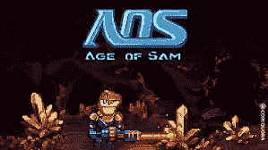

# 最近的薄荷糖和耐心的重要性…

> 原文：<https://medium.com/coinmonks/recent-mints-and-the-importance-of-patience-9f6c655920ed?source=collection_archive---------59----------------------->

Age of Sam NFT Collection

自从我上次写作以来，我已经创作了三个 NFT 系列，每个系列的经历都大不相同:

## 山姆第二代时代

这些家伙很聪明，他们有一个惊人的社区，并提供非常定期更新的所有事情山姆(AOS)和合作伙伴相关的时代。作为第一代持有人，我可以很容易地进入他们的第二代铸币厂，在这里我又获得了 2 个新的铸币厂。

**当前状态:**他们的赌注(月球任务)现在已经到位，我正在从中赚取$日光浴室。这个令牌的实用程序很快就会发布，但它的价值已经是每$ Solaris um 0.3 美元。

**想法:**继续持有，要么从代币中赚钱，要么卖掉我的 AOS NFT 以获得长期利润。

## **幼猿社交俱乐部**

这是我在一个系列卖完之后的第一个薄荷糖，但它重新获得了如此大的吸引力，我不想错过。路线图是令人兴奋的，它们是 OpenSea 上第一周列出的少数几个 Solana 项目之一。

当前状态:我在顶部附近买的，它在过去的一个月里起伏不定，这与我无关。如果我在公告/新路线图发布后卖出，社区的规模和对外星变异下降的预期将保证投资的正回报。

**想法:**我可能会长期持有这些股票，因为我正在收集大约 DAB(他们的代币),随着供应迅速枯竭，这些代币对美元具有实际价值，类似于 SOLARIUM。

## **bullet punk:Quiccs 的 Bitwars**

discord 社区稳步发展，由 Quiccs(东南亚最大的玩具制造商和设计师，曾与阿迪达斯合作)带头，这里有巨大的潜力。

不幸的是，造币过程的后勤考虑不够周全，鉴于 WL(白名单)和公共造币时间之间只有 1.5 个小时，当你知道公共造币开始时不会售罄时，它不会提供太多激励来促进该项目获得 WL 地位。

**当前状态:**他们推迟了游戏的发布，这导致 FP(底价)从 1 下降到 0.38 索尔。游戏预计将在未来 3 天内发布，让我们一起关注这个空间。

**想法:**游戏一发布，这些 NFT 的价值就会上涨，很有可能再次达到/超过 FP，所以我会在此时卖出，退出。

# **即将推出的造币厂:**

## **阿兹拉游戏**

六月的某个时候，我对这个薄荷最感兴趣。创始人在游戏领域(星球大战:英雄的创造者)有着良好的记录，他们很难获得 WL(幸运的是，我很早就积极主动，所以设法做到了)。

他们是区块链不可知论者，所以这种*多链方法*将是我第一次以这种方式铸造，所以我很想看看它会如何发展。有人引用他们的话说，“这个 NFT 永远不会比造币厂的价格更便宜”，所以我期待看到这出戏。

**想法**:筹集足够的溶胶，以确保我可以铸造一个这样的东西。

## **杜皮斯**

来自 de gods(Solana NFT 10 强)的创始人，这是他们的下一个创作。要彻底创造财富，你需要价值 1000 美元的灰尘(可以通过网站购买，也可以通过社交活动获得。考虑到 DeGods 的 FP(15k)，毫无疑问 Duppies 也会达到那些高度！

想法:尝试通过参与获得$DUST，如果我获得了牵引力，那么我将购买造币所需的剩余金额。

**——**

## **结论**

这个月我学到的是，除非我 100%确定一个项目，他们的 doxxed 团队和路线图，否则我不会在公开销售之前造币。在这一点上，我可以算出他们是否是其中之一；只是炒作，这将很快坦克底价或如果创作者正在执行他们的计划有效，有稳定的增长。

*谢谢你看完。如果您对本文有任何意见或问题，请留言。还有，如果内容有错误，如果你能指出来，我会很感激。*

查理·索尔💫

**下一次……斯戴普的 FOMO 和对我所有非金融交易的全面回顾，以及我被动收入的来源。**

> 加入 Coinmonks [电报频道](https://t.me/coincodecap)和 [Youtube 频道](https://www.youtube.com/c/coinmonks/videos)了解加密交易和投资

# 另外，阅读

*   [3 商业评论](/coinmonks/3commas-review-an-excellent-crypto-trading-bot-2020-1313a58bec92) | [Pionex 评论](https://coincodecap.com/pionex-review-exchange-with-crypto-trading-bot) | [Coinrule 评论](/coinmonks/coinrule-review-2021-a-beginner-friendly-crypto-trading-bot-daf0504848ba)
*   [莱杰 vs n rave](/coinmonks/ledger-vs-ngrave-zero-7e40f0c1d694)|[莱杰 nano s vs x](/coinmonks/ledger-nano-s-vs-x-battery-hardware-price-storage-59a6663fe3b0) | [币安评论](/coinmonks/binance-review-ee10d3bf3b6e)
*   [Bybit 交易所评论](/coinmonks/bybit-exchange-review-dbd570019b71) | [Bityard 评论](https://coincodecap.com/bityard-reivew) | [Jet-Bot 评论](https://coincodecap.com/jet-bot-review)
*   [3 commas vs crypto hopper](/coinmonks/3commas-vs-pionex-vs-cryptohopper-best-crypto-bot-6a98d2baa203)|[赚取加密利息](/coinmonks/earn-crypto-interest-b10b810fdda3)
*   最好的比特币[硬件钱包](/coinmonks/hardware-wallets-dfa1211730c6) | [BitBox02 回顾](/coinmonks/bitbox02-review-your-swiss-bitcoin-hardware-wallet-c36c88fff29)
*   [block fi vs Celsius](/coinmonks/blockfi-vs-celsius-vs-hodlnaut-8a1cc8c26630)|[Hodlnaut 审核](/coinmonks/hodlnaut-review-best-way-to-hodl-is-to-earn-interest-on-your-bitcoin-6658a8c19edf) | [KuCoin 审核](https://coincodecap.com/kucoin-review)