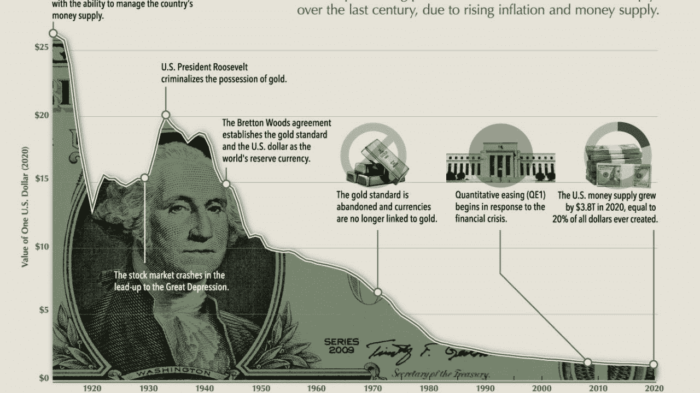
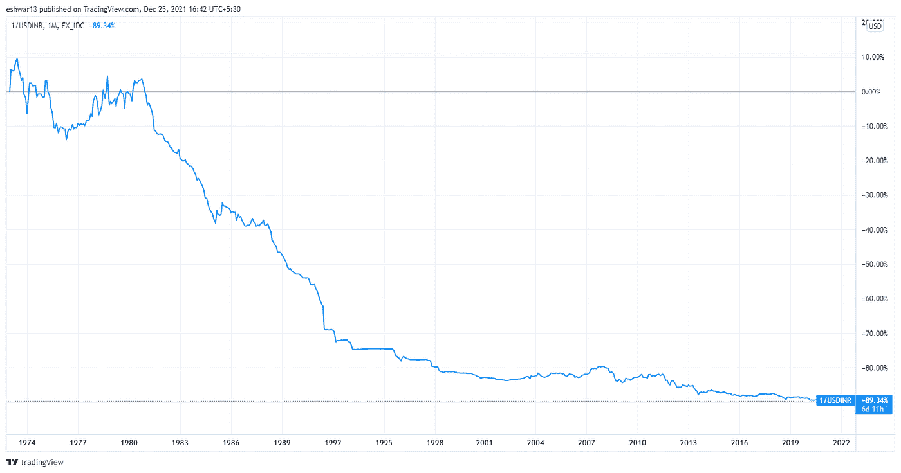
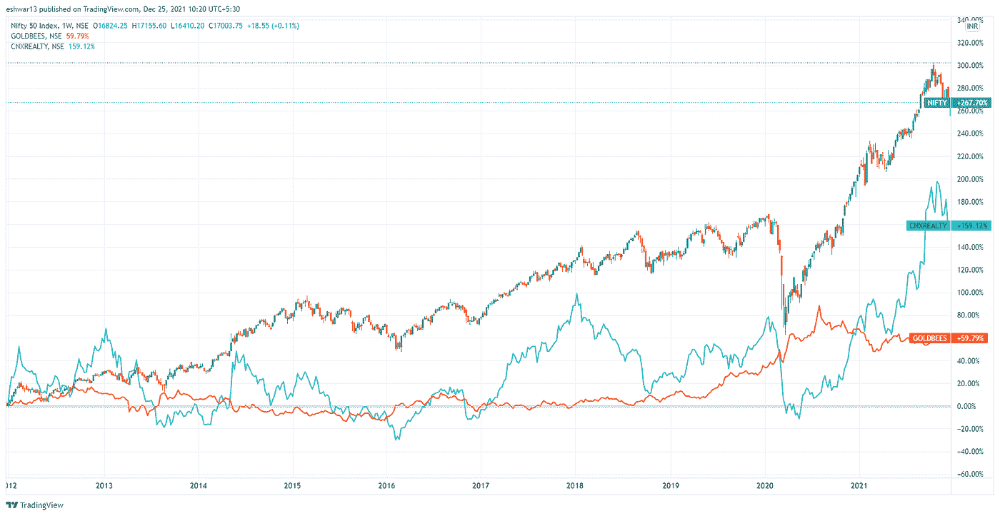
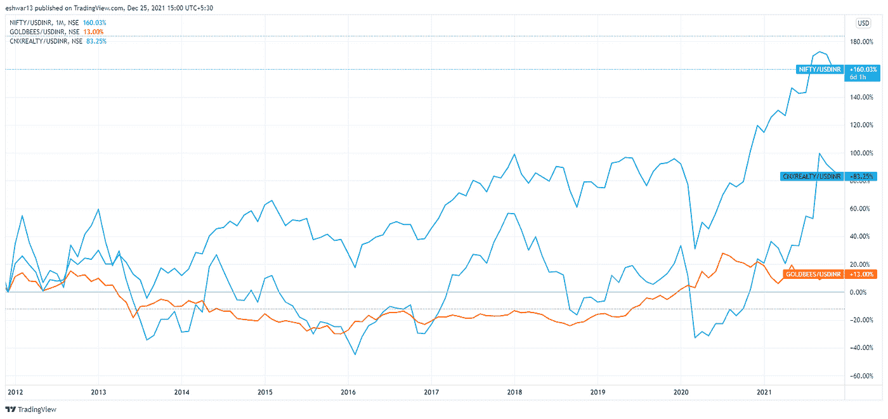
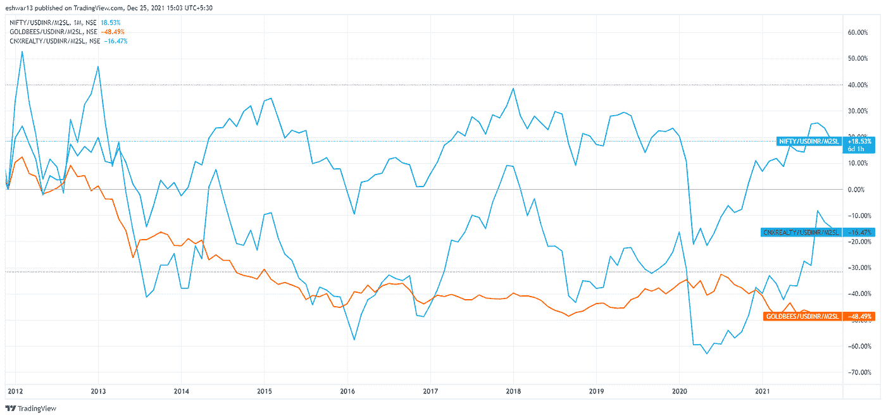
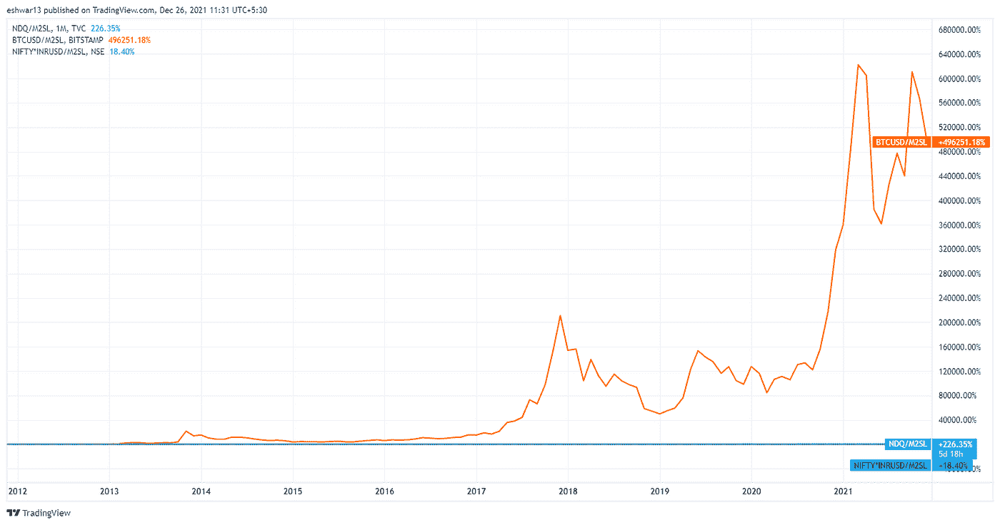

# 红色药丸或蓝色药丸——橙色药丸怎么样？

> 原文：<https://medium.com/coinmonks/red-pill-or-blue-pill-how-about-orange-pill-e6f35053846e?source=collection_archive---------26----------------------->

每个人都有蓝药丸和红药丸的时刻。大多数时候——我们选择蓝色药丸，因为无知比真相舒服得多。大约一年前，当我第一次在播客上看到比特币时，我也有过类似的经历。我有两个选择，

1.  蓝色药丸——我理性的自己尖叫着说这是一个庞氏骗局/泡沫
2.  红色药丸(橙色药丸)——我内心的某种冲动促使我更深入地探索这个问题

在过去的一年里，我了解比特币的旅程让我阅读了超过 5 本关于比特币的书籍，消费了超过 7000 小时的播客和 YouTube 视频。通过这次进入兔子洞的旅程，我的意识得到了扩展，我想在这里展示我的一些心得，

我给你两个选择😈

蓝色药丸—故事结束，您可以关闭此选项卡

橙色药丸——你呆在仙境，我试着展示兔子洞有多深

# 时间作为一种货币

时间是我们所有人拥有的最宝贵的资源。它是有限的，你不可能得到更多的时间(即使是埃隆·马斯克也有同样的每天 24 小时的配额)。所以我们都用自己的时间来换取我们认为有价值的东西(钱、房子、汽车等等)。认识到时间就是财富是很重要的，我将在下面的部分中交替使用这两个术语，

如果我们把时间看作一种货币，那么

1.  储蓄就是把现在的时间储存起来，以备将来使用
2.  借贷就是在现在花费未来的时间

# 如何储存时间

金钱是人类用来储存时间/财富的技术之一。但是随着时间的推移，大多数现代货币在保值方面表现不佳。在过去的 90 年里，美元已经贬值超过 96%。如果 1920 年你能用 1 美元买 100 个苹果，今天你只能用 1 美元买 4 个苹果。苹果没有增值——随着时间的推移，金钱失去了购买力。

面对贬值的货币，印度卢比的表现如何？非常差。在过去的 47 年里，印度卢比对美元贬值了 90%。更令人痛苦的是，相对于一种正在贬值的货币，我们已经贬值了。想象一下在板球世界杯上输给津巴布韦——这正是这里 47 年来一直发生的事情:)

# 属性 2 —记账单位

法定货币在我们的社会中实现了另一个重要的功能——记账单位(你如何为你的时间定价)。这是使我们能够拥有比物物交换系统更复杂的经济的主要功能之一。

在我们的社会中，我们可以用两种方式来表示我们的时间(财富),

1.  我持有 1 克金币
2.  我持有价值 4000 卢比的金币

由于印度卢比是记账单位，我们所有人都采用这种方式来交流一切事物的价值。在上一篇文章([通货膨胀海啸](https://www.linkedin.com/pulse/inflation-tsunami-coming-your-life-raft-ready-eshwar-nilakantan/?trackingId=fMSS586%2FT5SBqcXv0C62xg%3D%3D))中，我们已经看到了黄金价格如何在 1971-1981 年的 10 年间上涨了 12 倍。对于像黄金这样资产(没有内在现金流)增值只有三种解释，

1.  黄金需求的增长超过了供给
2.  相对于黄金贬值的记账单位(印度卢比/美元)
3.  两者兼而有之——黄金需求增加，法币贬值

为什么一种货币会贬值？它会因为各种原因贬值。我将不讨论同样的原因。但是货币贬值的结果很简单——购买力的损失或者你时间的损失(如果你已经把这作为你时间/财富的主要储备)

# 法定货币迫使人们接受愚蠢的赌注

人们凭直觉理解这一点，因此他们选择将时间储存在风险资产类别中，如房地产、黄金和股票，希望战胜通胀。我称之为高风险，是因为这些资产固有的波动性和损失资本的能力。当前的体制迫使人们过两种生活，

1.  克拉克·肯特的日常生活——努力在日常工作中表现出色，以此谋生/省钱
2.  夜晚的超人生活——成为房地产投资专家、基金经理、宏观分析师等。努力战胜通货膨胀

人们没有意识到，印度 57%的大盘股共同基金经理(他们接受了几十年的培训，只做一件事)在 5 年内无法持续跑赢大盘股指数。一个正常的全职工作的人期望在日常工作中表现出色，并在选股时表现出色，这就像试图加入印度国家板球队和曲棍球队一样——极不可能。不幸的现实是，许多人将运气误解为技能——如果运气是你的技能，你应该买彩票，而不是 200 卢比的 ITC 股票:)

在[的上一篇文章](https://www.linkedin.com/pulse/inflation-tsunami-coming-your-life-raft-ready-eshwar-nilakantan/?trackingId=KQ4XtAZSTyOPqTgxHyu4sw%3D%3D)中，我曾说过，你最好把时间节省在房地产、股票、黄金或比特币上，以抵御通胀。我个人选择了比特币，而不是黄金房地产。在此陈述我不选择黄金和房产的理由！让我们看看这些资产在过去 10 年间的回报。

# 让我们从系统(INR)测量系统(INR 返回)

PFB 图表与过去 10 年的回报 3 资产在印度卢比。过去 10 年看起来很不错。

*   Nifty 50 实现了 267%的总增长或 14%的 CAGR
*   Nifty Realty 实现了 159%的总增长或 10%的 CAGR
*   黄金现实实现了 60%的总增长或 4.8%的 CAGR

# 让我们从一个优越的系统(美元)来衡量这个系统(INR 回报)

下图以美元衡量了同一组资产类别的回报。同时仍然从一个系统进行测量——与 INR 相比，USD 是一个更好的系统，可以节省时间！看起来不错的印度卢比回报率减少了近 4%,因为在过去的 10 年里，印度卢比对美元的汇率每年下降 4%。

*   印度卢比的 50–267%(14% CAGR)变成了以美元计算的 160% (10% CAGR)
*   nifty Realty——159%(10%)的印度卢比变成了 83% (6.2%的 CAGR)的美元
*   黄金——60%(4.8%)的印度卢比变成 13% (1.2%)的美元

# 从系统内部测量系统的缺陷？

相信平地球理论的早期人类是从系统内部来测量系统的。假设地球是平的很自然——因为我们周围的一切都是平的？一旦我们创造了空间，进入一个气球并升空——我们就可以最终证明地球是圆的而不是平的。重要的是从系统之外去衡量一个系统，才能知道真相。

为了衡量实际回报——让我引入另一个变量——M2 货币供应量。在高水平上，M2 货币供应量是流通中的所有货币供应量。M2 货币供应量的扩张，而国内生产总值没有相应的增长，会导致通货膨胀或货币贬值。为简单起见，让我们假设更多的 M2 供应意味着对美元/印度卢比的“价值储存”属性不利。

# 让我们从系统外部(针对 M2 供应进行调整)衡量系统(美元回报)

从系统外部测量时，回波曲线看起来非常糟糕。我们并不认为这是负面的，因为卢比或美元并没有变成负面的。然而这在社会上反映为财富不平等。由于这一点，稀缺资产(高档房地产、常春藤盟校教育)的价格一直超出许多人的承受能力。

*   nifty 50–267%(14% CAGR)的 INR 变为 18% (1.6%)
*   Nifty Realty —印度卢比的 159% (10%)变成了-16.4%(1.7%)
*   黄金——印度卢比的 60% (4.8%)变成了-48%(6.4%)

其中一些资产类别的增长是由于货币供应的扩张，与基础公司的实际收益增长关系不大。这就是当对超额货币供应进行调整时，这些指数的回报率接近于 0 的原因。

因为我重视我的时间——理想情况下，我不想把我的时间存在以下任何一种资产类别中。黄金被认为是通货膨胀的对冲工具——但是很明显它的效果并不太好！

在上一篇文章中，我提到我选择比特币来储存我的时间，而不是房地产和股票。除了比特币，只有纳斯达克 100 指数轻松跑赢了 M2 货币供应调整后的增长。以下是针对 M2 调整后的两个指数的结果。

我到了比特币基础淘汰超过选择:)。我已经提供了我的完整理论，解释了为什么我不持有黄金或房地产，也不打算持有，除非发生重大变化(持有一些纳斯达克和 Nifty 的股票)。我选择比特币来储存我的时间，并不纯粹是为了消除其他资产。比特币有如此多的属性，使其成为存储时间的极具吸引力的资产。

这个兔子洞很深——我将在下一篇文章中讨论比特币的属性，以及它如何成为价值的最终储存手段。也将尝试打破围绕比特币的一些常见 FUD(恐惧、不确定性、怀疑)。

一如既往，这不是投资建议。请 DYOR。如果这篇文章帮助你得到了橘子皮——你可以通过分享这篇文章来表达谢意。此处显示的所有数据均来自 tradingview，回报计算时间为 2011 年 12 月 1 日至当前日期(2021 年 12 月 24 日)。如果你发现一些假设是错误的，请告诉我。乐于讨论并纠正我的观点。