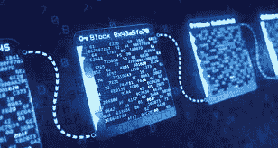

# 颠覆性创新|用技术构建可持续发展的未来

> 原文：<https://medium.com/coinmonks/redefining-the-future-through-technological-revolutions-why-you-should-care-about-tech-566b0219e8b9?source=collection_archive---------66----------------------->

Photo by [Shubham Dhage](https://unsplash.com/@theshubhamdhage?utm_source=medium&utm_medium=referral) on [Unsplash](https://unsplash.com?utm_source=medium&utm_medium=referral)

比特币。Defi。道斯。就在你以为已经听完了的时候，又来了 NFTs，solidity，Yield Farming，Play-to-earn 和元宇宙。

技术正在重新定义一切；从视频游戏到价值转移，收藏品，以及谁在互联网上拥有什么。

技术正在赋予平凡事物以效用，挑战不同部门各种机构的创造力、相关性和运作。

科技承诺的未来令人兴奋，但其不确定性令人恐惧。

所有这些改变的后果是什么？你应该试试技术吗？坚持住，我会回答这些问题的。

自古以来，技术发明中断并促进了人类的成长和生存。从石器时代的发明到数字化世界的技术趋势，很明显，技术戏剧性地但有趣地改变了人类的动态。

从石器时代到数字时代的技术进步带来了创造力、创新、思维模式以及对生活、商业、经济和金融的看法的转变。渐渐地，它重新定义了未来，创造了新的前景，什么可以，什么会成为。

> 交易新手？试试[加密交易机器人](/coinmonks/crypto-trading-bot-c2ffce8acb2a)或者[复制交易](/coinmonks/top-10-crypto-copy-trading-platforms-for-beginners-d0c37c7d698c)

人工智能在 20 世纪 50 年代的发明，是最早的复杂技术创新之一，改善了人类与机器和机器人的互动。计算机和机器人第一次能够利用人类的智能执行任务。

这项发明创造了用人工智能算法开发的增强和虚拟现实。AR 和 VR 技术从此改变了很多领域的实践模式。

在医学的学习上，发达国家的各个学校都实现了 VR 学习模式。学生能够与身体的内脏器官互动，在比教科书(传统学习模式)中的图像更近、更真实的范围内研究它们。

随着 VR 头戴设备在银行和金融业的使用，投资者可以轻松地在大屏幕上可视化和分析约 400 只股票的实时市场数据，以及接收货币信息和主要股票指数的 3D 图像。

今天，区块链技术已经动摇了技术的基础。它目前被现有的机构所采用，并且已经证明了很少的技术限制。

分散金融的发明对传统金融及其机构的结构提出了挑战。与 TradFi 漫长的、有中介介入的等级框架相反，Defi 给出了一个扁平的、分布式的结构，允许透明性和所有权。

Defi 的历史可以追溯到 2009 年，当时 Satoshi Nakomoto 在分布式账本上创建了比特币，现在称为区块链。

这样，从第一个块到当前块的事务历史被存储在区块链上，每个节点和事务的参与者都可以访问。

区块链技术已经超越了加密货币和金融交易的范畴。NFTs，即玩即赚游戏，DAOs，dApps 和元宇宙，因为区块链技术而存在。

Dao 通过允许社区治理来改变组织中的管理结构。在这里，DAO 的用户和参与者可以参与 DAO 中的决策、投票和治理协议。这之所以成为可能，是因为创造了允许选举进程的本土标志。

dApps 正在重新定义用户数据所有权和隐私。用户仍然控制着数据以及他们的数据如何在这些应用程序上使用，大多数 dApps 都是在以太坊区块链上创建的。

A BAYC NFT

NFT 的使用案例对艺术作品的实用性提出了挑战。从挂在博物馆和旅游中心的价值成千上万美元但没有实用价值的油画到真实性、财富和使用权的象征。

随着技术领域引人入胜的升级，以及它为人类问题提供的解决方案，关于每一个新趋势的猜测和争议每天都在出现。

2020 年的封锁向虚拟互动开放了世界，随着区块链科技[智能合约](/@munaolehi/beginners-guide-to-understanding-smart-contracts-e01c959b51f0)的实施，中介/中间人被切断，以提高透明度和值得信赖的交易。

(新加入“智能合同”一词？[点击这里](/@munaolehi/beginners-guide-to-understanding-smart-contracts-e01c959b51f0)阅读我为初学者写的关于智能合约的文章)

随着“玩即赚”游戏和元宇宙体验等创新的出现，人与人之间的物理互动受到了威胁。一切事物和每个人都在向网上移动，并与虚拟互动更加一致，因为未来是在线的。

元宇宙体验、虚拟会议和在线互动能取代并完全取代物理互动和随之而来的情感纽带吗？

科技代表着未来，在这个行业快速发展的时代，我们最多只能接受并顺应变化。科技的未来是迷人的，我们能做的最好的事情就是加入火车，这样我们就不会被甩在后面。

好奇想知道元宇宙是关于什么的吗？点击[这里](/@munaolehi/improving-human-interactions-with-virtual-realities-through-metaverse-experiences-a5482a661a4f)。

请留下 50 个掌声和一个关注。我相信你喜欢这本书。

> *加入 Coinmonks* [*电报频道*](https://t.me/coincodecap) *和* [*Youtube 频道*](https://www.youtube.com/c/coinmonks/videos) *了解加密交易和投资*

# 另外，阅读

*   [Bookmap 评论](https://coincodecap.com/bookmap-review-2021-best-trading-software) | [美国 5 大最佳加密交易所](https://coincodecap.com/crypto-exchange-usa)
*   [加密交易机器人](/coinmonks/crypto-trading-bot-c2ffce8acb2a) | [造币评论](https://coincodecap.com/coingate-review)
*   最佳加密[硬件钱包](/coinmonks/hardware-wallets-dfa1211730c6) | [Bitbns 评论](/coinmonks/bitbns-review-38256a07e161)
*   [新加坡十大最佳加密交易所](https://coincodecap.com/crypto-exchange-in-singapore) | [购买 AXS](https://coincodecap.com/buy-axs-token)
*   [红狗赌场评论](https://coincodecap.com/red-dog-casino-review) | [Swyftx 评论](https://coincodecap.com/swyftx-review)