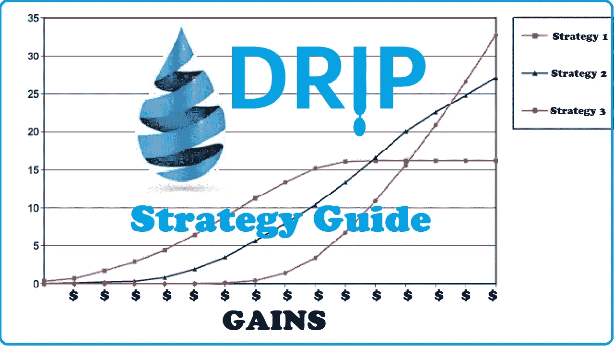
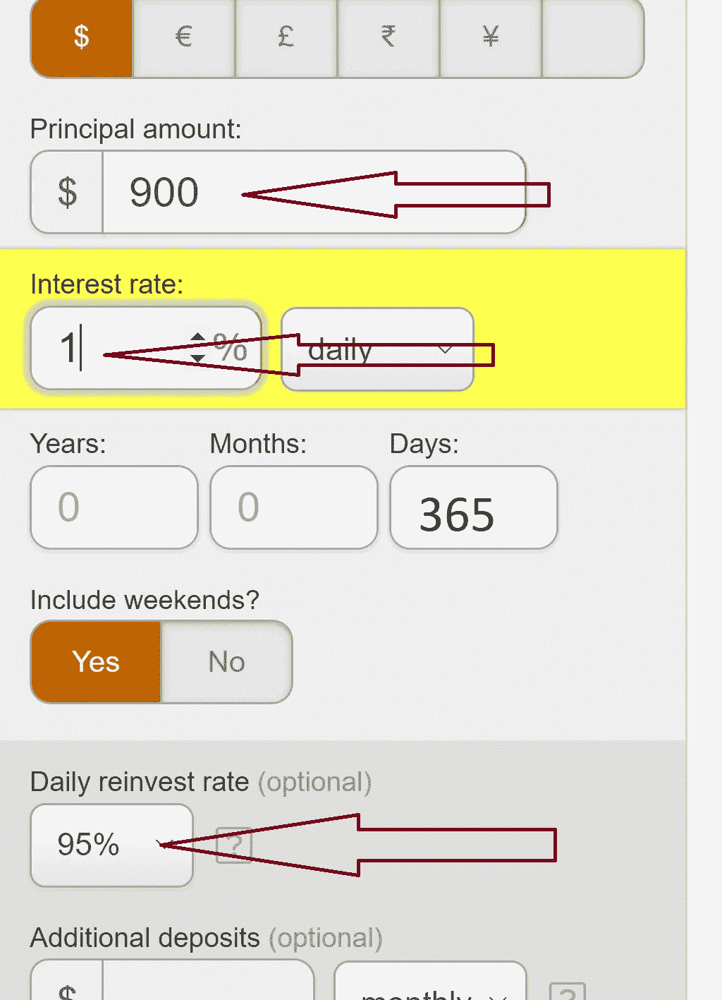

# $DRIP 策略指南:获得最大收益的最佳策略

> 原文：<https://medium.com/coinmonks/reference-article-top-drip-strategies-for-maximum-earnings-2a9cce68fa65?source=collection_archive---------4----------------------->

你和滴滴的目标是什么？

是尽快把你的现金拿出来，感觉好一点，然后寻找收益吗？也许你有一个在 12 个月内购买某样东西的目标，并希望这成为你购买的来源。也许你想在一年内获得最大收益，或者一路慢慢收回资金。

归根结底，一个策略和下一个策略之间的差异可以归结为一个决策是如何做出的，**何时复合，何时主张**。一个人如何平衡这个简单的选择会产生很多变化。这两者之间的错误平衡将大大降低收益。

这篇文章将面向已经投资于滴滴并希望在特定财务目标框架内实现收益最大化的读者。如果读者想更多地了解滴滴，它是什么，它是否是一项符合他们需求和风险承受水平的投资，他们可以去 [**这里**](/@hjellen1974/drip-simplified-guide-to-invest-in-drip-767c62d63a40) 。

这篇文章的目的是回顾排名靠前的点滴策略，让读者了解 1)哪种策略适合他们的财务目标，以及 2)如何以最佳方式使用该策略。

# 规则:

为了使策略具有可比性，会有一些标准…

1.  每个策略都以 1000 美元的“投资”开始。这意味着，在 10%的税收之后，每笔投资将从 900 美元开始，在滴滴池中提供 1%的每日回报。
2.  每个策略都假设滴滴的价格不变。
3.  每个策略都假设不会通过推荐、空投或额外存款带来额外的资金。当然，复合是允许的。
4.  所有的策略都将在一年后结束，因为 365 天的到期将影响到最初的 1000 美元存款。所以可以赚取利息的金额当时会下降 900 美元，然后第二天会再下降 8.55 美元，以此类推。与此同时，可以赚取利息的金额将随着当天复利的增加而增加。一年后，这些计算对我小小的大脑来说变得太复杂了。
5.  对于这些策略，我将不包括汽油费。一般来说，每笔交易不到 1 美元。我相信，希望将这一点纳入计算的读者可以确定他们需要完成多少交易，并带来适当的扣除。

# 策略 1:保守的投资者

我想先取出我的钱。

当人们知道他们收回了最初的投资时，他们会有一种心理安慰。获得这种保证是这位投资者的首要目标，但达到这一目标的最佳方式是什么？

**完全没有复利**:这是一个人能想到的最简单的方法。如果投资者等待 **124 天**，那么他们将有足够的资金撤出他们的资金，并收回最初的 1000 美元投资。

*   9 x 124 天= 1116 美元
*   1，116 美元- 10%的费用= 1，004.40 美元

复利一两天也改变不了这个终点。还需要 124 天。然而，如果投资者的复利为 4 天，那么他们将能够提前一天收回初始投资。

**4 天复利:**如果投资者连续 4 天复利，然后开始收回收益，他们最终会得到$ 934.69 的收益。这每天产生 9.3469 美元或 119 天产生 1，112.28 美元。在损失了 10%的提款税后，投资者在第 123 天最终兑现了 1001.05 美元。

这种趋势持续到第 30 天。10 天复利给投资人 989.25 美元在滴滴系统。这每天产生 9.8925 美元。再等 113 天后，将会有 1117.85 美元可以申请。这样做会触发 10%的提款税，投资者在 123 天后最终获得 1006.07 美元。20 天的复利计算将允许在第 123 天获得原始投资的 1，007.97 美元的回报。30 天的复利得出 1，195.18 美元，每天产生 11.9518 美元。93 天之后，这将产生 1111.52 美元，在 10%的税之后支付 1000.37 美元。这也在第 123 天完成。

在第 31 天，情况发生了逆转。现在，投资者需要 124 天才能收回他们的原始投资。

总之，想要尽快收回投资的投资者至少要等 123 天。他们可以选择在开始收集前的 4 到 30 天内进行复合。在此范围内的任何选择都允许在第 123 天收回全部投资。然而，在第 123 天收回投资后，在第 4 天开始收款的投资者将获得 934.69 美元，每天赚 9.3469 美元，而在第 30 天开始收款的投资者将获得 1195.18 美元，每天赚 11.9518 美元。这是额外的 2.6049 美元/天的收益。这看起来不多，但当复利开始发挥作用时，它可以为未来更快的增长奠定基础。

将这一因素带入决策中，**前瞻性思维的投资者将在 30 天内复利，然后等待在第 123 天收回他们的原始投资**。之后，一切都是利润，但因为他们等到第 30 天才开始索赔，他们未来的利润会更高。

# 策略 2:最高 1 年收益率

这位投资者希望在 365 天内获得最大可能。这个投资者从第 1 天到第 259 天每天都在复利。在那一天，他们在滴滴系统中有 10，918.82 美元，日收益为 109.1882 美元。从第 260 天到第 365 天，投资者什么都不做，每天 109.1882 美元开始增加。第 365 天的可用总额为 11，573.95 美元，在扣除提现费、汽油费(非常保守，估计为 1 美元/天)以及最初损失的 1000 美元后，投资者将获得 9051.55 美元的收益。

258 天的复利是 9，051.04 美元，259 天的复利是 9，051.55 美元，260 天的复利是 9，051.07 美元。所以甜蜜点是 259 天，最长 1 年！

这个策略在 [**这里**](/@hjellen1974/optimizing-returns-on-drip-get-731-apr-if-done-right-3ec646dbea17) 有更详细的回顾。

# 策略 3:如果一个好，那么两个一定更好

这个投资者想一天复利两次。他们的目标和策略 2 一样，在一年内实现收益最大化，但他们愿意在那一年内每天复利两次来增加收益。

直到第 259 天复利仍然是甜蜜点。那时他们在滴滴系统中会有$10，982.56 开始赚取利息。与上面的数字相比，每天复利两次，投资者将在第 259 天获得大约 63.74 美元的利息。在接下来的 105 天内收集这个将会得到 11，531.69 美元。但是我们必须去掉讨厌的 10%的税，这使它降到 10，378.52 美元。考虑到最初损失的 1000 美元投资，收益为 9378.52 美元。每天复利两次的策略提供了 60.99 美元的额外收益。

在这种情况下，收取汽油费是有道理的。估计每笔交易 1 美元将使每天复利一次的投资者在年底花费 365 美元的汽油费，而如果他们每天复利两次，将花费 730 美元。这还没有抵消每 12 小时复利带来的 60.99 美元的额外收益。即使更精确地估计 508 笔交易，每笔 1 美元，也是行不通的。为了达到收支平衡，每笔交易的平均成本必须达到 0.12 美元。

纵观全局，一天复利两次并不能提高投资者一年的回报。

# 策略三:喜欢轮流。

这个投资者在获利和复利之间交替。奇数日投资者复利，偶数日获利。

**三个月后**投资者将获得 671.07 美元，在滴滴系统中仍有 1，587.16 美元获得 1%的日利息。

六个月后，他们的口袋里会有 1149.93 美元，还有 2087.88 美元的利息。

在九个月大的时候，他们将收集到 1830.02 美元，将有 2798.99 美元来赚取 1%。

**一年后**，3963.97 美元将被索赔。在第一年年末，投资者将有 5030.29 美元准备在第二年赚取利息。

# 策略三:周末战士

这种策略复合 5 天，然后在周末索赔。

**3 个月后**，这位投资者将获得 432.85 美元，并有 2029.49 美元存在滴滴系统中，在今年剩余的时间里赚取利息。

**6 个月后**将会有 793.08 美元的索赔，并且将会有 3，047.60 美元的利息。

9 个月后，此人将获得 1379.76 美元的收入，4，448.47 美元将产生未来收益。

**第 12 个月**本周末，warrior 将获得 3524.55 美元，并有 9658.94 美元，产生 1%的下一年利息。

# 策略 4:第七天他休息了

最后一个策略是一周复合 6 天，第 7 天索赔。

**三个月后**此人将索赔 238.41 美元，收取利息 2，383.38 美元。

**六个月后**他们将要求 459.69 美元，同时烧掉 3896.93 美元以获得未来利息。

**在九个月的时候**这个人将获得 863.82 美元，其中 6，432.17 美元在滴滴系统中，每天赚取 1%。

**1 年后**投资者将存下 2659.20 美元，并在下一年获得 17，358.88 美元的利息。

没有哪种方法比另一种方法更好(T21 ),但是对于给定的目标，一种方法可能更好。这些是我看过的帖子中提到的最佳策略。如果有其他受欢迎的策略，你想把它们放在这里，把它们留在评论区，如果其他人同意你的建议，我会编辑这个帖子。但是，请不要使用超过 365 天的策略……它们让我头疼。

为了方便读者，这些计算大部分都是使用[这个](https://www.thecalculatorsite.com/finance/calculators/daily-compound-interest.php)站点完成的。它可以用来适应任何期限的投资。确保你拿出初始投资的 10%，所以如果你的投资是 1000 美元，用 900 美元。在底部附近，有一个复利部分，需要从默认的 100%下调到 95%，因为当你复利时，滴滴系统会扣除 5%的税。它应该看起来像下面的图片。

> 加入 Coinmonks [电报频道](https://t.me/coincodecap)和 [Youtube 频道](https://www.youtube.com/c/coinmonks/videos)了解加密交易和投资

# 另外，阅读

*   [AscendEx Staking](https://coincodecap.com/ascendex-staking)|[Bot Ocean Review](https://coincodecap.com/bot-ocean-review)|[最佳比特币钱包](https://coincodecap.com/bitcoin-wallets-india)
*   [霍比审核](https://coincodecap.com/huobi-review) | [OKEx 保证金交易](https://coincodecap.com/okex-margin-trading) | [期货交易](https://coincodecap.com/futures-trading)
*   [网格交易机器人](https://coincodecap.com/grid-trading) | [Cryptohopper 审查](/coinmonks/cryptohopper-review-a388ff5bae88) | [Bexplus 审查](https://coincodecap.com/bexplus-review)
*   [7 个最佳零费用加密交易平台](https://coincodecap.com/zero-fee-crypto-exchanges)
*   [氹欞侊贸易评论](https://coincodecap.com/anny-trade-review) | [霍比保证金交易](/coinmonks/huobi-margin-trading-b3b06cdc1519)
*   [分散交易所](https://coincodecap.com/what-are-decentralized-exchanges) | [比特 FIP](https://coincodecap.com/bitbns-fip) | [Pionex 评论](https://coincodecap.com/pionex-review-exchange-with-crypto-trading-bot)
*   [用信用卡购买密码的 10 个最佳地点](https://coincodecap.com/buy-crypto-with-credit-card)
*   [最好的卡达诺钱包](https://coincodecap.com/best-cardano-wallets) | [Bingbon 副本交易](https://coincodecap.com/bingbon-copy-trading)
*   [印度最佳 P2P 加密交易所](https://coincodecap.com/p2p-crypto-exchanges-in-india) | [柴犬钱包](https://coincodecap.com/baby-shiba-inu-wallets)
*   [八大加密附属计划](https://coincodecap.com/crypto-affiliate-programs) | [eToro vs 比特币基地](https://coincodecap.com/etoro-vs-coinbase)
*   [最佳以太坊钱包](https://coincodecap.com/best-ethereum-wallets) | [电报上的加密货币机器人](https://coincodecap.com/telegram-crypto-bots)