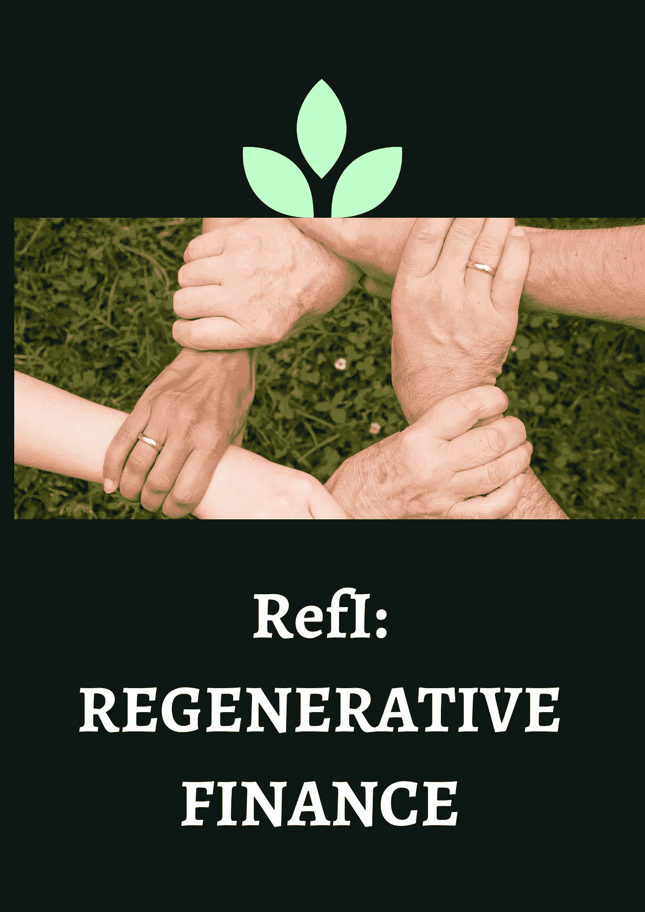
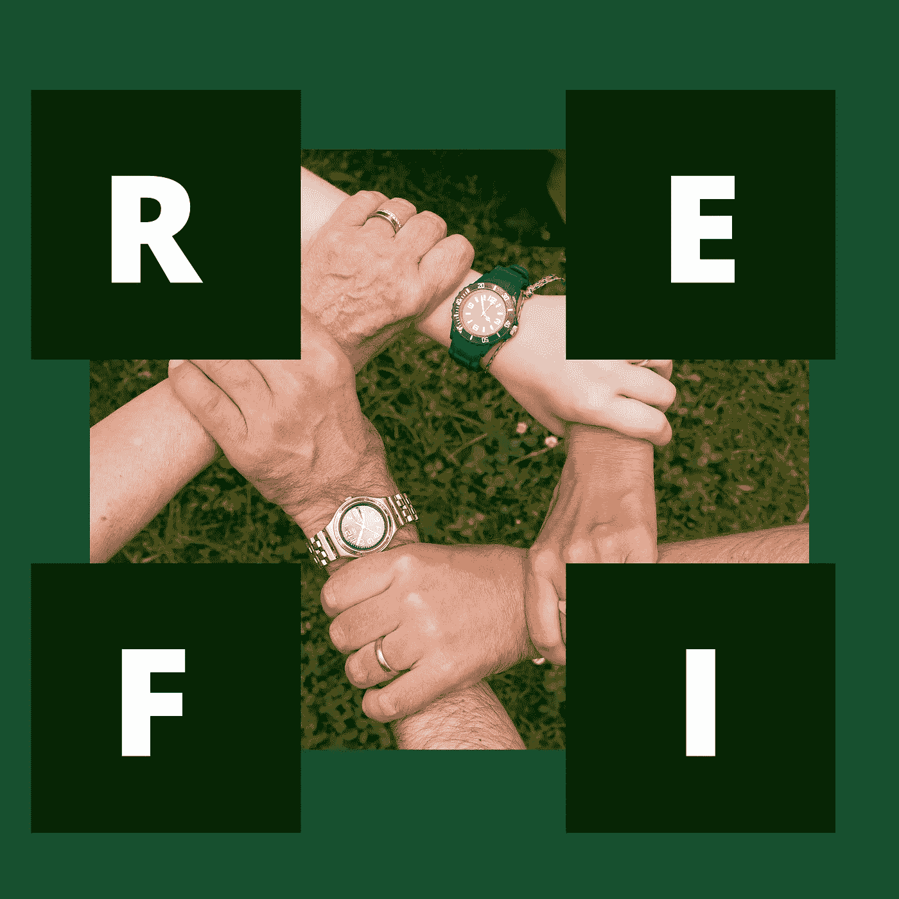

# ReFi:投资再生金融

> 原文：<https://medium.com/coinmonks/refi-a-dive-into-regenerative-finance-84282d9f61b8?source=collection_archive---------11----------------------->

首先是以中央集权为导向的传统金融体制。事实证明，这在很多方面都是低效的。然后是 Defi 一个建立在区块链技术基础上的分散化财务系统，修正了集权化的缺陷。

> 用 Defi 人们可以借出、借入、投资和交易，而不需要一个中央实体。

**什么是 Defi？**

Defi 代表分散金融。它包含了所有可以在区块链技术上完成的金融活动。Defi 允许用户在世界任何地方使用金融协议(不同于集中式金融)，它让用户完全控制他们的投资组合，消除所有形式的第三方，并创建一个基于区块链的透明生态系统。

几乎每天都有大量的 Defi 协议产生；随着时间的推移，一批投资心态不那么道德的新投资者崛起了；他们的运动开始疯狂蔓延。这些投资者被称为 **Defi Degens。**

[Defi Degens](https://www.dazeddigital.com/art-photography/article/55263/1/degens-the-high-risk-crypto-traders-making-millions-from-nothing#:~:text=Shorthand%20for%20'degenerate'%2C%20it's,with%20a%20sense%20of%20pride.) 是投资者(最好被称为堕落的赌徒),他们在没有关键研究或安全需求的情况下投资于收益率最高的协议，迅速获利，并将项目转交给新的投资者；然后投资亏损。他们被视为水泵和垃圾场的建筑师。他们故意夸大协议的价值和令牌的价值，将其提升到 5 倍、10 倍甚至 20 倍。新的、无知的和无辜的投资者然后将项目视为一笔好交易，并且可能想要投资以获得有利可图的 ROI 这是德根夫妇套现并放弃项目的时候；用新投资者的钱作为退出流动性。

对大多数人来说，德根被视为一场赌博；它的名气越来越大，许多农民开始采用这种不道德的做法。德根的崛起使 Defi 成为一个不安全的生态系统(除非你知道如何玩这个游戏，那么你可能是安全的)，几乎每一个新的产量农业协议都是由德根赞助和大力支持的。

为了这个事业；一种新的反贫困农民的亚文化已经兴起，以消灭退化的增长；这就是再生金融发挥作用的地方。

**什么是 Refi？**

Refi 代表再生金融；这是 Defi 世界的亚文化。它基本上涉及一种分散的社区或公益项目融资方式(或与之并行),这些项目的主要预期是回报投资者(出资者)。

把 Refi 看作是 Defi 的一个方面，它主要关心的是帮助公众，而不是创造单一协议的收益。Refi 将金钱作为解决问题、再生社区驱动的目标和提供公共产品的工具。公共产品就是没有限制谁应该或不应该使用它们的商品(换句话说，它们被任何人和任何人消费)。它们是经济学中一类重要的日常消费商品。在我们的现实世界中，这些公共产品包括良好的道路、干净的水、新鲜的空气、街道照明等。在技术领域，开源软件是公共产品的一个基本例子。开源软件(OSS)是一种简单的代码，它被设计成可以公开访问，创作者授予第三方使用、研究、修改和分发的权利。这是许多加密货币建立的基础。本质上；区块链技术是建立在开源软件之上的。

> Refi 不以盈利为目的；它以进步为导向。

**我们为什么需要 Refi？**

再生金融的发展使得人们对分散金融部门如何运作有了不同的看法。Refi 证明了一个安全、透明和开放的金融生态系统的基础不仅仅依赖于为开发者提供资金。

再生金融是民主的，而不是技术官僚的；它完全由社区驱动；它使用对等(P2P)资助机制来资助社区决定应该资助的项目。没有一个中央权力机构或治理机构能够操纵筹资过程或决定什么值得筹资。

再生金融建立了一种因克服不确定性而繁荣的金融文化；建立长期思维和社区信任

不像德根文化；再生金融用符合所有人利益的短期偏好取代了对短期个人利益的长期偏好。

领先的 ReFi 项目

1.)git coin Grant:git coin 于 2017 年 11 月推出，是一个专注于资助公共产品项目的开放平台。Gitcoin 还向开发开源软件的开发者支付报酬。需要资金的项目(或者说项目想法)可以提交给平台，以便从捐助方获得资金支持。Gitcoin 使用二次资助系统来开展其资助活动，二次资助是一种更加民主和可扩展的资助项目结构；个人捐款与大捐助者提供的更大资金池中的资金数额相匹配。本质上，这不是关于一个项目获得了多少资金，而是有多少人为这个项目提供了资金。二次拨款机制，让大佬们很难操纵拨款体系；从 500 个人那里得到 1 美元的赠款比从一个人那里得到 500 美元的赠款更匹配。

二次资助让小额捐赠者有机会支持他们认为最适合提供公共产品的项目。它符合捐赠者、项目和开发商的需求和动机。

2.)WhalerDAO: WhalerDao 是一个由开发人员、研究人员、社区影响者、技术大师和法律专家组成的社区，他们打算控制“鲸鱼”对 Defi 协议的控制权，并将其交给普通投资者。这样，Defi 将不仅仅是一个“富人越来越富，穷人越来越穷”的领域。WhaleDao 创建的第一个 Defi 协议是 TREE，它更像是一个慈善事业。

更多的 Refi 项目包括 Panvala、CLRFund、Fair Launch、Commons Stack 等等。

结论:

随着时间的推移，Defi 在采用和用例方面有所增长，大量资金被注入到这一倡议中，使其成为一个明确的生态系统。虽然 ReFi 站在遏制德根，事实是，德根在这里停留，无论再生文化是否消除德根的，有一点是真的；再生金融让投资者、用户甚至开发商看到了区块链和金融如何用于公益。

> 加入 Coinmonks [电报频道](https://t.me/coincodecap)和 [Youtube 频道](https://www.youtube.com/c/coinmonks/videos)了解加密交易和投资

# 另外，阅读

*   [比特币基地评论](/coinmonks/coinbase-review-6ef4e0f56064) | [德里比特评论](/coinmonks/deribit-review-options-fees-apis-and-testnet-2ca16c4bbdb2) | [FTX 评论](/coinmonks/ftx-crypto-exchange-review-53664ac1198f)
*   [Coinmetro 评论](https://coincodecap.com/coinmetro-review) | [VirgoCX 评论](https://coincodecap.com/virgocx-review)
*   [法国 4 大最佳加密副本交易平台](https://coincodecap.com/copy-trading-platforms-france)
*   [从 WazirX 切换到 CoinDCX 的 5 个理由](https://coincodecap.com/reasons-to-switch-from-wazirx-to-coindcx)
*   [联合国硬币评论](https://coincodecap.com/unocoin-review) | [最佳加密赌注硬币](https://coincodecap.com/best-crypto-staking-coins)
*   如何使用 MetaMask Wallet 获得 KCC 地址？