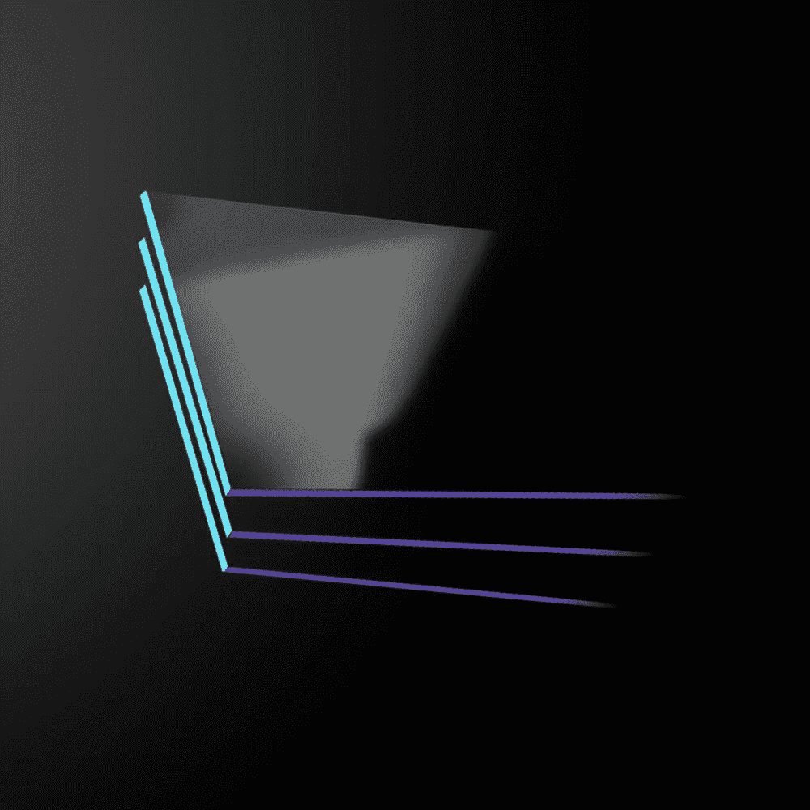
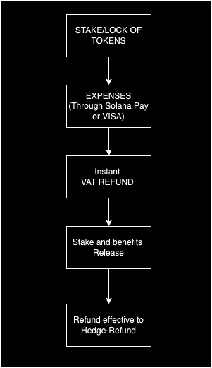
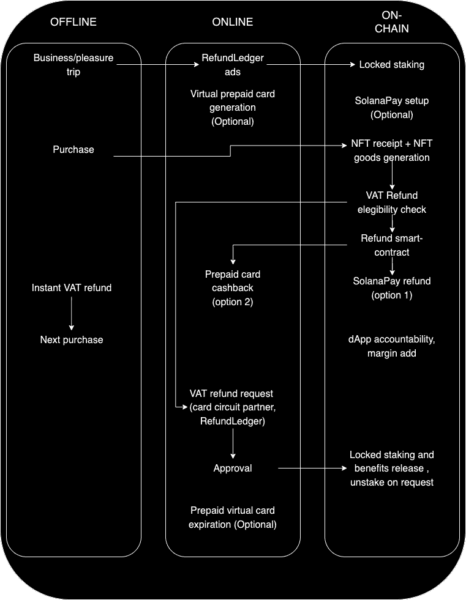
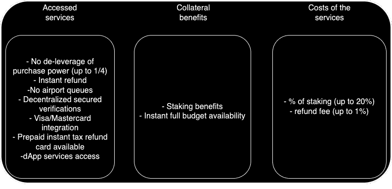
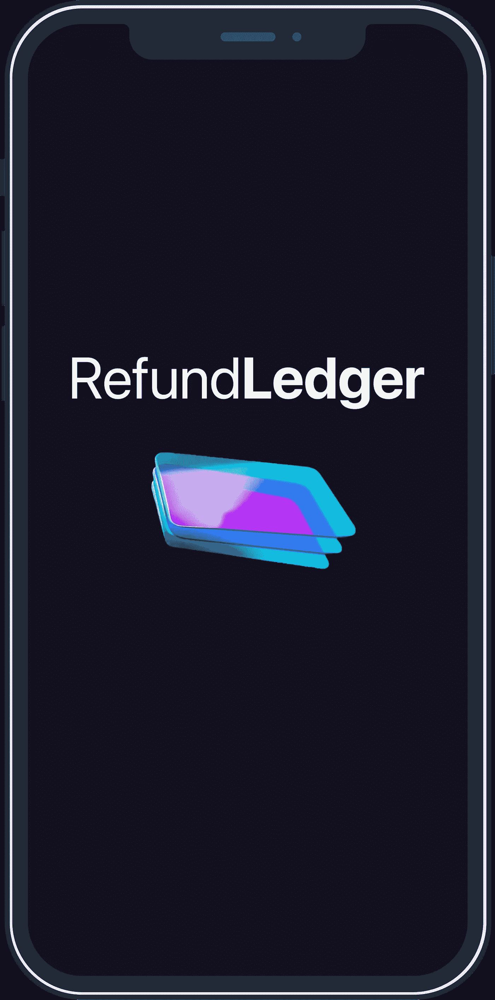
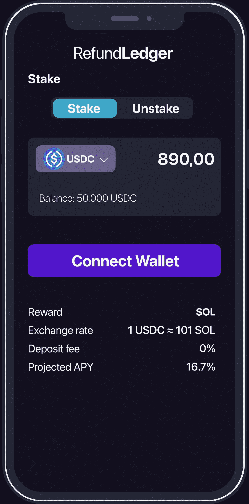
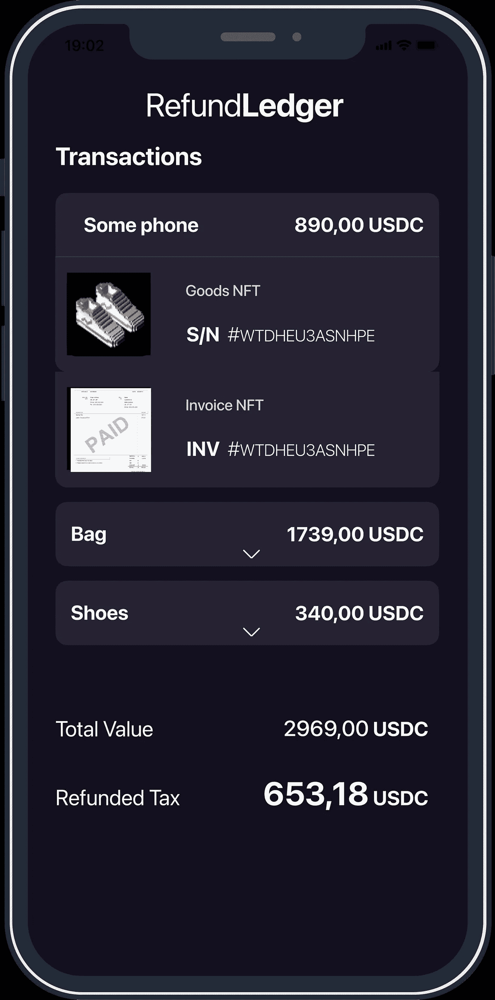
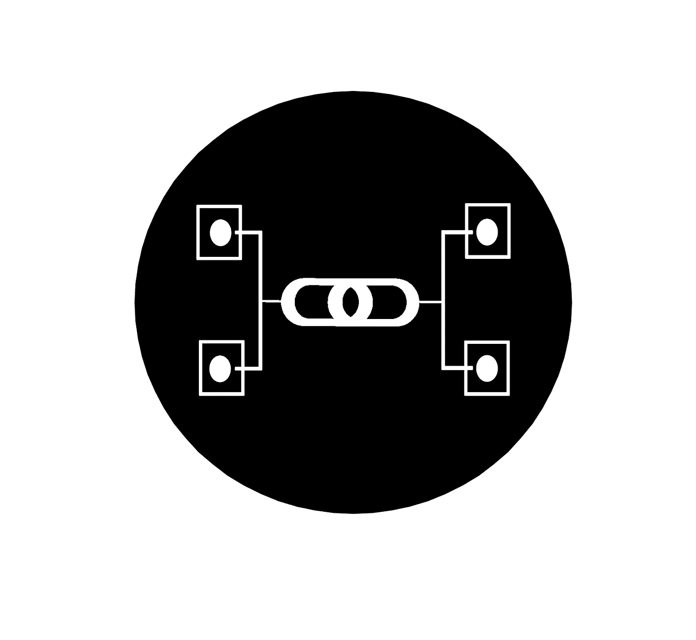
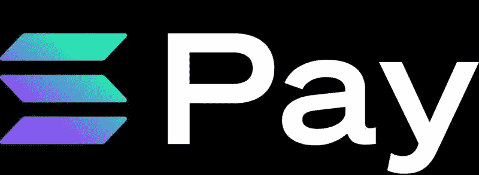
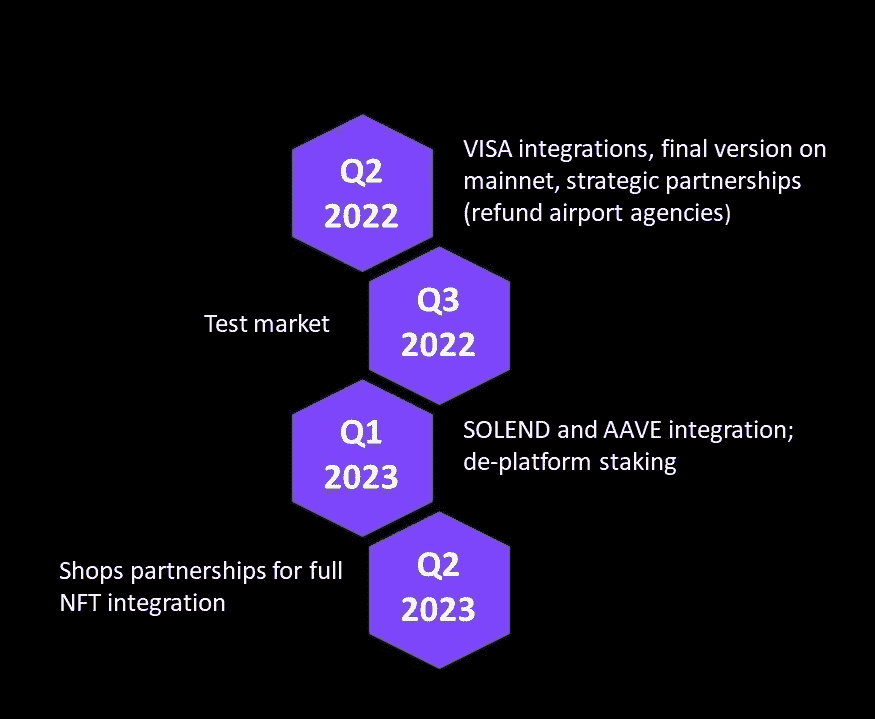

# 退款指南白皮书

> 原文：<https://medium.com/coinmonks/refundledger-whitepaper-d2456a671b57?source=collection_archive---------70----------------------->

# **简介**

[RefundLedger](http://www.refund-ledger.com) 是为 SolanaPay 和 VISA 卡打造的自动增值税退税机，由抵押品支持。

**我们的使命是避免税收，以在短期内降低不清晰的个人购买力。**

该系统可以平衡旅行的预算，因此该系统可以应用于将实体经济与区块链 BAAS 技术联系起来的更广泛的信用系统。

# **问题**

平均来说，一个外国游客 1/5 的预算花在了难以辨认的税收上:这对当地经济和游客都是不利的。大部分可退款流程都没有填。

*   增值税退税流程通常需要很长时间才能在钱包上生效；
*   难以辨认的税款会对一次旅行的全部预算造成高达 25%的损失；
*   没有用于即时了解退款资格和有效退款检查的自动化系统。

作为一个案例研究，中国游客在欧洲:

*   从中国到欧盟的出境旅游人数(参考移动，占总数的 28%):249 万
*   每位游客的平均现场消费为 5.000 美元(欧盟参考)
*   平均合格率:12%

传统的增值税退税制度阻碍了增值税退税本身，对促进预算扩张以刺激当地经济支出几乎没有帮助:这个问题对当地人和旅行者都有影响。

# **解决方案**

一个为旅行者提供的即时增值税退税系统，由出发前的赌注和自动人工智能测试支持，从收据和交易中产生双 NFT。

简而言之，我们的解决方案:

*   出发前抵押担保品；
*   交易的双重 NFT 生成:应用增值税的价值和货物类型；迭代退款资格计算；第一个 NFT 将存储交易值，第二个 NFT 将存储收据动机(货物，也将被支付交易取走)；第二个 NFT 将由我们的人工智能机器人检查，它将与政府 API 对抗，并评定增值税退税的资格；
*   即时增值税退税；
*   在政府最终批准后，可获得 Unstake + APY 福利。

# **流程**

在此之后，请查看验证增值税退税和最终取消服务激活的整个流程。

然后接下来你可以从 web2 到 web3，进入整个过程发生的位置。

总结优势和获得的服务:

**退款客户将为每笔交易支付 1–2%的费用，平均为 9.8%至 40%的 APY 费用。**

# **在移动中**

在 2022 年 Q2 奥运会结束时，将有一个移动 dApp 来跟踪所有的运动和系统的效率。所有数据和隐私都符合 safu 和法规。

**使用我们的 dApp**

通过智能手机、平板电脑或 PC 轻松跟踪您的支出、退款、赌注和贷款

**轻松下注**

出发前，投入一定数量的硬币作为抵押*

* 2023 年 Q1 将实现 AAVE 和索伦德整合

## 获得合格商品的即时退款

我们通过我们独特的双 NFT(交易和货物)生成系统和我们的人工智能管理的应用编程接口，对可转让的货物即时退还增值税

# **为什么是区块链**

区块链是我们用来设计我们向世界提供服务的概念的技术；它所确保的安全性，是让自动化发挥最大作用的原因。特别是，不可信自动化将通过部署多个智能合同来实现。

一份**智能合同**是两个实体之间以计算机代码形式达成的协议。这些代码然后在区块链上运行，结果它们被存储在公共数据库中，不能被修改。在智能合同中，交易在协议中的条件得到满足时发生*，而没有第三方的参与*。这解决了信任、速度和安全等问题。智能合同将用于在交易后激活服务，中断 unstake 处的服务，基于交易和购买生成双重 NFT，并基于双重 NFT 验证系统向客户退款。

我们首先选择的区块链是 *Solana* ，当他们能方便地得到更好的结果时(主要指*油费*)，也可以考虑*以太坊*或任何 L2；web2 操作也将通过区块链 oracles(如 *Chainlink* )实现，这将实现与政府方和增值税退税机构的 API 连接。

退款系统将由**赌注**来保证，在开始合同之前，客户将需要一定数量的硬币。

# **整合和预期的合作关系**

退款分类器的建立是为了支持 SolanaPay 获得所需的交易信息，并立即向旅客退款。

为了使我们的系统平稳运行，我们正在将其与 Visa 和 Mastercard 等支付卡发行商集成，以确保最佳的用户体验，并允许客户选择他们喜欢的支付方式，并承认我们仍处于支付加密应用的早期。

我们计划与全球公认的增值税退税机构(如 Global Blue)建立合作伙伴关系，以确保快速交付服务，并能够为现有服务提供尽可能多的可插入价值:这就是我们如何将传统流程连接到区块链支持的更快的新技术应用中。

我们的系统将支持与借贷平台的集成，不仅允许即时退款，还允许即时贷款。这样，该系统将为企业和个人提供更广泛的服务和应用，而不仅仅是将应用限制在自己国家以外的旅行。

AAVE 和索伦德将是第一个整合，我们将从平台打桩过渡到永久平台打桩。这将使我们和客户本身的风险最小化，允许客户访问我们服务的多种使用选择。

# **路线图**

# **结论**

这是分散式服务和应用区块链即服务新时代的开始。这一概念将成为去中心化世界和全球社区之间的关键联系点，使我们能够实现广泛采用 DeFi 加密货币的愿景。

*拆船队*

[www.refund-ledger.com](http://www.refund-ledger.com)

> 加入 Coinmonks [电报频道](https://t.me/coincodecap)和 [Youtube 频道](https://www.youtube.com/c/coinmonks/videos)了解加密交易和投资

# 另外，阅读

*   [SmithBot 评论](https://coincodecap.com/smithbot-review) | [4 款最佳免费开源交易机器人](https://coincodecap.com/free-open-source-trading-bots)
*   [杠杆代币](/coinmonks/leveraged-token-3f5257808b22) | [最佳密码交易所](/coinmonks/crypto-exchange-dd2f9d6f3769) | [Paxful 点评](/coinmonks/paxful-review-4daf2354ab70)
*   [加密套利](/coinmonks/crypto-arbitrage-guide-how-to-make-money-as-a-beginner-62bfe5c868f6)指南| [如何做空比特币](/coinmonks/how-to-short-bitcoin-568a2d0b4ae5)
*   [币安期货交易](https://coincodecap.com/binance-futures-trading)|[3 commas vs Mudrex vs eToro](https://coincodecap.com/mudrex-3commas-etoro)
*   [如何购买 Monero](https://coincodecap.com/buy-monero) | [IDEX 评论](https://coincodecap.com/idex-review) | [BitKan 交易机器人](https://coincodecap.com/bitkan-trading-bot)