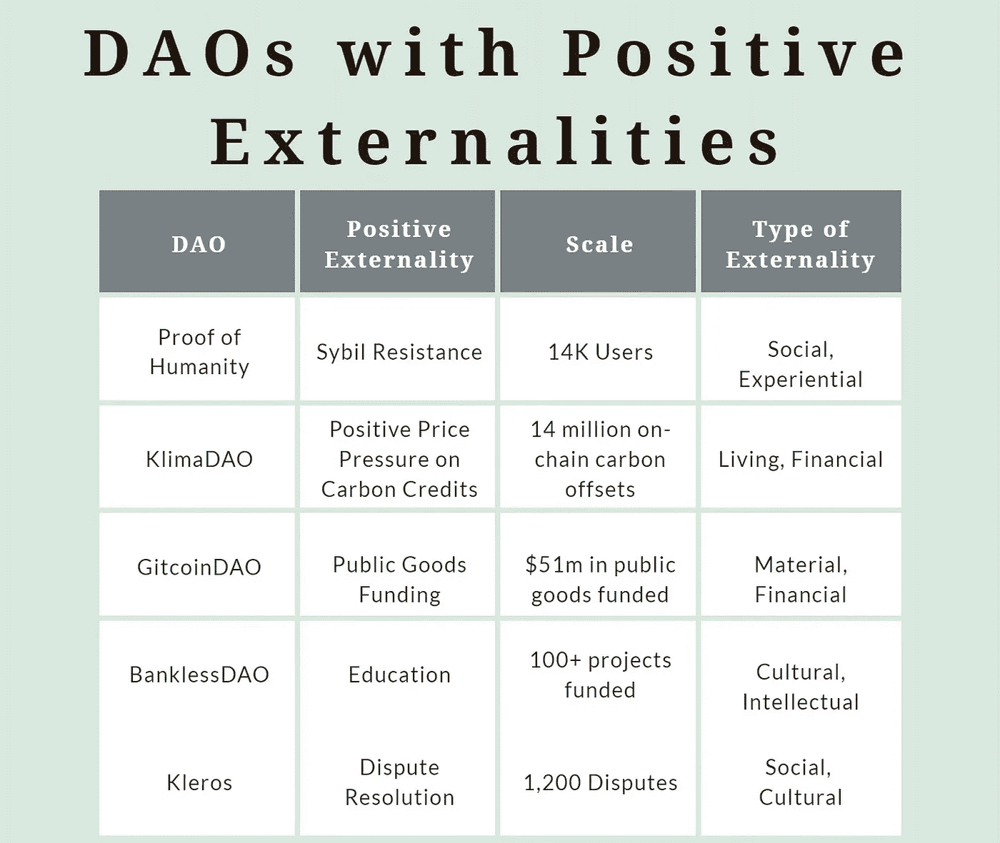

# 为秘密的冬天再生夏天

> 原文：<https://medium.com/coinmonks/regen-summer-for-crypto-winter-e976c5a51ffc?source=collection_archive---------13----------------------->

随着我们进入(或者继续生存)由美国和全球潜在滞胀的完美风暴、Luna 灾难和之前过热的 crytpo 市场引起的加密冬天，问题变成了，加密的下一步是什么？

今天(5 月 14 日)听了无银行播客，我被他们对熊市给这个行业带来的影响的热情所打动。“游客”在熊市中离开，而建筑商则被留下来继续建造。

DeFi summer 几年前就发生在这样的市场上。无银行二人组在播客的结尾提出，今年夏天及以后将会出现另一轮发展热潮，但他们质疑这可能是什么。

与其坐在一旁看接下来会发生什么，我们似乎可以尝试利用来自多元化利益相关者社区的不断增长的能量，推动 **Regen Summer** 成为在市场低迷时期诞生的下一个大趋势。

**重生之夏的绿色学校**

虽然加密“基因”通常模仿新兴的时尚事物，如 NFTs，但“基因”是那些寻求利用加密做好事的人。虽然可能没有一个公认的定义是什么使一个人成为再生或什么是再生密码经济学，我会简单地定义这个空间为

> “专注于利用加密经济工具从根本上改变资本主义固有激励的人员和项目，为人类和地球创造积极的外部性”

这个空间已经在秘密爆炸，但还没有足够的人谈论它。Gitcoin 的创始人 Kevin Owocki 有一个无银行赞助的播客，主题是再生密码经济学，名为[绿色药丸](https://open.spotify.com/show/0l6aXWC94dd0RA3tkKfxjd)，他在那里与再生密码经济学项目的建设者交谈。他最近还发表了这篇文章，其中包括了考虑到这些目标的 DAOs 图表。

Source: Bankless, Kevin Owocki (note: KlimaDAO enabled 1.4mn tons of offsets)

*公共产品资助*

Owocki 将他的播客和思想领导力的大部分重点放在如何开发更好的公共产品融资工具上，如 Gitcoin 采用的二次融资模型。以太坊的非官方代言人维塔利科·布特林(Vitalik Buterin)一直支持利用区块链来实现追溯性公共产品融资的潜力。

这里的概念是，希望为再生经济开发更多开源工具的构建者很难筹集到足够的资金，因为潜在的项目资助者没有高质量的出口。这使得这些项目急需资金，无法满足许多开源项目的雄心和潜力。追溯性公共产品资助旨在为已经取得足够影响力的开源项目创建资助工具(和“退出”途径)。这种想法是，如果有资金池使这些项目能够退出，这些项目开发商将更容易在其开发的早期吸引资金，因为早期开发商和投资者现在已经有了退出的途径。

乐观基金会最近宣布了第一个这样的计划，即大规模和持续的资本流动，以实现追溯性的公共产品融资。

*社会影响*

显而易见，追溯性公共产品融资可以通过激励开发商构建能够以重要方式推动社会发展的解决方案来实现社会影响。然而，除此之外，最近关注社会影响的加密活动似乎有了显著增长。例如，加密社区联合起来向乌克兰政府捐赠(并继续这样做)加密技术，以对抗俄罗斯侵略者，捍卫他们的自由。许多其他类似的乌克兰倡议已经出现，包括许多 NFT 项目，他们把所有的收入都捐给了这项事业。

说到 NFT 项目，越来越多的艺术家正在开展 NFT 活动，为他们关心的事业筹集资金。在最新一期的 Crypto 利他主义播客中，OSbiome 和 Ome NFTs 的创始人强调了他们利用 NFTs 鼓励更健康的生活方式的努力，以及他们每年拯救 150 万人生命的目标。

*气候与环境*

虽然这几十年来一直是我心中的一个话题，因此我有偏见，但我们似乎正在目睹再生加密经济学方法的爆炸，以重新调整围绕气候变化和其他环境原因的激励措施。在最近的一篇文章中，我强调了 10 个这样的项目,从负碳区块链到链上碳抵消项目、低碳流动性和为资助低碳 web3 倡议而成立的投资 Dao。

总之，我的观点是，我们已经看到越来越多的人意识到并致力于采用再生加密经济学的项目，以重新调整激励机制，创造正外部性。现在是时候让 2022 年夏天成为重生之夏了。

我们会见证一个由 web3 建设者、投资者、媒体和有意识的消费者组成的全球社区的诞生吗？

让我们让这个夏天焕然一新！

**关于作者**

*Boyd Cohen 是 Iomob 的首席执行官和联合创始人，Iomob 是一个分散的移动互联网(IoM)网络。自 2001 年在科罗拉多大学获得战略和创业博士学位以来，他在过去的二十年里致力于加速实现低碳可持续经济。这包括出版了 3 本书，多篇同行评审的文章，经常为 Fast Company 投稿，并在智能城市和可持续发展领域创办了一些企业。*

> 加入 Coinmonks [电报频道](https://t.me/coincodecap)和 [Youtube 频道](https://www.youtube.com/c/coinmonks/videos)了解加密交易和投资

# 另外，阅读

*   [Bookmap 评论](https://coincodecap.com/bookmap-review-2021-best-trading-software) | [美国 5 大最佳加密交易所](https://coincodecap.com/crypto-exchange-usa)
*   最佳加密[硬件钱包](/coinmonks/hardware-wallets-dfa1211730c6) | [Bitbns 评论](/coinmonks/bitbns-review-38256a07e161)
*   [新加坡十大最佳加密交易所](https://coincodecap.com/crypto-exchange-in-singapore) | [购买 AXS](https://coincodecap.com/buy-axs-token)
*   [红狗赌场评论](https://coincodecap.com/red-dog-casino-review) | [Swyftx 评论](https://coincodecap.com/swyftx-review) | [CoinGate 评论](https://coincodecap.com/coingate-review)
*   [投资印度的最佳密码](https://coincodecap.com/best-crypto-to-invest-in-india-in-2021)|[WazirX P2P](https://coincodecap.com/wazirx-p2p)|[Hi Dollar Review](https://coincodecap.com/hi-dollar-review)
*   [加拿大最佳加密交易机器人](https://coincodecap.com/5-best-crypto-trading-bots-in-canada) | [库币评论](https://coincodecap.com/kucoin-review)