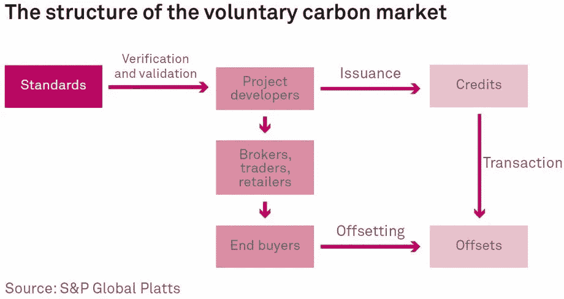

# 再生金融:可持续未来的创新

> 原文：<https://medium.com/coinmonks/regenerative-finance-innovation-for-a-sustainable-future-315580e11f90?source=collection_archive---------4----------------------->

可持续发展不仅仅是一个时髦词。气候正处于危机之中，我们需要立即采取行动。

政府和消费者要求采取气候行动，作为回应，组织正在将可持续性融入其运营和投资决策。不幸的是，我们目前的金融体系无法很好地满足必要的融资需求水平。

传统金融围绕着一套狭隘的股东利益盈利标准而建立，并不是为了融资整体投资而建立的，这种投资以各种各样的成功标准使所有利益相关者受益。再生金融，简称 ReFi，已经成为一种新型的融资结构，正迅速受到欢迎。

ReFi 通过关注更广泛的环境、社会和治理(ESG)投资标准来确定投资价值，从而采取全面的融资方法。随着 ReFi 启动可持续系统，我们正处于一种新型经济繁荣的边缘。

# 什么是再生金融？

再生金融是利用各种形式的资本推动所有利益相关者进行系统、可持续和积极变革的过程。ReFi 旨在将投资引向再生企业，以加速它们的增长，并帮助它们扩大影响。再生金融可以通过提供这些企业繁荣发展所需的资本来帮助解决市场失灵问题。再生金融也有助于激励积极的环境和社会成果，而这往往是传统金融所缺乏的。

ReFi 与传统金融的关键区别在于，再生金融将系统的长期健康置于短期金融回报之上。再融资投资的短期回报率往往较低，因为它们是从更长远的角度进行投资的。然而，正如我们看到的可持续投资的增长，这些投资可以提供长期的高回报，因为它们降低了风险，有助于建设一个更可持续的未来。

ReFi 的一个主要优势是它可以帮助解决市场失灵问题。当自由市场由于缺乏信息或激励结构而不能有效地分配资源时，就会发生市场失灵。例如，自从工业革命以来，人类已经建立了工业，而不用担心温室气体排放。虽然这似乎产生了可持续增长，但不受控制的排放现在让我们面临着一场气候危机，到 2050 年，这场危机可能会削减高达 14%的 GDP，相当于 23 万亿美元。

当前的市场没有考虑到碳排放的负外部性，资源的低效配置使得人类在面临迫在眉睫的环境危机时不得不奋起直追。ReFi 致力于通过促进资源的智能分配来纠正这一问题。

# Refi 在行动:碳抵消

目前使用的主要 ReFi 工具是碳补偿信用。为了创造一种抵消，这一过程就像一个市场，通过中介连接信贷购买者和信贷生产者。第三方组织验证信用生产者的再生行为。组织利用这些信用来加速范围 1、2 和 3 排放的抵消，而不会迅速改变其业务运营。

碳市场目前分为强制市场和自愿市场。强制性市场是指在符合排放限额的基础上进行信用交易的市场，如欧盟排放交易计划(EU ETS)和加州限额交易计划。2020 年，强制市场的总规模约为 2610 亿美元。

清洁发展机制(CDM)是《京都议定书》的灵活机制之一，允许主要排放国通过投资其他国家的减排项目来实现其减排目标。清洁发展机制是一种基于项目的机制，这意味着单个项目产生经证明的减排(CER)信用额，这些信用额可以出售给减排国家以获取利润。强制性合规有严格的报告和验证标准。

自愿市场被那些在法律上没有义务降低排放，但由于 ESG 目标或利益相关者的压力而选择降低排放的公司所使用。这些市场目前主要由 Verra 和金本位制等少数实体主导。志愿服务市场规模较小，但增长迅速，2021 年将达到 1500 亿美元 1B，但到了 2030 年可能会升至 1500 亿美元。

碳信用主要有两种类型:碳避免和碳去除。碳避免包括付钱给组织不要做增加二氧化碳的行为，例如付钱给伐木公司不要砍伐树木的特定部分。传统上，避税是最常见的抵消类型，2020 年占已发行信用的 96%。第二种也是更有效的抵消方式是除碳。这包括传统活动，如植树或利用更可持续的农业实践来保持土壤中的碳。遵循特定抵消方法的机构必须让独立的第三方对其行为进行验证。GHG 每净减排一公吨就创造一个碳信用额。碳信用购买者的商业运作使他们成为 GHG 的净排放者。这些企业可以在碳市场上购买碳信用，并将其应用于他们的组织，从而“抵消”他们的运营，使他们成为净碳中和。

# 区块链和生态系统服务

分布式账本技术在过去的几年里已经发展到了这样一个程度，真实世界的用例不仅是可能的，而且代表了对以前系统的改进。再生金融领域是目前正在释放的创新的最强有力的例子之一，目前正以几种不同的方式展开。像 Toucan protocol 这样的组织正在直接从 Verra 这样的注册中心弥补碳补偿。

通过桥接来自链上孤立数据库的信用，可以跟踪信用以避免重复花费。此外，Toucan 能够重新利用现有的 DeFi 基础设施，以促进围绕碳信用创造新的金融产品。例如，KlimaDAO 利用这一基础设施建立了一个由碳信用支持的财政部。这种金融工具减少了碳信用的供应，从而提高了价格。这使得污染者推迟改变运营的成本越来越高。

# 超越狭隘的视野:下一步是什么

关于气候变化及其对环境影响的讨论主要集中在碳排放上。这是可以理解的，因为二氧化碳排放的释放是最广为人知的气候变化驱动因素。然而，减少二氧化碳排放只是抵御气候变化所需的更大规模行动的一部分。通过将碳去除作为关键指标，我们未能认识到气候变化对生物多样性、珊瑚礁酸化和水资源枯竭的影响。

为这类行为定价在传统上是很困难的。然而，重新规划现有的 DLT 基础设施允许将相同的令牌化资产定价机制应用于再生行动。Regen network、BasinDAO 和 Avano 等组织是最早围绕更广泛的再生行动创建资产的组织。随着围绕这些业务的金融机会增加，这一趋势只会加速。随着创新的新融资机会和资产的释放，它将各部分整合在一起，形成强大的力量。

一个令人兴奋的例子是用自然资本支持一种货币的想法。受查尔斯·爱森斯坦的“神圣资本”的启发，Celo 区块链与气候集体合作，承诺以自然资本资产(如雨林和最终更广泛的资产，如受含水层补给和矿产支持的资产)支持其 40%的美元等值稳定货币。这将激励对这些自然资产的保护，因为它们的管理者将有效地凭空创造可替代货币。随着自然资本资产的激增，这种未来是可能的。

> *加入 Coinmonks* [*电报频道*](https://t.me/coincodecap) *和* [*Youtube 频道*](https://www.youtube.com/c/coinmonks/videos) *了解加密交易和投资*

# 另外，阅读

*   [有哪些交易信号？](https://coincodecap.com/trading-signal) | [Bitstamp vs 比特币基地](https://coincodecap.com/bitstamp-coinbase) | [买索拉纳](https://coincodecap.com/buy-solana)
*   [ProfitFarmers 点评](https://coincodecap.com/profitfarmers-review) | [如何使用 Cornix 交易机器人](https://coincodecap.com/cornix-trading-bot)
*   [十大最佳加密货币博客](https://coincodecap.com/best-cryptocurrency-blogs) | [YouHodler 评论](https://coincodecap.com/youhodler-review)
*   [my constant Review](https://coincodecap.com/myconstant-review)|[8 款最佳摇摆交易机器人](https://coincodecap.com/best-swing-trading-bots)
*   [MXC 交易所评论](/coinmonks/mxc-exchange-review-3af0ec1cba8c) | [Pionex vs 币安](https://coincodecap.com/pionex-vs-binance) | [Pionex 套利机器人](https://coincodecap.com/pionex-arbitrage-bot)