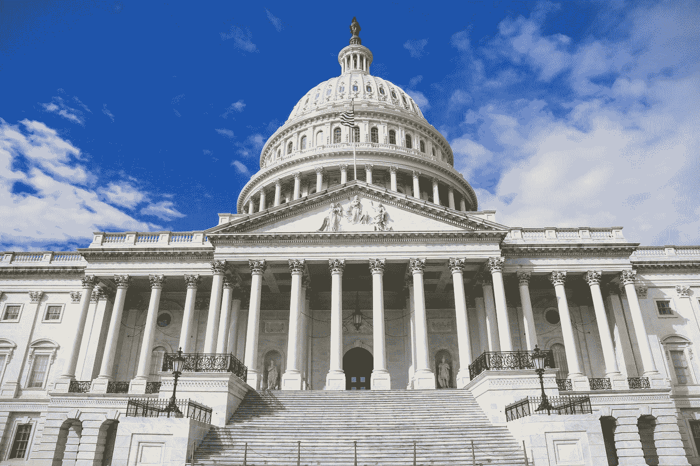

# 监管不受监管的

> 原文：<https://medium.com/coinmonks/regulating-the-unregulated-f15bbbaa4344?source=collection_archive---------27----------------------->

探索监管稳定信贷意味着什么，以及这将如何影响货币市场和银行体系。

尽管更广泛的加密货币市场在一年多的时间里相对停滞在 2 万亿美元，但 stablecoins 的采用在同一时期增长了约 5 倍，强化了 stablecoins 是加密现金的概念。对稳定玉米的兴趣和采用日益增加，在机构和政府层面引发了关于监管稳定玉米的可能方式的讨论。

**如果我们像监管银行一样监管他们会怎么样？**

如果稳定的信贷受到与银行同等程度的监管，这可能会从结构上改变货币市场格局和银行体系:

1)对高质量流动资产的需求显著增加(**【HQLA】**)，导致安全和流动资产短缺。

2)鼓励从银行存款和货币市场基金(**“MMFs”**)转向稳定的货币，消除传统的金融体系，导致向更广泛的经济提供更少的信贷和流动性。

在我们深入研究货币市场和银行体系的其他部分如何发展以补充稳定货币作为现金替代品之前，让我们先来看看稳定货币和存款以及货币市场基金之间的区别。

**稳定存款与存款和 MMF 有何不同？**

稳定硬币背后的主要思想是，它们应该起到另一种货币形式的作用。这意味着它们必须内在地提供价值储存，成为交换媒介，并按面值计价。这三个特征使得货币能够在整个金融系统中有效地转手。

虽然稳定货币和存款有相似之处，但稳定货币不符合货币的定义。最值得注意的是，目前还不清楚 stablecoins 是否可以按面值赎回——这是决定 stablecoins 作为交换媒介的有效性的一个关键特征，因为我们尚未看到 stablecoins 的真正挤兑。

让我们探讨一下为什么稳定债券的经济面值会受到质疑的两个因素:

**#1 稳定硬币更像 19 世纪的私人纸币:**

目前有数百种稳定硬币发行者和稳定硬币，都由不同类型的抵押品支持。这种安排让人想起了 19 世纪的纸币，当时银行可以发行自己的私人纸币，只要它们以国家债券作为抵押。这种私人银行货币的生产让位于对各种不同类型的私人纸币进行不同估价的市场。市场可以对某个州的票据进行估值，使其低于另一个州的票据。实际上，市场为每张私人钞票分配了信用风险，导致某些钞票以低于票面价值的价格交易。因此，纸币是一种低效率的支付方式，在压力时期，私人银行容易出现挤兑。最终，1863 年出台了《国家银行法》，允许建立国家银行，发行由美国国债支持的国家银行券。从此，各国纸币现在是统一货币，都是按面值计价。另一方面，稳定的纸币以不同的价值和不同的抵押品进行交易，是私人纸币的翻版。

**#2 稳定的收入并不总是由稳定的资产支持:**

由于缺乏监管，稳定币发行者用大量非 HQLA 支持他们的稳定币。最大的稳定币发行者有将近 50%的储备在非 HQLA，在经济紧张时给赎回带来了巨大的风险。作为流动性来源的高风险资产敞口肯定会带来挤兑风险，这在 2008 年和 2020 年的优质 MMF 市场中显而易见。相反，有关存款的法规要求银行保持最低水平的 HQLA，不仅要满足当天的流动性需求，还要应对突发的流动性事件。然而，稳定的货币储备往往可以由大部分非 HQLA 货币来弥补。

简而言之，虽然稳定的货币从支付的角度来看提供了实质性的好处(即结算时间、跨境效率)，但票面赎回的不确定性使其有别于作为一种货币形式的存款。

**像监管银行一样监管银行意味着发行人被视为受保存款机构**

除了挤兑风险，稳定账户还面临其他风险，如系统风险、保管风险、洗钱风险等。对银行等稳定的硬币发行者进行监管，可以最大限度地降低挤兑风险，还可以降低支付系统风险，以及对发行者成为主要支付服务提供商时经济实力集中的担忧。挤兑风险可以通过资本、流动性和其他审慎要求以及将美联储作为最后贷款人来降低。支付系统风险可以通过各种风险管理实践来降低。通过禁止发行人从事某些活动，可以解决权力集中的问题。

如果稳定硬币发行人被监管为受保存款机构(**“IDIs”**)，他们将在公司和控股公司层面接受联邦监管。他们将需要遵守资本和流动性要求。据推测，稳定的硬币存款将受到 FDIC 存款保险的保护，受到法律限制，并保持获得紧急流动性和美联储服务的渠道。所有这些措施都将增强市场对稳定货币的信心，在经济困难时期，稳定货币是一种支付和价值储存手段；从而最小化稳定颗粒的运行风险。

**然而，受监管的稳定信贷可能会对货币市场格局和银行系统产生重大影响**

要求稳定的硬币发行者持有 HQLA 储备可能会显著增加对安全和流动性资产的需求。截至 2021 年 12 月，Tether (USDT)和 Circle (USDC)共持有 780 亿美元的美国国债。尽管这只占短期国库券市场的 2%,但稳定币的需求和采用一直在快速增长(稳定币市场资本总额从去年的 380 亿美元增加到 1800 亿美元),进一步采用可能会加剧货币市场的供需不平衡。如果稳定的硬币发行者像银行一样受到监管，这可能导致短期国库券和其他 HQLA 的潜在短缺。

监管稳定硬币发行者可能会鼓励从存款和货币市场基金转向稳定硬币，这将扰乱融资市场和更广泛的经济。考虑到 stablecoins 是一种有效的支付形式，尤其是跨境支付，并且其易用性可能对跨国公司有吸引力，因此从企业和机构轮换并不困难。

此外，稳定债券为企业资金管理提供了巨大的优势，因为它们能够以远高于存款和货币市场基金的利率赚取利息。举例来说，稳定债券在 DeFi 协议(AAVE、复利)上可以获得 2.0-3.0%的收益率，而银行存款和 MMF 的平均净收益率分别为 0.06%和 0.1%。

对稳定债券的大规模轮换可能会夺走传统银行的资金以及它们为经济其他部分提供的信贷。银行的资金将会减少，它们将无法提供同样多的贷款，这将减少银行系统中的信贷供应。这将导致借贷成本增加。正如总裁工作组报告所指出的，“如果受保存款机构的零售存款被稳定信用债券抢走，而支持稳定信用债券的储备资产无法支持信用创造，那么稳定信用债券的总增长可能会增加借贷成本，影响实体经济中的信用可用性。”尽管该报告侧重于零售轮换，但将稳定收入作为 IDIs 进行监管将增强市场信心，并可能吸引企业和机构采取类似行动。

*Compound Capital Partners 是一只开放式基金，通过其稳定货币和 delta 中性收益农业的双重方法提供对数字资产类别的投资。*

*碎碎念:*[https://twitter.com/investcompound](https://twitter.com/investcompound)

*网址:*[*https://www.compound.capital/*](https://www.compound.capital/)

> 加入 Coinmonks [电报频道](https://t.me/coincodecap)和 [Youtube 频道](https://www.youtube.com/c/coinmonks/videos)了解加密交易和投资

# 另外，阅读

*   [Bookmap 评论](https://coincodecap.com/bookmap-review-2021-best-trading-software) | [美国 5 大最佳加密交易所](https://coincodecap.com/crypto-exchange-usa)
*   最佳加密[硬件钱包](/coinmonks/hardware-wallets-dfa1211730c6) | [Bitbns 评论](/coinmonks/bitbns-review-38256a07e161)
*   [新加坡十大最佳加密交易所](https://coincodecap.com/crypto-exchange-in-singapore) | [购买 AXS](https://coincodecap.com/buy-axs-token)
*   [红狗赌场评论](https://coincodecap.com/red-dog-casino-review) | [Swyftx 评论](https://coincodecap.com/swyftx-review) | [CoinGate 评论](https://coincodecap.com/coingate-review)
*   [投资印度的最佳密码](https://coincodecap.com/best-crypto-to-invest-in-india-in-2021)|[WazirX P2P](https://coincodecap.com/wazirx-p2p)|[Hi Dollar Review](https://coincodecap.com/hi-dollar-review)