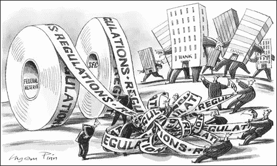
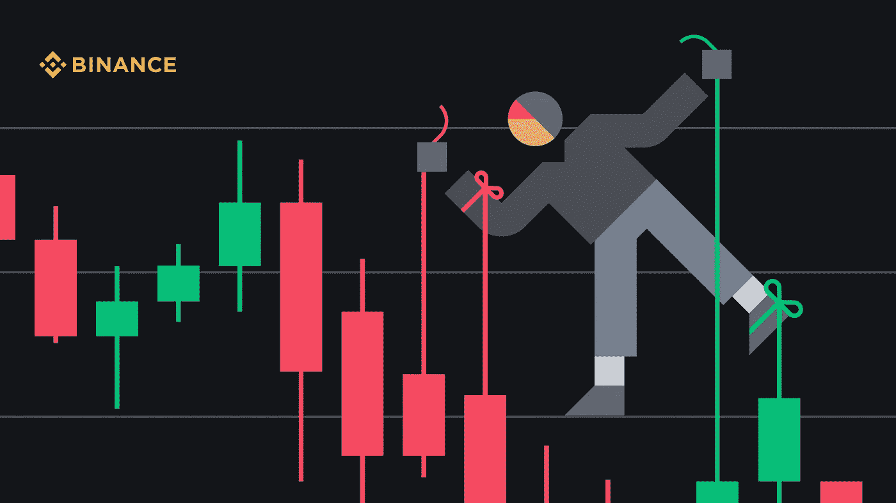
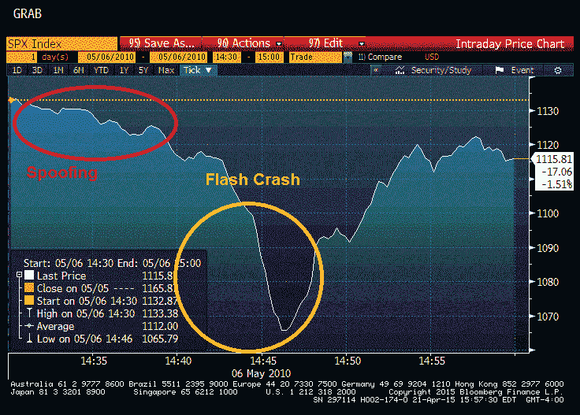
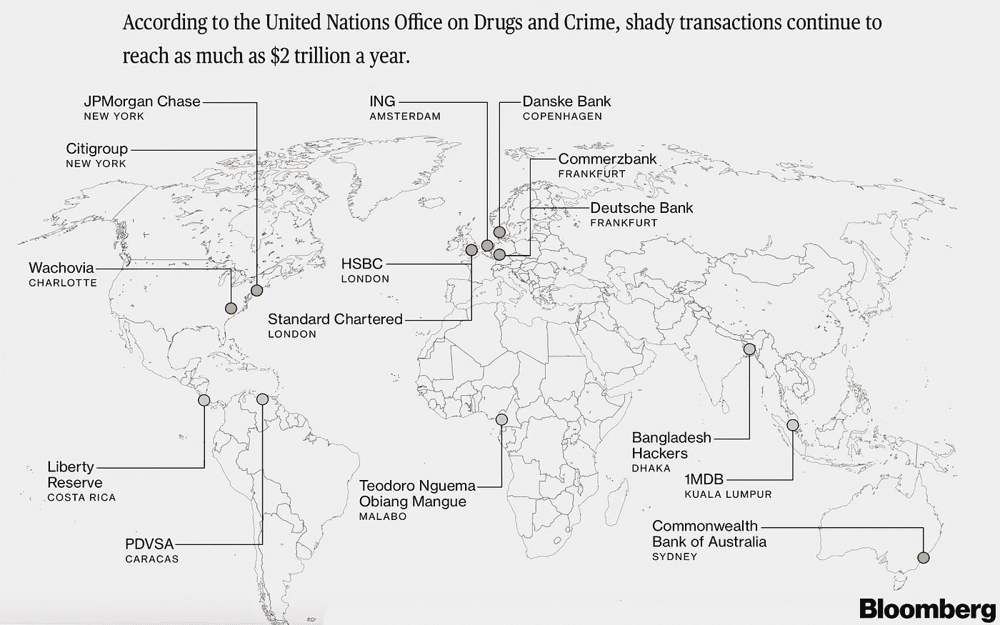

# 规则，规则…规则。

> 原文：<https://medium.com/coinmonks/regulation-regulation-regulation-ceccdaf6e441?source=collection_archive---------47----------------------->

我在这里完全摸不着头脑。

在大多数情况下，监管行动需要经验丰富的投资者、律师和交易员的集体智慧来消化和利用。

既然这些都不是，让我们试着解决它。

首先，让我公开我非常怀疑监管，尤其是声称防止以下情况的监管:

1.  **市场操纵(保护投资者免受早期采用者或‘鲸鱼’——拥有大量市场份额的人的伤害)**
2.  **骗局(拉地毯的项目)**
3.  **网络欺诈和网络安全风险**
4.  **洗钱/逃税(典型的错误提示)**

我也不认为 BTC 对美国的监管环境有什么好担心的(因此也不担心那些会效仿美国、欧盟和英国的人)——稍后会有更多的讨论。

**市场操纵**

[https://www.binance.com/en/blog/fiat/what-is-market-manipulation-in-cryptocurrency-421499824684902912](https://www.binance.com/en/blog/fiat/what-is-market-manipulation-in-cryptocurrency-421499824684902912)

币安是世界上加密货币日交易量最大的交易所，据该交易所称，主要的弊端是一个古老的“泵和转储”。他们在下面很好地描述了这个过程。

> 当一群人一起人为地抬高一枚硬币的价值。抽水和转储通常针对在有限的交易所可获得的低市值硬币…该集团的内部人士将尽早购买一枚硬币，一旦有足够的交易商和投资者注意购买，就将其抛售。在这种情况下，领导者通常会获利，而大多数参与者最终会亏损。

“鲸鱼欺骗”是另一种常见的策略，它会导致大型玩家在资产中出现无法解释的下跌和多头陷阱，从而改变供求关系。

瑞典金融监管局将欺骗/分层定义为:

> 下达旨在操纵工具价格的订单的策略，例如通过买入和卖出订单的组合

虽然欺骗的目的是通过在虚假信号上轻微移动市场来获利，但过度的欺骗在过去已经导致了一些愚蠢的市场波动。

其中之一是道琼斯指数在 2010 年的暴跌，如下所示:

In the space of 10 mins…

这些在传统市场上受到监管，方法是开出巨额罚单，这在大宗商品市场上很常见。这些部分由集中交易所监管。这两个方案并没有结束，还有很多方法可以吓唬交易者…尤其是杠杆交易者！

他们毕竟是一群情绪化的反动分子。

然而，投资者通过美元成本平均法(DCA)和持有一个经过充分研究的项目/硬币，要公平得多。这里的风险较少来自市场操纵部门，而更多的是围绕着糟糕的研究、过度的冒险和超出一个人承受能力的投资。陷入困境的一个常见例子是因为你的租金到期而被迫在糟糕的市场条件下清算。

我认为有必要进行监管，防止电子欺骗成为不诚实的行为。尽管如此，我不知道有什么更轻的替代品。我想回答的一个大问题是，交易所能否防止另一家交易所有意取消大额订单，尤其是在使用分散式交易所(dex)的情况下。

令霍德勒夫妇恼火的是，市场操纵和资产安全经常被监管机构援引为拒绝加密货币 ETF 的理由。为了澄清这一点，这些指数跟踪特定或一篮子资产/商品的价格走势。

> 早在 2014 年，大约在[比特币](https://www.investopedia.com/terms/b/bitcoin.asp) ( [BTCUSD](https://www.investopedia.com/markets/quote?tvwidgetsymbol=btcusd) )开始在交易所交易的五年后，文克莱沃斯双胞胎向美国证券交易委员会提交了一份加密货币的 ETF 提案。
> 
> 代理处拒绝了他们的申请。自那以后，各种投资公司纷纷申请——包括文克莱沃斯双胞胎成立的一家，他们今年再次申请——寻求从比特币的价格波动中获利。仅在 2021 年，美国证券交易委员会[就收到了至少 12 份申请。](https://www.investopedia.com/invesco-files-for-bitcoin-etf-will-it-be-approved-5197381)[来源](https://www.investopedia.com/investing/understanding-cryptocurrency-etfs/)

我希望交易员们讨论监管是否是解决问题的办法，以及如何在保持分散化交易所完整性的同时做到这一点。

或者这是一个错误的信号——对交易者来说是一个可操作的风险。

接下来:

**客户保护**

许多人把 crypto 送到了错误的地址，买了一个不可靠的 NFT，或者相信了一个庞氏骗局，渴望有一种方式来上诉和告诫他们对自己的错误、错误判断或高风险偏好的责任。

我去过那里。

或许除非受到监管，否则加密资产交易的学习曲线仍将是比股票更陡峭的准入门槛。然而，我对这个障碍很满意。虽然听起来很无情，但是*你打盹了……你输了*也可以翻译成——感谢上帝——早起的鸟儿有虫吃**。**

**勤奋、策略和信念相结合，往往会得到回报。坦率地说，强调加密的风险是有原因的。大多数硬币的开源性质意味着我们都可以开始创造和销售一些代币，向世界承诺并欺骗一个可怜的盲人。你也可以兑现每一个承诺，让许多早期的信徒变得富有。凡事皆有因果，所以… DYOR。我会重复三遍:**

**DYOR、DYOR 和 DYOR(自己做研究 **x3** )。**

****网络欺诈和网络安全风险****

**最近 BTC 被黑了…**

**如果你看到这个标题，很可能是假的。**

**人们将不得不在超过 50%的节点上发现、攻击和处理虚假交易，这些“挖掘”密码的计算机将会消耗疯狂的能量，如果它们甚至能做到那一步的话。尤其是在像 BTC 这样更加分散和复杂的网络上。**

**然而，交易所和在线钱包…给 Bitfinex 搜索一下。**

**ETH 和 Solana 之间的一个虫洞桥(不要问)最近被黑了。**

**很多人在虚假网站上制造 NFT，接受错误的智能合同，钱包被掏空(买个硬件钱包吧，它增加了一层保护…呵呵)。**

**骗子首先在 Twitter 上假装是经验丰富的流动性矿工，然后是辣妹，刺激可怜的灵魂接受虚假流动性池网站上的智能合同，在给出虚假回报后耗尽他们的钱包。几天(无可奉告，知道我打卡够快！).**

**我已经谈到了 NFT 地毯，所以我们不要老调重弹。**

**这份清单还在继续，数十亿美元正在被重新分配。我不确定除了研究、一些工具和理性思维之外，有多少事情是可以避免的。它值得监管吗？这让我感到害怕，它可能不得不针对加密的去中心化方面，如果不彻底禁止购买，这几乎是不可能的(正如中国所做的，以此为借口)。**

****洗钱/逃税****

**随着信托、有限责任公司和其他针对富人/见多识广者的合法税收循环的存在，这一个充满了废话。这里被指控的主要是掉期交易和 Monero。**

1.  ***有什么大惊小怪的？***

**当局发现监视你的交易要困难得多。**

**从本质上讲，连接交易钱包 A 和钱包 B 的线索似乎被切断了，并且充满了随机性。联邦调查局发现追踪加密黑客令人恼火。所以让我们在 crypto 中禁止隐私的概念？**

**2.*为什么不禁止 VPN？***

**唉，邪恶的人用它在黑暗的网络上冲浪。**

**3.*还有砖墙？***

**让我们有强制性的强化玻璃住房，以防你的邻居迈克尔有外遇…这是出于喜剧目的的延伸，但它使下一个问题相对榨汁机。**

**4.*现金呢？***

**有人可能会说，现金交易与货币交易有相似之处。用现金购买非法物质是有原因的。地下经济相对免税，因为手头的现金很难追踪。**

**我希望滑坡已经显现。**

**如果不是，我试图引出下面的问题:**

**为什么隐私必须被视为只有罪犯才能交易的商品？**

**这个我以后再深入写。**

**不管怎样，这些都不重要，赌场、洗车绝命毒师、向获胜的政党捐款或让银行帮助朋友摆脱困境，似乎仍然是获胜的策略…**

**[**瑞士瑞信银行在保加利亚可卡因贩子审判中面临洗钱指控**](https://www.reuters.com/business/finance/credit-suisse-faces-money-laundering-charges-trial-bulgarian-cocaine-traffickers-2022-02-07/)**

**[**汇丰帮助恐怖分子、伊朗、墨西哥贩毒集团洗钱，参议院报告称**](https://www.forbes.com/sites/afontevecchia/2012/07/16/hsbc-helped-terrorists-iran-mexican-drug-cartels-launder-money-senate-report-says/?sh=19cb0a125712)**

**[**一家美国大银行如何为墨西哥凶残的贩毒团伙洗钱**](https://www.theguardian.com/world/2011/apr/03/us-bank-mexico-drug-gangs)**

****

**The market cap of all cryptocurrencies is estimated at around $2 trillion. Money is laundered in that amount through bank negligence every year.**

**还需要我多说吗？有趣的是，当普通人可能犯下这些罪行时，它就成为所有加密货币的问题，而不仅仅是隐私硬币。**

## **为什么“制度需求”对 BTC 和稳定的硬币无关紧要**

**通货膨胀。**

**未来几十年的赢家将对冲或跑赢通胀，所有替代方案都会让你陷入混乱——数字不会说谎。**

**通货膨胀是一个被简化的概念，它的定义越来越与 CPI 联系在一起。我认为通货膨胀的数学方法对于理解为什么对马厩和 BTC 的需求存在并且可能呈抛物线增长至关重要。**

**首先，停止将通货膨胀视为标量值，它可以被等距定义为一个**向量。**将通货膨胀视为第 n 维向量更有意义，**其中 n 与以该货币定价的重要资产、商品和服务的数量相关。通货膨胀是所有这些变量在*美元*(假设)时间*(通常以年为单位)的变化率。*****

***那么让我们定义一下***f*(*x*)**，其中 ***f*** 将这些重要的资产、商品和服务、
***【x =***(…*)、汽油、水、面包、FAANG 股票、木材、毕加索的第五幅画、铜、…、x_n* )映射到它们的价格为***

***所以****f(****…、蛋、…****)=(****…、0.17、…* ***)*****

**现在通货膨胀是所有这些与时间有关的变量的价格变化率，由运算符 nabla 表示，显示向量函数 ***f*** 的梯度作为另一个向量。**

****∇*****f(x)****=(…，15%，41%，4%，…。)***

**回想一下，矢量有大小和方向。这个数值就是净通货膨胀，但除非归入能源、资产、食品、商品等类别，否则没什么用。**

**然而，**∇****t15】f(x)**的方向在不做任何分组的情况下非常有用。它指向发生最大变化率的 ***x*** 中的变量 *x_i* 。**

**显而易见，最大的增长方向****梯度**是资产。股票，债券，房地产。这些信息对大多数人来说是显而易见的，但应该会强化这样一种观点，即通货膨胀比你想象的或被告知的要高得多。自 1971 年尼克松开启金本位以来，这种情况是有可能发生的，尽管可能性不大。****

****Stables、BTC 和 ETH 分别是货币、加密财产和加密平台。这些都需要不同的监管方法。****

******BTC** 旨在成为一种去通胀并最终通缩的价值储存手段。它的价值在于设计，而非其他。这很难接受，尤其是对于传统资产的投资者来说，他们习惯于将资金投入到现实生活基本面的东西中。祝 SEC 好运，把比特币监管成一家科技公司，甚至是一种货币。****

******可扩展加密**致力于构建合同、NFT 并在其链上推出 ico 的开发人员可能会受到 SEC 监管的冲击。我可以看到调节以太，索拉纳，波尔卡多特，宇宙的方法…作为科技公司。坦率地说，他们是一个平台/软件公司，即使是分散的。这可能会导致 BTC 的合并，因为它不会和这些孩子扯在一起，或者受到更糟糕的待遇。****

****稳定的硬币之于主要央行，就像西班牙半岛之于 1812 年的拿破仑，一个巨大的“出血溃疡”。****

****这里有一个理解图形图像的好方法。想象一下，你在一个第三世界国家，你的货币将在几个月内贬值 50%。****

****知道了未来，你可以卖掉你所有的东西换成里拉，买 USDC(一种与美元挂钩的稳定的硬币)，现在你有了一个数字美元，银行在即将到来的危机中无法抓住它。这笔美元也没有借给美国银行(对于那些阅读我的银行文章的人来说)。马厩显然引起了监管机构的注意。尤其是系绳(lmao)。****

****现在我们假设你告诉了一个哥们，他买了黄金来对冲危机。他将不得不把它存放在某个银行无法没收的地方，向政府隐瞒，以防他的国家像罗斯福一样，宣布黄金所有权非法。****

****他不是一个人…****

******1935 年:墨索里尼获得 35 吨黄金结婚戒指******

******1939 年:纳粹德国在伦敦窃取捷克黄金******

******1966 年:英国开始起诉金币投资者******

****在通胀的 20 世纪 70 年代，英国有外汇监管，直到 1999 年，意大利才取消了外汇监管。和人们一样，当政府担心通货膨胀、金融危机或政治危机时，他们希望拥有黄金。把它放在家里可能会遭到盗窃和胁迫。即使他找到了一种在国外保持安全的方法，民主司法机构仍然可以对你不利。****

****相当频繁的事件。你可能会问，如果他只是得到了美元呢？完全相同的问题，它只是取代了纸张的黄金媒介。****

****假设你没有先知的能力，而且你住在委内瑞拉。祝你好运，找到一家当地的美国银行，更别说一家愿意贷款或将你崩溃的货币兑换成美元的银行了。甚至更多的因果报应需要积累以避开资本管制，资本管制阻止你兑换和携带美元逃离(甚至中国也有这些)。****

****你可以通过购买一种稳定的硬币来持有一种与美元挂钩的货币，从而绕过这一切。一旦存储在硬件钱包中，密码可以被记忆和隐藏，当局将不得不猜测 24 个随机单词来扰乱你。****

****一句“哎呦，我忘了”应该管用！****

****马厩是有用的，只要它们保持与美元挂钩。我敢打赌。****

****唉，美元，对菲亚特来说最好的赌注，在 50 年间已经贬值了 85-97%。****

****所以，我最重要的观点是:****

## ****让机构收养见鬼去吧。****

****马厩，有第三世界猖獗的通货膨胀可以期待。****

****BTC 有着世界第一的高通胀和压倒竞争对手的监管。****

****BTC 也是不可捕获的，只要你把它冷藏起来，保持种子短语离线和隐藏。它是可追踪的，每一笔交易都是可追溯的，这是一把双刃剑。****

****你可以在几秒钟内把它发送到任何地方，没有人能阻止这个交易。作为一种证券很难监管，因为与大多数其他硬币不同，它不代表一种证券。相反，它更像是可替代的财产。****

****这是在一个从一无所有的人那里窃取控制权的世界里的某种回收。****

****你真的拥有一样东西吗，如果它能被你一时兴起抓住的话？****

****试着跳过财产税，看看房子是否还是你的。****

****我会积累 BTC，特别是在这些价格，我知道别人也会。****

****这可能需要十年或二十年的时间，但当它真的被采用时，我确信早起的鸟儿会胖得要命。****

****另外，隐私币中的匿名，FBI，master card & cipher trace——满足好奇心的渴望需要几周时间……但上帝知道我在挖。****

> ****加入 Coinmonks [电报频道](https://t.me/coincodecap)和 [Youtube 频道](https://www.youtube.com/c/coinmonks/videos)了解加密交易和投资****

# ****另外，阅读****

*   ****[3 商业评论](/coinmonks/3commas-review-an-excellent-crypto-trading-bot-2020-1313a58bec92) | [Pionex 评论](https://coincodecap.com/pionex-review-exchange-with-crypto-trading-bot) | [Coinrule 评论](/coinmonks/coinrule-review-2021-a-beginner-friendly-crypto-trading-bot-daf0504848ba)****
*   ****[莱杰 vs n rave](/coinmonks/ledger-vs-ngrave-zero-7e40f0c1d694)|[莱杰 nano s vs x](/coinmonks/ledger-nano-s-vs-x-battery-hardware-price-storage-59a6663fe3b0) | [币安评论](/coinmonks/binance-review-ee10d3bf3b6e)****
*   ****[Bybit Exchange 审查](/coinmonks/bybit-exchange-review-dbd570019b71) | [Bityard 审查](https://coincodecap.com/bityard-reivew) | [Jet-Bot 审查](https://coincodecap.com/jet-bot-review)****
*   ****[3 commas vs crypto hopper](/coinmonks/3commas-vs-pionex-vs-cryptohopper-best-crypto-bot-6a98d2baa203)|[赚取加密利息](/coinmonks/earn-crypto-interest-b10b810fdda3)****
*   ****最好的比特币[硬件钱包](/coinmonks/hardware-wallets-dfa1211730c6) | [BitBox02 回顾](/coinmonks/bitbox02-review-your-swiss-bitcoin-hardware-wallet-c36c88fff29)****
*   ****[BlockFi vs 摄氏度](/coinmonks/blockfi-vs-celsius-vs-hodlnaut-8a1cc8c26630) | [Hodlnaut 审核](/coinmonks/hodlnaut-review-best-way-to-hodl-is-to-earn-interest-on-your-bitcoin-6658a8c19edf) | [KuCoin 审核](https://coincodecap.com/kucoin-review)****
*   ****[Bitsgap 审查](/coinmonks/bitsgap-review-a-crypto-trading-bot-that-makes-easy-money-a5d88a336df2) | [Quadency 审查](/coinmonks/quadency-review-a-crypto-trading-automation-platform-3068eaa374e1) | [Bitbns 审查](/coinmonks/bitbns-review-38256a07e161)****
*   ****[密码本交易平台](/coinmonks/top-10-crypto-copy-trading-platforms-for-beginners-d0c37c7d698c) | [Coinmama 审核](/coinmonks/coinmama-review-ace5641bde6e)****
*   ****[印度加密交易所](/coinmonks/bitcoin-exchange-in-india-7f1fe79715c9) | [比特币储蓄账户](/coinmonks/bitcoin-savings-account-e65b13f92451)****
*   ****[OKEx vs KuCoin](https://coincodecap.com/okex-kucoin) | [摄氏替代品](https://coincodecap.com/celsius-alternatives) | [如何购买 VeChain](https://coincodecap.com/buy-vechain)****