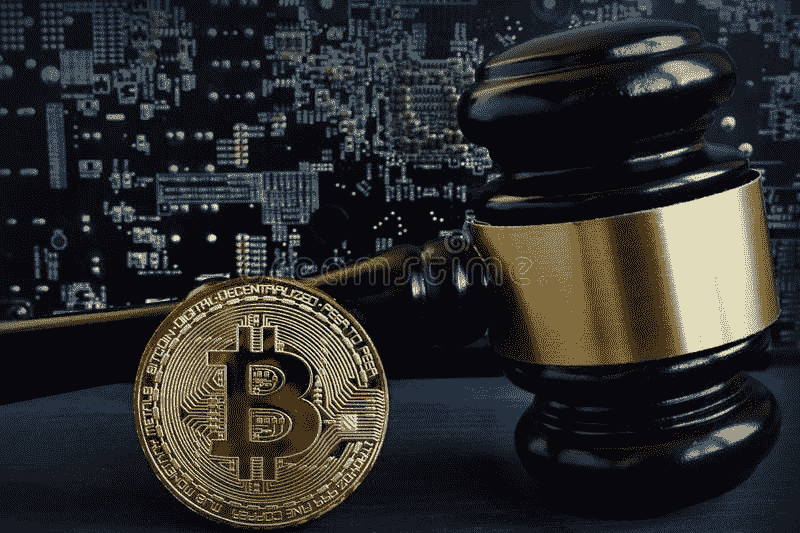

# 监管将打击比特币去中心化

> 原文：<https://medium.com/coinmonks/regulations-will-attack-bitcoin-decentralization-193e3a8858ef?source=collection_archive---------9----------------------->

政府渴望监管密码产业。这并不是什么新鲜事，因为控制贸易的规则是中央集权者的主要工作，当试图实施一种超出他们权力范围的电子货币时更是如此。

美国政府有明确的意图[监管加密行业，特别是比特币](https://www.financemagnates.com/cryptocurrency/regulation/us-white-house-plans-to-issue-an-executive-order-on-crypto/)。

美国及其盟友可以影响比特币的去中心化，通过监管来控制它。因此，美国开始与其西方盟友协调监管政策[。](https://chaintimes.com/g20-financial-stability-board-says-regulators-need-to-prepare-a-global-response-to-crypto-risks/)

禁止比特币不再是政府的理想选择，因为它已经与全球金融体系交织在一起。另一方面，对他们来说，更好的做法是对其进行监管，以一种完整的全球方式(肯定地)控制所有交易。

## 他们怎么能控制全球所有的比特币交易？

他们将通过控制比特币网络用来确认交易的几百万台计算机的大部分计算(散列)能力来做到这一点。

要做到这一点，它需要监管比特币的大部分散列率，这被称为 51%攻击。

监管应该是全球性的，这样才能监管控制大部分比特币挖矿杂凑率的公司。然而，并不需要很多国家来实现对散列的控制。

截至 2022 年 2 月，美国拥有全球比特币散列率的 35.5%，加拿大拥有 9.5%，德国和爱尔兰各有 4.5%。仅四个西方国家就拥有全球比特币杂凑率的一半以上(54%)。这些国家是美国的盟友。通过增加几个国家来实施统一监管，将有可能对大多数杂凑率实施全球规范。

虽然比特币矿工可以转移管辖权，就像他们在中国的禁令一样(尽管花了几个月才恢复到安全散列率)，但大型比特币采矿公司(农场)等待监管，否则就是禁令，并专注于利润，不像人们，他们往往更关注中本聪认为的比特币哲学的基本原则，p2p 资金，稀缺，可替代，不可改变，假名不可使用，没有信任，没有许可。

# 比特币挖矿监管是一种“分而治之”的战术。

矿业公司将统一遵守这些规定。公司董事会有信托责任将投资者的收益置于个人价值之前。我们已经看到了美国的一个审查案例，美加最大的比特币开采公司之一马拉松公司开采了第一个符合 OFAC ( [外国资产控制办公室](https://en.wikipedia.org/wiki/Office_of_Foreign_Assets_Control))的比特币区块:[马拉松公司开采了第一个符合 OFAC 的比特币区块 de](https://news.bitcoin.com/marathon-mines-first-ofac-compliant-bitcoin-block/) 。

由于大型企业采矿池控制了大部分杂凑率( [5 个采矿场拥有 51%的杂凑率](https://www.blockchain.com/charts/pools))，并且主要受利润驱动，大部分杂凑率可能会保留。在合法(受监管)的地方，开采比特币更有利可图。

机构控制大部分比特币挖矿 hash 率，机构积极寻求监管。

大型比特币农场的管理团队将无法证明仅仅为了逃避监管而迁移到外国的停机时间、收入损失、费用和延迟是合理的。它的竞争对手将继续按照“合理的”规定进行有利可图的开发。

独立矿工可以移动他们的设备主要是基于他们的原则。可惜比特币挖矿变得太[集中化](https://mybitbiz.com/2021/12/bitcoin-hash-rate-in-2022/)。独立矿商是控制杂碎率的少数，考虑到他们比大农场更容易转移，他们仍愿意确认来自不受监管来源的交易。

如果愿意遵守规定的人和不愿意遵守规定的人之间的差别非常小，因为 51%的散列率遵守政府规定，而 49%不遵守，那么少数不遵守规定的矿工仍将确认 49%的交易。这 2%的下降可能看起来微不足道，但是，从长远来看，这是不可持续的。

监管政府没有必要破解比特币哈希算法。他们只会协调对比特币矿工的监管，要求他们只确认来自受监管交易所的交易。将确认仅限于来自经批准的交易所的交易，不需要对核心比特币代码进行任何修改。比特币的核心代码允许矿工选择每个区块包含哪些交易。限制交易确认也不需要破解比特币的加密哈希。

在确认不受监管的交易方面的延误将会加剧。对不合规交易的确认将是零星的。确认被禁止的交易所需的费用会越来越高。

比特币的现状已经从主要是一系列自由货币市场哲学的忠实信徒，变成了机构的投资工具，不幸的是，许多比特币创造者对此表示欢迎。

理解并声称诚实货币、p2p、不受审查和未经中央政府许可的原则的比特币创造者已经是少数。

# KYC 是最终目标

在西方政府监管比特币开采后，比特币主要通过受监管的交易所进行交易将容易得多，KYC(了解你的客户)将成为常态。

交易所将识别所有用户，获取比特币收入的欠税，并在政府指示下查封用户账户。

比特币将保持其价值储存地位，但受到政府征税程度的限制。但是，比特币会失去不可破解的本质品质。

这十年围绕比特币的监管之争将影响个人和货币自由之战的结果。

中本聪的想法，即货币可以在国家控制之外存在，将会一次又一次地出现，寻找可能的替代品。

争取个人自由的斗争代代相传。

[libelion.com](http://liberlion.com/)

> 加入 Coinmonks [电报频道](https://t.me/coincodecap)和 [Youtube 频道](https://www.youtube.com/c/coinmonks/videos)了解加密交易和投资

# 另外，阅读

*   [在美国如何使用 BitMEX？](https://coincodecap.com/use-bitmex-in-usa) | [BitMEX 评论](https://coincodecap.com/bitmex-review)
*   [最佳期货交易信号](https://coincodecap.com/futures-trading-signals) | [流动性交易所评论](https://coincodecap.com/liquid-exchange-review)
*   [南非的加密交易所](https://coincodecap.com/crypto-exchanges-in-south-africa) | [BitMEX 加密信号](https://coincodecap.com/bitmex-crypto-signals)
*   [MoonXBT 副本交易](https://coincodecap.com/moonxbt-copy-trading) | [阿联酋的加密钱包](https://coincodecap.com/crypto-wallets-in-uae)
*   [Remitano 审查](https://coincodecap.com/remitano-review)|[1 英寸协议指南](https://coincodecap.com/1inch) | [购买 Floki](https://coincodecap.com/buy-floki-inu-token)