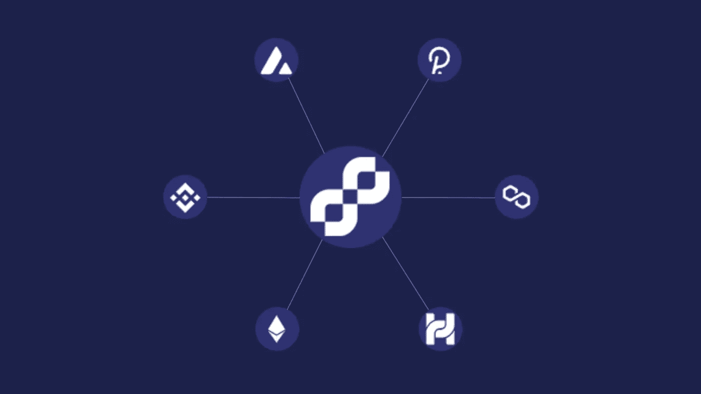

# 中继桥:迁移令牌的最佳方式

> 原文：<https://medium.com/coinmonks/relay-bridges-an-optimal-way-to-migrate-tokens-a7ad9fc25900?source=collection_archive---------17----------------------->

随着权力下放的日益突出，致力于不同共识协议的区块链数量也随之增加。共识协议中的这种差异不允许在两个不同的区块链之间进行令牌迁移。为了解决这个互操作性问题，区块链桥是最合适的解决方案。它们帮助用户在两个链之间安全转移令牌。这些区块链桥还提供黑客监视、代码审计和分散中继器等功能来处理跨链交易。

根据不同的区块链共识机制，有多种方法可以通过迁移令牌来实现区块链互操作性。令牌迁移的这些[方式](https://www.leewayhertz.com/migrate-tokens-using-relay-bridges/)不需要任何中介或集中式解决方案来在两个区块链之间运行。

因此，中继桥最适合令牌迁移。现在让我们使用中继桥来展示令牌迁移的动态，以理解区块链互操作性。

# 什么是中继桥，它有什么好处？

Relay 是一个跨链的生态系统，它是在两个不同的区块链平台之间迁移令牌和资产的桥梁。它有助于调节 DeFi 流动性空间。中继桥将资产及其各自的区块链生态系统连接到具有不同共识协议的其他区块链。

通过中继桥迁移令牌既经济又快速，两个不同区块链之间的停机时间最短。中继桥目前按照相似地址的流动性交换运行，从一个区块链迁移到另一个。因此，中继桥有助于在多个第 1 层网络之间迁移令牌。中继桥目前在以下平台之间运行:

*   以太坊
*   币安
*   雪崩
*   多边形(Matic)
*   赫科

继电器桥有一个用于 DeFi 平台的桥气体标记龙头。使用桥气体令牌龙头，中继桥将本地令牌传送给用户。

因此，桥气令牌龙头通过减少跨链转移中的摩擦来帮助令牌迁移参与者。中继桥将 DeFi 与独特的 tokenomics 模型连接起来，提供 gas token 奖励(HT、ETH、BNB、AVAX 和 MATIC)。这些汽油代币奖励有助于调节汽油代币指数。

Relay bridge 还收取费用并奖励其流动性提供者。中继桥收取的一定费用直接促成了中继令牌的买回和烧回，转化为通缩资金。

# 中继桥的好处

中继桥通过连接不同的区块链网络来增强区块链的互操作性。因此，它们允许用户体验每个网络的独特功能和主机链的额外优势。中继桥具有以下基本优势:

*   **跨链并行** 在中继桥的帮助下，用户可以在第一层网络的各种 dApps 之间直接转移数字资产。这些第 1 层网络通过获得额外的流动性而具有不同的共识机制和益处。
*   **可扩展性** 中继桥的构建是为了在不中断流动性的情况下提供最大数量的快速交易。中继桥的使用减少了拥塞，提高了处理事务的可扩展性。
*   **效率
    这使得用户通过中继桥利用互操作性、跨链传输和迁移在经济上变得可行。**

[中继桥](https://www.leewayhertz.com/migrate-tokens-using-relay-bridges/)使用不同的共识机制支持区块链网络之间的互操作性。它们在两个不同的平台之间提供可互操作的令牌传输、数据传输、数字资产传输和智能合约指令传输。在中继桥的帮助下，用户可以将一个链上的数字资产部署到另一个链上运行的 dApps，促进在可扩展性较差的区块链上托管的令牌的快速和低成本交易。因此，中继桥是区块链互操作性的最佳解决方案之一。

> 加入 Coinmonks [电报频道](https://t.me/coincodecap)和 [Youtube 频道](https://www.youtube.com/c/coinmonks/videos)了解加密交易和投资

# 另外，阅读

*   [NFT 十大市场造币集锦](https://coincodecap.com/nft-marketplaces)
*   [AscendEx Staking](https://coincodecap.com/ascendex-staking)|[Bot Ocean Review](https://coincodecap.com/bot-ocean-review)|[最佳比特币钱包](https://coincodecap.com/bitcoin-wallets-india)
*   [Bitget 回顾](https://coincodecap.com/bitget-review) | [双子 vs 区块链](https://coincodecap.com/gemini-vs-blockfi) | [OKEx 期货交易](https://coincodecap.com/okex-futures-trading)
*   [美国最佳加密交易机器人](https://coincodecap.com/crypto-trading-bots-in-the-us) | [经常性回顾](https://coincodecap.com/changelly-review)
*   [在印度利用加密套利赚取被动收入](https://coincodecap.com/crypto-arbitrage-in-india)
*   [霍比审核](https://coincodecap.com/huobi-review) | [OKEx 保证金交易](https://coincodecap.com/okex-margin-trading) | [期货交易](https://coincodecap.com/futures-trading)