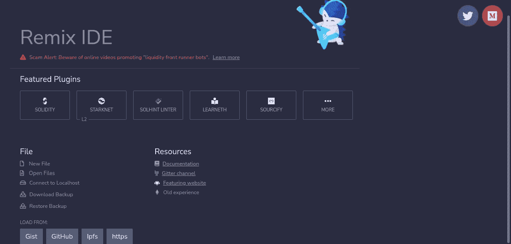
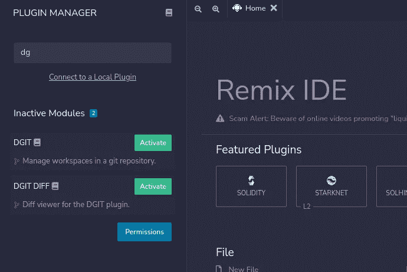
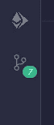
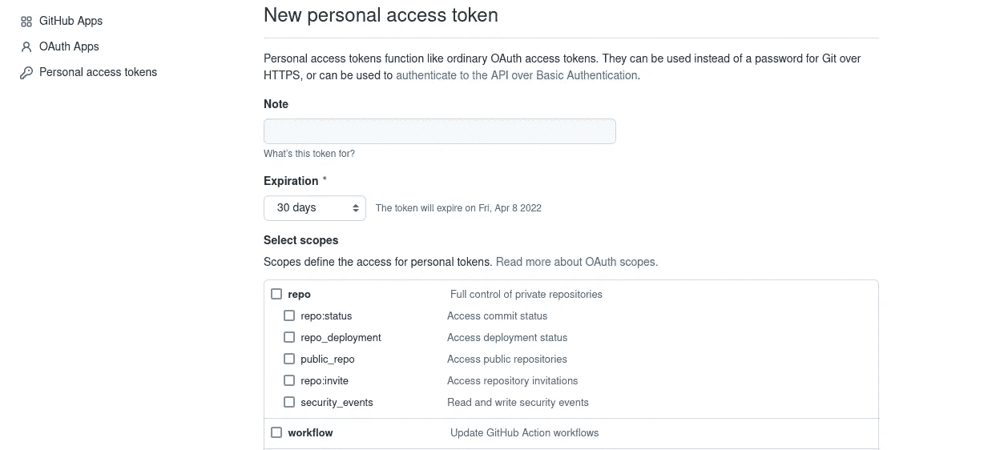
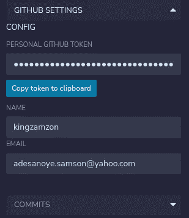
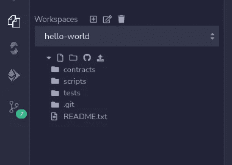
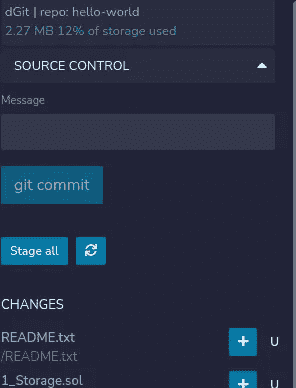
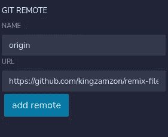
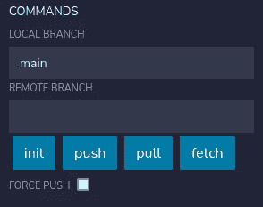

# Remix + Github

> 原文：<https://medium.com/coinmonks/remix-github-f702ee28de37?source=collection_archive---------2----------------------->

在这篇文章中，我将通过连接 Remix IDE 到你的 Github 库来指导你。在撰写本文时，当前的 Remix 版本是 0.21.4。享受旅程💌

1.  **安装 DGIT 插件:**要安装 DGIT 插件，点击 remix 主页上的更多。

Remix home page

2.**搜索 DGIT 插件:**插件管理器会在左边弹出，你可以在那里搜索 **DGIT** ，当 **DGIT** 显示时点击*激活*按钮。

Plugin Manager shows up where one can seach for dgit

3. **DGIT 图标:**一旦 DGIT 插件被激活，一个类似下图的漂亮图标将会出现在左边的工具条上。

DGIT icon

5. **Github:** 在[https://github.com/settings/tokens](https://github.com/settings/tokens)上从 Github 创建个人令牌，或者从 *GitHub 设置- >开发者设置>个人访问令牌*导航。不要忘记检查回购范围，并将新的个人访问令牌复制到安全的地方。

Create New personal access token

6. **Github:** 创建新的回购协议。

7.**混音:**点击 *DGIT 图标> GITHUB 设置* >将新创建的令牌粘贴到**个人 GITHUB 令牌**中。更新您的姓名和电子邮件。

DGiT > GITHUB SETTINGS

8.**选择工作区:**选择您想要部署新创建的 repo 的工作区。

select the repo you want to deploy

9.点击 *DGIT 图标>克隆，推、拉&遥控器*。滚动到命令并点击***初始化*** 按钮。

10.点击*源代码控制>点击 stage all >添加新消息>* 点击 git commit 按钮。

stage and commit all changes

11.选择*克隆、推送、拉取&REMOTES>GIT REMOTE:* Name:origin
URL:链接到您之前创建的 github repo。

12.点击添加遥控器；添加后，您将在**可用遥控器**部分看到新添加的遥控器。

add github repo

13.**升空:** *克隆，推，拉&遥控器>命令>按钮*到 Github，有时需要一段时间。

关于 DGIT 插件不同部分的更多细节和深度，请随时查看参考资料。

**资源:**
[https://medium . com/remix-ide/github-in-remix-ide-356 de 378 F7 da](/remix-ide/github-in-remix-ide-356de378f7da)