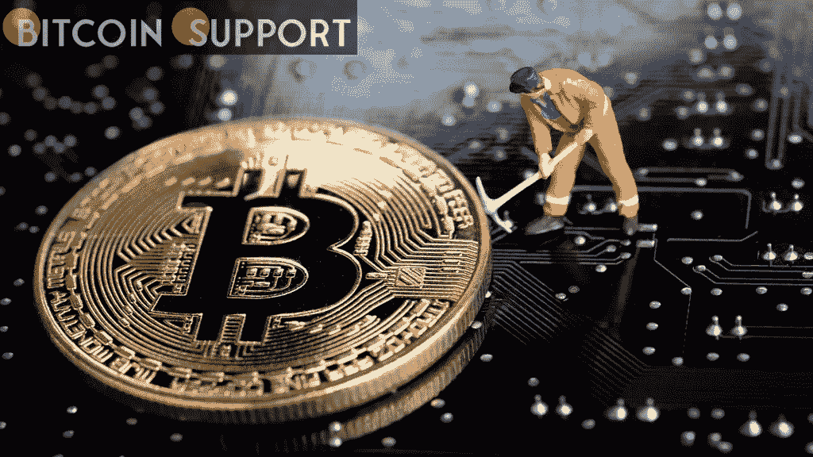
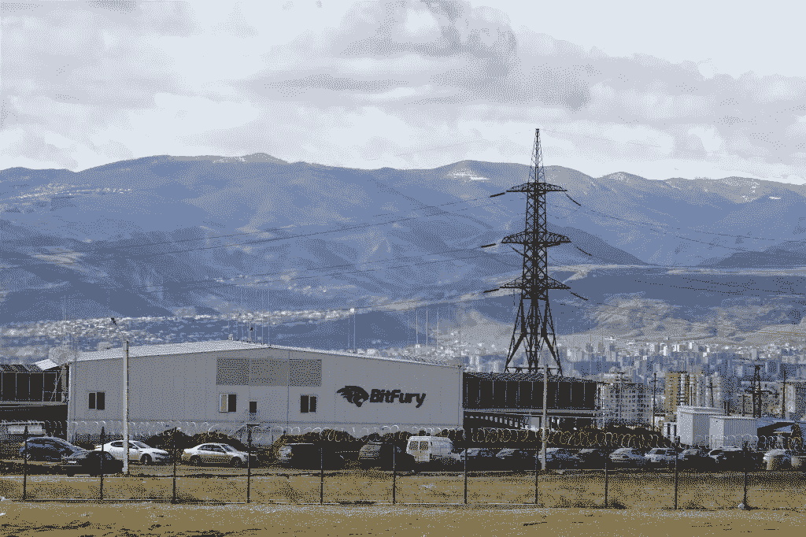

# 报道:格鲁吉亚是比特币采矿业的主要参与者

> 原文：<https://medium.com/coinmonks/report-georgia-is-a-major-player-in-the-bitcoin-mining-industry-545d9e592722?source=collection_archive---------34----------------------->

[https://bitcoinsupports.com/](https://bitcoinsupports.com/)

根据 Arcane Research 的分析，格鲁吉亚的人口少是比特币采矿的一匹黑马，提供了该行业整体散列率的近 1%。乍一看，小小的佐治亚共和国似乎是比特币(BTC)开采的一个不寻常的候选者。该国在矿业上处于劣势，但水力资源丰富，在世界银行的营商环境排名中名列第六，领先于英国和德国。

佐治亚州位于黑海，位于欧洲和亚洲的交汇处，是 Bitfury 的工业采矿业务以及依赖大量水力发电的小型个体矿工的所在地。

[https://bitcoinsupports.com/](https://bitcoinsupports.com/)

在比特币挖矿方面，中国是一股不可忽视的力量。根据剑桥比特币电力消耗指数，格鲁吉亚的哈希比率为 0.18%，但 Arcane Research 的一份详细而长期的报告显示，该比率接近 0.71%。这份报告的作者，神秘研究公司的分析师贾兰·梅勒鲁德告诉记者:

**“在佐治亚州，家庭采矿非常受欢迎，尤其是在能源补贴的地区。只要中国某些地区仍有电力补贴，人们就会继续建立小型家庭采矿企业。”根据分析，至少有 125 兆瓦的加密开采能力，其中 62 兆瓦来自工业数据中心。“剩下的 63 兆瓦应该来自散布在全国各地的住宅、车库、废弃仓库和工厂中的大量普通业余装置。”因为“格鲁吉亚 125 兆瓦的总加密开采能力中有 100 兆瓦专用于比特币，格鲁吉亚的硬件与网络平均水平一样高效，”梅勒鲁德认为，格鲁吉亚整体加密开采能力的真实数字在 0.71%左右。他指出，这比 CBECI 估计的 0.18%高出许多倍。

虽然比特币矿工倾向于去未开发的能源资源、低成本能源或仅仅是高性价比的地方做生意并不新鲜，但这是一把双刃剑。由于廉价的电力和宽松的规则，哈萨克斯坦的监管者最近托管了全球 18%的电力，他们已经在考虑干预，提议提高电价和征税。尽管佐治亚州“商业友好”，梅勒鲁德认识到“不断上涨的电价”可能会阻止矿工建立设施。他说:

**“我怀疑格鲁吉亚政府希望在该国进行新的采矿作业，因为矿工已经消耗了该国 10%以上的电力，导致该国电力短缺日益严重。”尽管如此，佐治亚州的政治家们可能会在一项新法案中为地下采矿者提供税收减免，这将有利于 BTC 的采矿者，而梅勒鲁德承诺“对于工业规模的采矿，我觉得没有更多产能的地方了。”相反，小规模采矿(小于 1 兆瓦的矿工)可能会继续繁荣。尽管有人要求佐治亚州斯瓦涅季地区的人们向圣乔治宣誓禁止地下采矿，但整个国家“对这一新的资产类别持积极态度”。多亏了格鲁吉亚丰富的“负担得起的清洁水力发电”，小规模的加密货币爱好者可以继续利用比特币采矿余热为他们的山区住宅供暖。

**免责声明:以上为作者观点，不应视为投资建议。读者应该自己做研究。******

> 加入 Coinmonks [电报频道](https://t.me/coincodecap)和 [Youtube 频道](https://www.youtube.com/c/coinmonks/videos)了解加密交易和投资

## 另外，阅读

*   [交易杠杆代币的最佳交易所](https://coincodecap.com/leveraged-token-exchanges) | [购买 Floki](https://coincodecap.com/buy-floki-inu-token)
*   [3 commas vs . Pionex vs . crypto hopper](https://coincodecap.com/3commas-vs-pionex-vs-cryptohopper)|[Bingbon Review](https://coincodecap.com/bingbon-review)
*   [加密复制交易平台](/coinmonks/top-10-crypto-copy-trading-platforms-for-beginners-d0c37c7d698c) | [如何在 WazirX 上购买比特币](/coinmonks/buy-bitcoin-on-wazirx-2d12b7989af1)
*   [货币评论](https://coincodecap.com/coinloan-review)|[Crypto.com 评论](/coinmonks/crypto-com-review-f143dca1f74c)
*   [如何在加拿大购买加密货币？](https://coincodecap.com/how-to-buy-cryptocurrency-in-canada)
*   [无聊猿游艇俱乐部(BAYC)评论](https://coincodecap.com/bored-ape-yacht-club-bayc-review)
*   [5 款最佳加密交易终端](https://coincodecap.com/crypto-trading-terminals) | [最佳 DeFi 应用](https://coincodecap.com/best-defi-apps)
*   [最佳网上赌场](https://coincodecap.com/best-online-casinos) | [币安评论](/coinmonks/binance-review-ee10d3bf3b6e) | [BitMEX 评论](https://coincodecap.com/bitmex-review)
*   [麻雀交换评论](https://coincodecap.com/sparrow-exchange-review) | [纳什交换评论](https://coincodecap.com/nash-exchange-review)