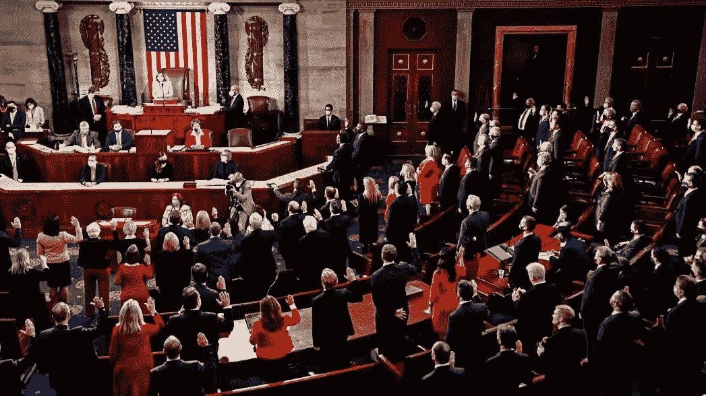

# 共和党人要求美联储对可能的美国 CBDC 进行更多分析

> 原文：<https://medium.com/coinmonks/republicans-demand-more-analysis-from-the-fed-of-a-possible-us-cbdc-de868ff31fd3?source=collection_archive---------57----------------------->

美国众议院金融服务委员会的共和党成员致信美联储主席 Jerome Powell，概述了他们认为在实现中央银行数字货币(CBDC)的道路上最重要的挑战。

美联储在今年 1 月发布了一份关于可能的数字美元的讨论文件。

在本文中，美联储指出了 CBDC 的利弊，并邀请公众讨论 CBDC 如何改善国内支付系统。立法者现在要求美联储关注金融系统中 CBDC 可以改善的部分。

> “在美联储考虑其下一步措施时，我们认为首先理解 CBDC 将解决的问题是至关重要的，”信中表示。此外，我们认为美联储需要明白 CBDC 的好处是否大于商业银行、现有支付系统和消费者的风险。"

议员们建议，美联储应该找出美国支付系统中的低效之处，并探索 CBDC 是否能缓解这些问题。

这包括看看 CBDC 是否需要那些没有银行账户或缺乏银行服务的人。根据法律，现有的美联储文件不适合 CBDC 将如何决定测试，预计在最低余额费或不信任银行机构的情况下会遇到没有银行账户的个人，这可能看起来是他们在检查银行系统。

为此，这封信提倡私营部门，特别是在支付系统中使用稳定的货币。

> “该委员会的共和党人认为，如果在明确的监管框架下发布，stablecoins 可能成为现代支付系统的潜在基石，”信中写道。与目前存在的支付方式相比，stablecoins 中的交易正变得更高效、更快捷、更便宜。"

注册签署人要求美联储对 CBDC 如何在稳定的货币市场中利用产品进行“详细分析”，特别是在创新和竞争方面。

议员们还对美联储如何将 CBDC 作为货币政策工具感兴趣，并要求分析如何将其用于央行决策。委员会代表还表示，他们支持讨论 CBDC 的隐私和安全问题。

5 月 18 日的信由委员会的所有 24 名成员签署，其中包括加密货币的倡导者沃伦·戴维森、汤姆·埃默和泰德·巴德。

📰 ***订阅*** [***斐波那契***](/@unclefibonacci) ***保持最新***

> 加入 Coinmonks [电报频道](https://t.me/coincodecap)和 [Youtube 频道](https://www.youtube.com/c/coinmonks/videos)了解加密交易和投资

# 另外，阅读

*   [阿联酋 5 大最佳加密交易所](https://coincodecap.com/best-crypto-exchanges-in-uae) | [SimpleSwap 点评](https://coincodecap.com/simpleswap-review)
*   购买 Dogecoin 的 7 种最佳方式
*   [最佳期货交易信号](https://coincodecap.com/futures-trading-signals) | [流动性交易所评论](https://coincodecap.com/liquid-exchange-review)
*   [火币加密交易信号](https://coincodecap.com/huobi-crypto-trading-signals) | [Swapzone 审查](/coinmonks/swapzone-review-crypto-exchange-data-aggregator-e0ad78e55ed7)
*   最佳[密码交易机器人](https://coincodecap.com/best-crypto-trading-bots) | [购买索拉纳](https://coincodecap.com/buy-solana) | [矩阵导出评论](https://coincodecap.com/matrixport-review)
*   [Coldcard 评论](https://coincodecap.com/coldcard-review) | [BOXtradEX 评论](https://coincodecap.com/boxtradex-review)|[uni swap 指南](https://coincodecap.com/uniswap)
*   [比特币基地评论](/coinmonks/coinbase-review-6ef4e0f56064) | [德里比特评论](/coinmonks/deribit-review-options-fees-apis-and-testnet-2ca16c4bbdb2) | [FTX 评论](/coinmonks/ftx-crypto-exchange-review-53664ac1198f)