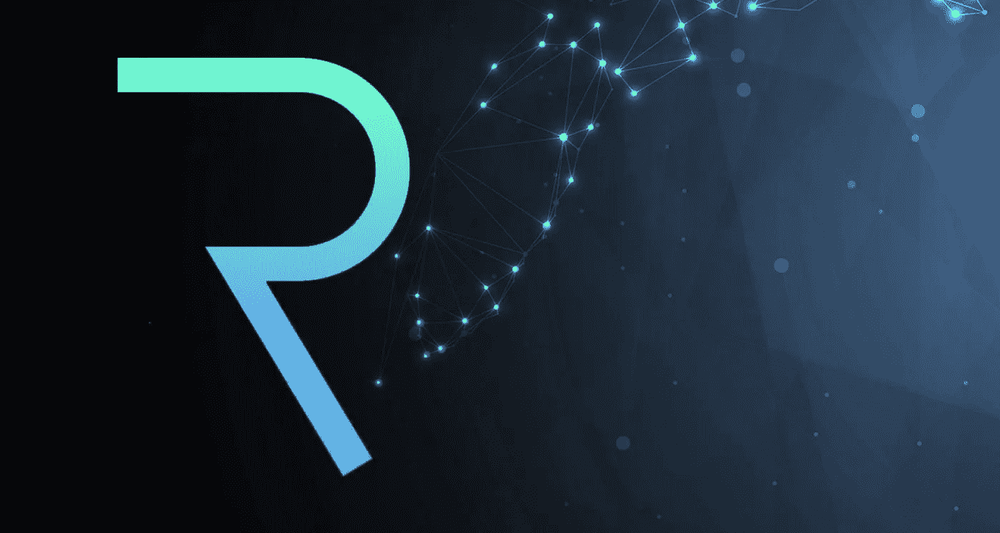

# 请求网络(REQ):创建和请求支付的协议

> 原文：<https://medium.com/coinmonks/request-network-req-a-protocol-for-creating-and-requesting-payments-7de65be7d56b?source=collection_archive---------18----------------------->

请求网络(REQ)加密是在以太坊协议上运行的请求网络的实用令牌。它作为一个分散的支付系统，允许不同的用户安全无缝地接收或发送资金。

请求网络(REQ)在不同的交易所上市，如币安、硬币基地、加密、bancor 等。请求网络(REQ)令牌为请求网络开源协议提供了一些机制，如治理、反垃圾邮件、折扣、赌注、独立性等等。

# 请求网络(REQ)加密的历史

请求网络(REQ)实用程序令牌于 2017 年推出，确保了请求网络的稳定性和性能。这个网络是一个基于以太坊的分散支付系统，任何人都可以通过安全的方式请求支付和接收资金。它不再需要第三方提供更安全、更便宜的支付解决方案，而是专注于所有全球货币。

当用户创建一个支付请求时，价格需要分配到的地址及其金额被定义。此外，用户还可以指定支付的条款和条件，升级发票中的简单请求。完成此流程后，用户可以分享他们要求由交易对手支付的请求。每一个步骤都被记录并存储在这个网络上，使每个人都可以轻松地跟踪会计建议的所有发票和付款。此外，该网络还与全球各地的法律相结合，以符合每个国家的贸易法。

> [**阅读更多关于 procommun.com**的此类有趣故事](https://procommun.com/)

# 请求网络(REQ)加密的创始人是谁？

请求网络(REQ)是一个去中心化的协议，任何人都可以为这个协议的开发做出贡献，并在 Github 上提交 pull 请求。请求网络的创始人是 Etienne Tatur 和 Christophe Lassuyt。

Christophe Lassuyt 是 REQ Network(REQ)的主要社区经理，也是 Ycombinator 的校友，在加密和网络行业已经创业八年多了。另一方面，艾蒂安·塔图(Etienne Tatur)是请求网络(REQ)的首席技术官，他参加了 Ycombinator Winter 2017，并从 2014 年开始在 web 行业中创建了不同的项目。

# 请求网络(REQ)加密的独特之处是什么？

由 Etienne Tatur 和 Christophe Lassuyt 创建的请求网络(REQ)允许其用户保持其账户信息的私密性，并因此控制所有交易。此外，在没有第三方监督的情况下，请求网络(REQ)利用以太坊和 IPFS 为最终用户提供更好的隐私和安全性。还实施交易费，以激励矿工就网络状态达成共识。仅在 5 月份，这个网络就设法结算了 4 亿美元的加密付款。

*   在请求网络(REQ)上进行的支付通过经由区块链发送发票来执行；交易对手也可以检测请求，并以点对点的方式一键支付。此外，这些支付是推产生的而不是拉引起的这一事实是请求网络(REQ)的关键优势之一。
*   用户也不需要共享他们的账户信息。
*   这种区块链技术的使用还消除了对第三方处理器的需求，这将导致交易成本的降低。
*   在请求网络(REQ)开源协议之上构建人们想要的东西的应用程序为用户提供了主要的好处。事实上，它的用户可以与一套不同的金融工具进行互动，这些工具可以顺畅地相互协作。这与封闭和资本主义的 web2 行业相反，因为这里的应用程序可以协同工作。例如，一家公司从一个应用程序开具发票，另一个应用程序接收付款请求并允许支付。然后，发票可以在第三个 Defi 应用程序上提取即时融资。

# 结论

请求网络(REQ)专注于完成像 PayPal 这样的顶级全球支付系统。它还寻求参与支付生命周期的服务，如 B2B、物联网、政府等。因此，这个网络似乎是一个可行的投资选择。该网络利用以太坊和 IPFS 等分散式区块链，为最终用户提高隐私、安全和数据所有权级别。交易费用于激励矿工就该网络的状态达成共识。

> [**阅读更多关于 procommun.com**的此类有趣故事](https://procommun.com/)

> 加入 Coinmonks [电报频道](https://t.me/coincodecap)和 [Youtube 频道](https://www.youtube.com/c/coinmonks/videos)了解加密交易和投资

# 另外，阅读

*   [如何在印度购买比特币？](/coinmonks/buy-bitcoin-in-india-feb50ddfef94) | [WazirX 评论](/coinmonks/wazirx-review-5c811b074f5b)
*   [隐翅虫替代品](/coinmonks/cryptohopper-alternatives-d67287b16d27) | [HitBTC 审查](/coinmonks/hitbtc-review-c5143c5d53c2)
*   [CBET 点评](https://coincodecap.com/cbet-casino-review) | [库币 vs 比特币基地](https://coincodecap.com/kucoin-vs-coinbase)
*   [折叠 App 审核](https://coincodecap.com/fold-app-review) | [Kucoin 交易机器人](/coinmonks/kucoin-trading-bot-automate-your-trades-8cf0ca2138e0) | [Probit 审核](https://coincodecap.com/probit-review)
*   [如何匿名购买比特币](https://coincodecap.com/buy-bitcoin-anonymously) | [比特币现金钱包](https://coincodecap.com/bitcoin-cash-wallets)
*   [币安 vs FTX](https://coincodecap.com/binance-vs-ftx) | [最佳(索尔)索拉纳钱包](https://coincodecap.com/solana-wallets)