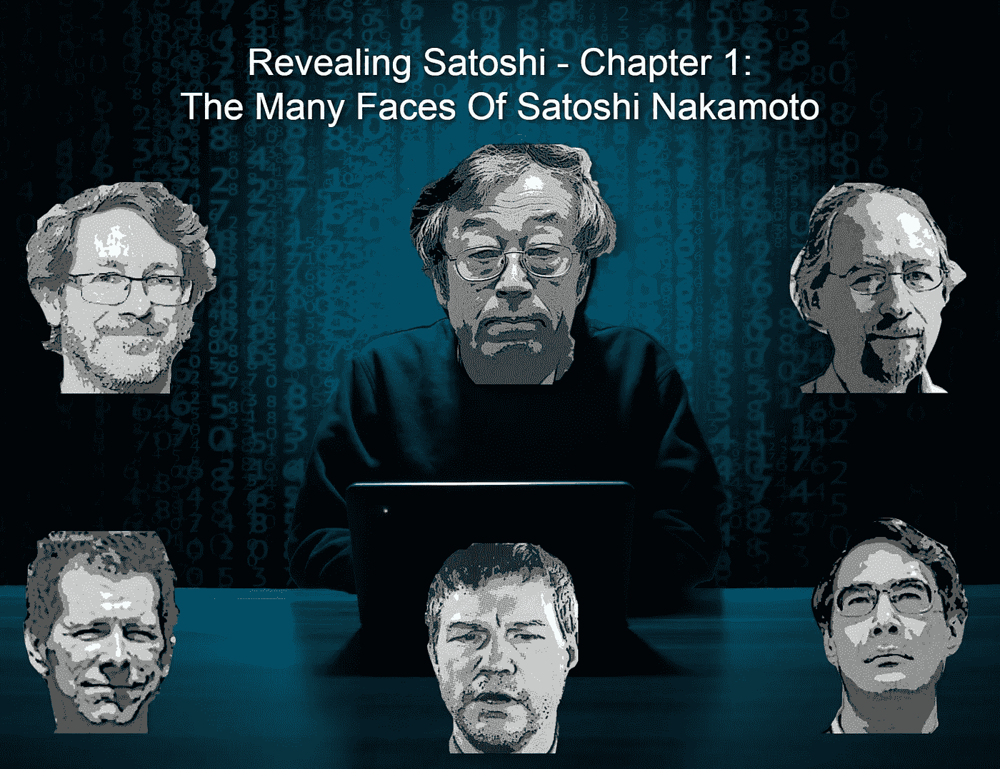

# 揭秘聪——第一部分:中本聪的多面性

> 原文：<https://medium.com/coinmonks/revealing-satoshi-chapter-1-the-many-faces-of-satoshi-nakamoto-113a863ebe23?source=collection_archive---------28----------------------->

*Cover Photo: by “B_A” on* [*Pixabay*](https://pixabay.com/photos/hacker-silhouette-hack-anonymous-3342696/) *(modified)*

很久以前，我发表了关于日本神秘的 SOS 标志的故事，这是一个 80 年代的真实神秘事件。

这个故事与我典型的密码相关工作无关。尽管如此，这仍然是我在浏览量方面排名第一的文章(2103，对于这个平台来说是个不错的数字)。