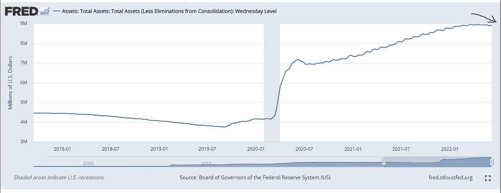

# 重新审视比特币和以太坊的估值

> 原文：<https://medium.com/coinmonks/revisiting-bitcoin-and-ethereums-valuation-311bfbcbb0db?source=collection_archive---------30----------------------->

在 2020 年至 2022 年的加密周期中，BTC 和 ETH 价格更多地受到估值倍数扩张的驱动，而不是采用率的增长。从股票市场的经验来看，在极端的货币紧缩周期中，如果出现流动性紧缩，估值倍数往往会从极高波动到极低。更糟糕的是，以太网的网络使用在本质上比比特币更具周期性。如果这种情况在加密领域重演，那么 ETH price 看起来比 BTC 更危险。

Figure 1: ETH’s valuation multiple (defied as Market cap to active addresses) expanded a lot more than BTC in 2020–2022 cycle

# **关键结论:**

1.  BTC 和瑞士联邦理工学院的市值和价格受以下因素驱动:1)网络使用情况，由**日活跃地址**衡量；2)以**市值与日活跃地址**之比衡量的估值倍数。
2.  ETH 的价格泵更多地是由多重扩张而不是网络采用所驱动的。
3.  ETH 在 2020 年至 2022 年期间的 20 倍价格更多地是由倍数扩展(10 倍)驱动，而不是网络使用(2 倍)。
4.  以太坊的网络使用(DeFi，NFT)比比特币更具周期性，因为用例本质上是金融性的，尽管以太坊已经发展到一个更加成熟的阶段。这意味着网络活动可能会崩溃更多。
5.  在流动性紧缩具有传染性的流动性事件(如摄氏度)中，倍数将急剧收缩。
6.  何时见底:印钞回归抽钞常态。

# 宏观图景——货币增长急剧下降

我最喜欢的年度图表:美国 M2 货币增长(浅蓝色区域)对 BTC 价格(蓝线)。周五拍摄的数据。当前价格比周五低 10%。哎哟！

显然，价格上涨的很大一部分来自量化宽松支持的大规模刺激措施和信贷扩张。所有这些导致高达 27%的美国 M2 货币增长(现金、零售储蓄、零售货币市场基金等)。家庭银行账户中的美元美元比以往任何时候都多(这也要归功于高涨的房价和股市的推动)。

自 2021 年初以来，货币增长明显放缓，恰逢比特币价格崩溃。鉴于美联储一再表示通胀是“暂时的”，随着对美联储加息的担忧减轻，BTC 价格随后大幅回升。2022 年 5 月 8.6%的通胀率正在吞噬家庭储蓄率。不好！

这是一张我们应该经常回来检查的图表。量化紧缩对家庭存款的影响没有那么直接！

Figure 2: US M2 money growth (light blue area) vs BTC price (blue line)

还有这个。美联储高达 9 万亿的总资产刚刚开始缩水。而缩减的速度将在 9 月份加快，每月增加 950 亿——每年 1.1 万亿。

Figure 3: FED total assets just started to shrink

毫无疑问，我们正处于绝望的熊市状态。坚持住！当资金增长仍呈下降趋势时，优先考虑生存而不是利润！

# **估值倍数**

我选择**市值对日活跃地址**作为比特币和以太坊等网络的估值倍数。可以把它想象成每活跃用户的估值——我们通常用于社交媒体公司的估值指标。当一个投资者投资一个网络时，她会假设活跃用户会带来长期的收入和利润。如果我们将这些用户的现金流贴现到今天，这种创收能力就转化为基于 DCF 的每用户估值。

例如，脸书(META)日活跃用户(DAU)19.6 亿，目前市值 5320 亿美元。532 / 1.96 =每 DAU 271 美元。脸书的股票投资者为每 DAU 支付 271 美元。比较具有类似网络效应商业模式的公司的估值是有用的。

在这里，每日活动地址是当天发起发送或接收操作的地址。

让我们看看比特币和以太坊的等价价格/ DAU。请注意，我不认为比特币和以太坊与脸书有很大的可比性，因为它们不代表股东对网络的主张。所以，不要拿比特币/以太坊的价格/DAU 和 Meta 比较。

比特币市场活跃地址上限为 60 万美元

以太坊市场价为 40 万美元。

不要这么早下结论！只是还没有！

Figure 4: Market cap to daily active addresses (7dMA)

# **估值倍数的周期性:以太坊的倍数往往比比特币波动更大**

让我们将图表分解为两个周期:2017–2018 和 2019–2022 最近的两个加密周期(图 5、图 6)。

很明显，在两个周期中，倍数在周期开始时经历了一段时间的扩张，后来在周期的后半段收缩。我一点也不惊讶！长期的估值倍数扩张和收缩在股票市场上很常见。驱动因素包括 1)宽松/紧缩的货币供应和 2)公司基本运营的改善/恶化。

**2017–2018 周期**

还要注意，以太坊的倍数往往比比特币波动更大。在 2017-2018 年周期期间(图 5)，以太坊的活跃地址市值飙升至 35 万，而比特币的倍数仅为 5 万。当他们受到第一批狂热支持者最热烈的欢迎时，这对于这个闪亮的新事物来说是很平常的。该网络使用较少，但支持者会考虑许多不切实际的积极因素，这些因素在短期内无法实现，因此接下来是务实的多重收缩阶段。

**2020–2022 周期**

这一模式在 2020-2022 年周期中再次重复(图 6)。以太坊的 market cap to active addresses multiple 起价为每个活跃地址 7 万美元，而比特币在 2020 年初为每个活跃地址 20 万美元。后来以太坊的倍数扩大到了 100 万美元的峰值水平。这是 10 倍的倍数。在股票市场不常见！想象一只市盈率 10 倍的股票膨胀到 100 倍市盈率，不可持续！即使目前每个活动地址 40，000 美元也是最低水平的 5.5 倍。对于比特币，从每个活跃地址 20 万美元的底部到 120 万美元(6 倍)的峰值，再到现在每个活跃地址 60 万美元(3 倍)。

这里有一个简单的结论:以太坊的估值倍数比比特币扩大了，以太坊从底部扩大了 5.5 倍，而 BTC 扩大了 3 倍。等等，我们需要查看网络活动(活动地址)来得出我们的最终结论。

Figure 5: Marketcap to active addresses (7d MA) 2017–2018

Figure 6: Marketcap to active addresses (7d MA) 2019–2022

**网络应用:与比特币相比，以太坊的网络使用在本质上更具周期性**

到目前为止还没有涉及到网络使用。从 2018 年到现在，以太坊在开发者社区、基础设施生态系统和 dapp 使用方面无疑发展到了一个更加成熟的阶段。其使用案例已经从 ICO 扩展到 defi、NFT、Gamefi、元宇宙等。这解释了为什么现在的日活跃地址比 2018 年高得多。然而，我们谈论的是 2017 年 6 月至 2018 年 6 月的平均每日活跃地址，分别为 535k 和 278k。只有 2X！或者从 20 万到 70 万的底部到顶部的增长。仅 3.5 倍！但是回想一下，同一时期 ETH 的价格从 180 美元涨到了 4000 美元。超过 20 倍。

Figure 7: Daily active addresses (7-day moving average): BTC vs ETH

让我们将多个地址与活动地址叠加起来(图 8、图 9)。很明显，倍数扩张是以太坊价格的更大驱动力。这还不是故事的全部。 ***与比特币*** 相比，以太坊的网络使用在本质上也更具周期性。

因为 Defi 和 NFT 在很大程度上仍然是财务用例。当市场下跌时，没有人会利用 Defi 来增加杠杆。当 NFT 被锁定而没有流动性和保证金时，恐慌性抛售将使价格降至零，NFT 将不再有买家！不要误会我的意思，我不是说所有的 NFT 都是垃圾。我仍然喜欢海滩。

Vitalik 实际上非常关注到目前为止以太坊上唯一成功的使用案例是金融案例。他最近的想法是[这里](https://vitalik.ca/general/2022/06/12/nonfin.html)。

Figure 8: Bitcoin network usage vs valuation multiple

Figure 8: Ethereum network usage vs valuation multiple

# 结论:在以下方面，ETH 看起来比 BTC 更危险:1)网络活跃度下降；2)估值倍数收缩。

有趣的是，图表分析师会用价格修正百分比来预测市场底部。就像上个周期 85%的价格修正。它可能行得通，也可能行不通。市场触底是一个动态过程，而不是信封计算的背面。

也许我们可以对网络活动得出类似的结论，例如在 2017-2018 年周期中，每日活跃地址比峰值下降了 70%。也许我们可以看到类似的模式。到目前为止，以太坊的活跃地址已经下降了 45%。我们可能会看到从这里再下降 30%。

# 底部标志？

最后的话。在流动性事件中，如摄氏度暂停退出，它是传染性的，并将影响其他机构的杠杆和流动性。在这些事件中，价格和倍数往往会走向非理性的低迷水平。当大多数杠杆头寸被冲销时，自由落体阶段最终将失去动力。

我们需要积极监控 defi 和交换清算数据、网络活动和宏观场景。

# 归咎于周期！还是共识 2022！

我写过霍华德·马克斯的市场周期理论。金融市场周期主要由两个因素驱动:

1.  货币周期:中央银行操纵货币和利率的增长
2.  投资者情绪周期:投资者的情绪很少停留在中性区。他们往往会在极度乐观和绝望的悲观之间快速交替。

对于加密，也许我们应该增加第三个驱动力:年度加密会议**共识**会议！共识 2022 在周末开始，我们在 ETH 上得到 20%的折扣(我知道我知道所有 Celsius 的错)。共识 2021 也与 2021 年 5 月的闪电崩盘巧合。

这实际上是有道理的，因为人们往往会在人群中失去独立思考，乐观或悲观在这些会议中是会传染的。机构是由人组成的。他们不能免于人为错误！

声明:不是投资建议。作者持有 BTC 和 ETH 的观点。

> 加入 Coinmonks [电报频道](https://t.me/coincodecap)和 [Youtube 频道](https://www.youtube.com/c/coinmonks/videos)了解加密交易和投资

# 另外，阅读

*   [如何在 FTX 交易所交易期货](https://coincodecap.com/ftx-futures-trading) | [OKEx vs 币安](https://coincodecap.com/okex-vs-binance)
*   [CoinLoan 审查](https://coincodecap.com/coinloan-review) | [YouHodler 审查](/coinmonks/youhodler-4-easy-ways-to-make-money-98969b9689f2) | [BlockFi 审查](https://coincodecap.com/blockfi-review)
*   XT.COM 评论 | [币安评论](https://coincodecap.com/xt-com-review)
*   [SmithBot 评论](https://coincodecap.com/smithbot-review) | [4 款最佳免费开源交易机器人](https://coincodecap.com/free-open-source-trading-bots)
*   [比特币基地僵尸程序](/coinmonks/coinbase-bots-ac6359e897f3) | [AscendEX 审查](/coinmonks/ascendex-review-53e829cf75fa) | [OKEx 交易僵尸程序](/coinmonks/okex-trading-bots-234920f61e60)