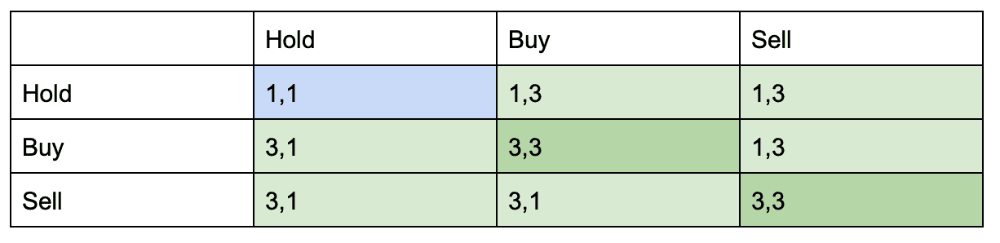
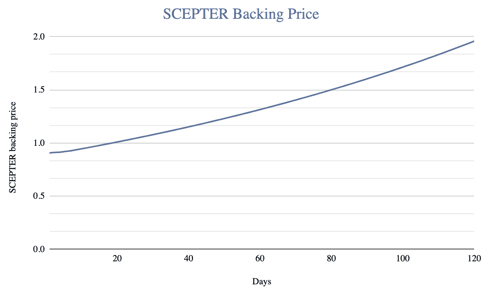
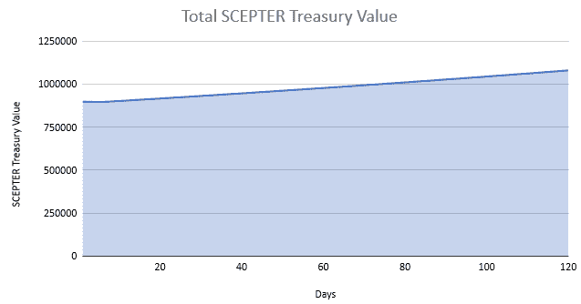

# 重温博弈论，使所有投资者的选择都是积极的

> 原文：<https://medium.com/coinmonks/revisiting-game-theory-to-make-all-investors-choices-positive-5ebc77875914?source=collection_archive---------5----------------------->

A New Take On Game Theory For DeFi

朋友们好。

奥林巴斯道和它的叉子把博弈论放在了 DeFi 的最前沿。(3，3)背后的思想是，只要所有人都持有他们的代币，每个人都赢。如果一个人选择出售他们的代币，它就变成(-1，1)，这意味着这个人将会损失，而持有者仍然会获利，但程度较低。而如果大家都卖，那就是双输的局面(-3，-3)。你可以在这里看到他们对博弈论的看法。我还想感谢他们将博弈论应用于 DeFi 所引领的道路，没有这些，我们就不会在这里。

这种模式有一个缺陷:虽然相当数量的投资者长期持有，但每个人都会在某个时候卖出。在 APY 很高的情况下，一个人卖出比一个人买入对价格行为有更大的影响。因此，任何欧姆型协议的最终情况都不是(3，3)，而是(-3，-3)，正如我们在 2021 年 11 月至 2022 年 1 月之间欧姆叉价格大幅下降时所看到的那样。

这并不是说奥林巴斯模型没有用处。这是一个筹集资金的好方法，奥林巴斯用奥林巴斯 Pro 充分利用了这一点。Hector 和 ImpDAO 也使用 Olympian 工具作为筹集资金的一种方式，只要这是透明的，我们相信这是没问题的。

然而，最初的(3，3)承诺被打破了:仅仅拿着令牌并把它拴起来还不足以让 lambos 登月。我们能修好它吗？

**修正博弈论**

我们一直致力于开发一种模式，让所有投资者因持有代币而获得回报。在我们的模型中，人们以高于和低于支持值的价格买卖主令牌(SCEPTER)，从而在进入或离开协议时使协议受益。

*Game theory applied to WAND*

为什么这里只有正数？仅仅因为所有的行为都是有益的:

*   *买卖*是一个投资者获利，使协议整体受益的必要行为，所以是 a 3。
*   *持有*对持有人有利，因为这可以让他们从权杖的价格升值中获益。它也有助于协议的增长，因为权杖国库投资。然而，与买卖相比，它对协议增长的贡献较小，因此它是 1。

我们的协议建立在博弈论的基础上，所有的行为都有利于财政部，因此也有利于持有者。

**运行模拟作为概念验证**

也就是说，我们的协议是独一无二的，建立在以前从未使用过的令牌组学基础上。有一个好的想法是不够的，我们需要运行模拟，以确保实施也将工作。由于 WAND 是一个社区驱动的项目，具有很强的透明度，我们正在公开我们的模拟器。

要自己使用它，您需要打开链接并下载 Excel 文档。它的建立是为了让用户可以很容易地看到投资者购买、出售或燃烧其代币对价格行为和国债价值的影响；以及不同表现对我们不同国债的影响。

[https://docs . Google . com/spreadsheets/d/1g _ wn U2 YF 9 mievzdhuivmnnuiqhtmo 934/edit？rtpof=true](https://docs.google.com/spreadsheets/d/1g_WNu2yf9mievzDHuIVMnNuIQhTMo934/edit?rtpof=true)

让我们运行一个模拟，假设每天买卖权杖代币总量的 2%(因此代币数量保持不变，买入压力=卖出压力)，我们的权杖国库的 APY 是 35%，我们的风险国库的 APY 是 600%，每天烧掉 0.25%的权杖代币(这样投资者就赚到了权杖代币)。这些都是相当保守的假设。

会发生什么？

*Evolution of the SCEPTER backing price*

如图所示，在这些保守参数下，权杖的价格稳步增长。四个月增长 100%左右。虽然与许多当前项目的投资回报率/APY 相比，这是适度的，但我们不属于同一类别:他们是高风险的，我们是低风险的。

我们在四个月内+100%的价格增长完全由 stablecoins 支持，使 WAND 成为一个低风险的投资平台。在我们的书中，每 4 个月一次低风险的 x2 是一笔非常划算的交易。

*SCEPTER treasury value*

现在让我们看看权杖国库。如我们所见，国库在四个月内从 9 万美元增加到近 11 万美元。这是接近+20%的国债价值*比以前少*(因为当购买压力=出售压力，一些投资者也烧了他们的权杖，所以较少的权杖代币流通，而国库已经扩大)。

**利用博弈论建立牛熊友好协议**

这是我们的概念证明:通过我们的博弈论启发的令牌组学，权杖令牌实际上不需要购买比销售更多来增加价值。象征性的价格升值在所有市场条件下都会发生。无论市场是熊市还是牛市，如果人们突然决定退出协议，或者营销活动吸引了很多新的投资者，投资者将从持有中受益。

一定要看看我们的[令牌组学](/@WAND-Investments/wand-investments-whitepaper-reconciling-safety-sustainability-and-rewards-in-defi-ba20d96213):虽然我们声称的“不断增长的令牌”看起来不可能，甚至令人发指，但数学确实在增加。

我们正在创造一个范式转变。问题不是“我确定我的投资会增值吗？”而是“我的资本增加的速度会有多快？”。你可以用我们开放的[模拟器](https://docs.google.com/spreadsheets/d/1g_WNu2yf9mievzDHuIVMnNuIQhTMo934/edit?rtpof=true)自己回答第二个问题。

SGMI！

> 加入 Coinmonks [电报频道](https://t.me/coincodecap)和 [Youtube 频道](https://www.youtube.com/c/coinmonks/videos)了解加密交易和投资

# 另外，阅读

*   [如何在势不可挡的域名上购买域名？](https://coincodecap.com/buy-domain-on-unstoppable-domains)
*   [印度的加密税](https://coincodecap.com/crypto-tax-india) | [altFINS 审查](https://coincodecap.com/altfins-review) | [Prokey 审查](/coinmonks/prokey-review-26611173c13c)
*   [赢取注册奖金——10 大最佳加密平台](https://coincodecap.com/earn-sign-up-bonus)
*   [Blockfi vs 比特币基地](https://coincodecap.com/blockfi-vs-coinbase) | [BitKan 点评](https://coincodecap.com/bitkan-review) | [Bexplus 点评](https://coincodecap.com/bexplus-review)
*   [南非的加密交易所](https://coincodecap.com/crypto-exchanges-in-south-africa) | [BitMEX 加密信号](https://coincodecap.com/bitmex-crypto-signals)