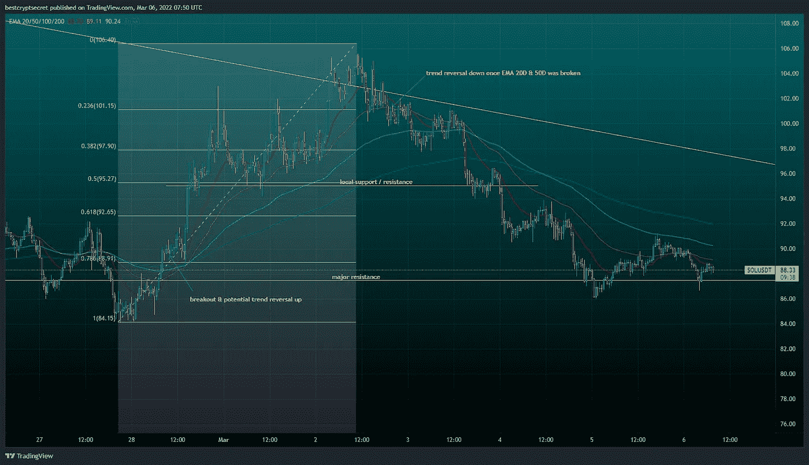

# 未来的回报

> 原文：<https://medium.com/coinmonks/rewards-of-the-future-21069e2b00b9?source=collection_archive---------59----------------------->

这是我之前博客的后续文章，详细介绍了我通过做空 AVAX 进行的清算。

从好的方面来看，在过去的一周里，我的前 5 枚硬币已经赢得了无数次胜利，尤其是 SOLUSDT 对，无论是上涨还是下跌。

看着朋友和家人去年在 Solana 上取得了合理的收益&在现货市场上抓住了它的一点上升趋势，我对它的基本面和未来增长的潜力有了一个粗略的想法。

这里的关键是重复好的实践，并把它融入到交易技巧中，特别是杠杆资产。

突破的迹象很明显，这是我利用期货市场的好时机。

此次跑步的主要优势包括:

*   头寸交易开始时规模很小，杠杆很低。
*   利用每一个机会加强地位，仍然使用小条目。
*   随着你的助教越来越接近确认，条目会越来越强。
*   否则，保留任何条目，直到这样。
*   如果市场对你不利，设置止损。
*   没有人有水晶球，但你可以有一个计划。

一旦我退出了所有的头寸，我会发布一份关于 SOL 的详细分析。

探索仍在继续。