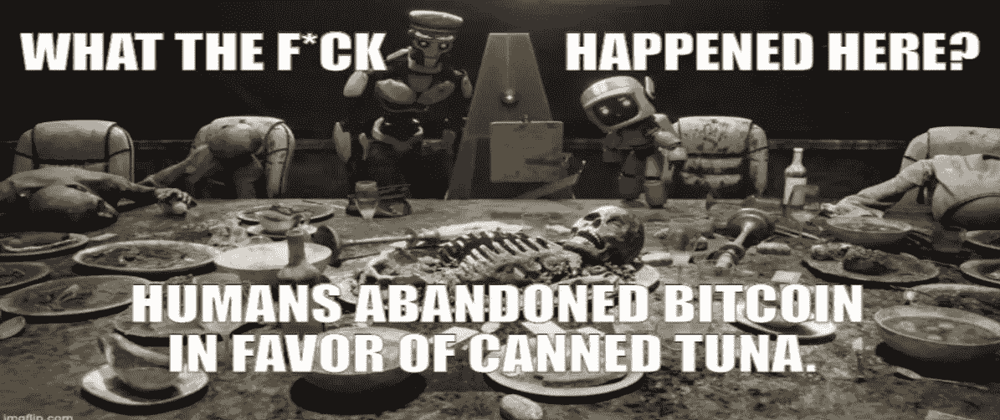
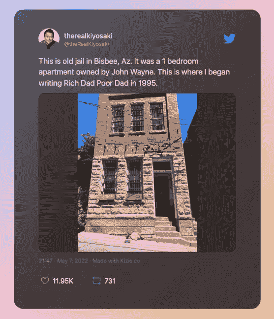
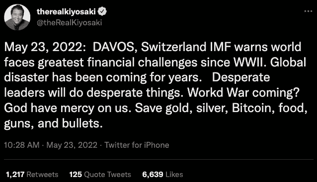
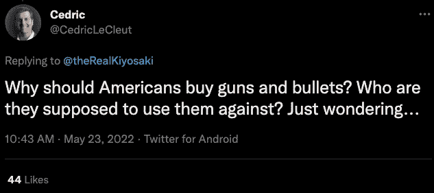
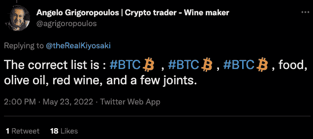
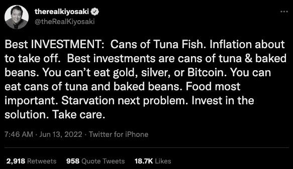
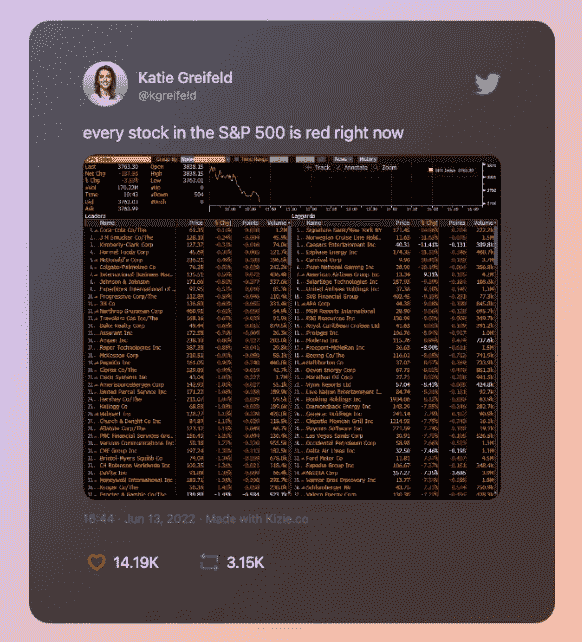
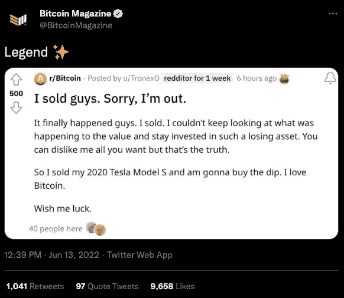
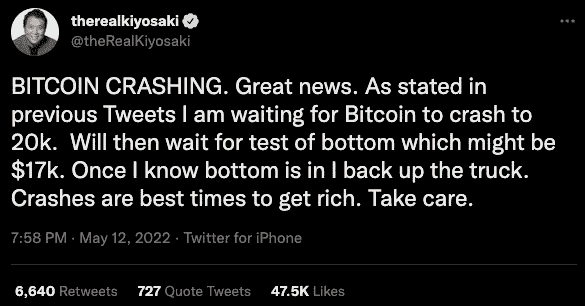

# 富爸爸，穷爸爸，比特币&金枪鱼罐头

> 原文：<https://medium.com/coinmonks/rich-dad-poor-dad-bitcoin-canned-tuna-396697df6759?source=collection_archive---------26----------------------->

金融和投资界有人没有读过《富爸爸穷爸爸:富人教给孩子穷人和中产阶级所没有的关于金钱的知识吗？我不这么认为。

罗伯特·t·清崎讲述他的励志故事已经快三十年了。他的无数版本的书的最后一章遥遥无期。从零到英雄，在他最好的时候。

说得委婉一点，尽可能委婉一点，我们生活在有趣的时代。我不是唯一一个不耐烦地等待着阅读清崎先生对此的评论的人。如果一定要发微博，那就随它去吧。这正是我们现在需要的，一个沉默寡言却有如此多与金钱相关的智慧的人。

好吧，我们得到的都比预想的多。清崎说，非常时期需要非常手段，包括“枪和子弹”。这就是比特币如何成为 2A 和食物的有趣“公司”的原因。

显然，写书和发微博不是一回事。有限的字符数量为无限的解释和问题留下了太多的空间，例如这一个。

事实证明，同时也是酿酒师的秘密交易者更受欢迎。我不能说我不赞成这个名单，不一定是这个顺序。

我也不怪那些认为这位传奇作者有点忘乎所以的人。没有人不需要有人提醒过去几年世界各地发生的事情。

# “红色星期一”——最佳投资假日

我认为，2022 年让我们重新考虑和重新定义了我们过去确信的任何事情和一切，包括 13 号星期五。这就是我们本周一第 13 条推文的来源:

既然黑色已经被星期五“认领”了，我猜红色更适合发生的事情…

“……周一，标准普尔 500 正式进入熊市，下跌超过 3%，比 1 月份的峰值低 20%以上。世界知名的经济学家杰里米·西格尔表示，在今年的经济低迷中，看起来股票已经低估了至少一次“轻度衰退”

“有人问 Siegel，考虑到自二战以来，标准普尔 500 在每次衰退中的平均收缩率为 31%，他是否认为衰退已经被消化了这一说法是公平的。”

> *“我认为我们正在考虑一场温和的衰退，”他回应道。“我不是说衰退实际上会有多严重。”*

根据这条推文，如果红色是轻度衰退的颜色，那么我们将很难为严重衰退选择最合适的颜色:

这一次，秘密酿酒商在 Twitter 上保持沉默，但 Redditers 却直言不讳。

这位特斯拉 Model S 车主宁愿步行也不愿放弃他的比特币。如果这不是真正的暗恋，我不知道它是什么。谈到特斯拉汽车和有争议的推文，我相信不止一位合格的绅士可以给清崎提供一句忠告。

# 崩盘是致富的最佳时机？！

如果不是因为一个小的不一致问题，我最喜欢的一位作者可以轻易地逃脱一系列有争议的推文，我不能忽视这个问题。几乎就在一个月前，清崎没有在推特上谈论旧世界的终结，而是谈论投资机会新世界的开始。

在所有可食用的选择中——“金枪鱼罐头”足智多谋的人不应该靠一个罐头(我可以用复数，不然押韵就没了)，甚至不是枪和子弹因为我们都知道如果…

> 你给一个穷人一条鱼，你可以喂他一天。你教他钓鱼，你给他一份可以养活他一辈子的工作。(中国谚语。)

如果你不喜欢钓鱼，而你更喜欢罐头，那么别忘了回收。

保重，清崎。

*原载于 2022 年 6 月 15 日*[*【https://hackernoon.com】*](https://hackernoon.com/rich-dad-poor-dad-bitcoin-and-canned-tuna)*。*

> *加入 Coinmonks* [*电报频道*](https://t.me/coincodecap) *和* [*Youtube 频道*](https://www.youtube.com/c/coinmonks/videos) *了解加密交易和投资*

# 另外，阅读

*   [3 商业评论](/coinmonks/3commas-review-an-excellent-crypto-trading-bot-2020-1313a58bec92) | [Pionex 评论](https://coincodecap.com/pionex-review-exchange-with-crypto-trading-bot) | [Coinrule 评论](/coinmonks/coinrule-review-2021-a-beginner-friendly-crypto-trading-bot-daf0504848ba)
*   [莱杰 vs n rave](/coinmonks/ledger-vs-ngrave-zero-7e40f0c1d694)|[莱杰 nano s vs x](/coinmonks/ledger-nano-s-vs-x-battery-hardware-price-storage-59a6663fe3b0) | [币安评论](/coinmonks/binance-review-ee10d3bf3b6e)
*   [Bybit Exchange 审查](/coinmonks/bybit-exchange-review-dbd570019b71) | [Bityard 审查](https://coincodecap.com/bityard-reivew) | [Jet-Bot 审查](https://coincodecap.com/jet-bot-review)
*   [3 commas vs Cryptohopper](/coinmonks/3commas-vs-pionex-vs-cryptohopper-best-crypto-bot-6a98d2baa203)|[赚取加密利息](/coinmonks/earn-crypto-interest-b10b810fdda3)
*   最好的比特币[硬件钱包](/coinmonks/hardware-wallets-dfa1211730c6) | [BitBox02 回顾](/coinmonks/bitbox02-review-your-swiss-bitcoin-hardware-wallet-c36c88fff29)
*   [block fi vs Celsius](/coinmonks/blockfi-vs-celsius-vs-hodlnaut-8a1cc8c26630)|[Hodlnaut 审核](/coinmonks/hodlnaut-review-best-way-to-hodl-is-to-earn-interest-on-your-bitcoin-6658a8c19edf) | [KuCoin 审核](https://coincodecap.com/kucoin-review)