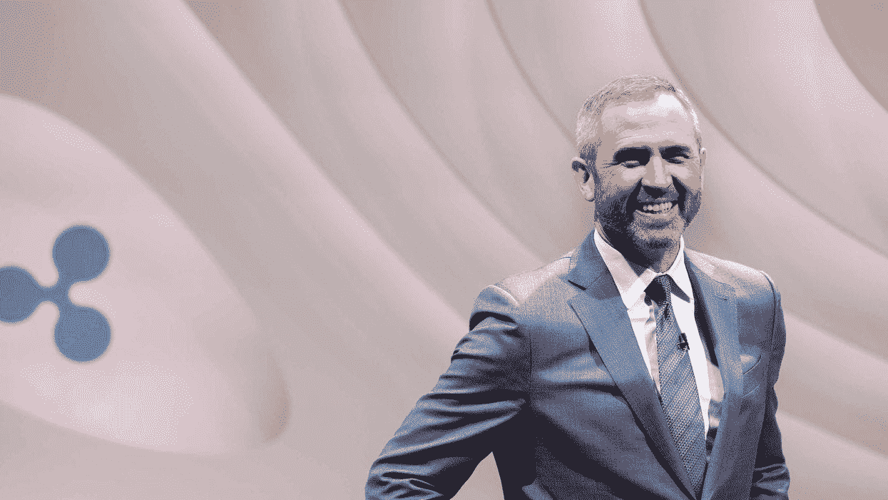

# Ripple 首席执行官透露，在诉讼开始前，他曾数次拜访 SEC

> 原文：<https://medium.com/coinmonks/ripple-ceo-reveals-he-visited-sec-several-times-before-lawsuit-struck-a78efb5a4a52?source=collection_archive---------63----------------------->

跨境支付公司 Ripple 的首席执行官布拉德·加林豪斯周一在瑞士达沃斯世界经济论坛的小组讨论中发言。

Garlinghouse 也是该公司董事会的成员，他就广泛的话题发表了评论，最引人注目的是美国与 G20 国家的监管现状。

Garlinghouse 强调了为“清晰性和确定性”的整体原则服务的监管框架的审慎必要性，他认为:

“在密码行业工作的绝大多数人都是好演员，他们希望监管机构做正确的事情。但当道路规则不明确时，就很难做到这一点。”

在随后的谈话中，加林豪斯透露，他去了美国证券交易委员会(SEC)办公室“在他们决定提起诉讼的几年里去了四五次”，指出没有理由为什么 XRP 的涟漪相关资产应该在法律上被归类为证券。

加林豪斯认为，“这表明美国与 20 国集团的步调有多么不一致”，并引用瑞士、新加坡、英国和日本作为拥有更有利的监管环境来培养技术创新的国家。

> 加入 Coinmonks [电报频道](https://t.me/coincodecap)和 [Youtube 频道](https://www.youtube.com/c/coinmonks/videos)了解加密交易和投资

# 另外，阅读

*   [分散交易所](https://coincodecap.com/what-are-decentralized-exchanges) | [比特 FIP](https://coincodecap.com/bitbns-fip) | [Pionex 评论](https://coincodecap.com/pionex-review-exchange-with-crypto-trading-bot)
*   [用信用卡购买密码的 10 个最佳地点](https://coincodecap.com/buy-crypto-with-credit-card)
*   [最佳卡达诺钱包](https://coincodecap.com/best-cardano-wallets) | [Bingbon 副本交易](https://coincodecap.com/bingbon-copy-trading)
*   [印度最佳 P2P 加密交易所](https://coincodecap.com/p2p-crypto-exchanges-in-india) | [柴犬钱包](https://coincodecap.com/baby-shiba-inu-wallets)
*   [八大加密附属计划](https://coincodecap.com/crypto-affiliate-programs) | [eToro vs 比特币基地](https://coincodecap.com/etoro-vs-coinbase)
*   [最佳以太坊钱包](https://coincodecap.com/best-ethereum-wallets) | [电报上的加密货币机器人](https://coincodecap.com/telegram-crypto-bots)