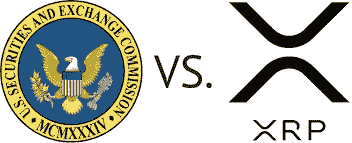

# Ripple 要输了，Pt。二

> 原文：<https://medium.com/coinmonks/ripple-is-going-to-lose-pt-ii-cfb4e51a3089?source=collection_archive---------17----------------------->

证券交易委员会起诉瑞波的案件中最令人困惑的一点是对 XRP 未来的乐观。人们对 XRP 的热情似乎与 Ripple 败诉的可能性成正比。[最近的这篇文章](https://ca.finance.yahoo.com/news/bitcoin-not-future-money-crypto-193800525.html)宣称 XRP 是“金钱的未来”，并说“Ripple Labs 被美国证券交易委员会起诉，并被广泛认为会赢。”

这种认知从何而来？在某种程度上，它直接来自上层。Ripple 首席执行官布拉德·加林豪斯(也是 SEC 案件中的一名被告)[转发了](https://twitter.com/bgarlinghouse/status/1502373335459524610?s=20&t=C7qcmmx0SynZEu86I_vrcQ) Ripple 总法律顾问的声明，即 2022 年 3 月 11 日[拒绝](https://www.nysd.uscourts.gov/sites/default/files/2022-03/Ripple%20Strike%20Order.pdf)SEC 的罢工动议“……这表明一个严重的问题是，SEC 是否向 Ripple 提供了公平的通知，即其自 2013 年以来发行的 XRP 将被证券法禁止。”

CryptoTwitter 采纳了这个想法并付诸实践。像约翰·E·迪顿和杰里米·霍根这样的律师和 XRP 的支持者通常会取笑这样的谣言，即 Ripple 将要揭露证交会与自己的陈述相矛盾的证据。不知何故，这已经演变成一种观念，即如果证交会被发现说谎或前后矛盾，Ripple 就赢了。潜在的假设似乎是，公平通知辩护意味着 SEC 有义务告知 Ripple XRP 是一种证券，如果这从未发生，Ripple 就摆脱了困境。

被告提出了类似的主张，在关于罢工动议的[裁决](https://www.nysd.uscourts.gov/sites/default/files/2022-03/Ripple%20Strike%20Order.pdf)中提到:“证券交易委员会未能提供‘其行为违反法律的公平通知，违反了 Ripple 的正当程序权利。’"

## 美国证券交易委员会不需要给 Ripple 公平的通知。

“法律没有要求政府在个人或行业层面上向所有潜在的违规者发出警告。”( [SEC v Kik](https://law.justia.com/cases/federal/district-courts/new-york/nysdce/1:2019cv05244/516941/88/) )。

Ripple 是否战胜了 SEC 反对公平通知辩护的动议？是的。是因为法官认为，SEC 是否向 Ripple 发出了适当的违法通知存在法律问题吗？号码

法官裁定，Ripple 的一些主张如果属实，可能会引发法律问题，即 Ripple 是否公平地注意到“投资合同”一词适用于 XRP。用法院的话说:

> " Ripple 表示，XRP 的价格与 Ripple 的活动无关。它还声称，它没有出售 XRP 作为投资，它与绝大多数 XRP 持有者没有关系。至少，如果这些事实属实，将引发法律问题，即 Ripple 是否公平地注意到“投资合同”一词涵盖了其对 XRP 的分销，法院可能需要更深入地考虑这些问题。”

这个想法的本质是，如果 XRP 真的不符合“投资合同”的豪威测试要素，那么 Ripple 认为 XRP 不是一种证券可能是合理的。“公平通知”与 SEC 做了什么或没说什么无关，而是，正如法院在 [*迪克森诉*纳波利塔诺](https://law.justia.com/cases/federal/appellate-courts/ca2/09-2167/09-2167-cv_opn-2011-03-27.html)案中写道:

> “法院问的是法律是否向普通人提供了足够的通知或机会来了解什么行为是被禁止或禁止的，而不是某一特定[当事人]是否实际收到了警告，提醒他或她有可能因有关行为而被追究责任。”

## Ripple 多年来对证券违规行为的诉讼给出了合理的解释。

让我们暂且把 2017 年的 [DAO 报告](https://www.sec.gov/litigation/investreport/34-81207.pdf)放在一边，该报告煞费苦心地警告说，加密货币和其他数字资产可能会受到 SEC 的注册要求。也许 Ripple 的高管和律师漏掉了那份报告。也许他们错过了有关道报告的文章，如[这篇](https://observer.com/2017/07/sec-dao-report-securities/)，标题为“**是的，这是一个安全问题，**”一篇文章得出了如下结论:

> 如果它看起来像一项投资，闻起来像一项投资，并且像一项投资一样能让人们损失大量金钱，那么它就是一项投资。

也许，在 2015 年，当他们与 [FinCEN](https://www.fincen.gov/sites/default/files/shared/Ripple_Assessment.pdf) 和[美国检察官](https://www.justice.gov/sites/default/files/opa/press-releases/attachments/2015/05/05/settlement_agreement.pdf)就“故意违反银行保密法的注册、程序和报告要求”达成和解时，也许他们没有考虑到他们应该检查并看看他们可能违反了哪些其他法律。

也许 Ripple 和它的律师在 2017 年至 2018 年左右在加州被起诉时仍然没有把它放在一起，当时它在个人和集体诉讼中“指控它应该根据联邦证券法将其虚拟货币 XRP 注册为证券”(这一引用由 Ripple 的律师之一 Peter B. Morrison 在其[律师事务所简介页面](https://www.skadden.com/professionals/m/morrison-peter-b)上提供)。

也许他们漏掉了[这篇文章](https://scholarship.law.duke.edu/cgi/viewcontent.cgi?article=1361&context=dltr)在《杜克法律&技术评论》中那篇有先见之明的结论:

> “在豪威的领导下，XRP 被列为受 SEC 监管的证券——出售 XRP 涉及对一个普通企业的资金投资，其利润完全来自他人的努力。
> 
> 随着越来越多的证券集体诉讼出现，心怀不满的 XRP 买家继续公布数字资产的麻烦状态，SEC 可能别无选择，只能对 Ripple 采取强制行动。"

在上述案例中，Ripple 及其高管似乎采用了 Kik 以前用过的策略。正如法院在该案中写道:

> “Kik 的大部分论点集中在 SEC 未能发布与加密货币具体相关的证券执法指南，SEC 官员在这个问题上的公开声明不一致，以及 SEC 未能对其他数字令牌发行者采取执法行动。"

他们是怎么解决的？证交会在简易判决中获胜。他们甚至不需要接受审判。SEC 对 Kik 或 Kik 或 crypto 说了什么或没说什么真的无关紧要。最终归结为豪威的分析，Kik 出色地通过了分析。

里普、加林豪斯和拉森有聪明的律师——他们肯定知道他们打算提出的公平通知辩护是没有价值的。他们当然知道法院极有可能会发现 XRP 是个安全隐患。为什么要歪曲它？为什么声称他们不知道自己有违反证券法规的风险，尽管有这么多相反的证据？

可能是这样的标题:“ [XRP 在 Ripple](https://cryptonews.com/news/xrp-pumps-drops-after-huge-win-for-ripple.htm) 获得‘巨大胜利’后加油并倒下。”

想想这个。布拉德·加林豪斯和 Ripple 团队发布夸张的推文，歪曲他们成功的机会，这导致 XRP 泵。他们正在引导 XRP 投资者期望从他们的努力中获利，在这场诉讼中，他们被指控引导 XRP 投资者期望从他们的努力中获利，同时否认他们曾经做过这样的事情，事实上，声称他们从来没有被期望知道他们在做什么。至少，这是一个大胆的策略。

> 加入 Coinmonks [电报频道](https://t.me/coincodecap)和 [Youtube 频道](https://www.youtube.com/c/coinmonks/videos)了解加密交易和投资

# 另外，阅读

*   [如何在 FTX 交易所交易期货](https://coincodecap.com/ftx-futures-trading) | [OKEx vs 币安](https://coincodecap.com/okex-vs-binance)
*   [CoinLoan 审查](https://coincodecap.com/coinloan-review) | [YouHodler 审查](/coinmonks/youhodler-4-easy-ways-to-make-money-98969b9689f2) | [BlockFi 审查](https://coincodecap.com/blockfi-review)
*   [XT.COM 评论](https://coincodecap.com/profittradingapp-for-binance)币安评论 |
*   [SmithBot 评论](https://coincodecap.com/smithbot-review) | [4 款最佳免费开源交易机器人](https://coincodecap.com/free-open-source-trading-bots)
*   [比特币基地僵尸程序](/coinmonks/coinbase-bots-ac6359e897f3) | [AscendEX 审查](/coinmonks/ascendex-review-53e829cf75fa) | [OKEx 交易僵尸程序](/coinmonks/okex-trading-bots-234920f61e60)