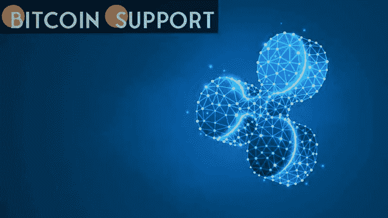

# Ripple 不是安全网在拜登的加密令之后，英国、瑞士、新加坡和日本的 Ripple 诉讼可能很快就会结束

> 原文：<https://medium.com/coinmonks/ripple-isnt-a-safety-net-following-biden-s-crypto-order-the-ripple-lawsuit-in-the-united-kingdom-9e2062c84477?source=collection_archive---------34----------------------->

**Visit our website:-** [**https://bitcoinsupports.com/**](https://bitcoinsupports.com/)

在英国、瑞士、新加坡、日本和阿拉伯联合酋长国，Ripple 不是一种证券。随着拜登的加密行政命令，律师约翰·迪顿预测，XRP 的诉讼将很快得到解决。

在美国证券交易委员会起诉这家区块链初创公司及其两名高管通过未注册证券募集 13 亿美元之前，关于 Ripple (XRP)是否是一种证券的问题持续了一年多。

虽然 Ripple 声称在发行 XRP 硬币之前，它已经采取了所有必要的预防措施，并咨询了顶级法律专家，但 SEC 认为这家加密货币公司通过发行违反了法律。由于没有明确的法规来决定哪些加密货币应被视为美国的一种证券，因此在确定哪种资产类别属于该机构的权限范围方面存在一些不确定性。

美国证券交易委员会(SEC)仍然认为加密货币是一种证券，该公司在没有事先注册的情况下向投资者出售 XRP 违反了法律。

在拜登政府的加密货币行政命令命令所有相关联邦机构与美国合作伙伴接触，以建立数字货币的国际框架后，预计 SEC 对 XRP 的立场将在未来几个月内发生转变。约翰·迪顿律师是一名美国律师，他在 Ripple 争端中被授予法庭之友的地位，他对 XRP 在其他被认为是美国盟友的国家中的地位提出了见解。根据 Deaton 律师的说法，XRP 在英国、瑞士、新加坡、日本或阿联酋都不安全。

[https://twitter.com/JohnEDeaton1/status/1501630961053802502](https://twitter.com/JohnEDeaton1/status/1501630961053802502)

根据国家安全顾问兼 NEC 董事 John Bolton 的声明:

**“该行政命令将有助于美国继续引领国内外数字资产生态系统的创新和治理，以保护消费者，符合我们的民主理想，并提高美国的全球竞争力。”**

[https://Twitter . com/belisarius 2020/status/1501711702609756163](https://twitter.com/Belisarius2020/status/1501711702609756163)

财政部长珍妮特·耶伦(Janet Yellen)在 3 月 8 日晚些时候表示，该部门已经开始采取措施遵守白宫的指示，预计所有相关机构都将效仿。尽管 Ripple 在最近的一份法庭文件中表示，SEC 的诉讼可能会在 2022 年 11 月 18 日之前解决，但如果 SEC 效仿美国其他盟友将 XRP 归类为非安全国家，此事可能会在今年上半年年底前解决。

**访问我们的网站:-**[**https://bitcoinsupports.com/**](https://bitcoinsupports.com/)

**免责声明:以上为作者观点，不应视为投资建议。读者应该自己做研究。**