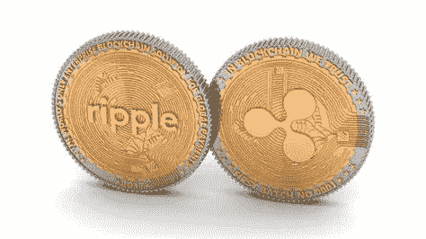

# 3 月 24 日涟漪价格分析

> 原文：<https://medium.com/coinmonks/ripple-price-analysis-24th-of-march-e164947ad1ae?source=collection_archive---------35----------------------->

Source photo [ripple cryptocurrency — Bing images](https://www.bing.com/images/search?view=detailV2&ccid=3iVXlWM8&id=927129258B83E7EB89E422D1CED6028AF78F181B&thid=OIP.3iVXlWM8G48j6uYCxHvSaAHaEK&mediaurl=https%3a%2f%2fi.redd.it%2f3x8w8uzves801.jpg&cdnurl=https%3a%2f%2fth.bing.com%2fth%2fid%2fR.de255795633c1b8f23eae602c47bd268%3frik%3dGxiP94oC1s7RIg%26pid%3dImgRaw%26r%3d0&exph=720&expw=1280&q=ripple+cryptocurrency&simid=608043571248894978&FORM=IRPRST&ck=8646CFC492D20CA4381D9377F0DEE6C8&selectedIndex=4&ajaxhist=0&ajaxserp=0)

今天的涟漪价格分析是积极的。随着接近下一个大关口，XRP/美元可能飙升至 0.90 美元附近。
过去两天，涟漪价格一直呈上升趋势。

Ripple 价格研究表明，今天的上涨仍在继续，因为我们预测它将维持在 0.82 美元创造的更高底部。当它接近…