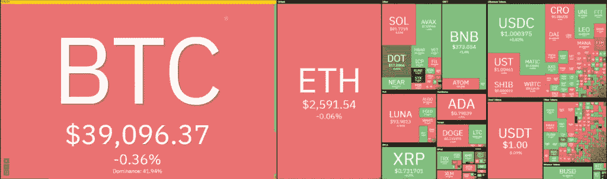
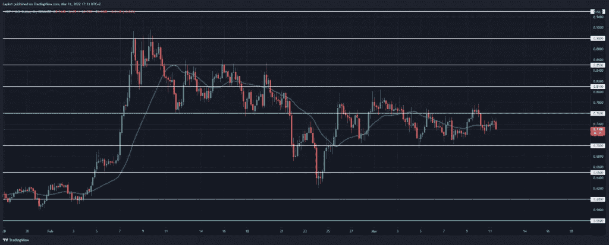

# 价格波动分析:XRP 触及 0.72 美元的更高低点，本周末反弹？

> 原文：<https://medium.com/coinmonks/ripple-price-analysis-xrp-struck-a-higher-low-at-0-72-rally-on-the-way-this-weekend-fb8a101eb3dc?source=collection_archive---------64----------------------->

**Visit our website:-** [**https://bitcoinsupports.com/**](https://bitcoinsupports.com/)

今天的涟漪价格分析是看涨的，因为我们预计另一个更高的底部，这可能会导致周末再次推高。XRP/美元接下来可能会再创新高，目标是 0.80 美元至 0.81 美元的关口。

**Visit our website:-** [**https://bitcoinsupports.com/**](https://bitcoinsupports.com/)

在过去的 24 小时里，市场整体表现不稳定。比特币下跌 0.36%，以太坊几乎保持在 0.06%不变。随着经济开始复苏，Ripple 经历了 0.27%的小幅上涨。

**Ripple 过去 24 小时的价格走势:Ripple 在 0.72 美元上方保持多头头寸。**

XRP/美元在过去 24 小时内交易于 0.7283 美元至 0.7507 美元的区间内，呈现高度波动性。交易量下降了 26.26%，至 19.9 亿美元，而硬币的总市值目前约为 352.6 亿美元，在全球排名第七。

**XRP/美元 4 小时图:XRP 处于突破边缘吗？**

在 4 小时图上，由于昨天建立了另一个更高的底部，积极的动力正在逐渐恢复涟漪价格的力量。

**Visit our website:-** [**https://bitcoinsupports.com/**](https://bitcoinsupports.com/)

过去一周，ripple 的价格行为表现为在越来越窄的区间内稳步盘整。在反复检查 0.70 美元的支撑位和确立更低的局部高点后，本周初交易区间变得非常狭窄。3 月 9 日，出现了大幅突破高点，立即导致了 0.78 美元的新高。从那里开始，XRP/美元在昨天早些时候迅速回撤至 0.72 美元的更高低点。

一般来说，这种价格波动发展暗示着多头市场结构的建立。除非突破当前的支撑位，否则我们预计 XRP/美元将在周末大幅上涨。

**涟漪价格分析:结论**

今天的涟漪价格分析是积极的，因为我们已经看到最近几天创下的更高的高点和更低的低点。因此，XRP/美元预计将在整个周末飙升，可能达到 0.80 美元的下一个障碍水平。

**访问我们的网站:-**[**https://bitcoinsupports.com/**](https://bitcoinsupports.com/)

**免责声明:这些是作者的观点，不应被视为投资建议。读者应该自己做研究。**