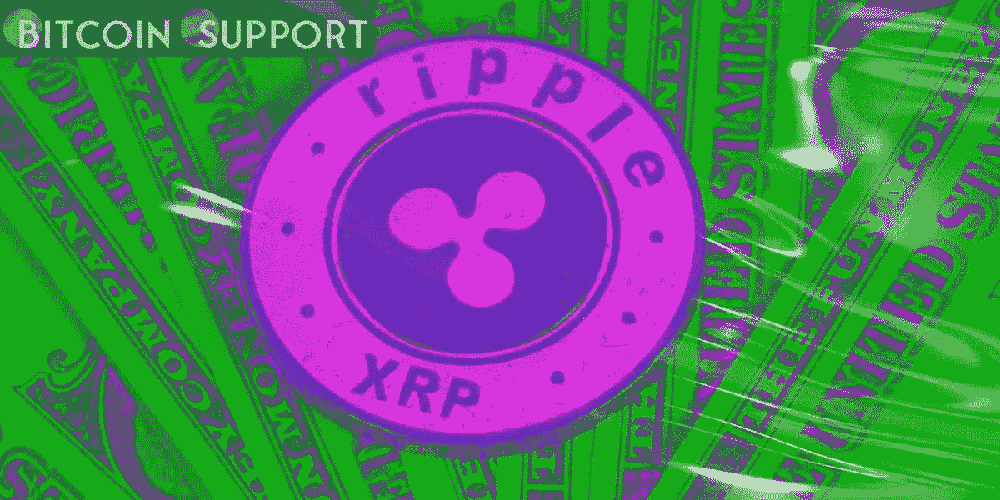

# 由于 Ripple 公布了一份名单，SEC 对 Ripple 的法律诉讼已经终止

> 原文：<https://medium.com/coinmonks/ripple-publishes-a-list-of-requirements-for-terminating-the-secs-legal-action-against-the-company-98ca9c87968?source=collection_archive---------34----------------------->

**Visit our website for full blog:-** [**https://bitcoinsupports.com/**](https://bitcoinsupports.com/)

Ripple 的个人被告拒绝了所有的索赔，并希望以有利于他们的方式驳回诉讼。上周末，Ripple 的个人被告布拉德加林豪斯(Brad Garlinghouse)和克里斯拉森(Chris Larsen)对美国证券交易委员会(sec)的修订申诉做出了回应。正如预期的那样，Ripple 高管对 SEC 提出的所有指控提出了质疑，声称他们对指控缺乏足够的了解，因为他们对投诉的大多数回应都表示“没有必要回应”。

**涟漪的要求**

除了对美国证券交易委员会对他们的指控提出异议，各个被告还提出了结束这场长达一年多的诉讼所需的四项要求。加林豪斯和拉森认为，法院应该驳回对他们的起诉，认为这是偏见，做出有利于被告的判决，并赔偿两个被告的律师费和其他费用。此外，个别被告请求法院根据诉讼的困难给予他们它认为适当的任何其他补救。

**被告集会反对陪审团审判**

个别被告在 2022 年 4 月 8 日星期五提交的答复中指出，证券交易委员会可能希望寻求“陪审团审判”以回应这些要求。虽然个别被告承认证券交易委员会有权提出要求，但区块链公司要求法院拒绝该动议，认为选择陪审团审判将导致更多的延误，进一步伤害投资者。证券监管机构被指控利用拖延战术迫使 Ripple 达成有利的和解协议。美国证券交易委员会要求延长提交申请的最后期限，这给被告带来了不便，并持续压低了 XRP 的价格。在 SEC 指控 Ripple 进行未注册证券销售之前，该公司与以太坊(Ethereum)并驾齐驱的 XRP，由于市值大幅下降，已跌至第七位。与此同时，美国证券交易委员会(SEC)前主任比尔希曼(Bill Hinman)被指控在任职期间藐视直接命令，该机构试图将他的电子邮件排除在指控之外。随着证交会承诺保护希曼的电子邮件，很明显，该机构意识到了他的利益冲突，如果该案件被提起，法院和 Ripple 将会发现这一点。

**XRP 价格变得看跌**

不幸的是，尽管有积极的发展，XRP 仍远未越过上个月达到的 0.9 美元的水平。在过去的 24 小时内，XRP 下跌了 3.3%，截至发稿时，交易价格约为 0.74 美元。XRP 目前的价格低于其第一个重要支撑位 0.7472 美元。然而，如果市场情绪好转，XRP 的价格可能会达到 0.75 美元。
**访问我们的网站获取完整博客:-**[**https://bitcoinsupports.com/**](https://bitcoinsupports.com/)

**免责声明:以上为作者观点，不应视为投资建议。读者应该自己做研究。**

> 加入 Coinmonks [电报频道](https://t.me/coincodecap)和 [Youtube 频道](https://www.youtube.com/c/coinmonks/videos)了解加密交易和投资

# 另外，阅读

*   [如何在 FTX 交易所交易期货](https://coincodecap.com/ftx-futures-trading) | [OKEx vs 币安](https://coincodecap.com/okex-vs-binance)
*   [OKEx vs KuCoin](https://coincodecap.com/okex-kucoin) | [摄氏替代品](https://coincodecap.com/celsius-alternatives) | [如何购买 VeChain](https://coincodecap.com/buy-vechain)
*   [ProfitFarmers 点评](https://coincodecap.com/profitfarmers-review) | [如何使用 Cornix Trading Bot](https://coincodecap.com/cornix-trading-bot)
*   [如何匿名购买比特币](https://coincodecap.com/buy-bitcoin-anonymously) | [比特币现金钱包](https://coincodecap.com/bitcoin-cash-wallets)
*   [瓦济里克斯 NFT 评论](https://coincodecap.com/wazirx-nft-review)|[Bitsgap vs Pionex](https://coincodecap.com/bitsgap-vs-pionex)|[坦吉姆评论](https://coincodecap.com/tangem-wallet-review)