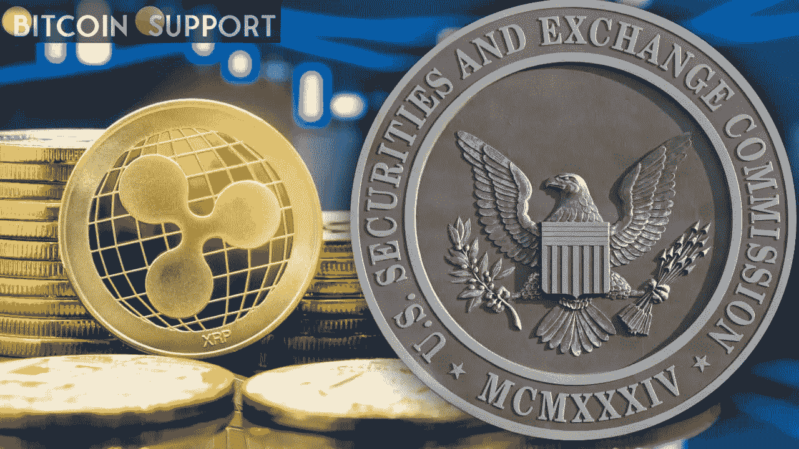

# Ripple 在 SEC 案件中赢得了“实质性胜利”

> 原文：<https://medium.com/coinmonks/ripple-secures-asignificant-victory-in-an-sec-case-dc1b4688311c?source=collection_archive---------34----------------------->

**Visit our website for full blog:-**[**https://bitcoinsupports.com/ripple-secures-asignificant-victory-in-an-sec-case/**](https://bitcoinsupports.com/ripple-secures-asignificant-victory-in-an-sec-case/)

Ripple Labs 在其正在进行的证券欺诈行动中赢得了对证券交易委员会的胜利。主持此案的法官拒绝了证交会对一些可能与起诉无关的文件进行审查的要求。在首席法官做出一项裁决后，Ripple Labs 在美国证券交易委员会(SEC)的案件中赢得了一次打击，一位 Ripple 社区律师称这是“Ripple 的一次非常重大的胜利”

美国证交会指控 Ripple 和高管布拉德·加林豪斯(Brad Garlinghouse)和克里斯蒂安·拉森(Christian Larsen)在 2020 年出售未注册证券。

首席法官莎拉·内特伯恩拒绝了美国证券交易委员会的要求，即重新考虑保护 2018 年 6 月 Ripple 时任董事威利安·希曼在特权下发表的演讲的相关记录。辛曼在演讲中表示，比特币(BTC)和以太坊(ETH)都不是证券。以前，美国证券交易委员会并不反对此类文件免于审议程序特权(DPP)保护，因为它们似乎只涉及希曼的个人观点，而不是涟漪政策。为了根据文件内容对现有政策进行秘密审查，检察部拒绝政府公开一些文件。

SEC 后来转变了立场，认为该言论反映了瑞普的政策，而非希曼的个人观点，因此应该受到保护。Netburn 法官表示，SEC 应避免试图反驳其指控而自相矛盾。她在自己的决定中写道:

**“尽管证交会希望两者兼得，但这篇讲话要么意在反映，要么无意反映该机构的政策。在坚称自己的立场反映了希曼的个人观点后，证交会现在不能拒绝自己的立场。**

詹姆斯·k·菲兰(James K. Filan)是一名 Ripple 社区辩护律师，拥有大量金融和 SEC 问题的案件档案，他总结了 Netburn 法官今天拒绝重新考虑的重要方面:

[【https://twitter.com/FilanLaw/status/1513650057563754497】](https://twitter.com/FilanLaw/status/1513650057563754497) 
此外，另一名 Ripple 社区律师兼 Crypto-Law.us 创始人今天在推特上向他的 191，000 名粉丝表示，由于 Netburn 法官的命令，“SEC 现在处于危险之中”。https://twitter.com/JohnEDeaton1/status/1513653053211172869

尽管这一判决显然意义重大，但诉讼远未结束，美国证券交易委员会现在有两周的上诉时间。

加密货币行业的大部分注意力都集中在这起案件的结果上，因为它可能决定 SEC 对未注册证券销售加密业务的投诉的未来。

一场涟漪式的胜利可能标志着证交会针对加密货币行业的激进行动出现逆转。然而，如果证交会获胜，闸门可能会加大，为精通密码的律师创造一个家庭手工业。

**访问我们的网站获取完整博客:-**[**https://bitcoinsupports . com/ripple-secures-asisignificant-victory-in-an-sec-case/**](https://bitcoinsupports.com/ripple-secures-asignificant-victory-in-an-sec-case/)

**免责声明:以上为作者观点，不应视为投资建议。读者应该自己做研究。**

> *加入 Coinmonks* [*电报频道*](https://t.me/coincodecap) *和* [*Youtube 频道*](https://www.youtube.com/c/coinmonks/videos) *了解加密交易和投资*

# 另外，阅读

*   [3 商业评论](/coinmonks/3commas-review-an-excellent-crypto-trading-bot-2020-1313a58bec92) | [Pionex 评论](https://coincodecap.com/pionex-review-exchange-with-crypto-trading-bot) | [Coinrule 评论](/coinmonks/coinrule-review-2021-a-beginner-friendly-crypto-trading-bot-daf0504848ba)
*   [莱杰 vs n 格拉夫](/coinmonks/ledger-vs-ngrave-zero-7e40f0c1d694) | [莱杰纳诺 s vs x](/coinmonks/ledger-nano-s-vs-x-battery-hardware-price-storage-59a6663fe3b0) | [币安评论](/coinmonks/binance-review-ee10d3bf3b6e)
*   [Bybit Exchange 审查](/coinmonks/bybit-exchange-review-dbd570019b71) | [Bityard 审查](https://coincodecap.com/bityard-reivew) | [Jet-Bot 审查](https://coincodecap.com/jet-bot-review)
*   [3 commas vs crypto hopper](/coinmonks/3commas-vs-pionex-vs-cryptohopper-best-crypto-bot-6a98d2baa203)|[赚取加密利息](/coinmonks/earn-crypto-interest-b10b810fdda3)