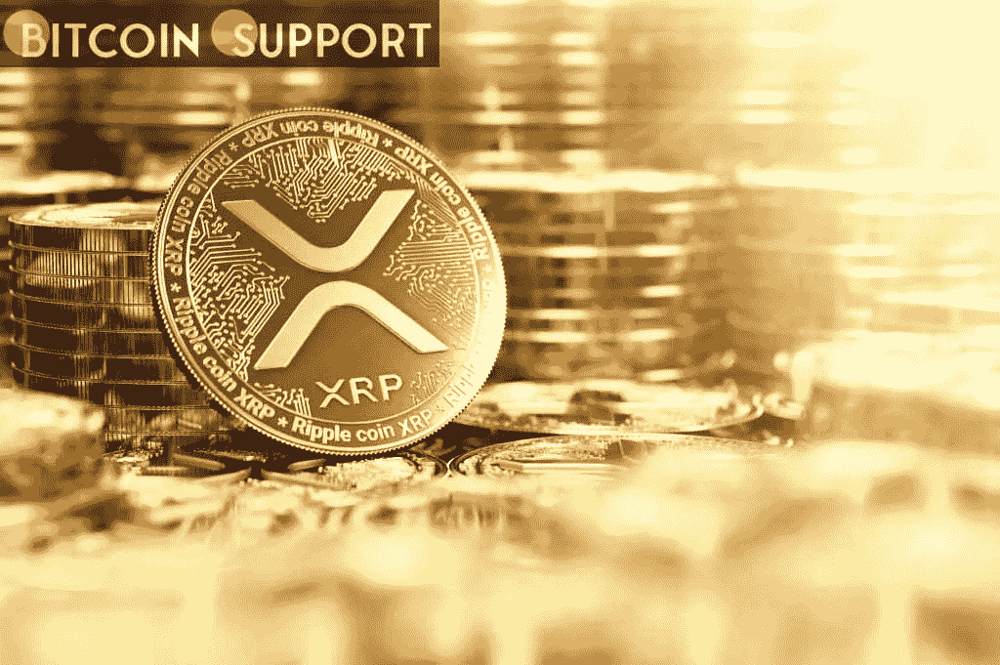
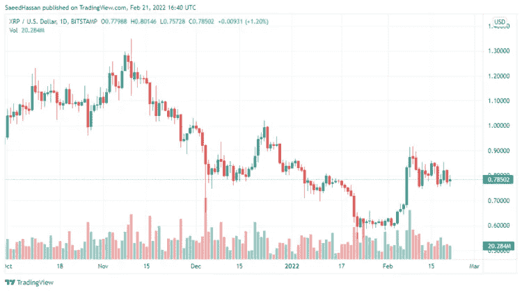

# Ripple 诉 SEC:随着新证据的出现，XRP 在法律战中显示出实力

> 原文：<https://medium.com/coinmonks/ripple-vs-sec-xrp-shows-strength-in-legal-battle-as-new-evidence-emerges-7df29ec6b92a?source=collection_archive---------39----------------------->

[**https://bitcoinsupports.com/**](https://bitcoinsupports.com/)

在过去十年里，Ripple 的回报一直很有希望，但它在很大程度上错过了重要的加密收益。然而，它在去年年初确实取得了成功，直到 4 月份，其价值大幅高于以往，只是在秋季晚些时候被其他加密货币取代，这些货币在整个期间的表现明显更好。

自 2017 年以来，XRP 一直在制造更低的高点，价格看跌。其他加密货币继续创下新高，直到 2021 年 11 月，但 XRP 的价格增长缓慢。XRP 在上个月的下跌中跌破 1 美元，跌至 0.55 美元。在周线图上，它遇到了第二次提供支撑的 SMA200(紫色)；今年 1 月，它又开始反弹走高。

XRP/美元正在上涨，但买家未能将价格推至 50 周 SMA(黄色)上方，该价格目前位于 1.9 美元，在顶部水平充当阻力；然而，从 055 开始的上涨确实显示了一些看涨的迹象，因为它们上涨了约 60%。一周后，市场再次转为熊市，但 XRP 守住涨幅的能力表明，在区间内可能还有更多上涨空间。

[**https://bitcoinsupports.com/**](https://bitcoinsupports.com/)

**XRP 与证交会争斗**

XRP 落后于加密市场其他公司的主要原因是一场始于一年多前的法律战，当时证交会对 Ripple 提起诉讼，声称这是一份投资合同。每一个关注这场诉讼的人都会对区块链科技如何在美国发展给后代有发言权。Ripple 对 SEC 的诉讼一直困难重重。最近的一个转折是，法官 Analisa Torres 允许他们回应，他们在本月早些时候以公平的辩护通知做了回应。

**访问我们的网站:-**[**https://bitcoinsupports.com/**](https://bitcoinsupports.com/)

**免责声明:以上为作者观点，不应视为投资建议。读者应该自己做研究。**

> 加入 Coinmonks [电报频道](https://t.me/coincodecap)和 [Youtube 频道](https://www.youtube.com/c/coinmonks/videos)了解加密交易和投资

# 另外，阅读

*   [40 个最佳电报频道](https://coincodecap.com/best-telegram-channels) | [1xBit 回顾](https://coincodecap.com/1xbit-review) | [Keevo 钱包回顾](https://coincodecap.com/keevo-wallet-review)
*   [如何在印度购买以太坊？](https://coincodecap.com/buy-ethereum-in-india) | [如何在币安购买比特币](https://coincodecap.com/buy-bitcoin-binance)
*   [在美国如何使用 BitMEX？](https://coincodecap.com/use-bitmex-in-usa) | [BitMEX 回顾](https://coincodecap.com/bitmex-review) | [买索拉纳](https://coincodecap.com/buy-solana)
*   [德国最佳加密交易所](https://coincodecap.com/crypto-exchanges-in-germany) | [Arbitrum:第二层解决方案](https://coincodecap.com/arbitrum)
*   [比诺莫评论](https://coincodecap.com/binomo-review) | [斯多葛派 vs 3Commas vs TradeSanta](https://coincodecap.com/stoic-vs-3commas-vs-tradesanta)
*   [Capital.com 评论](https://coincodecap.com/capital-com-review) | [香港的加密借贷平台](https://coincodecap.com/crypto-lending-hong-kong)
*   [支持卡审核](https://coincodecap.com/uphold-card-review) | [信任钱包 vs 元掩码](https://coincodecap.com/trust-wallet-vs-metamask)
*   [赢取注册奖金——10 大最佳加密平台](https://coincodecap.com/earn-sign-up-bonus)
*   [Exness 回顾](https://coincodecap.com/exness-review)|[moon xbt Vs bit get Vs Bingbon](https://coincodecap.com/bingbon-vs-bitget-vs-moonxbt)