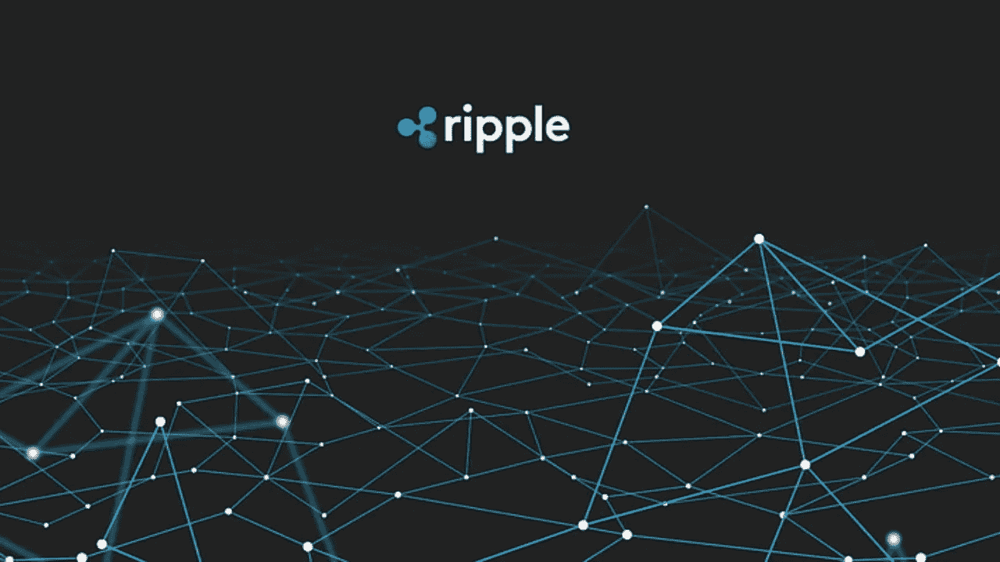

# 涟漪(XRP)在 60 秒内解释道

> 原文：<https://medium.com/coinmonks/ripple-xrp-explained-in-60-seconds-e723af2f66ab?source=collection_archive---------34----------------------->

Ripple 是一种奇怪的加密货币，区块链有点集中，这使得一些人声称 [Ripple 不是“真正的”加密货币](https://www.investopedia.com/news/why-some-claim-ripple-isnt-real-cryptocurrency-0/)。但是我跑题了。所以你心中的问题是，涟漪到底是什么，它从何而来？

加州大学伯克利分校(UC Berkeley)的辍学生、连续创业者杰德·麦卡勒(Jed McCaleb)在 2011 年提出了 Ripple 的概念，并在 2012 年创立了 OpenCoin，即现在的 Ripple Labs。

Ripple 被设想为一种数字货币，旨在成为世界上第一个无摩擦、真正全球化的支付网络。它利用区块链技术向世界各地提供安全、快速、廉价的汇款方式。Ripple 背后的公司 Ripple Labs Inc .创建了一个名为 RippleNet 的开源协议，可以与现有的金融机构集成。这使得银行和其他大型金融机构可以使用区块链技术，而不必从头开始建设自己的基础设施。此外，它使用 XRP 作为本国货币，可用于网络交易或兑换成法定货币。

Ripple (XRP)是国际支付的理想选择，前提是其安全特性能够应对这一挑战。自加密货币于 2012 年推出以来，银行已开始将其视为现有 SWIFT 系统的可能替代品，该系统几十年来一直在促进金融交易。

 [## 你准备好迎接加密经济了吗？加密派

### 每次你打开新闻，阅读报纸，或者浏览你的推特，你很可能会看到一些故事…

www.thecryptopie.com](https://www.thecryptopie.com/) 

> 加入 Coinmonks [电报频道](https://t.me/coincodecap)和 [Youtube 频道](https://www.youtube.com/c/coinmonks/videos)了解加密交易和投资

# 另外，阅读

*   [加密货币储蓄账户](/coinmonks/cryptocurrency-savings-accounts-be3bc0feffbf) | [加密交易机器人](https://coincodecap.com/best-crypto-trading-bots)
*   [BigONE 交易所评论](/coinmonks/bigone-exchange-review-64705d85a1d4) | [CEX。IO 审查](https://coincodecap.com/cex-io-review) | [交换区审查](/coinmonks/swapzone-review-crypto-exchange-data-aggregator-e0ad78e55ed7)
*   [最佳比特币保证金交易](/coinmonks/bitcoin-margin-trading-exchange-bcbfcbf7b8e3) | [比特币保证金交易](https://coincodecap.com/bityard-margin-trading)
*   [加密保证金交易交易所](/coinmonks/crypto-margin-trading-exchanges-428b1f7ad108) | [赚取比特币](/coinmonks/earn-bitcoin-6e8bd3c592d9)
*   [WazirX vs coin dcx vs bit bns](/coinmonks/wazirx-vs-coindcx-vs-bitbns-149f4f19a2f1)|[block fi vs coin loan vs Nexo](/coinmonks/blockfi-vs-coinloan-vs-nexo-cb624635230d)