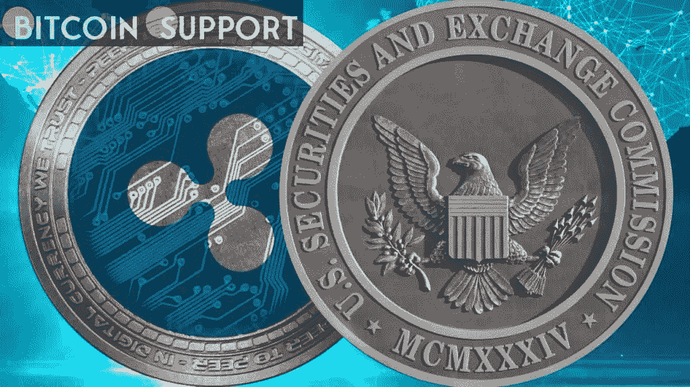

# Ripple (XRP)正寻求在加密货币监管方面与国会合作

> 原文：<https://medium.com/coinmonks/ripple-xrp-is-seeking-to-work-with-congress-on-cryptocurrency-regulation-466f931a9ade?source=collection_archive---------33----------------------->

**Visit our website:-** [**https://bitcoinsupports.com/**](https://bitcoinsupports.com/)

Ripple 希望提前与国会和监管机构就合理的监管进行合作。Ripple 公共政策主管苏珊弗里德曼(Susan Friedman)表示，包括 Ripple 在内的许多加密行业公司都希望在合理的监管方面与国会和监管机构积极合作，以建立一个既刺激创新又保护消费者的数字资产生态系统。https://twitter.com/ss_friedman/status/1498659432900665344

[Ripple 首席执行官在指出加密货币行业并不像人们经常描绘的那样“狂野西部”时这样说。2021 年 9 月底在美国参议院作证时，SEC 主席加里·詹斯勒(Gary Gensler)将 crypto 称为“狂野的西部”，同时要求更多的监管。美国证券交易委员会指控 Ripple 和两名主要高管在 2013 年至 2020 年期间在 XRP 执行了一项 13 亿美元的未注册发行，这是一项诉讼的主题。

根据 Cryptolaw 创造者约翰·迪顿(John Deaton)的说法，法院“诉讼中最大的判决”指日可待。美国证券交易委员会目前正在对公诉署的判决提出上诉，称“Estabrook 票据”享有特权，并寻求复议。上周末，Ripple 和个别被告对 SEC 要求对 Netburn 法官的 DPP 裁决进行部分审查和澄清的举动做出了回应。
如果这些笔记被公布，Cryptolaw 创始人约翰·迪顿认为它们将有助于 Ripple 起诉 SEC。据迪顿称，他们可以支持 Ripple 首席执行官布拉德·加林豪斯(Brad Garlinghouse)的说法，即他离开 2018 年的会议时，确信继续出售 XRP 不是未注册的证券。](https://twitter.com/ss_friedman/status/1498659432900665344) [https://Twitter . com/attorneyjeremy 1/status/1498449721253371905](https://twitter.com/attorneyjeremy1/status/1498449721253371905)

Hogan&Hogan 的合伙人杰里米·霍根律师最近公布了一份文件，详细说明了 SEC 和 Ripple 可以遵循的几项原则，包括在事实发现完成 14 天后召开和解会议。在一系列推文中，这位 XRP 社区友好型律师分享了他对 Ripple 诉讼的想法。他指出，让已经在摄像机上看过所有文件的法官莎拉·奈特本主持调解可能对瑞普有利。据杰里米·霍根称，和解可能会在 4 月或 5 月达成。

**访问我们的网站:-**[**https://bitcoinsupports.com/**](https://bitcoinsupports.com/)

**免责声明:以上为作者观点，不应视为投资建议。读者应该自己做研究。**

> 加入 Coinmonks [电报频道](https://t.me/coincodecap)和 [Youtube 频道](https://www.youtube.com/c/coinmonks/videos)了解加密交易和投资

# 另外，阅读

*   [OKEx vs KuCoin](https://coincodecap.com/okex-kucoin) | [摄氏替代品](https://coincodecap.com/celsius-alternatives) | [如何购买 VeChain](https://coincodecap.com/buy-vechain)
*   [币安期货交易](https://coincodecap.com/binance-futures-trading)|[3 comas vs Mudrex vs eToro](https://coincodecap.com/mudrex-3commas-etoro)
*   [如何购买 Monero](https://coincodecap.com/buy-monero) | [IDEX 评论](https://coincodecap.com/idex-review) | [BitKan 交易机器人](https://coincodecap.com/bitkan-trading-bot)
*   [CoinDCX 评论](/coinmonks/coindcx-review-8444db3621a2) | [加密保证金交易交易所](https://coincodecap.com/crypto-margin-trading-exchanges)
*   [红狗赌场评论](https://coincodecap.com/red-dog-casino-review) | [Swyftx 评论](https://coincodecap.com/swyftx-review) | [CoinGate 评论](https://coincodecap.com/coingate-review)
*   [Bookmap 评论](https://coincodecap.com/bookmap-review-2021-best-trading-software) | [美国 5 大最佳加密交易所](https://coincodecap.com/crypto-exchange-usa)
*   [如何在 FTX 交易所交易期货](https://coincodecap.com/ftx-futures-trading) | [OKEx vs 币安](https://coincodecap.com/okex-vs-binance)
*   [CoinLoan 评论](https://coincodecap.com/coinloan-review) | [YouHodler 评论](/coinmonks/youhodler-4-easy-ways-to-make-money-98969b9689f2) | [BlockFi 评论](https://coincodecap.com/blockfi-review)
*   XT.COM 评论 | [币安评论](https://coincodecap.com/xt-com-review)
*   [SmithBot 评论](https://coincodecap.com/smithbot-review) | [4 款最佳免费开源交易机器人](https://coincodecap.com/free-open-source-trading-bots)
*   [比特币基地僵尸程序](/coinmonks/coinbase-bots-ac6359e897f3) | [AscendEX 审查](/coinmonks/ascendex-review-53e829cf75fa) | [OKEx 交易僵尸程序](/coinmonks/okex-trading-bots-234920f61e60)