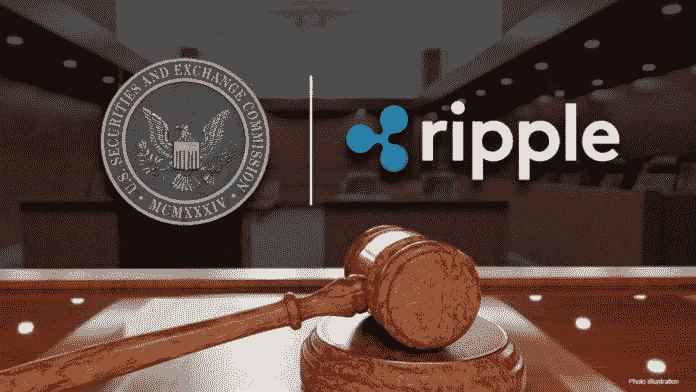
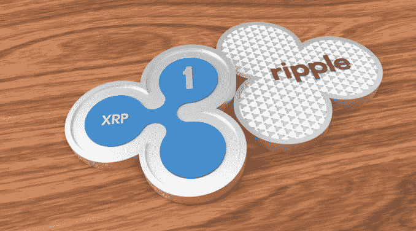

# Ripple 的首席执行长表示，证交会诉 XRP 一案进展“非常顺利”

> 原文：<https://medium.com/coinmonks/ripples-ceo-says-the-sec-vs-xrp-court-case-has-gone-exceedingly-well-35873bc43cb8?source=collection_archive---------57----------------------->

Ripple 首席执行官布拉德·加林豪斯(Brad Garlinghouse)表示，他相信 Ripple 在与美国证券交易委员会(SEC)的漫长诉讼案结束时会表现良好。

总部位于旧金山的初创公司 Ripple 正与美国证券交易委员会(SEC)展开法庭大战。SEC 指控 Ripple、Garlinghouse 和执行主席 Chris Larsen 通过销售 Ripple 的 XRP 硬币或代币从事非法证券发行。Ripple 对 SEC 的指控提出了质疑，并认为 XRP 应该被视为一种虚拟加密货币，而不是像股票或股份那样的传统投资。

# 什么是涟漪的硬币 XRP？

Ripple's coin XRP 是一种加密货币，旨在满足金融业的需求，并在市场上销售，供银行用于多种用例，包括国际支付结算、资产交换和汇款系统。XRP 硬币或代币可以与 Ripple Lab 的产品一起使用，以方便不同货币之间的快速转换。

# Ripple 首席执行官布拉德·加林豪斯(Brad Garlinghouse)最近对证交会诉 XRP 案的现状发表了评论

Ripple 首席执行官布拉德·加林豪斯最近在美国消费者新闻与商业频道的炉边谈话中表示，“诉讼进行得非常顺利，比大约 15 个月前开始时我所希望的好得多。”他后来补充说“但是正义的车轮移动缓慢。”

该评论是在本周早些时候收到一份有利的判决后发表的。证交会诉 XRP 案的法官裁定，证交会不能编辑据称显示监管机构如何处理 XRP 和其他代币(如[以太坊(ETH)](https://bumblebeecrypto.com/crypto-prices/) )存在利益冲突的电子邮件内容。

加林豪斯表示，Ripple XRP“已经在最坏的情况下运营”，去年向美国金融机构出售了“零”企业合同。“我们有创纪录的增长，”他后来补充说，“这只是在美国之外。”加林豪斯还谈到了该案件对整个加密货币行业的重要性。他表示“如果 Ripple 赢不了这场官司，会有很多风险。”这个案子很重要，不仅仅是对 Ripple 这对美国的整个加密行业都很重要，”他接着补充道，“这对美国的加密业来说确实是负面的。"

来源:BumbleBeeCrypto.com

> 加入 Coinmonks [电报频道](https://t.me/coincodecap)和 [Youtube 频道](https://www.youtube.com/c/coinmonks/videos)了解加密交易和投资

# 另外，阅读

*   [折叠 App 审核](https://coincodecap.com/fold-app-review) | [Kucoin 交易机器人](/coinmonks/kucoin-trading-bot-automate-your-trades-8cf0ca2138e0) | [Probit 审核](https://coincodecap.com/probit-review)
*   [如何匿名购买比特币](https://coincodecap.com/buy-bitcoin-anonymously) | [比特币现金钱包](https://coincodecap.com/bitcoin-cash-wallets)
*   [币安 vs FTX](https://coincodecap.com/binance-vs-ftx) | [最佳(SOL)索拉纳钱包](https://coincodecap.com/solana-wallets)
*   [比诺莫评论](https://coincodecap.com/binomo-review) | [斯多葛派 vs 3Commas vs TradeSanta](https://coincodecap.com/stoic-vs-3commas-vs-tradesanta)
*   [Capital.com 评论](https://coincodecap.com/capital-com-review) | [香港的加密借贷平台](https://coincodecap.com/crypto-lending-hong-kong)