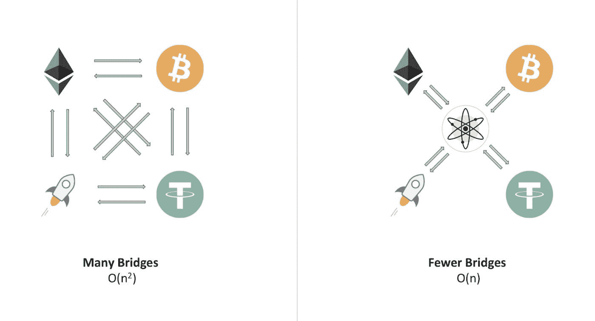

# 桥梁毁灭者的崛起与全链条未来

> 原文：<https://medium.com/coinmonks/rise-of-the-bridge-destroyer-85d027946547?source=collection_archive---------29----------------------->

随着最近高达 3.2 亿美元的桥梁黑客攻击，我相信对跨链未来的安全性有巨大的需求。也就是说，LayerZero 实验室用星际之门融资拯救了我们。

Stargate Finance 是一个可组合的本地跨链资产桥，具有统一的流动性、即时保证的终结性，其目标是使跨链流动性转移成为无缝的单一交易过程！

他们欢迎我们加入全链条。omnichain 是不同链相互连接的互操作性，不需要包装令牌！

自推出以来，他们已经在 TVL 筹集了高达 35 亿美元的资金(总价值锁定)。

## 是什么让星门如此特别？

用户可以在一次交易中在$STG 上跨链交换本地资产。

想想跨链资产互换，借贷和耕作，而不离开你首选链的舒适。

用户可以用以太坊上的 USDC 兑换币安智能链上的 USDT。

## 星际之门金融是解决桥接三难问题的第一座桥梁，即 DeFi 的 Ikigai。

## 嗯，有什么问题？

*   即时保证终结，保证交易从源链到目的链。
*   本地资产、真实掉期(USDC)与合成掉期(fUSDC)
*   统一流动性，所有链共享的流动性池。

## 星际之门金融公司使用他们的 Delta 算法。

一种新颖的资源平衡算法，能够在所有链上实现统一的本地资产池，同时还提供即时的有保证的终结性。

这开启了真正的可组合性。

用户可以在一次交易中将 E [上的$wBTC 换成](https://twitter.com/ethereum)[上的$JOE，而不用离开交换界面。为多链 Dapps 如](https://twitter.com/avalancheavax)[寿司交换](https://twitter.com/SushiSwap)和 Abracadabra 提供完整的统一体验。

这最终降低了成本，增强了用户体验。我相信这将是普通人进入高壁垒的转折点，使过程变得容易。

## 好吧，这听起来像是 Thorchain？

*“它们是根本不同的项目。Thorchain 是一个 DEX，它允许您将链 X 上的资产 A 交换到链 Y 上的资产 B，并且它通过自己的验证器网络/自己的共识机制来实现这一点。”*

*“layer zero 不是 bridge/ DEX/ etc，它是一个专注于通用消息传递的消息传递协议。Bridge、DEX 等都是可以构建在 LayerZero 之上的东西，它本身就是一种通信协议。”*

*“星际之门不是 DEX，它不会做 A > B 资产，只做同类资产比如:USDC > USDT。你可以把它想象成一把马刀。”— Primo*

## 嗯，宇宙不也是 0 层吗？

在 LayerZero 中，块头由独立的 oracle 提交，而在 Cosmos 中，主链协调块头。

LayerZero is on the left while Cosmos takes the right

最重要的是，Stargate Finance 提供了诱人的收益率，从 18%到 16%不等！

该协议得到了 Alameda Research 的进一步支持，Alameda Research 是最大的加密投资公司之一。在下面的主题中有更多关于购买的详细信息:

> 加入 Coinmonks [电报频道](https://t.me/coincodecap)和 [Youtube 频道](https://www.youtube.com/c/coinmonks/videos)了解加密交易和投资

# 另外，阅读

*   [OKEx vs KuCoin](https://coincodecap.com/okex-kucoin) | [摄氏替代品](https://coincodecap.com/celsius-alternatives) | [如何购买 VeChain](https://coincodecap.com/buy-vechain)
*   [币安期货交易](https://coincodecap.com/binance-futures-trading)|[3 comas vs Mudrex vs eToro](https://coincodecap.com/mudrex-3commas-etoro)
*   [如何购买 Monero](https://coincodecap.com/buy-monero) | [IDEX 评论](https://coincodecap.com/idex-review) | [BitKan 交易机器人](https://coincodecap.com/bitkan-trading-bot)
*   [CoinDCX 评论](/coinmonks/coindcx-review-8444db3621a2) | [加密保证金交易交易所](https://coincodecap.com/crypto-margin-trading-exchanges)
*   [红狗赌场评论](https://coincodecap.com/red-dog-casino-review) | [Swyftx 评论](https://coincodecap.com/swyftx-review) | [CoinGate 评论](https://coincodecap.com/coingate-review)