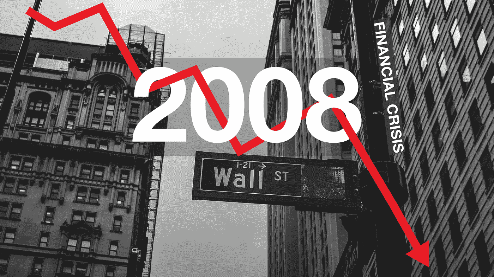
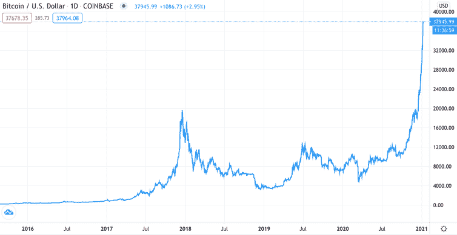
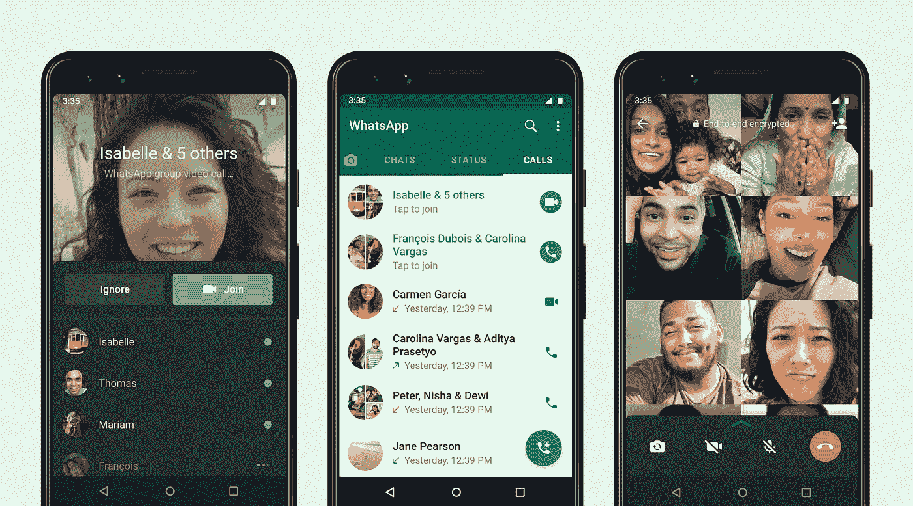

# 涨跌:比特币的创新价值

> 原文：<https://medium.com/coinmonks/rises-and-falls-the-innovation-value-of-bitcoin-eaa364527eb0?source=collection_archive---------34----------------------->

> 第一章:危机

2008 年的危机无疑影响了我们整个社会。银行倒闭，经济衰退。全球经济的下滑是由美国的房地产行业造成的。这一事件引发了公众对“邪恶大银行”心态的开始。美国 2008 年的危机(后来影响了整个世界的经济)迫使人们去寻找一种比美元更可靠、更值得信赖的货币。

2009 年初，一个名叫中本聪的人制造了一种数字货币，这种货币使用点对点技术，在没有中央机构或银行的情况下运行。听起来不错，对吧？另外，这种货币是开源的，它的设计是公开的，没有人拥有或控制比特币，每个人都可以参与其中。这个项目的时机也是金融界最棒的事情，它后来被认为是有史以来最有价值的数字货币。

> 第二章:繁荣、萧条和信徒

与美元、黄金和股票资产不同，比特币严重依赖供求规律。这意味着有一定数量的人可以利用他们拥有的大量资源创造高需求。虽然从技术上讲，它们是一个电子账本，每个硬币背后都有潜在的代码，但这并不能改变人们并不真正关心潜在代码的事实，因为它基本上是无形的。这个事实和它看起来一样可怕。当某些人可以操纵整个市场时，市场可能比任何其他市场都更加不稳定。

Bitcoin Stocks 2016–2021

比特币热潮首先发生在 2017 年，这一飙升的主要原因是比特币的稀缺性吸引了人们。2017 年的牛市具有经典金融泡沫的所有迹象，投资者在**“害怕错过”(FOMO** )买入。正确的是，2018 年 12 月，比特币下跌了 45%。

市场从未从泡沫中吸取教训。2020 年，当新冠肺炎危机冲击全球经济时，这一事件再次发生。信徒们相信比特币是“新黄金”，它总能战胜危机。也不是完全不正确，2020 年 3 月，比特币上涨 700%，突破历史新高。英国金融行为监管局(Financial Conduct Authority)警告投资者不要贷款或投资加密资产，他们应该做好“血本无归”的准备。这个泡沫在 2021 年 11 月破裂，直到 2022 年 1 月，崩溃抹去了超过 1 万亿美元的市值，这比**1929 年黑色星期二后经历的通货膨胀调整后的价值损失还要多。**

> 第三章:比特币的技术创新

被归类为创新的是，它允许任何人利用技术人工制品，并利用它们与他人互动。在技术创新中，网络外部性起着重要的作用。网络外部性理论认为，创新的用户数量越多，创新获得的价值就越大。

Whatsapp

以 Whatsapp 为例，如果 Whatsapp 上的用户总数只有两个，你和你最好的朋友，你就不能使用该应用程序联系你的家人、配偶或你的其他朋友。因此，在这一点上，创新的价值仍然很低。Whatsapp 现在有数百万用户，几乎我们所有的朋友、家人和同事都在使用这个应用。由于用户数量的增加，该值急剧增加。这些是网络外部性。

另一方面，比特币只在某些国家合法交易，这些国家大多是发达国家。在许多国家，如我的国家(印度尼西亚)，比特币用于投资是合法的，被归类为投资工具，而不是交易工具。从创新的角度来看，比特币的价值远远低于美元或黄金等交易工具。因为比特币的网络外部性远低于美元，它远没有美元安全和有价值。

最终，比特币被一只拥有大量资源的看不见的手所控制，这只手可以创造大量需求或大量供应，也可以围绕投资者创造情绪的过山车。随着各国对硬币实施禁令，它的网络外部性减少了。

明智地投资吧，读者们，❤和平了

**资源**

s . j . liebowitz 和 s . n . Margolis(1994 年)。一个不寻常的悲剧。经济展望杂志，8，133–150 页。*

> 加入 Coinmonks [电报频道](https://t.me/coincodecap)和 [Youtube 频道](https://www.youtube.com/c/coinmonks/videos)了解加密交易和投资

# 另外，阅读

*   [币安 vs FTX](https://coincodecap.com/binance-vs-ftx) | [最佳(SOL)索拉纳钱包](https://coincodecap.com/solana-wallets)
*   [如何在 Uniswap 上交换加密？](https://coincodecap.com/swap-crypto-on-uniswap) | [A-Ads 审查](https://coincodecap.com/a-ads-review)
*   [加密货币储蓄账户](/coinmonks/cryptocurrency-savings-accounts-be3bc0feffbf) | [YoBit 审核](/coinmonks/yobit-review-175464162c62)
*   [Botsfolio vs nap bots vs Mudrex](/coinmonks/botsfolio-vs-napbots-vs-mudrex-c81344970c02)|[gate . io 交流回顾](/coinmonks/gate-io-exchange-review-61bf87b7078f)
*   [CoinFLEX 评论](https://coincodecap.com/coinflex-review) | [AEX 交易所评论](https://coincodecap.com/aex-exchange-review) | [UPbit 评论](https://coincodecap.com/upbit-review)