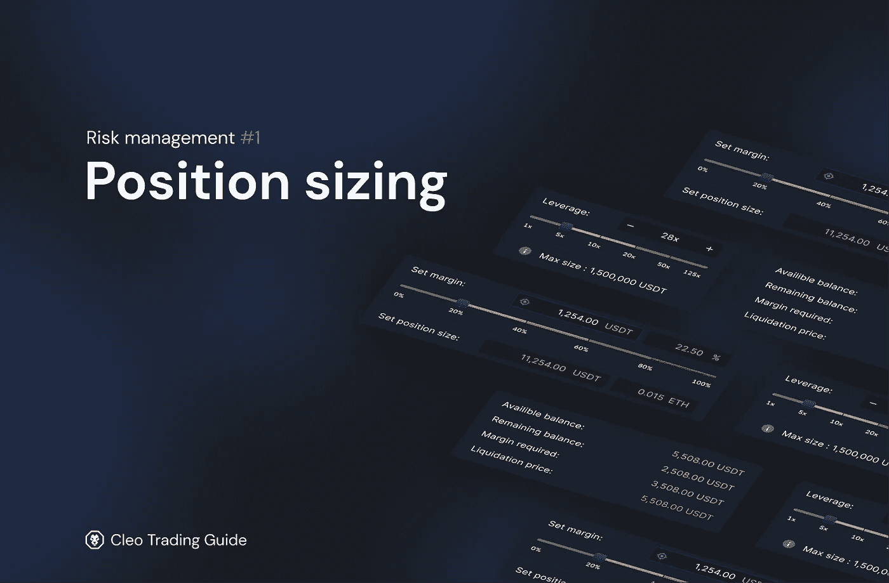
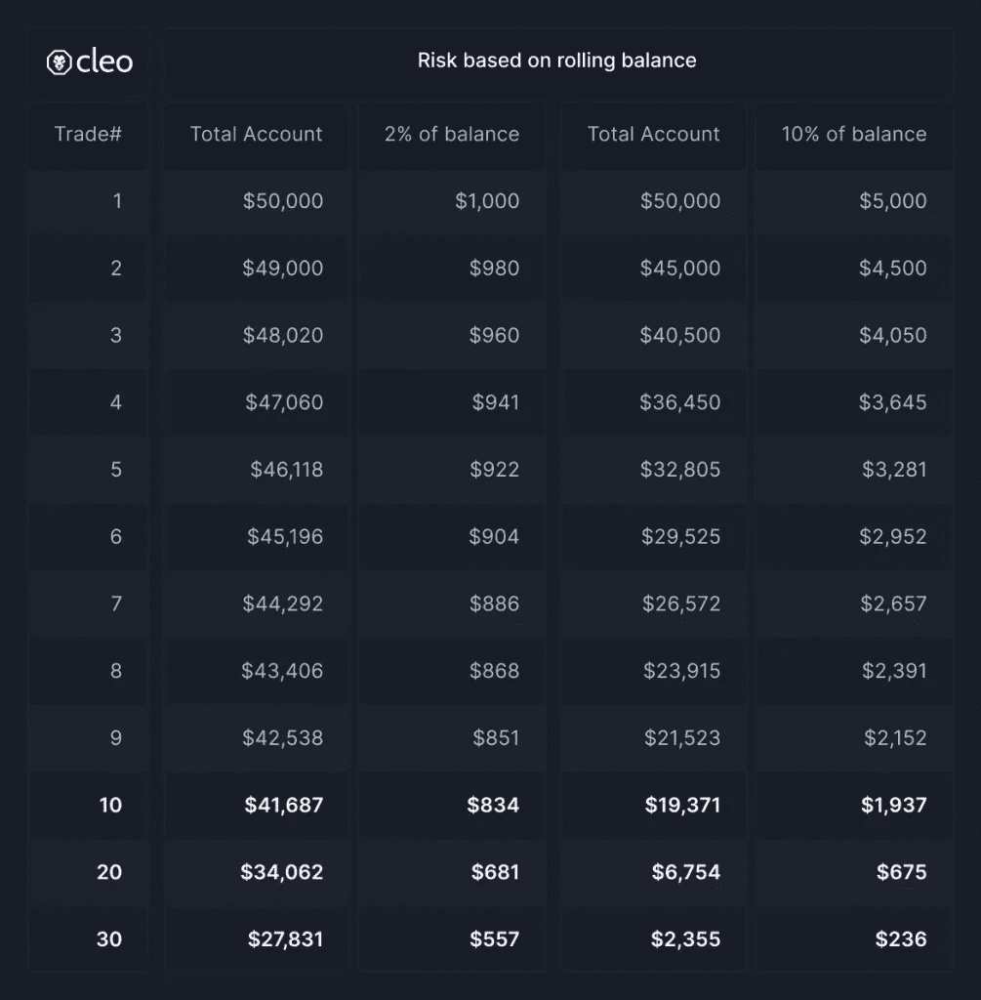
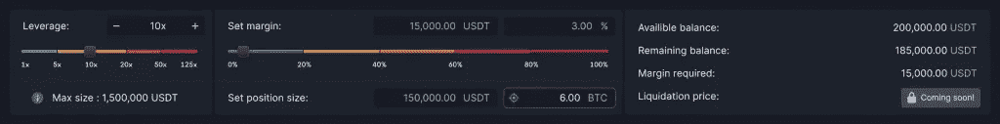
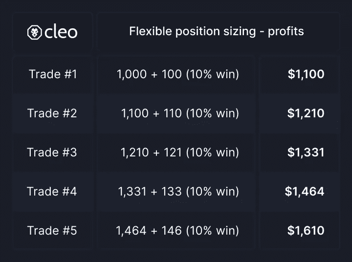
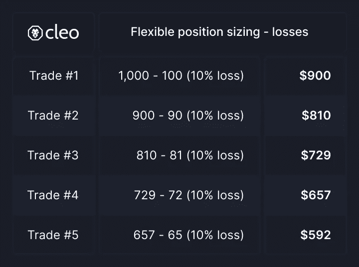
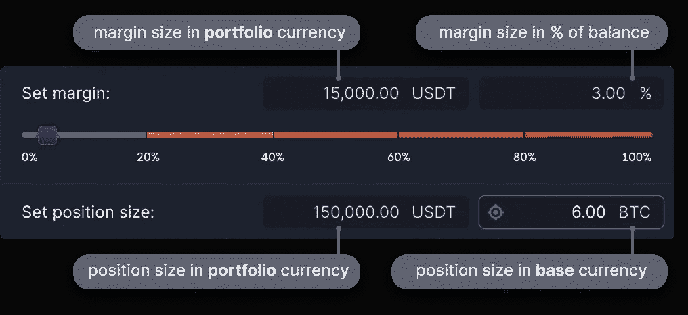
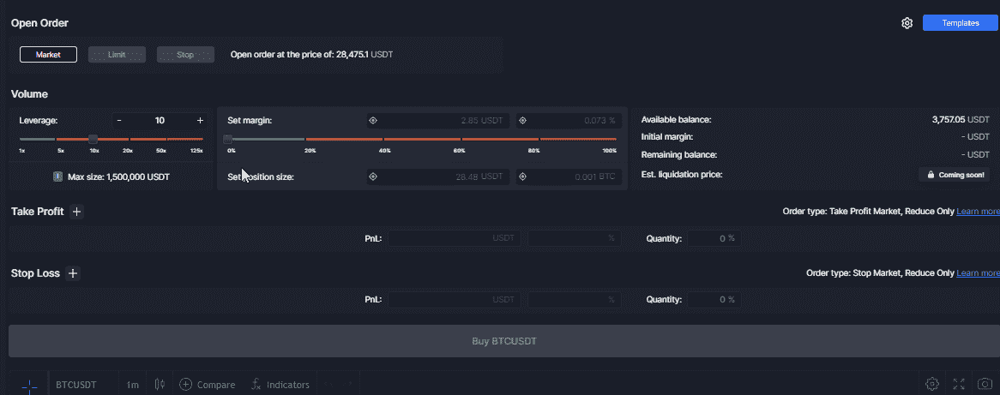

# 风险管理#1:头寸规模| Cleo 交易指南

> 原文：<https://medium.com/coinmonks/risk-management-1-position-sizing-cleo-trading-guide-d5991a5f0f5f?source=collection_archive---------18----------------------->

许多新手交易者认为成功在于找到在正确的时间进出市场的交易系统。在许多情况下，他们忽略了一个被证明比时机更重要、更容易实现的方面:**风险管理**。

在本文中，我们将展示头寸规模对您的交易成功有多么重要，以及如何有效地设置头寸规模，如何根据风险计算头寸规模，如何确定正确的距离，最后揭示一种更快的方法来完成这一切。最终，你会知道该怎么做，才不会让自己再次遭受重大损失。

[自行止损在此涵盖。](https://blog.cleo.one/how-set-stop-loss-crypto/)

# 风险管理和头寸规模

头寸规模估算是**根据你在特定交易**中承担风险的金额 **来确定头寸的正确规模。在你这样做之前，你需要弄清楚交易的最大可接受风险是多少。这种风险通常用你愿意损失的余额的百分比来表示。为了确保你不会损失超过这个数额，交易者设置了止损单。止损不应该被随意挪用。其实才是你职位真正的最大化曝光。**

假设你的投资组合是 10，000 美元，交易止损 5%。这个职位对你不利，你损失了 500 美元。在没有止损的情况下，你可能会损失更多，甚至你的整个投资组合。

没有太多回旋余地的严格止损可以通过正常的市场运动来平仓，你可能会错过一个可能有利可图的交易。如果止损太大，可能需要进入一个很小的位置，这样潜在的利润可能太微不足道了。一个[跟踪止损](https://blog.cleo.one/post/trailing-stop-loss-and-trailing-take-profit-how-to-maximize-every-trade-on-any-crypto-exchange)可能也是一个不错的选择，你只需要明白如何用好它。

## 为什么职位规模如此重要？

头寸规模对于交易者来说是一个非常重要的因素，不能匆忙决定。在下面的表格中，我们看到了每笔交易中拿余额的 2%和 10%冒险的区别。在连续 8 次亏损交易后，我们的投资组合只剩下不到一半，这使得我们在每次遇到新的亏损时实现盈利变得更加困难。

有许多不同的方法来设定适合你的仓位大小，许多优秀的交易者根据他们的策略产生的信号的感知强度有不同的风险敞口，所以每笔交易都有不同的敞口不是不可能的。

根据经验，每个头寸的风险占投资组合余额的 1 %- 3%。这样，任何单个的损失都不会抹去你的账户，也不会击垮你的精神。而且更重要的是，即使是一连串的亏损，也会给你留下足够的弹药来挽回损失。

# 如何看待职位规模

这些方法迎合所有的交易者和平衡大小。

## 固定位置尺寸

第一种方法是使用固定的仓位大小。这可能对账户余额大的交易者有用，他们不希望使用账户余额的百分比，因为即使很小的百分比也是一笔大数目。

例如，如果你总是拿 100 美元冒险，你的亏损不会增加，但你的盈利也不会增加。当试图确定你的交易策略是否有优势时(在回溯测试中),推荐使用这种方法，因为复合盈利/亏损会扭曲策略的潜在功效。

建议在使用固定仓位调整时，定期回来检查策略的执行情况，并调整仓位大小。

[Cleo.finance](https://cleo.finance/) 允许您使用基础货币和报价货币进行固定头寸调整，并设置初始保证金，这增强了您的灵活性。

## 灵活的位置尺寸

另一种调整头寸的方法是使用当前余额的**百分比。如果你的交易进展顺利，这将让你受益于复利，如果不顺利，这将减缓你的损失。**

## *灵活的位置调整—赢复合*

在每笔交易中使用一定比例的交易账户有复利的好处。假设你没有拿走任何资金，每笔交易的利润会增加你的总余额。给你更大的收益。花期也是真的。使用百分比意味着你的损失更少。举个简单的例子，假设你的余额是 1000 美元。你全额交易，100%交易，连续每笔交易你都赢了 10%。你的余额如下。

你第五次交易的期末余额是 1610 美元。而不是一些人可能期望的每赢 1000 美元的 10%，这将为你带来 1500 美元。通过增加仓位，你获得了额外的 110 美元。

## 灵活的位置调整—损失变得更小

在损失方面，让我们看看同样的例子是如何进行的。

你的余额最后是 592 美元。如果你预计每笔交易会亏损 10%，那么你的期末余额应该是 500 美元。因此，使用动态百分比方法来确定头寸规模有利于资本保全。

# 计算职位大小

就像市场不在乎你的感受，也不在乎你有多努力想赢或者愿意输。大多数散户会看图表，看看止损点在哪里(通常在支撑线或阻力线后面，或者基于一些波动指标，如 ATR)。然后记住你的账户风险规则——假设你想在一个头寸上冒险 2%的余额。如果你想让你的止损只损失你余额的 2%，仓位大小应该是多少？

我们要通过一个例子来说明。要做到这一点，你需要知道:

*   **交易账户规模**
*   **交易账户风险**
*   **失效**(止损点以离开盘价距离的形式)

这将给出您的头寸规模:

**头寸规模=交易账户规模 x 交易账户风险/失效**

## 计算仓位大小—示例:

这是为数学头脑，如果不感兴趣跳过这一大块。

我们有一个 10，000 美元的交易账户，如果我们认为价格下跌 4%是无效的，我们就会平仓。我们愿意用我们交易账户的 1%来冒险做这笔交易。

头寸规模公式为我们提供了:

职位大小= 10，000 x 0.01/0.04 = 2，500

我们的头寸规模为 2500 美元，止损为市场价格变动的 4%。这样，如果我们的止损被触发，我们的风险最高为 1%或 100 美元。

比方说，我们希望有一个更宽松的止损 8%，而不是 4%。在这种情况下，公式将采用以下形式:
职位大小= 10，000 x 0.01/0.08 = 1，250

止损点的距离增加一倍(从 4%到 8%)，我们的仓位减少一半，以保持同样的损失。

# 如何在 cleo.finance 中设置头寸规模

头寸规模是使用 Cleo 交易平台的资产管理部分中的交易量部分设置的。该部分允许以 4 种不同的方式设置仓位大小:

## 1.使用投资组合货币设定头寸规模

无论你在这里用多少，都是组合货币，也就是 USDT。上面的例子使用的是 BTC/USDT 加密对。USDT 这里是报价，但也是投资组合货币，所以你在 USDT 设置头寸规模。如果您输入 1000 USDT，这是它每次建仓时使用的金额，无论资产或其当前价格如何。

## 2.使用基础货币设置头寸规模

在这种情况下，您可以指定您希望用于头寸规模的基础货币金额。在上面的例子中，它使用的是 BTC/USDT 加密对。因此，它将使用 BTC 进行定位。如果你输入 1 BTC，它将总是打开一个 1 BTC 的位置，无论 USDT 当前的 BTC 价格是多少。

## 3.设置组合货币的保证金规模

当你第一次开始交易时，你会有一个初始余额。不管你的余额如何变化，假设你有足够的资金，你的头寸规模将是你初始余额的一个百分比。例如，您的初始余额为 1000 美元，您的余额翻倍至 2000 美元。如果您使用 10%的交易规模，它将使用初始余额 1000 美元创建头寸，而不是您的余额 2000 美元。因此，你的仓位大小是 100 美元。

## 4.将保证金大小设置为余额的%

这是您需要的唯一灵活的位置设置尺寸。如果您以这种方式选择头寸大小，它将始终打开一个头寸，其大小等于您当前余额的选定百分比。例如，如果您有一个 1000 美元的账户，并将头寸规模设置为余额的 10%，那么您的头寸规模将为 100 美元。

## 如何正确设置位置大小—例如

首先，我们选择想要使用的杠杆。接下来，我们添加一个新的止损，并输入止损的距离或市场价格。使用名为“目标”的功能，我们可以设置 4 个止损值中的哪一个。如果我们编辑其他设置，如杠杆或头寸规模，该值将保持不变。默认情况下，平台锚定您输入的第一个字段，但是您可以随时更改它。

基于我们上面计算的例子，我们将通过锚定市场价格距离%来设置止损。现在我们需要观察 PnL 值，因为我们移动头寸大小以适应我们的风险偏好(在下面的 gif 中是 5%)。

在了解所有相关变量的同时，我们可以非常容易地控制我们的风险敞口。我们甚至可以添加多个止损单，这可以帮助我们限制风险敞口，例如在定罪较低的交易中。

# 结论

调查你的头寸规模，包括你在哪里设置止损，对于理解你能在交易游戏中坚持多久是必要的。这也与你的[交易策略密切相关。](https://blog.cleo.one/btc-trading-strategy-in-times-of-uncertainty/)

您可以按%将位置大小设置为动态或固定。学会计算与止损相关的仓位大小，将创造一个更系统的交易方法，保护你的资金。你选择什么方法取决于你交易的资产和你的风险承受能力。回溯测试是寻找最优方案的一个很好的起点。

有了 [cleo.finance 的](https://cleo.finance)交易平台，你可以更放心地完全了解自己的风险敞口，并完全控制头寸规模。没有神奇的公式，但是一旦你理解了原则，就很容易有效地实施它们。

*(文章原载*[*blog . Cleo . finance*](https://blog.cleo.finance/risk-management-1-position-sizing/)*)*