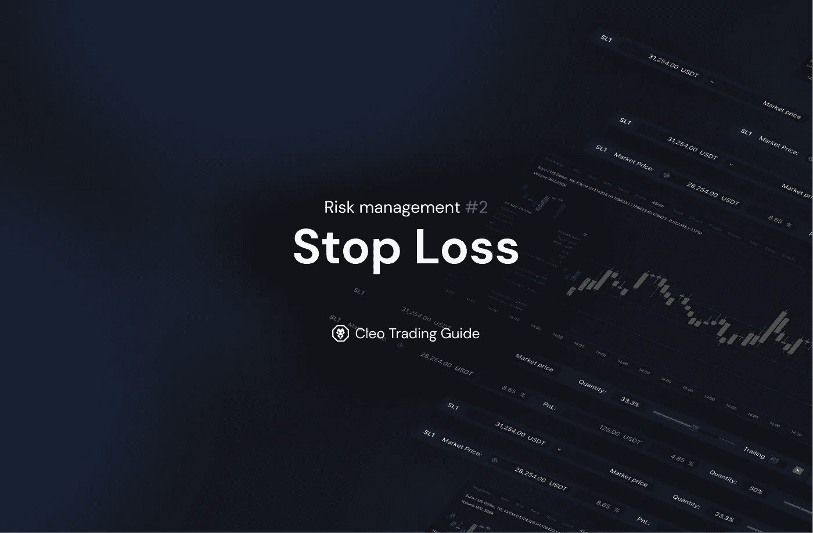
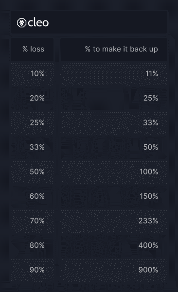
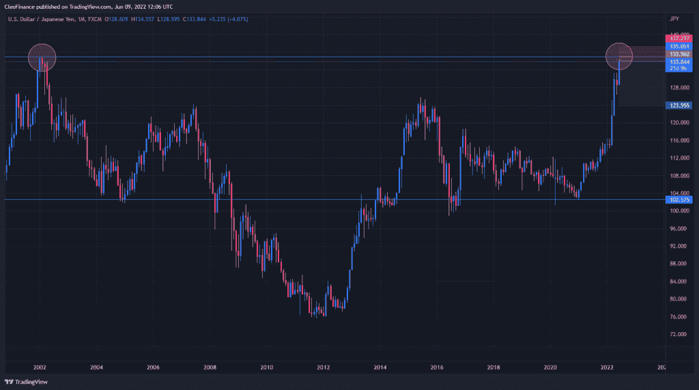
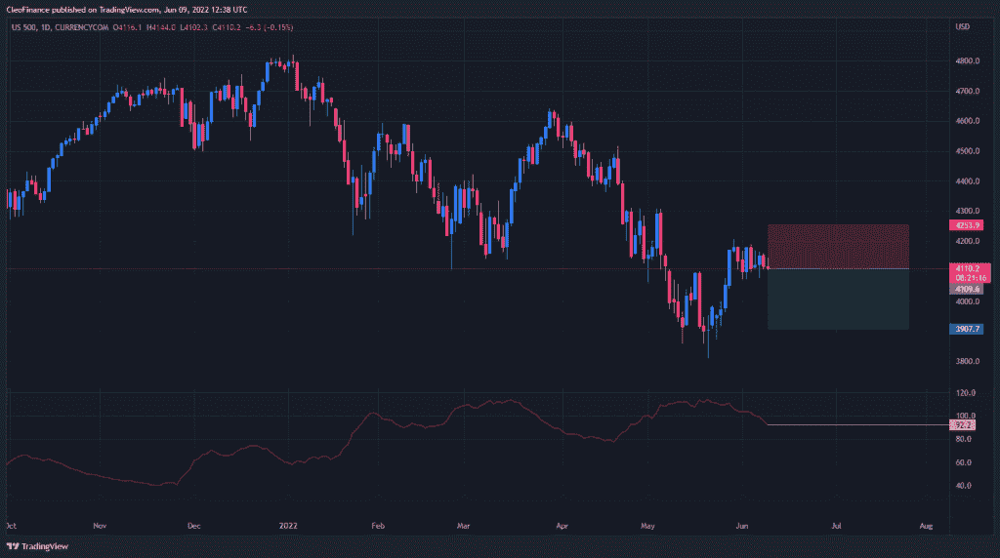
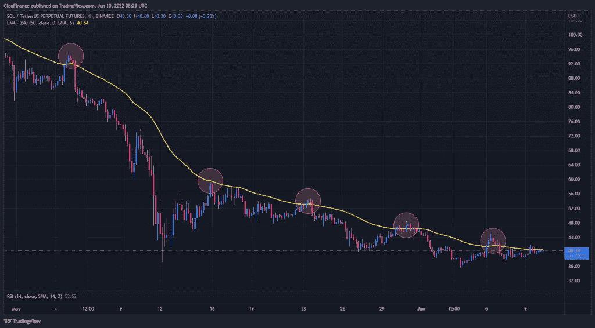
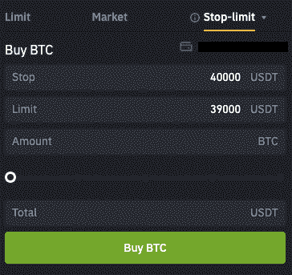

# 风险管理#2:如何设置止损| Cleo 交易指南

> 原文：<https://medium.com/coinmonks/risk-management-2-how-to-set-a-stop-loss-cleo-trading-guide-a9c2028f2d43?source=collection_archive---------34----------------------->

“设置止损！”可能是新交易者得到的重复最多的建议，然后又忽略了。只要在谷歌上搜索“加密货币交易清算”，你就会看到几乎每天都有文章引用 1 亿美元或更多的清算(或在这里查看数据)。这是一个明确的证据，表明这个市场的交易者还没有采取适当的风险管理措施。

Cleo Trading Guide: Risk Management article #2: How to set a Stop Loss

在追求长期盈利的过程中，你需要主动保护你的资金。从你所冒的风险，而不是你会得到什么的角度来建仓，这就是“成功”的交易者和其他交易者的区别**。**

在第二次安装的 Cleo 交易指南中，我们将重点介绍风险管理，我们将重复为什么需要止损，存在哪些类型的止损，以及如何在您的交易系统中正确考虑止损。

# 为什么止损这么重要？

每次你进入一个行业，你就把自己暴露在损失资本的风险中。如果你不使用止损单，你的整个投资组合在每次交易时都会亏损。就这么简单。

**止损**，因此**定义了你为特定交易机会所承担的风险**。了解这种风险会让你建立正确规模的头寸(更多关于[头寸规模的信息，请点击](https://blog.cleo.finance/risk-management-1-position-sizing/))。通过正确地做这两件事，你几乎肯定能在市场上生存下来。不错吧。

没有止损的交易是缺乏交易系统或策略的证明。这让你很容易被自己的情绪和错误所迷惑，比如增加损失头寸或激进的报复交易。交易心理学大师马克·道格拉斯讲述了交易的基本原理，并不断重复下面的话:“任何事情都可能发生。”如果你真的认真看待这个观点，你就不会梦想在没有止损的情况下建仓。市场情绪每小时都在变化，20%蜡烛线越来越频繁。不要成为虚假安全感的牺牲品，失去你的账户。

即使你没有利用杠杆交易，当其他资产充满机会时，持有水下头寸的机会成本也是令人痛苦的。

交易中不舒服但必要的部分是接受，有亏损的头寸是好的。按照计划平仓很好——让你退出交易，为下一次交易做好准备。如果你不愿意接受亏损，而是坚持交易，交易就不适合你。了解你的损失是如何累积的，以及你要赚多少钱才能拿回你的账户，这非常发人深省:

What % gains does it take to get back to break-even

一天结束时，人们开始通过以下两种方式学习止损:

1.  甚至在他们开始交易和拿辛苦赚来的钱冒险之前
2.  在他们失去账户后。然后又丢了。再一次。然后他们退出，或者如果他们足够幸运，仍然有一些资本，并开始交易止损

你是哪一个？

# 理想的止损距离开盘价是多少？

你止损的距离将取决于你的交易策略和市场。如果你交易的是一个日波动率为 20%的小 altcoin，止损在开盘价 2%以内可能会很快平仓。而像欧元兑美元这样的“稳定”外汇对可以用相同的止损交易几天。

关于交易，你只需要知道三件事，就能决定你是否盈利。就是**胜率，风险/回报比，和交易费用。**如果你赢了你下单的每一笔交易(50%)，但赢的是输的两倍，你就成功了。

有两种主要方式来思考止损是如何进入这个等式的:

1.  严格止损——接近开仓的位置

这很可能导致更少的盈利头寸=更低的盈利率，因此风险/回报比率必须是有利的，交易费用必须合理(我认为这是所有交易的共同主题)。

1.  宽松的止损——远离开仓的位置

宽松的止损会导致更高胜率的概率更大，所以风险/回报比不一定要高得离谱。

找到你的完美止损位置不是一件容易的事情，但是有一些工具你可以依靠。

# 如何确定在哪里设置止损

一些策略有一个基于指标或市场条件的封闭规则:“当 RSI 达到 75 时，我会卖出。”还有一些是基于与开盘价的距离:“如果市价下跌 10%，我就卖出。”

最受欢迎的选项包括:

1.  基于支撑位或阻力位的价格失效
2.  波动性指标，如平均真实范围(ATR)
3.  趋势指标
4.  固定 PnL 止损
5.  基于市场价格距离的跟踪止损

我们将更详细地看一下它们。

# 1.使用支撑位和阻力位止损

用这种方法，你已经确定了一个区域，在这个区域内，过去发生了一次强烈的价格波动，你预计价格会在这个价格水平上下波动。在 Investopedia 上阅读更多关于 S/R 行的信息。

例如，美元兑日元目前正面临 20 年阻力的考验。如果我们的交易策略在这个时候产生了做空(卖出)信号，我们可能会想利用这个 20 年的强阻力区，并在其上设置止损。

The monthly chart of USD/JPY, Source: TradingView

我们将止损点设在当前市场价格的 2.5%以上，这意味着价格必须突破阻力 200 点以上。由于我们的目标是 7.5%的收益，我们有一个舒适的 3:1 风险/回报比。(这只是一个假设的场景)

# 2.基于 ATR 或其他波动指标的止损

ATR 是外汇交易人群中流行的止损指标。它向我们展示了基于最近 14 根(默认值)棒线数据的平均波动率。使用它背后的想法很简单:我最好把止损放在正常波动区之外，以避免被正常/平均/预期的市场波动止损。

市场情绪在这一点上相当消极，所以假设我们想做空(卖出)S&P 指数。每天的 ATR 值为 92.2，这意味着在过去两周的平均一天中，该资产的 1 日波动为 92.2 点。因为我们想确保我们的 SL 在正常的市场波动中不受影响，所以我们选择这个值乘以 1.5，这就是我们的保护点。

The daily chart of S&P500, Source: TradingView

您还可以使用哪些其他指标？一般来说，包络线指标，如布林线、凯特纳线或唐奇安通道，可以提供评估止损水平的价值。

# 4.根据趋势止损

交易者有很多方法来识别趋势和它的强度。如果需要的话，我们可以在另一篇文章中讨论这些方法，但是使用技术分析的最简单的方法是通过移动平均线(MAs)。无论你是在看均线的**斜率**，它与**价格**(在均线之上或之下的**)，价格，还是另一条不同设置的均线(快速和慢速均线交叉组合)——所有这些选项都可以帮助你确定趋势方向。**

让我们看看索拉纳的图表。随着整个市场的暴跌，索拉纳也不例外。正如你所看到的，周期 50 的指数移动平均线(EMA)多次充当阻力。它的斜率告诉我们，现在下跌趋势正在降温，甚至这条线的再测试也越来越厉害。但是如果我们想在重新测试后用这个均线(50)止损，我们会做得很好。

The 4-hour chart of SOL/USDT, Source: TradingView

# 5.固定 PnL 止损

这通常不是一个非常有效的止损方式，因为市场并不关心你愿意损失你账户的多少%。例如，如果你总是以同样的规模建仓，并使用同样的止损，比如说 2%，它将被置于价格水平上，而不考虑之前的市场运动、波动或任何其他因素，只考虑你的余额。这会导致你被大量止损，即使潜在的信号可能是好的。

知道你每次交易的最大可接受损失是非常重要的。然而，你应该结合使用上述方法来确定你的仓位大小。在风险管理系列的第一篇文章中会有更多的介绍。

# 6.跟踪止损

这种设置止损的动态方式是跟随价格的。如果你设置了 5%的跟踪止损，价格持续上涨，止损随着价格上涨。在趋势市场中，或者当资产进入价格发现阶段，而交易者不知道价格水平时，它会很有用。

[这个关于跟踪止损如何运作的详细解释](https://blog.cleo.one/trailing-stop-loss-and-trailing-take-profit-how-to-maximize-every-trade-on-any-crypto-exchange/)会让你快速上手。

没有多少交易所提供这一选项，这是我们在未来几周内将添加到 [cleo.finance](https://cleo.finance/) 交易平台的内容。

# 止损单的类型:市场与限制

一旦你开始设置止损，你的交易所或经纪人通常会给你两个选择:限价止损和市价单止损。差异并不大，但在特定情况下，它们可能会产生巨大的影响。理解它们并决定什么适合你是很重要的:

1.  **限价单**:设定一个特定的价格，只能在该价格下执行。

这个止损只有在那个价格有买家的情况下才能抵消。价格也可以达到这个水平，但如果有更多的人试图出售，它可能不会触发你。
限价订单的成本往往低于市价订单，因为[它们被视为“做市”](https://leapfrogs.navy/how-to-lower-your-binance-trading-fees/)

1.  **市价单**:设置为达到某一价格时触发，尽管实际执行价格可能有所不同。

主要的区别是，当你的资产达到你设定的止损价格时，就会发出基于市场的订单，你会 100%地摆脱你的头寸，即使这意味着滑点。

滑动主要在三种情况下成为一个大问题:

1.  市场趋势强劲
2.  市场缺乏流动性
3.  对于订单簿的当前深度，您的位置太大

如果你正在交易一些新的替代硬币，或者价格正在无情地下跌，在你设置止损的价格点可能没有买家。大仓位可能以这种方式在执行中“吃掉订单”，特别是在流动性差的趋势替代币中。对于大多数零售商来说，这些额外的成本通常是可以承受的，因为他们确信订单会被执行。

限价单没有这些问题。限价单只有在你的价格被满足时才会被执行。然而，如果在这个价格上对你的资产没有或没有足够的需求，你将不能完全平仓。

你用什么取决于你，价格有多大可能花时间在你的止损水平上。

# 停止限价单

限价单甚至可以有更多的细分类别:止损限价单。这些是使用两种价格的有条件订单:止损价和限价。当止损价格达到限价时，订单将被提交到交易所。例如，我想购买比特币，但只有在它试图突破 40，000 美元后，我相信如果有人拒绝，它会下跌一点。因此，我将止损单设置为 40，000 美元，限价单设置为 39，000 美元，以利用可能的拒绝:

它也可以用于销售。如果我害怕亏损，我可以在允许的价格下设置止损和限价。

# 如何执行你的止损

# 1.用手

你有时会看到交易者这样做，观察价格，当价格达到一定水平时手动点击。如果你是一个日内交易者，花时间观察你有未平仓头寸的所有交易对，并且不隔夜离开未平仓头寸，这没问题。

然而，当事情开始剧烈变动时，尤其是在加密市场，你往往没有时间做出反应，你的止损可能会变成比计划更大的损失。

# 2.自动止损

这是实现这些安全性的更常规的方式。再次重复道格拉斯的话，如果你真的相信市场上任何事情都可能发生，你就没有理由不设置止损。

交易所提供的服务各不相同。例如，币安有几种不同类型的止损，但你不能把它设置为跟踪止损。来自长期市场的经验丰富的交易者通常使用一个平台，通过这个平台，他们可以在不同的交易所和经纪商进行交易。

在 [cleo.finance](https://cleo.finance/) 中，您可以同时设置多个止盈单和止损单，根据指标或价格变动平仓，并灵活设置仓位大小。如果你交易多种资产，并且有几个设置，使用专业的交易平台可以大大提高你的效率，从而提高你的盈利能力。

不管怎样，我坚信自动止损是正确的选择。不是因为你期待发生什么，而是因为所有你想象不到的情景。

# 如何设置止损:结论

使用止损的问题不在于你的偏好，而在于你对市场不可预测性的接受程度。任何新交易者都需要做出一些选择，比如使用哪种订单类型，止损基于什么，以及如何执行。无论他们认为什么是最好的，止损的使用将确保他们在市场上的寿命。

如果你想实施本文中提到的任何方法，请访问 [cleo.finance](http://www.cleo.one/) 。

> 加入 Coinmonks [电报频道](https://t.me/coincodecap)和 [Youtube 频道](https://www.youtube.com/c/coinmonks/videos)了解加密交易和投资

# 另外，阅读

*   [币安 vs FTX](https://coincodecap.com/binance-vs-ftx) | [最佳(SOL)索拉纳钱包](https://coincodecap.com/solana-wallets)
*   [比诺莫评论](https://coincodecap.com/binomo-review) | [斯多葛派 vs 3Commas vs TradeSanta](https://coincodecap.com/stoic-vs-3commas-vs-tradesanta)
*   [Capital.com 评论](https://coincodecap.com/capital-com-review) | [香港的加密借贷平台](https://coincodecap.com/crypto-lending-hong-kong)
*   [如何在 Uniswap 上交换加密？](https://coincodecap.com/swap-crypto-on-uniswap) | [A-Ads 评论](https://coincodecap.com/a-ads-review)
*   [WazirX vs CoinDCX vs bit bns](/coinmonks/wazirx-vs-coindcx-vs-bitbns-149f4f19a2f1)|[block fi vs coin loan vs Nexo](/coinmonks/blockfi-vs-coinloan-vs-nexo-cb624635230d)