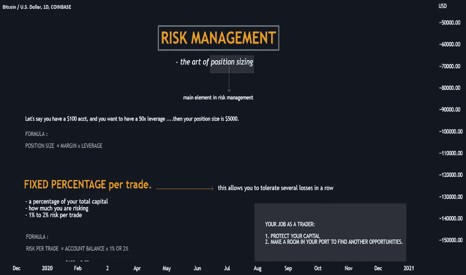

# ❗❗冒险 MANAGEMENT❗❗

> 原文：<https://medium.com/coinmonks/risk-management-614ec3caad54?source=collection_archive---------52----------------------->

# 你可能听说过统计数据，90%的交易者在前 3 个月失去了他们的存款。有时候是零花钱，有时候是工资，有时候是毕生积蓄。

# 有一次，我在一个交易者群里看到一条消息，来自一个沮丧的 55 岁男子，他在一家超市做保安，仅仅一个月就因为交易密码而失去了他过去 20 年的所有积蓄。有很多这样的故事，我向你保证，其中大多数是由于缺乏风险管理而发生的。

# **什么是风险管理？**
风险管理是规则的集合，防止你在一天或一周内损失相当一部分存款。

# 没有规则的地方，就有混乱；有规则的地方就有秩序。

# 当一个交易者没有规则时，他只是在赌博。大多数新手都会遇到这种情况——他们听说有一些很酷的硬币值得购买，一个月后他们就会开着兰博，搬到 Côte 蔚蓝海岸的豪宅里。这样的新人一开始可能确实很幸运，他会用他的成功吸引其他几十个持有者，但是这样的策略有一个问题:**数学**

# 从来没有 100%的保证任何资产都会增长；总有失败的可能。

# 给你一个问题:如果有 10%的机会输，值得拿你的全部存款去冒险，让它翻倍，而有 90%的机会吗？在真空中，是的，但是让我们想象同样的机会再次发生。你愿意冒这个险吗？下一个呢？
这就是我们如何来到几乎所有初学者都踩的耙子。即使赔钱的几率微乎其微，一遍又一遍的重复这种情况，你也会有一次 100%失败。去 Reddit WallStreet Bets，你可以很容易地找到几十个故事，讲述那些一开始只有 2 万美元时很幸运的人，然后他们在一天内失去了他们获得的一切(有时是几百万美元)。
即使是最聪明的人也会被一笔巨款冲昏头脑，如果没有严格的规则，这样的人在交易中会 100%失去存款。

# 风险管理有助于减少损失。它还可以帮助保护交易者的账户，防止他们损失所有的钱。当交易者遭受损失时，风险就出现了。如果风险能够得到控制，交易者就可以放开手脚在市场上赚钱。

# 这是成功的活跃交易的一个重要但经常被忽视的先决条件。毕竟，如果没有适当的风险管理策略，一个获得丰厚利润的交易者可能会在一两次糟糕的交易中失去所有利润。那么你如何开发最好的技术来抑制市场的风险呢？

# **交易者损失保证金后会发生什么？**
在这种情况下，交易者会经历“ *7 个接受死亡的阶段*”。让我们以乔(化名)为例。

# 一个月前，乔对加密产生了兴趣，当时他的哥哥在一次家庭晚宴上告诉他，他设法用比特币的利润为自己买了一辆新车。他告诉乔如何注册交易所，并帮他存入了第一笔 1000 美元的存款。
一个月后，乔知道了如何在币安开仓，并从 TradingView 学会了如何使用自由交易理念。在他们的帮助下，他在游戏中买了一枚硬币，在第一周就成功翻倍。他相信自己，决定大玩一把，把家里的 10000 美元积蓄都倒进了自己的账户，当然，这是瞒着妻子的。

# **1–2。震惊和否认。**
乔早上起床，像往常一样，早上第一件事就是拿出手机查看他在币安的投资组合。原来他的主要资产 Luna 一夜之间从 80 美元跌到了 5 美元。他损失了一半的存款，但认为这没什么大不了的，这是平仓的好机会。他很快决定向亲戚借钱，并承诺在一周内还清。毕竟，如果价格回升，他将成为百万富翁。

# **3–4。失望和沮丧。乔整天盯着屏幕看价格，但价格并没有上涨。此外，它大幅下跌，交易价格已经达到 1 美元一股。傍晚时分，面纱终于从他的眼前落下，他开始明白现实的情况:
——他和他的朋友们一生的积蓄都没了。
——破坏了亲人的信任。
——女方得知资金损失后几乎肯定会离婚。
——多年的工作付之东流。在真实事实的重压下，他忍不住哭了，尽管他已经多年没有这样做了。一个女人带着他的孩子离开了他。他的父母和朋友都不再和他联系。他孤身一人，没有任何支持，背上巨额债务。**

# **5–7。实验，解决，接受。**
几周，也许几个月，过去了。乔习惯了他的新生活。他犯了一个错误，并为此付出了代价，而且在未来的几年里，他都将为此付出代价。他意识到他别无选择，所以他只能接受现实。他现在能做的就是从错误中吸取教训，以后不再犯。

# 正确的风险管理是什么样子的:
十年后，乔还清了所有的债务，也变得聪明多了，他决定在再次交易前接受专业的交易培训就是证明。在那里，他学会了什么是风险管理，并制定了他的计划:
-每笔交易的风险是 1%。你要连续误判 100 次交易情况才能赔掉你的保证金，这几乎是不可能的。
——风险与利润的最低比率是 1:3。这意味着每次他是正确的，他就赚了 3%的保证金，这足够他在三分之一的情况下是正确的，达到盈亏平衡。
-你不能在一天内损失超过 3%。它迫使你更负责任地选择交易，消除了因情绪化而亏损的可能性。你不能在一周内损失超过 9%。如果市场连续几天没有按照你的方式发展，那么问题就出在你和你的适应能力上。最好休息一下，然后带着新鲜的观点回来。

# 用这种方法，乔负责任地交易，有效地从错误中学习。几个月后，他成为了一名盈利的交易者，并庆祝他的第一次胜利。随后，他将成为一名成功的交易者，并在某一天将风险管理的奇迹传授给其他人😉

> 加入 Coinmonks [电报频道](https://t.me/coincodecap)和 [Youtube 频道](https://www.youtube.com/c/coinmonks/videos)了解加密交易和投资

# 另外，阅读

*   [3 商业评论](/coinmonks/3commas-review-an-excellent-crypto-trading-bot-2020-1313a58bec92) | [Pionex 评论](https://coincodecap.com/pionex-review-exchange-with-crypto-trading-bot) | [Coinrule 评论](/coinmonks/coinrule-review-2021-a-beginner-friendly-crypto-trading-bot-daf0504848ba)
*   [莱杰 vs Ngrave](/coinmonks/ledger-vs-ngrave-zero-7e40f0c1d694) | [莱杰 nano s vs x](/coinmonks/ledger-nano-s-vs-x-battery-hardware-price-storage-59a6663fe3b0) | [币安评论](/coinmonks/binance-review-ee10d3bf3b6e)
*   [加密交易机器人](/coinmonks/crypto-trading-bot-c2ffce8acb2a) | [Bingbon 评论](https://coincodecap.com/bingbon-review)
*   [Bybit 交易所评论](/coinmonks/bybit-exchange-review-dbd570019b71) | [Bityard 评论](https://coincodecap.com/bityard-reivew) | [Jet-Bot 评论](https://coincodecap.com/jet-bot-review)
*   [3 commas vs crypto hopper](/coinmonks/3commas-vs-pionex-vs-cryptohopper-best-crypto-bot-6a98d2baa203)|[赚取加密利息](/coinmonks/earn-crypto-interest-b10b810fdda3)