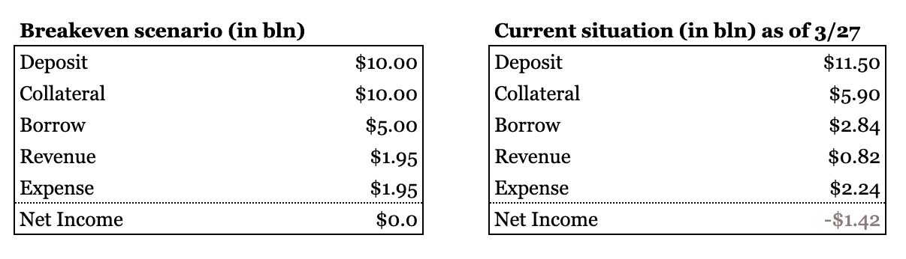
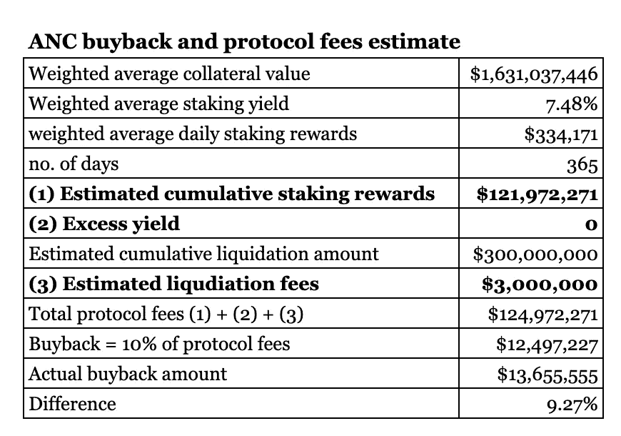
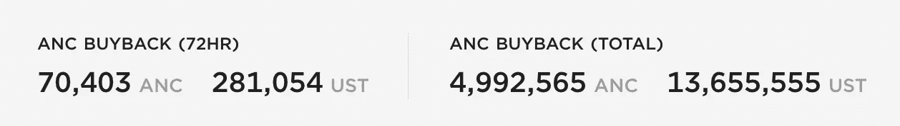
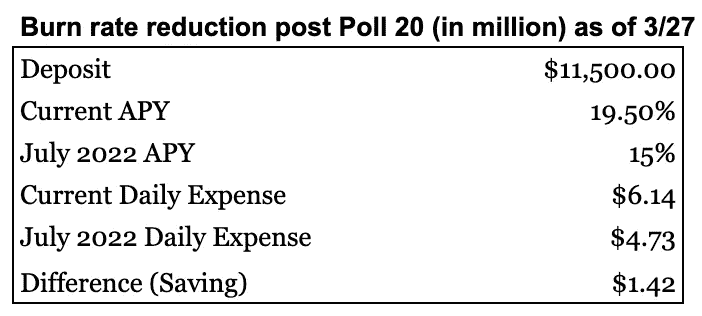
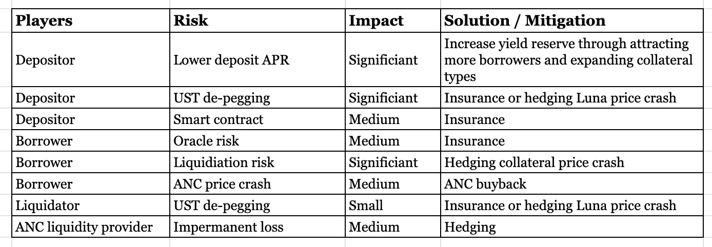

# 锚协议的风险-缓解和潜在的解决方案

> 原文：<https://medium.com/coinmonks/risks-of-anchor-protocol-mitigation-and-potential-solutions-5e07af9cd16?source=collection_archive---------8----------------------->

# 锚协议风险和缓解

1.  系统中所有玩家的 UST·德佩格风险。缓解措施:a .建立比特币储备，b .购买保险，c .对冲 Luna 价格暴跌。
2.  降低存款人的存款年利率。缓解措施:a .治理投票降低存款利率，b .吸引更多借款人，c .扩大抵押品选择。
3.  智能合约风险。缓解:买保险。
4.  甲骨文风险。缓解:买保险。
5.  借款人的清算风险。缓解:对冲抵押品价格下跌。
6.  ANC 价格风险。缓解措施:a .对冲，b .回购。
7.  ANC 流动性提供者的非永久性损失。缓解:动态对冲。

# 理想世界

首先，让我们想象一个借款需求赶上存款需求的理想世界。我们在下面提供了一个收支平衡的场景来说明 Anchor 如何在这个理想的世界中可持续地运作。假设协议里还有 100 亿存款。借款需求赶上来，达到 50 亿美元。假设 LTV 比率保持在 0.5，即抵押品价值为 100 亿美元。使用 50%的利用率(借入/存放)，我们得出 23%的借入率(50% x 0.42 + 2%基本利率=23%)。如果我们假设抵押品的收益率为 8%，我们计算出 Anchor 每年从借款方产生 19.5 亿美元的收入(50 亿美元 x 23%+100 亿美元 x 8% = 19.5 亿美元)。在存款方面，APY 仍保持在 19.5%，Anchor 支付了 19.5 亿美元的费用，完全抵消了收入

source: [www.algotune.com](http://www.algotune.com)

*净收入=抵押品 x 赌注收益率+借款 x 借款利率(受 ANC 价格影响的借款需求)-存款 x 年利率*

现在的问题是我们有多大可能达到这个理想世界。截至本文撰写之时(2022 年 3 月 27 日)，借款价值仅为 28 亿美元，这意味着利用率仅为 0.25。当使用率较低时，借款利率也会较低，从而进一步加剧出血。Anchor 如何改善其净收入状况？基本上有三种方法来实现这一点，每种方法都面临着自己的挑战。

1。 **需要强大的 ANC 令牌价格**。借款人受到 ANC 代币的激励。ANC 价格越高，激励和分配 APY 越高。然而，这是棘手的部分。ANC 价格由市场供求决定。正如我们之前所讨论的，ANC 令牌的总供应量将从目前的约 4 亿增加到未来 4 年的 10 亿。供过于求的局面将继续主导市场情绪，从而压制价格。Anchor 推出了一个回购计划来抵消供应，但迄今为止回购的总额一直很小(只有 1400 万美元的回购，而 ANC 的总市值接近 7 亿美元)。主播可以提高回购金额吗？要回答这个问题，我们需要了解回购资金的来源。基本上，它来自 10%的协议费，即 bAsset 赌注奖励、超额收益和抵押清算费的总和。巴塞特赌注回报与总抵押品和借款需求相关。超额收益是无法实现的，所以我们可以假设它现在是零。抵押品清算费用取决于抵押品总价值和市场条件(加密资产价格波动越大，抵押品清算的机会就越大)。下面我们提供一个简单的计算来估计总回购金额，这是非常接近实际数字。除非 Anchor 改变回购机制，否则不太可能提高回购金额。最近，我们看到 ANC 损失了超过一半的价值，低至 2.5 美元，这对借款人的激励产生了重大影响。自 3 月初以来，存款总额增加了 20 多亿美元，而贷款总额几乎没有变化。部分原因是 ANC 价格疲软。

在这里，我们看到了一个负反馈循环:(1)较低的 ANC 价格-> (2)较低的借款人激励-> (3)借款需求减少，抵押品减少-> (4)较低的借款利率-> (5)借款人收入减少，赌注收入减少-> (6)更快的收益率储备枯竭->(7)19.5%的存款 APY 不可持续。

source: algotune.com

source: [https://app.anchorprotocol.com/](https://app.anchorprotocol.com/)

2。 **需要更高的压桩产量。**其他流动性赌注衍生品需要加入进来，以吸引更多借款人进入生态系统，并有可能通过不同的代币产生更高的赌注收益率。问题是其他赌注衍生品的流动性可能不如 Luna 或 ETH，因此限制了要过账的抵押品的价值。后以太坊 2.0，以太赌注收益率可能会翻倍，这意味着锚更多的收入。目前，总抵押品的 ETH %仍低于 20%，因此 Anchor 需要吸引更多的 ETH 所有者加入生态系统。

2022 年 3 月 20 日，sAVAX(雪崩生态系统中的赌注令牌，赌注收益率约为 9.5%)被列入白名单，作为第三抵押品，以进一步拓宽借款人的选择。如果 sAVAX 担保品的规模能够增长，将有助于降低协议的燃烧率。截至今天，Anchor 已经吸引了 1000 万美元的协议抵押品，而 AVAX 的总赌注为 2.2 亿美元。

3。 **存款利率需要下调。**将需要治理投票。ANC 代币的所有者大多是接受 ANC 作为激励的借款人。这些借款人也是储户，他们不太可能投票选择更低的 APY 存款利率。[民意测验 18](https://app.anchorprotocol.com/poll/18) 就是这样一个降低存款利率的努力，但却被大部分人否决了。

(当我写这篇文章的时候，一个新的提议[投票 20](https://app.anchorprotocol.com/poll/20) 被通过来实现一个半动态的收入比率。基本上在新规则下，如果收益率准备金每月继续下降超过 1.5%，从 2022 年 5 月开始，存款利率每月最多下降 1.5%。最低存款利率设定为 15%(最低收益率可通过治理提案进行调整)，可能会在 2022 年 7 月达到。新规则将有助于在 2022 年 7 月后使用最近的 115 亿美元存款价值将每日燃烧率降低 140 万美元。)

source: algotune.com

# 借款人和 Oracle 风险

在我们之前的[帖子](/algotune/20-yield-3dc46aa077d3#3b0b)中，我们简要讨论了神谕机制是如何在区块链大地上运作的。oracle 价格也反馈到 Anchor 协议，以便在清算发生时促进清算过程。oracle 价格可能被操纵或由于某些系统问题而不准确吗？甲骨文机制可以被攻击吗？让我们看看发生在 2021 年 12 月 9 日的甲骨文问题。当天，Anchor oracle price feeder 记录的 bLuna 价格比链外交易中报告的价格低了近 10%，这导致了本来不应该发生的 2700 万美元的 bLuna 清算。240 多名借款人受到影响，860 万美元得到偿还。Anchor 团队已经实施了一个修复程序，将 Anchor oracle price feeder 替换为直接从 Chainlink (bLuna/Luna)采购。

虽然这证明了协议的透明性和主播团队的及时响应，但也显示了 oracle 价格反馈机制的漏洞。Oracle 价格投票是 Terra 生态系统的重要组成部分。Oracle votes 并不优先于块中的其他事务，并且很容易受到 DDoS(分布式拒绝服务)攻击。在 2021 年 9 月 23 日，这样的攻击以 Terraform Labs 的完整节点为目标，导致网络拥塞。由于这次攻击，价格数据无法更新。幸运的是，它没有像周五发生的那样造成太多痛苦，Terraform 实验室团队迅速做出反应来解决这个问题。想象一下，如果这发生在最极端的抛售环境中，不准确的抵押品清算量可能会严重伤害借款人，链上 UST/卢纳互换可能无法运作，以依赖 1:1 的挂钩。

# 缓解和保险

有什么方法可以降低上述风险吗？实际上有各种保险产品可以用来保护存款人和借款人。Nexus mutual 涵盖小型合同黑客、甲骨文或治理攻击等事件。保护性购买者每年支付 2-3%来涵盖这些类型的协议风险，但 UST 脱钩不在其中。Unslashed(另一家保险公司)承保 UST 脱钩事件，但只有当 UST 交易低于 0.87，你每年支付 2-3%。Nexus mutual 和 T2 un slashed 都是分散式协议，购买保护的人应该在购买前先研究条款。

Terra 还推出了自己的保险产品，名为 Ozone，以覆盖诸如用户无法从 Anchor 协议中的 UST 储蓄账户中取款等风险事件。它于 2021 年 11 月被总部位于以太坊的 DeFi 风险管理市场 place Risk Harbor 收购。写这篇文章的时候，《臭氧》的 AUM 大约是[1000 万美元](https://ozone.riskharbor.com/)。

# 最后的想法

概括地说，我们提供了一个下表，从每个参与者的角度总结了风险和解决方案。

购买保险可能是减轻风险的一种方式，但它也使用户面临额外的保险协议风险。保险费是由供给和需求驱动的，当需求很高时，它很快成为一个非常昂贵的解决方案。如下表所示，储户和借款人面临的最大风险与 Luna 价格暴跌有关。为了帮助你在锚协议中投资/借款时睡得好，一个可行的方法(也是直接的方法)是通过期货或期权简单地对冲 Luna 的下跌价格风险。这就是我们在 AlgoTune 所做的——识别并降低风险。

Anchor protocol risks and mitigation summary

如果你喜欢关注我们的工作，欢迎在我们的邮件列表上注册[这里](http://www.algotune.com)或者在[推特](https://twitter.com/algo_tune)上关注我们。

# 参考

[1] Terra Crypto 风险评估【https://cryptorisks.substack.com/p/ust-december-2021?s=r 

[2]保险[https://danku-r . medium . com/thoughts-on-anchor-and-ust-peg-coverage-to-sleep-well-always-a 374751 CB 61 e](https://danku-r.medium.com/thoughts-on-anchor-and-ust-peg-coverage-to-sleep-well-always-a374751cb61e)

[3]Ozone[https://coin telegraph . com/news/risk-harbor-set-to-take-over-decorated-insurance-protocol-Ozone-on-terra-network](https://cointelegraph.com/news/risk-harbor-set-to-take-over-decentralized-insurance-protocol-ozone-on-terra-network)

> *加入 Coinmonks* [*电报频道*](https://t.me/coincodecap) *和* [*Youtube 频道*](https://www.youtube.com/c/coinmonks/videos) *了解加密交易和投资*

# 另外，阅读

*   [Bookmap 评论](https://coincodecap.com/bookmap-review-2021-best-trading-software) | [美国 5 大最佳加密交易所](https://coincodecap.com/crypto-exchange-usa)
*   最佳加密[硬件钱包](/coinmonks/hardware-wallets-dfa1211730c6) | [Bitbns 评论](/coinmonks/bitbns-review-38256a07e161)
*   [新加坡十大最佳加密交易所](https://coincodecap.com/crypto-exchange-in-singapore) | [购买 AXS](https://coincodecap.com/buy-axs-token)
*   [红狗赌场评论](https://coincodecap.com/red-dog-casino-review) | [Swyftx 评论](https://coincodecap.com/swyftx-review) | [造币厂评论](https://coincodecap.com/coingate-review)
*   [投资印度的最佳密码](https://coincodecap.com/best-crypto-to-invest-in-india-in-2021)|[WazirX P2P](https://coincodecap.com/wazirx-p2p)|[Hi Dollar Review](https://coincodecap.com/hi-dollar-review)