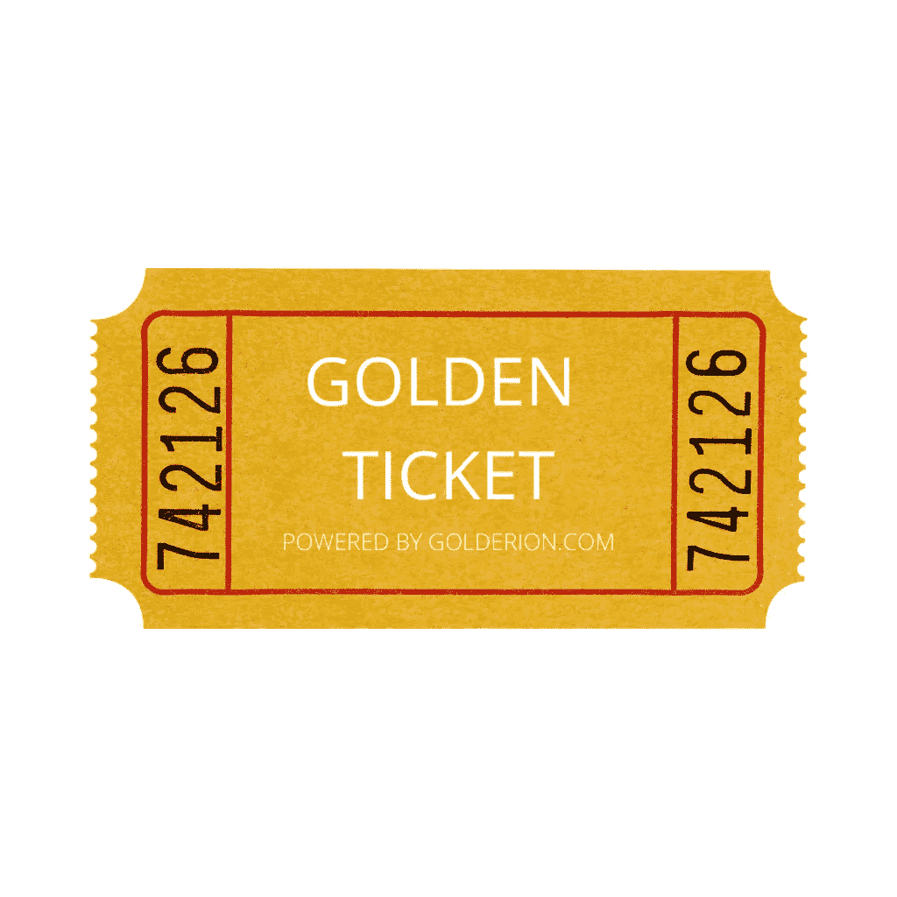
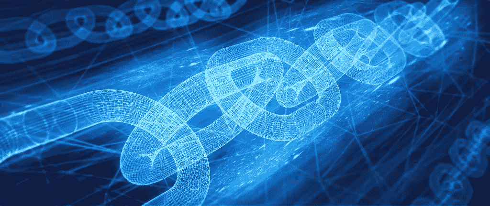
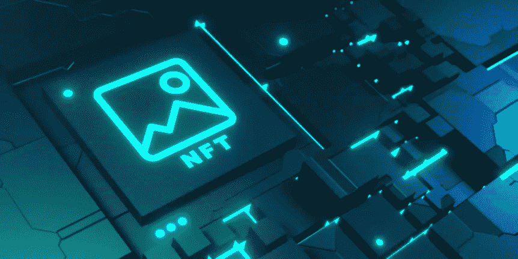

# 区块链在不久的将来的作用:GOLDERION NFTs

> 原文：<https://medium.com/coinmonks/role-of-blockchain-in-the-near-future-golderion-nfts-c53c82b6e4ee?source=collection_archive---------51----------------------->

众所周知，区块链技术已经彻底改变了我们现在和不久的将来，创造和购买数字资产。Golderion 是一个资产市场，它使用位于区块链的不可替代代币(NFT)作为交易媒介，供人们买卖具有内在价值的数字资产。

区块链是一种可以在知识产权、版权和数字身份等领域加以利用的新技术。当今交易平台的问题在于，它们通过操纵高于应有价格的价格来获利。Golderion 在多边形区块链上运营，这意味着交易几乎是免费和即时的。这将使每个人都更容易进行交易。

除此之外，Golderion 还为用户提供一张“金券”，这是一种资产支持的代币，可用于购买 Golderion 的每一件实物产品。这可以让消费者从该网站购买产品，而不用担心欺诈或假货，因为将有可验证的真实资产。

区块链是一个分散的账本，区块链上的每一笔交易都记录在每个节点上。Golderion NFTs 是代表特定资产所有权的令牌。

Golderion 项目将彻底改变数字资产的工作方式，将它们带到区块链，而无需创造任何新技术。它将联合现有的所有技术，如 ERC721、ERC 1155 等，使人们能够以各种方式将这些数字资产用于自己的目的。

区块链是记录交易的数字账本。它是一种不可变的、分散的技术。这些技术可以提供一种创造分散经济的手段，以及管理资产、身份、投票等的新方式。

Golderion NFTs 是区块链网络上的下一代令牌化资产。它们是金本位制的现代形式——一种具有内在价值的货币，几个世纪以来一直被用于储存价值、购买或在某些情况下作为交换媒介。

区块链有可能将我们的经济体系从集中金融转变为分散金融。在 Golderion，我们正在为符号化世界的新时代构建基础设施。这个想法是为资产创造一个新的范例。

市场在发展，做生意的方式也在改变。在这个新时代，你也许可以将你的资产进行令牌化，并在全球市场上出售。您可能会通过使用 ERC721 代币购买物品。这些令牌是不可替代的，并且基于区块链技术。

Golderion NFTs 是一个协议，它将所有这些技术结合在一起，为未来的分散经济创建了一个生态系统。

**我们的社交媒体渠道:**

**网页:www.golderion.com**

**Instagram: @golderion_nft**

**推特:@GolderionNFT**

**LinkedIn: @GolderionNFT**

**不和:@ golderionoofficial**

**中:@黄金官方**

**GitHub:@ golderionoofficial**

**Tumblr:@ golderionoficial**

跟随我们，保持关注！！

> 加入 Coinmonks [电报频道](https://t.me/coincodecap)和 [Youtube 频道](https://www.youtube.com/c/coinmonks/videos)了解加密交易和投资

# 另外，阅读

*   [如何匿名购买比特币](https://coincodecap.com/buy-bitcoin-anonymously) | [比特币现金钱包](https://coincodecap.com/bitcoin-cash-wallets)
*   [瓦济里克斯 NFT 评论](https://coincodecap.com/wazirx-nft-review) | [比茨盖普 vs 皮奥克斯](https://coincodecap.com/bitsgap-vs-pionex) | [坦吉姆评论](https://coincodecap.com/tangem-wallet-review)
*   [如何使用 Solidity 在以太坊上创建 DApp？](https://coincodecap.com/create-a-dapp-on-ethereum-using-solidity)
*   [币安 vs FTX](https://coincodecap.com/binance-vs-ftx) | [最佳(SOL)索拉纳钱包](https://coincodecap.com/solana-wallets)
*   [如何在 Uniswap 上交换加密？](https://coincodecap.com/swap-crypto-on-uniswap) | [A-Ads 评论](https://coincodecap.com/a-ads-review)