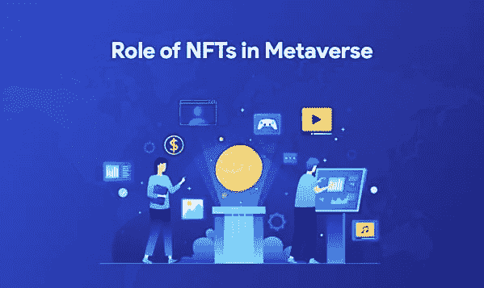

# 非功能性测试在元宇宙的作用

> 原文：<https://medium.com/coinmonks/role-of-nfts-in-metaverse-80329c17dd05?source=collection_archive---------10----------------------->

如果你是一名 [**企业区块链专业人士**](https://www.codezeros.com/) ，你一定会享受到每天都涌现出的所有加密、NFT 和元宇宙项目。对于其他人来说，这是一个从来没有人体验过的空间！

在 2020 年，如果有人建议你将一些钱投入比特币或以太坊，你可能会称之为逻辑陈述。但是，如果有人建议你把你所有的退休基金放在一个几乎任何人都可以复制的数字图像中，会怎么样呢？

对于外行人来说，这听起来很疯狂。但一直关注不可替代代币空间的人们一直在等待这一时刻。随着更多的 NFT 市场气流。

(在我们开始之前，这里有一个关于区块链、NFTs 和元宇宙的初级读本:

*区块链:一种去中心化的公共账本，可以存储所有权和交易信息，无需中央管理机构。*

不可替换的令牌:位于区块链之上的数据单元，一旦产生就不能改变。然而，它可以被交易以改变其所有权。数据可以存在于视频、音频或图像中。

*元宇宙:一个数字化的、实时的、互联的模拟世界，正如我们所知，在这个世界中，数字化身取代了人类*。)

Role of NFTs in Metaverse

# 2022 年的 NFT 市场

如果你直到 2022 年 2 月才听说过 NFT，那么你很有可能一直生活在互联网上。无聊猿游艇俱乐部和华尔街公牛队已经成为 NFT 社区最广为人知的名字。此外，你最喜欢的 Instagram 艺术家很有可能正在从事一个 NFT 项目。

让我们澄清一件事——非技术基金远非投资。它们是投机性的赌注。但棘手的是，潜在的好处远远大于潜在的坏处。这就像投资一家电动汽车制造商的股票，其首席执行官上了一个受欢迎的播客，并沉醉其中，不料在大约两年内同一只股票获得了近 8 倍的回报(提示——我们正在谈论特斯拉。)

尽管具有投机性质，但 NFT 正在以连最具创新性的技术公司都只能梦想的速度积累市场资本。2020 年价值 2 亿美元的 NFT 市场已经膨胀到 2022 年的 220 亿美元，并且预计会更高。问题依然存在——是什么让不可替代代币如此吸引人？以下是几个原因:

1.  **永久所有权:**可能没有任何其他资产类别提供永久所有权。房地产可能会受到公共项目的限制，黄金这种贵金属依赖于商品周期。而 NFT 则由复杂的 [**区块链应用开发**](https://www.codezeros.com/services/blockchain-development) 能力支持，更容易维护为永久安全而优化的公共账本。今天属于你的东西将一直属于你，直到你另有决定。
2.  **先行者的优势:**尽管大肆宣传，NFT 作为一种资产类别仍处于早期阶段。虽然有些非功能性交易比其他交易更受欢迎，但传统资本市场的许多参与者尚未进入这一领域。因此，对于早期行动者来说，仍然有很大的空间进入并停留足够长的时间，以从他们的投机中获利。
3.  **用例**:当艺术市场本身向普通人开放时，NFT 正在帮助艺术机构变得无障碍。早些时候，你可能需要一些重要的社会资本才能接触到像阿姆、林赛·罗韩或肖恩·蒙德兹这样的艺术家。但是，今天，如果你的账户里有几千美元，你就可以虚拟地拥有他们的作品——只要你愿意。
4.  **社区**:面向非技术人员的社区正在做着沙龙为股票市场所做的事情。人们会聚集在一个地方，谈论他们最近的赌注或投资。这是所有谣言的源头。但是，如果你给这样的社会系统一些时间，他们可以找到推动未来市场的共同趋势。除此之外，社区释放出网络效应，为 NFTs 等新资产类别创造增值。

人们不能忽视非正规金融机构的指数增长和疫情的出现。突然之间，全球资本市场中出现了一个足够年轻的细分市场，这个市场拥有一些资金，并有进入新市场的风险偏好。年轻投机者、投资者和福音传道者这一特殊群体接受了 NFTs，将我们带到了今天。

# **然后，元宇宙发生了**

在谷歌镜头和 Oculus 等项目的公开失败或缺乏大规模采用之后，你可能会想——是什么让脸书有胆量围绕元宇宙的概念锚定其整个身份？提示——这个概念的证明从 1989 年游戏[模拟城市](https://simcity.fandom.com/wiki/SimCity_(1989))发布时就存在了。

《模拟城市》是一款游戏，玩家可以模拟现实建造自己的城市，并与全球其他玩家实时互动。如果你改变定义，用“用户”替换玩家，用“元宇宙”替换模拟城市，你仍然会得到相同的输出。《模拟城市建造》是世界上最受欢迎的游戏之一，迄今为止已经拥有超过 4000 万用户。

证明这个概念的一个更近的例子是第二人生。自推出以来的 10 年里，玩家已经在游戏中花费了超过 32 亿美元来建造虚拟家庭、房屋和企业。令人惊讶的是，即使在今天，这款游戏在全球仍有超过 [75 万](https://time.com/6123333/metaverse-second-life-lessons/)的活跃用户。

疫情更加支持虚拟生活。在 2018 年至 2021 年期间，与《模拟城市》一起发行其他几款游戏的艺电公司(Electronic Arts)的股价几乎翻了一倍。

所以，脸书只是看到了大规模运作的趋势。它知道，要让这种趋势成为一种全球现象，一些公司必须提供关键的基础设施——虚拟世界需要硬件和软件的集成，以及对社会系统的良好理解。除了一家已经成功扩展了有史以来最大的三个社交网络——insta gram、WhatsApp 和脸书——的公司，还有谁能做到这一点？

# 天作之合:NFT 在元宇宙

对于外行人来说，元宇宙概念的兴起和非金融交易的指数增长可能看起来像是无聊的年轻投资者想要尝试新事物的巧合。但是，如果像三星和普华永道这样的公司花钱在元宇宙购买虚拟土地，这还会是一种趋势吗？像“分散土地”和“沙盒”这样的项目已经超越了概念测试，开始在全球范围内推广。有人最近支付了 450，000 美元成为史努比狗狗在元宇宙的邻居。

这些趋势展示了一个类似的新兴主题——元宇宙正在开放，越来越多拥有重要资本的人正在认真对待元宇宙的崛起。虽然听起来像是加密文化的远亲，但 NFT 是这些人融入元宇宙生活的门户。

**1。虚拟房地产**

自 2008 年金融危机以来，全球房地产价格一直在以超出人们预期的方式升温。你可能听说过美国、新加坡或阿联酋的房价上涨，但即使在像土耳其这样增长缓慢的经济体，每年的房地产价格涨幅也突破了 [35%](https://www.statista.com/topics/5466/global-housing-market/#topicHeader__wrapper) 的门槛。

低利率对这一趋势至关重要。但它们有利于已经拥有一些资本的人，即没有受到 2008 年危机严重影响的人。对于许多年轻的专业人士来说，如果他们的收入保持在今天的水平，在未来几年内几乎不可能在大都市拥有自己的房子。

元宇宙为这些年轻的专业人士打开了一扇新的机会之门——经验丰富的投资者要么不了解这个新市场，要么不想冒险。你可能觉得房地产和虚拟房地产不是一个档次的。但是，随着更多的机构资本涌入后者，它们正在趋同。而 NFT 是完成这个循环的核心。

NFT 是一个很好的例子，说明如何在区块链周围建立志同道合的积极投资者社区。这样，NFTs 既可以用来标记虚拟不动产的所有权，也可以用数字制品来提高其价值。此外，它还可以作为一个概念验证，看看一个快速增长的虚拟房地产市场将如何表现。

**2。社会经历**

在元宇宙参加聚会、建立关系网或结识新朋友听起来令人兴奋。但是，我们还没有大规模地跨过那座桥。NFTs 是加密市场的一个更加个性化的子集，是社区成员、创建者和买卖双方之间更好的沟通渠道。

很难想象没有商业基础设施的社交体验——你需要一家咖啡馆去约会，你需要一栋办公楼去会见新客户，或者你需要一张入场券去参加一个活动。拥有不可替代的公共所有权记录的国家森林公园可以让企业更容易在元宇宙实现社交体验。想象一个大型经济体中的中央银行，以及它如何跟踪货币并确保经济中存在合法货币。元宇宙的国家森林小组也将发挥同样的作用，尽管方式更加分散和可靠。

**3。身份、价值储存和可交易证券**

想象一下一个可以作为你的护照、钱包和股票投资组合的设备。当元宇宙扩大规模时，NFTs 将有可能扮演这个虚构设备的确切角色，专注于您的数字化身、您的元宇宙钱包和您拥有的数字艺术品。

加密货币的运行水平仍然高度依赖于其转换为法定货币的能力，但非加密货币运行得更深入。它们既有投资用途，也有工程用途——有潜力在未开发领域的两端扩展。

# 概括起来

随着越来越多的人加入元宇宙的行列，它将达到临界质量——就像一个你可能不喜欢的社交媒体平台，但你不能忽视，因为你所有的朋友、家人、同事和客户都在上面。因此，明智之举是在 NFT 和元宇宙市场仍处于早期阶段时进入。

如果你计划成为元宇宙的一部分，非功能性测试是一个不错的选择。但是，如果你想有更多的控制，想影响这个元宇宙呢？这就是你需要一个区块链开发服务提供商的地方，他可以单独帮助你开发分散的应用程序、令牌组学和区块链。如果这让你感到兴奋，你可能想点击[此处](https://www.codezeros.com/contact)联系我们的专家。

元宇宙见！

> 【https://www.coinideology.com/role-of-nfts-in-metaverse】来源