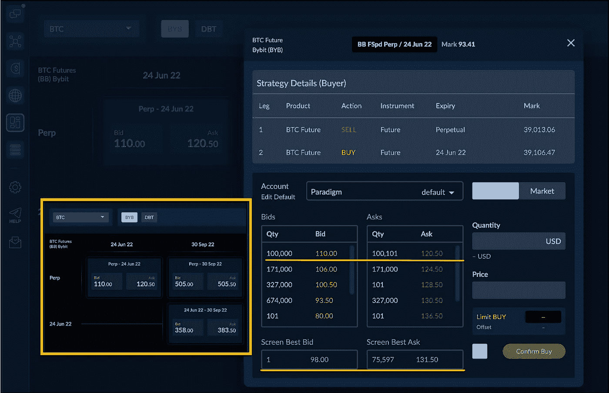

# 滚动加密期货

> 原文：<https://medium.com/coinmonks/rolling-crypto-futures-e6db27ab5a63?source=collection_archive---------32----------------------->

将永久期货推出到过期期货已经成为加密领域的一项大业务，而 [Paradigm](https://www.linkedin.com/feed/#) 的期货价差仪表板已经从根本上改善了这些价差交易者的工作流程。我们的场外机构流动性网络已经为利差交易者积累了大量储蓄，因为紧张的市场和更大数量的交易远离了现货市场。

加密的永久期货往往比他们的过期期货有更深的市场。对冲者经常利用罪犯来掩盖他们的风险。问题是，罪犯并不总是与他们的风险保持一致。为了使他们的风险管理回到正轨，他们通常会将风险敞口移至更接近其风险敞口期限的到期日。

资金利率呢？资金利率让你失望了？当然，过期期货需要保证金，但是当你平仓时，你可以拿回保证金。当永久期货融资利率趋势对你不利时，这是一个双输的命题。

保费呢？是的，远期期货交易有溢价，这种溢价可以给你的策略增加阿尔法。

只是一些可以讨论的想法。

至于我们的场外交易网络所提供的优越的流动性，请看下面的例子截图。在 [Bybit](https://www.linkedin.com/feed/#) 屏幕上的最佳隐含买价/卖价被我们的做市商吹走了。本地交易所屏幕上的买卖价差为 33.50，可用数量少得多。。在 Paradigm 上，买价/卖价价差为 10.30(3 倍)，两边各涨 10 万英镑。

有什么问题吗？随便问问。

> 加入 Coinmonks [电报频道](https://t.me/coincodecap)和 [Youtube 频道](https://www.youtube.com/c/coinmonks/videos)了解加密交易和投资

# 另外，阅读

*   [印度最佳 P2P 加密交易所](https://coincodecap.com/p2p-crypto-exchanges-in-india) | [柴犬钱包](https://coincodecap.com/baby-shiba-inu-wallets)
*   [八大加密附属计划](https://coincodecap.com/crypto-affiliate-programs) | [eToro vs 比特币基地](https://coincodecap.com/etoro-vs-coinbase)
*   [最佳以太坊钱包](https://coincodecap.com/best-ethereum-wallets) | [电报上的加密货币机器人](https://coincodecap.com/telegram-crypto-bots)
*   [交易杠杆代币的最佳交易所](https://coincodecap.com/leveraged-token-exchanges)
*   [最佳加密分析或链上数据](https://coincodecap.com/blockchain-analytics) | [Bexplus 评论](https://coincodecap.com/bexplus-review)