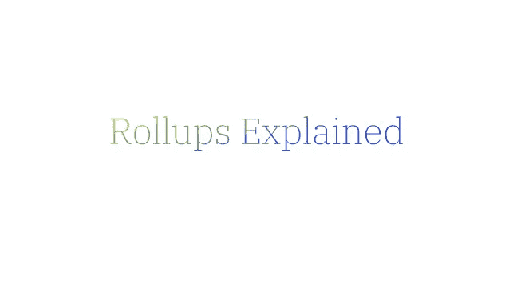
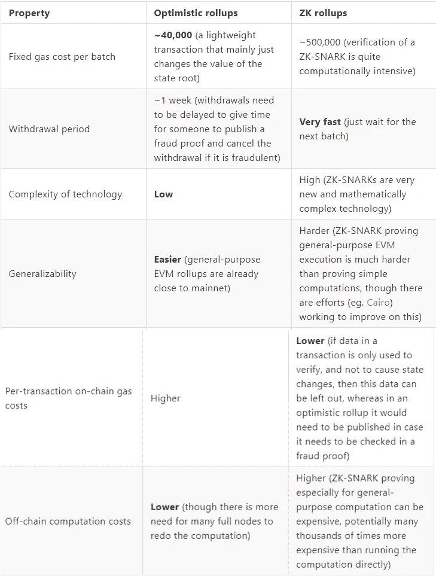

# 汇总解释

> 原文：<https://medium.com/coinmonks/rollups-explained-fbf6c32b0f5c?source=collection_archive---------11----------------------->

在解释什么是 Rollups 之前，理解[区块链三难困境](https://opeyemiegbeola14.medium.com/the-blockchain-trilemma-173412f6f945)很重要。这个概念解释了每一个区块链要成功需要解决的三个问题。去中心化、安全性和可扩展性是三个问题。三难问题之所以存在，是因为解决其中一个问题可能会损害其他一个或两个问题。

可伸缩性是指区块链处理事务的效率。区块链快速处理和确认交易的能力。

以太坊区块链当前拥有 15 TPS(每秒交易量)。这导致了当存在高水平的活动时网络中的拥塞。为了解决这种拥塞，需要对网络进行扩展。扩展第 1 层、构建侧链(构建在第 1 层的侧面)和扩展第 2 层是当前可用的解决方案。第 1 层是一个术语，用于指代底层主区块链架构。而第 2 层是指构建在第 1 层之上的解决方案。简单来说，第一层是土地，第二层是建在土地上的建筑。

扩展第 1 层需要构建专门的节点或更大的块来处理网络上增加的工作负载。这里的缺点是，它会导致更高的集中化，从而降低安全性。这种形式的第 1 层扩展对用户来说是不利的，因为网络的去中心化(这是加密货币的特质)将被消除。

另一方面，扩展第 2 层会产生更多的好处。第 2 层处理链外事务，同时利用第 1 层的安全性和一致性模型。第 2 层扩展解决方案的示例包括通道、等离子和卷装

汇总在第 1 层之外处理事务，然后在第 1 层发布事务(TX)数据。它们使事务的计算和存储脱离链，但保留每个事务层 1 的一些数据。

汇总将交易捆绑或“汇总”成一批，压缩数据并在以太坊第 1 层上发布。上滚有助于通过离线处理交易来扩展网络，从而减轻以太网的压力。

这听起来令人印象深刻，您自然会问该解决方案如何防止欺诈者为了自己的利益向汇总提交虚假交易。

您可能想知道 rollup 如何确认批量交易是否正确。这个查询非常重要，因为这个问题有两种解决方案，这两种解决方案形成了两种类型的汇总

让我们看一下两种类型的汇总

**乐观向上**

乐观汇总使用欺诈证据。

它允许批次被发布，假设它是正确的——善意的。在某种情况下，它是正确的，没有欺诈，汇总没有工作要做。

然而，如果批次是假的，系统开始识别和惩罚肇事者的过程。

乐观汇总利用争议解决系统。该系统验证欺诈证据并执行处罚。在争议解决系统中通常有两方当事人；提交批次的用户和提交欺诈证据的可疑用户。他们都在 ETH 中提供了一个纽带，如果他们中的任何一个行为不端，这个纽带将被切断。

例如，一个用户提交一批交易并被过账，如果另一个用户怀疑这批交易是假的，他们就提交一份欺诈证明。系统将在第 1 层上重新执行事务，同时保持最初发送批处理时网络的当前状态。

如果发现该批交易是欺诈性的，提交该批交易的用户将被削减其 ETH。另一方面，如果该批交易有效，提供欺诈证据的用户的 ETH 将被削减。这是为了阻止用户向网络发送虚假的欺诈证明。

似乎没有人张贴欺诈证明，虚假交易将被张贴。然而，如果只有一个诚实的用户监视汇总并在需要时提交欺诈证据，则该系统被构建为按预期工作并能够检测欺诈。

乐观汇总项目有乐观、Arbitrum、波巴网等。

**ZK 汇总**

ZK(零知识)汇总利用有效性证明。

本质上，每一批都包括一个被称为 ZK-斯纳克(零知识简洁的非交互式知识论证)的密码证明。

ZK-斯纳克允许用户以完全加密的方式通过区块链发送交易。这些交易不能被任何人阅读，但是，它同时表明这些交易是合法有效的。

例如，零知识证明允许 Tunde 向 Chinedu 证明一个陈述是真实的，而不提供除该陈述的有效性之外的任何信息。想象一下，在不提供用户名和密码的情况下，向某人验证你是社交媒体账户的所有者。这就是 ZK-斯纳克的工作方式。

一旦提交，它们就自动证明提交的批次是有效的。无论计算量有多大，都可以在第 1 层快速验证证明。

ZK Rollup 项目包括 Hermez、Immutable X、DeversiFi、zkSync、Aztec、Loopring 等。

**乐观 VS ZK**

以下是乐观累计和 ZK 累计之间的差异:

Source: An Incomplete Guide to Rollups by Vitalik Buterin

两种类型的汇总都有其独特性，这形成了它们的优点和缺点。一些人认为 ZK 汇总由于其速度而更胜一筹，然而，它们创建起来非常复杂，并且不容易与 EVM(以太坊虚拟机)兼容。乐观汇总可能会慢一些——几乎需要一周的时间来确认——但它构建起来不那么复杂，而且更兼容 EVM。

Vitalik Buterin 对这些卷有这样的看法:

> 总的来说，我自己的观点是，在短期内，乐观的汇总可能会在通用 EVM 计算中胜出，ZK 汇总可能会在简单的支付、交换和其他特定于应用程序的用例中胜出，但在中长期内，随着 ZK-斯纳克技术的改进，ZK 汇总将在所有用例中胜出。

**结论**

在扩展第二层以太坊时，总结是非常有用的，他们被解释为扩展网络的未来的关键。即使有了 Eth2，汇总仍然有用，因为网络仍然需要第 2 层解决方案的帮助来快速处理和确认交易。

**资料来源和进一步阅读:**

1.  [不完整的汇总指南](https://vitalik.ca/general/2021/01/05/rollup.html)
2.  [汇总—终极以太坊扩展解决方案](https://finematics.com/rollups-explained/)
3.  隐私币和 zk-SNARKs:它们是如何工作的？
4.  [以汇总为中心的以太坊路线图](https://ethereum-magicians.org/t/a-rollup-centric-ethereum-roadmap/4698)

> 加入 Coinmonks [电报频道](https://t.me/coincodecap)和 [Youtube 频道](https://www.youtube.com/c/coinmonks/videos)了解加密交易和投资

# 另外，阅读

*   [如何在 Uniswap 上交换加密？](https://coincodecap.com/swap-crypto-on-uniswap) | [A-Ads 审查](https://coincodecap.com/a-ads-review)
*   [WazirX vs coin dcx vs bit bns](/coinmonks/wazirx-vs-coindcx-vs-bitbns-149f4f19a2f1)|[block fi vs coin loan vs Nexo](/coinmonks/blockfi-vs-coinloan-vs-nexo-cb624635230d)
*   [本地比特币评论](/coinmonks/localbitcoins-review-6cc001c6ed56) | [加密货币储蓄账户](https://coincodecap.com/cryptocurrency-savings-accounts)
*   什么是融资融券交易
*   [维护卡审核](https://coincodecap.com/uphold-card-review) | [信任钱包 vs MetaMask](https://coincodecap.com/trust-wallet-vs-metamask)