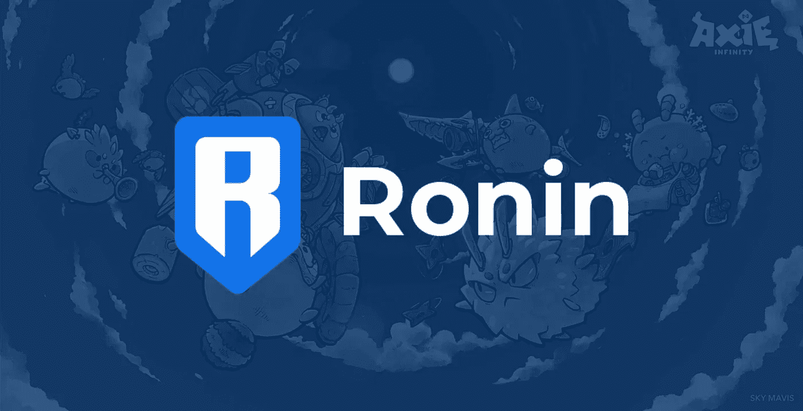

# 浪人:L1 游戏平台

> 原文：<https://medium.com/coinmonks/ronin-l1-gaming-platform-bd0680c8dec4?source=collection_archive---------22----------------------->

自从脸书更名为 Meta 以来，散户和风投都疯狂地投资区块链的游戏项目和相关的非功能性游戏。像[去中心化](https://decentraland.org/)和[沙盒](https://www.sandbox.game/en/)这样的项目在过去三个月里见证了用户和投资者的大幅增长，这两个项目目前的市值约为 50 亿美元。围绕“元宇宙”代币有一种狂热，甚至在项目白皮书中使用这个词都会导致代币价格飙升。这些已建立的项目和尚未上市的项目的持续成功已经反映在象征性的估值中。这种与元宇宙相关的区块链项目的过剩，使得人们几乎不可能把小麦从谷壳中分离出来。在一个稀缺推动价值、项目有望迎来数以千计的元宇宙数的市场中，我们必须为最稀缺的资源进行优化:[合法性](https://vitalik.ca/general/2021/03/23/legitimacy.html)。

区块链游戏领域最合法、最持久的项目之一是 Axie Infinity。他们的合法性是通过他们成熟的产品、庞大的用户群和疯狂的销售数字赢得的。Axie Infinity 是一款由 Sky Mavis 开发的区块链游戏，让人想起神奇宝贝。每个 Axie 都是自己的 NFT，生活在浪人的侧链上。玩家购买斧头并与其他玩家或环境战斗，同时赚取$SLP 和$AXS。虽然$SLP 和$AXS 都充当游戏中的货币，但$AXS 很难获得，因为它也充当 Axie Infinity 的治理令牌。虽然 Axie Infinity 在目前的状态下完全令人愉快，但 Axie Infinity 团队正在开发新的功能和创新。截至目前，玩家可以繁殖他们的 Axie，在 Axie Infinity 的虚拟世界中购买土地 *Lunacia，*和战斗 Axie。即使只有这三个功能，在过去的三十天里，Axie 市场上已经售出了价值 1.1893 亿美元的 Axie。与此同时，Axie 协议对发生在 Axie Marketplace 上的每笔交易收取 4.25%的费用。最重要的是，AXS 代币在过去 30 天里创造了 1280 万美元的收入。

这一增长都是由 Sky Mavis 引领的，自 2017 年底成立 Axie Infinity 以来，该公司一直在稳步创新和发展 Axie 生态系统。当 Axie Infinity 推出时，还没有分发平台、加密钱包或定制的区块链。现在，有 Mavis Hub、Ronin Wallet 和 Ronin Blockchain，它们都是为区块链游戏量身定制的。Sky Mavis 已经赢得了合法性，现在希望 Mavis Hub 和 Ronin Blockchain 成为区块链游戏的市场和部署平台。2022 年 1 月 27 日，Sky Mavis 推出了$RON token，这是现在浪人区块链的 gas 和治理 token。$RON 目前的市值为 4.21 亿美元，随着 Axie Infinity 从区块链以太坊迁移到浪人区块链，该公司的市值还在稳步增长。很快，Axie 的所有生态系统都将在浪人区块链上，尽管用户可以随时使用[浪人桥](https://bridge.roninchain.com/)将他们的资产桥回以太坊。Ronin 区块链的创建是为了促进快速交易和低汽油费，以延长 Axie Infinity 的寿命。因此，Ronin 协议是非常集中的。虽然 Sky Mavis 计划分散加班时间，但他们确实控制着智能合同可以在 Ronin 区块链上部署的内容。这种控制的最终目标是筛选高度优化的智能合同，而不会使区块链拥塞。一个低效的区块链游戏可以通过不恰当地使用智能合同来堵塞区块链，这反过来又会将汽油费提高到一个潜在的瘫痪水平。当区块链游戏[向日葵农场](https://www.coindesk.com/tech/2022/01/06/polygon-under-accidental-attack-from-swarm-of-sunflower-farmers/)将汽油费推至创纪录高位，基本上使所有其他链上活动陷入停顿时，我们看到了这种情况发生在多边形第二层。虽然 Ronin 目前是一个应用特定的区块链，它的最终形式可能看起来更像一个区块链游戏特定的区块链。Sky Mavis 计划允许其他区块链游戏部署在 Ronin 上，给这些项目一个进入 Axie Infinities 庞大用户群的机会。Sky Mavis 和 Axie Infinity 将继续成为区块链游戏领域的主力。

## **浪人背后是谁？**

Sky Mavis 由 [Trung Nguyen](https://www.linkedin.com/in/trungfinity/?originalSubdomain=vn) 、 [Aleksander Larsen](https://www.linkedin.com/in/psycheout86/) 和 [Jeffrey Zirlin](https://www.linkedin.com/in/jeffzirlin/) 创建，他们目前分别担任首席执行官、首席运营官和增长主管。Nguyen、Zirlin 和 Larsen 都是加密领域经验丰富的老手，他们已经将 Sky Mavis 和 Axie Infinity 发展成为大型项目。Axie Infinity 是区块链游戏潜力的光辉典范，也是许多其他项目的概念证明。Sky Mavis 已经从 Andreessen Horowitz、A16Z、paradigm 和其他风险投资和私人资本那里筹集了总计 1.61 亿美元的资金。

## **为什么是浪人？**

随着区块链游戏越来越受欢迎，对不拥挤的链上的块空间的需求将会增加。Sky Mavis 和 Axie 社区非常了解用户在使用次优区块链时可能遇到的负面影响。浪人区块链有潜力成为游戏领域的顶级区块链，也是许多新加密用户的入门渠道。罗恩的市值为 4.12 亿美元，而 SLP 和 AXS 的市值都在 50 亿美元左右。随着越来越多的 Axie Infinity 资产从以太坊转移到 Ronin ,$ RON 令牌将得到更多的使用，这些市值应该开始变得相似。我还没有见过另一个第 1 层，其中汽油代币的市值比它上面的代币低。区块链游戏将继续存在，Axie Infinity 继续证明了这一点。我们进入了一个多链条的世界；浪人可能是游戏链。

*由 Istari Capital LP 的加密专家和分析师 David Coryat 撰写。*

[https://www.istari.io/](https://www.istari.io/)

*此内容仅供参考，您不应将任何此类信息或其他材料理解为法律、税务、投资、财务或其他建议。本报告中的任何内容均不构成 Istari 或任何第三方服务提供商在该司法管辖区或任何其他司法管辖区购买或出售任何证券或其他金融工具的邀约、建议、认可或要约，根据该司法管辖区的证券法，此类邀约或要约是非法的。请注意，Istari Capital LP 投资于本文讨论的项目和/或与本文相关的项目。*

> 加入 Coinmonks [电报频道](https://t.me/coincodecap)和 [Youtube 频道](https://www.youtube.com/c/coinmonks/videos)了解加密交易和投资

## 也阅读

 [## 杠杆代币[多头代币]终极指南

### 杠杆化令牌是具有杠杆化风险敞口的 ERC20 令牌，不考虑保证金、要求、管理…

medium.com](/coinmonks/leveraged-token-3f5257808b22)  [## 最佳加密交易所| 2022 年十大加密货币交易所| CoinCodeCap

### 哪一个是最好的加密交换？在本文中，我们将根据多种加密货币列出 10 大加密货币交易所

coincodecap.com](https://coincodecap.com/crypto-exchange)  [## 2022 年最佳加密交换平台| CoinCodeCap

### 随着时间的推移，我们大多数人将转向 dex 以获得更好的安全性和隐私。因此。在这里，我们将讨论…

coincodecap.com](https://coincodecap.com/best-swap-platforms)  [## 2022 年最佳加密和比特币赌场(美国批准，存款奖励)

### 接收、支付和赚取加密货币| |有各种各样的最佳在线赌场可供选择，有可能…

coincodecap.com](https://coincodecap.com/best-online-casinos)  [## 2021 年最佳加密借贷平台| 6 大比特币借贷平台

### 获得比特币和其他加密货币的最佳贷款利率

medium.com](/coinmonks/top-5-crypto-lending-platforms-in-2020-that-you-need-to-know-a1b675cec3fa)  [## 2021 年 6 大最佳硬件钱包|顶级加密硬件钱包[更新]

### 最好的加密货币硬件钱包是绝对必要的。我们将在 NGRAVE、Ledger Nano X 和…

medium.com](/coinmonks/the-best-cryptocurrency-hardware-wallets-of-2020-e28b1c124069)  [## 加密交易机器人——19 款最佳免费加密交易机器人

### 2022 年币安、比特币基地、库币和其他密码交易所的最佳密码交易机器人。四进制，位间隙…

medium.com](/coinmonks/crypto-trading-bot-c2ffce8acb2a)  [## 最佳 4 个加密交易信号电报通道

### 这是乏味的找到正确的加密交易信号提供商。因此，在本文中，我们将讨论最好的…

medium.com](/coinmonks/best-crypto-signals-telegram-5785cdbc4b2b)  [## Bitsgap 评论-交易机器人加密信号和套利 2022

### 这篇文章的重点是 Bitsgap 审查，这是一个最终的交易解决方案，并提供交易机器人，信号…

coincodecap.com](https://coincodecap.com/bitsgap-review)  [## 40 个最佳电报频道，用于加密、电影、表演和演讲| CoinCodeCap

### 免费下载所有电影。德国免费加密信号。下载讲座。CoinCodeCap 经典，网飞电影等。是……

coincodecap.com](https://coincodecap.com/best-telegram-channels)