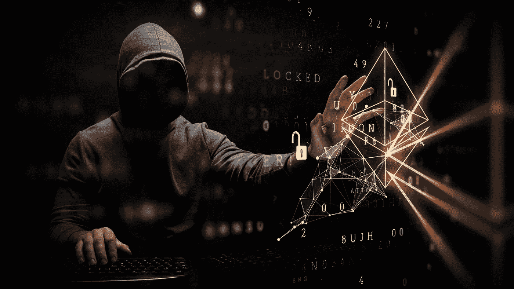

# 遭受 6 亿美元黑客攻击后，Ronin 团队致力于安全升级— Derev 博客

> 原文：<https://medium.com/coinmonks/ronin-team-working-on-security-upgrades-after-600m-hack-derev-blog-bd4cb9fa0f07?source=collection_archive---------47----------------------->

# 快速拍摄:

*   在经历了史上最大的一次加密黑客攻击后， [**【浪人桥】**](https://derev.co/blog/ronin-network-loses-620-million-in-one-of-the-largest-hacks-in-crypto-history) **，开始升级其安全系统。**
*   他们还悬赏 100 万美元给发现漏洞的黑客。

继上个月晚些时候价值 6 亿美元的攻击后，浪人网络和天空 Mavis 已经…