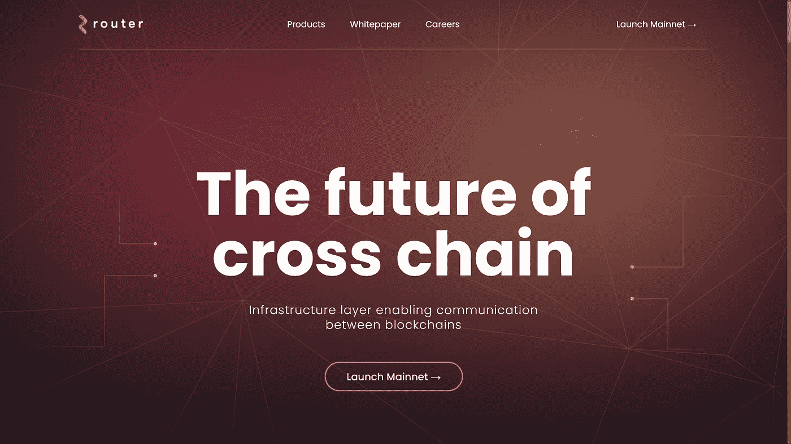

# 路由器协议:跨链的未来

> 原文：<https://medium.com/coinmonks/router-protocol-the-future-of-cross-chain-c58b9531a6be?source=collection_archive---------5----------------------->

## 路由器协议解释

Router Protocol Logo Image

> **路由器协议**被喻为*区块链生态系统中跨链* *的* ***未来。***

近年来，为解决以太坊的可扩展性限制而设计的第 1 层和第 2 层网络的数量有所增加。这些解决方案通过降低天然气成本和提高网络吞吐量，在让越来越多的用户加入 DeFi 生态系统方面发挥了重要作用。然而，这种网络的激增意味着现在大多数活动分散在这些网络上，而不是集中在一个单一的网络上，如以太坊。这导致了一系列互不关联的区块链生态系统，这些生态系统相互独立运行，阻碍了该行业发挥其全部潜力。为了解决这个问题，似乎需要一种促进这些网络之间的互操作性的机制，即，一种使这些网络能够相互通信和共享数据的机制。

# 路由器协议:简介

路由器是一个**交叉链**流动性框架原油，期望在不同的当前和正在出现的第 1 层和第 2 层区块链解决方案(如 Matic 和 Ethereum)之间持续提供跨越基础架构。

从逻辑上讲，路由器打算在其指南中计算出多个不同链之间的基础架构跨越。该路由器致力于开发桥接基础设施，以允许合同级数据流通过各种区块链，从而实现资产级数据传输。

Router Protocol

# 路由器协议:功能

路由器协议提供:

## 代币互换的最优价格

路由器使用专有的路径查找算法来查找跨链交换的最佳路由。

## 统一燃气费

使用$ROUTE 作为路由器协议上所有传输/交换的统一 gas 令牌。

## 跨链结算引擎

通过自动结算所有交易，路由器协议确保用户资金永远不会被冻结。

## 面向开发人员的 SDK

利用路由器的 SDK 为跨链环境构建复杂的分散式应用程序。

## 多链令牌标准

利用内置的责任标准启动和管理多链令牌。

## 特定应用的区块链

路由器区块链将充当全球多链记账层。

# 路由器协议:架构

就其架构而言，与使用一对一网桥的传统跨链协议部署不同，Router 创建了一个网状网络，其中所有链都通过同一组路由器节点相互连接。这些节点可以侦听并写入属于路由器超级网状网的所有区块链上的事务。因此，通过将其相关配置推送到所有路由器节点，任何新链都可以简单地插入到路由器的超级网格中。

Router’s Architecture

# 路由器协议:因素

路由器协议是一个可扩展的多向网桥，它连接当前和新兴的第 1 层和第 2 层区块链，以允许契约级数据流通过它们。这可能是在源链上锁定并在目标链上兑现的令牌，或者是在源链上启动并在目标链上执行的操作。让我们看看您需要了解哪些关于路由器协议的重要因素

# 链子

这些是区块链网络，是路由器流动性“超级网状网络”的一部分启动事务的链称为源链，而执行事务的链称为目标链。在跨链转移期间，路由器协议将用户的资金锁定在源链上，并在目标链上释放。为了促进这些传输，每条链都有两个重要的规范:

*   **链 ID:** 用于识别链的唯一 8 位标识符。
*   **资源 ID:** 一个 32 字节的标识符，用于将源链上的动作映射到目的链上的动作。资源 ID 的最低有效字节包括启动事务的链 ID，而剩余的 31 个字节可用于表示任何映射。例如，路由器协议使用资源 ID 来表示不同链之间的令牌映射。

# 过渡性合同

路由器协议支持的每个链上都部署了一个网桥协议。在源链上，桥契约锁定用户的资产，并广播一个事件，该事件可以被与路由器节点相关联的监听器接收到。在目的地链上，桥契约聚集来自路由器节点的关于从源链中继的提议的投票。当达到投票法定人数时，桥契约解锁/铸造目标链上的令牌。每当在源链上提交事务时，都会在桥契约上启动存款函数，该函数接受三个参数:destinationChainID、resourceID 和 calldata。桥接协定为每个存款交易生成一个 nonce，并根据 resourceID 将调用委托给一个单独的处理程序协定。

*   **Calldata:** 该字段包含处理程序所需的参数。Calldata 根据事务的性质而有所不同，例如，ERC20 传输、任意消息传递等。
*   **存款随机数:**它是一个无符号的 64 位整数，由并行路由器为所有跨链传输生成。所有路由器节点跟踪所有可能的目标链的顺序随机数。

# 费用管理器模块

有了 Router，用户在选择使用哪个令牌支付交易费用时将拥有最大的灵活性。用户可以选择:

*   源链上的 Native gas 令牌(默认)
*   USDC
*   路线(交易费 50%优惠)
*   DFYN(交易费优惠 20%)

路由器协议使用费用管理器模块，根据不同网络的拥塞情况，每 30-60 分钟估算一次交易费用。这个费用管理器模块是完全模块化的，可以支持上述令牌之外的令牌，为用户提供了更大的灵活性。由于 Router 的 fee manager 模块与其余代码没有紧密耦合，所以欢迎其他项目使用它。

# 路由器的 UI

它是用户可以与路由器的网桥合约进行交互的接口。路由器的 UI 负责代表用户调用存款功能。它还负责在调用桥契约之前与源链上的 pathfinder 算法进行通信。

# 探路者算法

路由器使用专有的路径查找算法来寻找将资产从源链移动到目的链的最佳路径。Pathfinder 算法由路由器的 UI 直接调用，并接受四个参数:

*   **链 ID:** 指示路径查找器访问特定链上的 DEX 协议。Pathfinder 算法维护一个映射到每个链 ID 的 DEX 契约地址列表。
*   **fromTokenAddress:** 待出售资产的 ERC20 令牌地址。
*   **toTokenAddress:** 要购买的资产的 ERC20 令牌地址。
*   **数量:**需要交易的代币数量。

基于这些参数，pathfinder 创建一个 JSON 对象，其中包含交换的最佳路由，并将其返回给 Router 的 UI，后者将该对象转发给源链上的桥契约。

# 聚合合同

ParaRouter 调用的一个专用契约，用于执行由 pathfinder 算法指定的交易。该合同仅在任意(非稳定货币)资产转移期间生效。对于 stablecoin 传输，ParaRouter 直接调用 ERC20 处理程序。

# 事件处理程序

来自并行路由器的函数调用被委托给处理程序契约，以确保网桥保持模块化。这些合同允许在接收来自 ParaRouter 的交易时的可定制行为。例如，ParaRouter 会将锁定源链上的 ERC20 资产的存款调用和解锁目的链上的 ERC20 资产的建议调用委托给专用的 ERC20 处理程序。每个处理程序都可以处理多个资源(例如，令牌)，前提是它们的协定地址已注册到该处理程序。目前，路由器支持一个处理程序——用于可替换资产的 ERC20 处理程序，但两个新的处理程序——用于不可替换资产的 ERC721 处理程序和用于任意数据的通用处理程序将很快添加。路由器协议通过代理契约实现来使用其处理程序，以确保它们保持可升级性。将来还可以添加对更多处理程序的支持。

*   **ERC20 处理程序:**该处理程序负责转移 ERC20 资产。ERC20 处理程序契约可以在存款呼叫时锁定(或烧毁)令牌，并在执行建议呼叫时释放(或铸造)令牌。要刻录和铸造令牌，处理程序需要有足够的权限。
*   **ERC721 处理人:**该合同将处理 ERC721 资产的转让。
*   **通用处理程序:**这个契约将允许消息从一个链传播到另一个链。存款调用启动消息的传输，而 executeProposal 调用将元数据传递给指定的执行函数。

# 流动性池

路由器可以插入任何 DEX 协议中存在的流动性池。在非储备资产转移的情况下，路由器将在源链上利用这些池将用户提交的资产交换为稳定币资产，并在目标链上将稳定币资产交换为用户需要的资产。DEX 提供了最好的价格，最少的滑点将用于完成订单。

# 路由器节点

路由器协议维护一组节点，这些节点侦听源链上的事件，为这些事件生成建议，并在目的链上提交签名的建议作为投票。要使一个传输被接受并被发送到桥的另一端，它必须获得足够的票数来超过预定的阈值。所有的网桥合约都维护一个安全的地址列表，以便只考虑从被认可的路由器节点接收到的投票。每个路由器节点运行一个 Golang 链模块，该模块有四个组件:

*   **连接器:**负责将路由器节点连接到作为路由器协议超级网格一部分的所有链。连接器由节点的侦听器和编写器共享。
*   **监听器:**主动观察链状态转换以监听发起的传输。每当检测到传输时，它会构造一条消息并将其传递给路由器接口。该消息总共有 6 个参数:源链 ID、目的链 ID、资源 ID、传输类型(可替换传输、不可替换传输或通用传输)、存款随机数和有效载荷(用于特定传输的数据)。
*   **路由器:**从监听器接收构造好的消息，并将它们转发给编写器。
*   **Writer:** 负责将桥消息解析成有效的事务，并提交给目的地链。

Router Nodes

# 投票过程

一旦在目的链上创建了提议，其他路由器节点就通过签署提议来对其进行投票。一旦达到投票阈值，路由器协议的投票模块就会运行一个随机函数来选择一个节点来执行 executeProposal 调用。这样做是为了防止多个路由器节点同时调用 executeProposal 函数。虽然可能性不大，但如果所选节点执行此调用失败，投票模块会重新运行 randomizer 函数，但这次会排除之前未能执行此任务的节点。

# 今天的路线价格

根据 [CoinMarketCap](https://coinmarketcap.com/) 的数据，今天**路由器协议的实时价格**为 2.28 美元，24 小时交易量为 5786699 美元。路由器协议在过去 24 小时上升了 8.19%。当前 CoinMarketCap 排名第 804 位，实时市值为 15，239，339 美元。它有 6，691，427 枚流通硬币和一枚最大面值硬币。供应 20，000，000 枚路线币。

Route Token price chart

# 哪里买路由器协议

如果您想知道在哪里购买路由器协议，目前用于交易路由器协议股票的顶级加密货币交易所有:

## [库币](https://www.kucoin.com/)

KuCoin 是一个大型加密货币交易所，提供购买、出售和交易加密货币的能力。用户也可以选择赌注或出借他们的密码来获得奖励。它们也被添加到路由器协议(路由)资产和交易对中。

KuCoin

## [Gate.io](https://www.gate.io/)

Gate.io 是一家领先的数字货币交易所，在全球 190 个国家拥有超过 1000 万用户。该交易所除了通过 HipoDeFi 提供 DeFi 产品外，还提供现货、保证金、期货和合约交易，通过 Wallet.io 提供托管服务，通过 Gate Labs 及其专用 GateChain 平台进行投资。

Gate.io

## [MEXC](https://www.mexc.com/)

MEXC Global 成立于 2018 年，是一家采用高性能大型交易匹配技术的集中式交易所。

MEXC

## [BKEX](https://www.bkex.com/)

BKEX 是一个全球性的加密货币交易所。除了常规的交易所功能，它们还提供现货交易、场外交易服务和杠杆 ETP 产品。BKEX 还提供期限长达 180 天的赌注和加密贷款。

BKEX

## [Uniswap (V2)](https://uniswap.org/)

Uniswap 是以太坊上自动令牌交换的协议。Uniswap 将自己描述为用于交换 ERC20 令牌的简单智能合约接口。它有一个汇集流动性储备的正式模型。它作为交易者和流动性提供者的开源前端接口，致力于提供免费和分散的资产交换。

Uniswap

# 最后的话

在这篇文章中，我解释了路由器协议。在区块链生态系统中，**路由器协议**被称为**、【跨链的未来】**，因为它是一个跨链流动性聚合平台，旨在为当前和开发中的第 1 层和第 2 层区块链解决方案提供无缝桥接基础设施。他们的目标是让用户以近乎即时和低成本的方式在网络之间无缝转移资产。路由器专注于构建桥接基础设施，该基础设施将允许合同级数据跨多个区块链流动，从而实现资产级数据传输。

## 在 Linkedin 上关注我，保持联系

【https://www.linkedin.com/in/ishanshahzad/ 