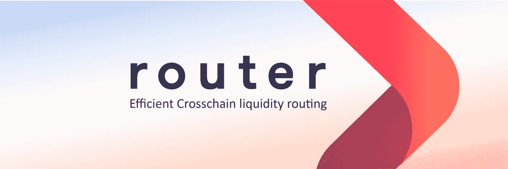

# 路由器协议:释放流动性

> 原文：<https://medium.com/coinmonks/router-protocol-unleashing-liquidity-5ab87850a2a5?source=collection_archive---------28----------------------->

所有加密货币的总市值约为 1.8 万亿美元。不幸的是，这一价值目前分散在 18，000 多种不同的加密货币中。这些流动性孤岛是 crypto 发展过程中不可避免的一部分，但却阻碍了它的采用。目前，即使在以太坊特有的第二层协议中，也有大约 60 亿美元在 14 个不同的第二层协议中分配。区块链空间正遭受互操作性问题的困扰。自动做市商(AMMs)不缺乏流动性提供者，DeFi 已成为大多数一级区块链的主要业务。货币互联网应该是超流动性的，可以在个人、区块链和戴普之间高度转移。为了实现这一未来，我们需要跨链的基础设施，能够快速、可靠地转移价值，而且费用极低。路由器协议旨在成为跨链流动性的骨干。

路由器协议不仅是一座桥，还是一种跨链通信的机制。路由器允许令牌和消息在区块链全境传输。这在理论上允许跨多个区块链的智能合约的互操作性，这将释放 DeFi 的全部潜力，并允许 dapps 是区块链不可知的。路由器可能是将各种加密岛整合成一个加密大陆的催化剂。Router 计划通过接入遍布区块链的 AMMs 来实现这一目标，同时保留一定的资产储备，以确保每一笔资金转移都以最高效的方式进行。这是加密的智能顺序路由方法。跨多个链接入 AMMs 是最大化路由器可桥接流动性的天才方式，同时消除了在智能合同中持有资金的需要。AMMs 和 Router 外包流动性能力的流动性提供商的活动增加是一个双赢的局面。这种关系是双向的。而路由器是伟大的最终用户谁希望交换令牌或移动他们在区块链；路由器协议对于 dapps、AMMs、dex 和 DeFi 协议也非常有用。这意味着像区块链雪崩上的 TraderJoe 这样的 dex 可以在他们的产量农业协议中实施 Router，并从多个其他区块链中获取价值。流动性提供者不再需要决定在哪个区块链部署他们的资本。他们可以选择一个 DEX，体验整个加密市场。

路由器协议 mainnet 于 2022 年 1 月推出，现在支持三种区块链:雪崩、多边形和币安智能链。你可以在这些区块链之间交换任何代币，并支付最少的汽油费。路由器协议接受$AVAX、$USDC 和$ROUTE 作为费用支付。使用$ROUTE 支付时，用户将获得 50%的折扣。$ROUTE 持有者可以通过运行一个验证器节点或提供流动性来获得协议产生的一部分交易费用。

谁是路由器协议的幕后黑手？

路由器协议由 Priyeshu Garg、Chandan Choudhury、Shubham Singhn 和 Ramani Ramachandran 于 2020 年 8 月创建。Ramani Ramachandran 和 Shubham Singhn 分别担任首席执行官和首席技术官。Garg 和 Singhn 都是经验丰富的软件工程师，自 2017 年以来一直在加密领域工作。Ramachandran 是智能合同专家，也是加密领域的长期开发者。乔杜里作为衍生品分析师在传统金融领域拥有广泛的背景，并于 2019 年成为印度中心加密交易所 Bitpolo 的战略主管。他们一起运行路由器协议并领导其员工。路由器协议由比特币基地风险投资公司、阿拉米达研究公司、Qcp 资本公司、Polygon 和其他未在此列出的公司提供支持。

**为什么是路由器协议？**

显然，加密生态系统需要一个跨链的桥梁。将会有一个首要的跨链桥，被区块链用户和开发者所信任和利用。路由器协议团队拥有网络、资金支持和技术能力，能够将他们的项目置于关键位置，使他们成为所有跨链传输的骨干。路由器协议已经进入三个主要的区块链，每个市场的市值超过 100 亿美元。这只是路由器的开始，因为他们计划在区块链之间安全稳定地增加兼容性。

*作者 David Coryat，Istari Capital LP 的加密专家和分析师。*

[https://www.istari.io/](https://www.istari.io/)

*此内容仅供参考，您不应将任何此类信息或其他材料理解为法律、税务、投资、财务或其他建议。本报告中的任何内容均不构成 Istari 或任何第三方服务提供商在该司法管辖区或任何其他司法管辖区购买或出售任何证券或其他金融工具的邀约、建议、认可或要约，根据该司法管辖区的证券法，此类邀约或要约是非法的。请注意，Istari Capital LP 投资于本文讨论的项目和/或与本文相关的项目。*

> 加入 Coinmonks [电报频道](https://t.me/coincodecap)和 [Youtube 频道](https://www.youtube.com/c/coinmonks/videos)了解加密交易和投资

# 另外，阅读

*   [最佳加密交易信号电报](/coinmonks/best-crypto-signals-telegram-5785cdbc4b2b) | [MoonXBT 评论](/coinmonks/moonxbt-review-6e4ab26d037)
*   [OKEx 评论](/coinmonks/okex-review-6b369304110f) | [Coinswitch 俱吠罗评论](/coinmonks/coinswitch-kuber-review-1a8dc5c7a739) | [比特币基地收费](/coinmonks/coinbase-fees-831e77d4f2c5)
*   [AscendEX 审查](/coinmonks/ascendex-review-53e829cf75fa) | [OKEx 交易机器人](/coinmonks/okex-trading-bots-234920f61e60) | [OKEx 交易机器人](/coinmonks/okex-trading-bots-234920f61e60)
*   [火币交易机器人](https://coincodecap.com/huobi-trading-bot) | [如何收购 ADA](https://coincodecap.com/buy-ada-cardano) | [Geco。一次审查](https://coincodecap.com/geco-one-review)
*   [币安 vs 比特邮票](https://coincodecap.com/binance-vs-bitstamp) | [比特熊猫 vs 比特币基地 vs Coinsbit](https://coincodecap.com/bitpanda-coinbase-coinsbit)