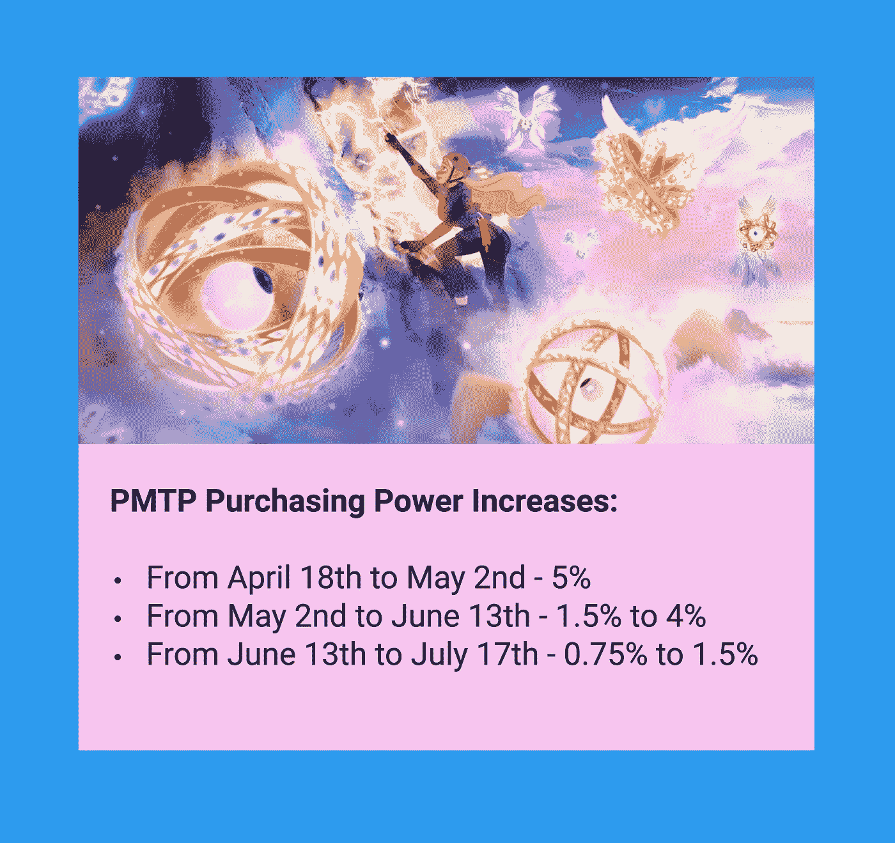

# 罗文得到了提升

> 原文：<https://medium.com/coinmonks/rowan-gets-a-boost-fce4c13edbc6?source=collection_archive---------7----------------------->

**全链流**

在 Evmos 重新推出其区块链之前，以及在 Osmosis 打开前沿领域之前很久，Sifchain 的团队就将以太坊资产引入了宇宙生态系统。Sifchain 在 IBC 支持的主权区块链上运营其全链分散交易所(DEX)。它提供了快速的交易速度、低廉的费用和华丽的用户界面(UI)。

通过 MetaMask 和 Keplr 钱包连接到受支持的资产。TerraStation 钱包支持目前正在维护中，但预计很快就会推出。在撰写本文时，可以在 DEX 上同时访问 21 个独立的区块链钱包地址。作为用户，我们可以通过 Balances 页面将我们的资产导入 Sifchain 区块链，进入该页面后，我们可以向大量池中添加流动性。所有的流动性池都由 Sifchain 的治理令牌 ROWAN 组成。目前，令人难以置信的是，DEX 上有 97 个池正在运行。

Sifchain DEX 为我们提供了各种各样的交易资产，包括以太坊生态系统的中坚力量，如:ETH、、、、戴、COMP、、UNI、SUSHI 和。来自宇宙生态系统的大量支持 IBC 的资产也可用，包括:ATOM、JUNO、LUNA、UST、OSMO、AKT、IXO、IOV、DVPN、REGEN 和 XPRT。

池的用户界面易于导航，搜索功能可帮助快速找到资产，为每个池提供的信息量非常丰富，只需点击一下鼠标即可。

为了进一步提高 Sifchain 的价值，以 ROWAN 奖励形式为流动性池提供的年百分比率很高，所有这些池都超过 100%，六个池提供的 APR 超过 200%。正如你在下面的图片中看到的，顶级泳池有着天文数字的价格。

让我们看看 Sifchain 的天才经济学家、开发人员和市场人员是如何完成这一壮举的。

**Sif 的提升**

SifDAO 关于 Sif 提升的提案在 4 月中旬成功地引入了英联邦，并在随后的治理投票中启动，并在早期获得了卓有成效的成功实施。Sifchain DEX 上锁定的总价值(TVL)在许多资金池中稳步上升，但特别是在“人民资金池”中，这些资金池充满了奖金激励。

提升计划取代了之前的 Sif 扩展计划，并计划了 14 个月的时间，其目标和特点总结在下面的图片中

根据每周参数负荷的需要，将对以下五个变量进行审查和调整:

1.  ROWAN 的排放计划
2.  Sif 的选择集合 LP 补贴因子
3.  新池 LP 补贴系数
4.  罗文 Cap 因子
5.  最大基本 APR 系数

ROWAN 排放计划持续 60 周，每周排放上限为超出计划 10%的溢出率。对于人才库和新人才库，补贴系数是 ROWAN staking APR 的 1.35 倍。对于所有其他池，最大基本奖励最初设置为 ROWAN staking APR 的 0.75 倍。

提升计划与 PMTP 紧密相连，是其成功的关键因素。

**介绍 PMTP**

协议货币贸易政策(PMTP)是指货币和贸易政策的整合，以影响资产的购买力和汇率。最值得注意的是，Sifchain 的经济学家、开发人员和市场人员团队设计了一个流动性池系统，由 ROWAN 锚定其中的每一个，实现了资产之间毫不费力的交换功能。这一切都是在 DEX 内利用来自许多不同链的资产以低成本、高速度完成的。

为了确保其资金池有大量的流动性来处理交易量，Sifchain 提供高 APR。这些利率是任何地方都可以找到的最好的利率，预计这将鼓励流动性提供者将其资产纳入 DEX。在幕后，ROWAN 购买力以小增量进行调整，特别是对于流动性最强的池。

下图总结了 PMTP 的目标和优势。

PMTP 的购买力是流动的，缩减是可以预期的。自从 PMTP 实施以来，就出现了对罗文的净买入，直到 4 月的最后一天，我们才看到任何大规模的获利回吐。

迄今为止，购买压力大于排放。因此，作为罗文业主，我们没有什么可做的。当我们见证新的经济政策成形时，我们可以简单地继续持有、持有和汇集我们的代币！PMTP 的实施试图对此产生积极影响，一步一步稳步提升我们的收益。

**PMTP 实施**

PMTP 实施于 4 月 18 日开始，将在就职期间持续 90 天。购买力将按照以下时间表与日俱增:

在撰写本文时，将 5 月 3 日至 5 月 10 日期间的购买力设定为 3.25%的信号提案正在投票表决中。看来它会通过治理。

实施的初步结果似乎很有希望，总体 TVL 急剧增加，ROWAN 购买量不断增加，ROWAN 价格在短期内有所提高。考虑到整体加密市场经历了总体下降趋势，这是谨慎乐观的理由。从下面的图表中可以看出，罗文的价格从 0.09 美元上升到 0.15 美元。在 PMTP 实施的前两周，TVL 也有大幅增长，从 9500 万美元增加到 1.75 亿美元。

营销团队和众多社区成员努力宣传 Sif 的提升、人才库和 PMTP 是另一个强有力的贡献因素。

**罗文奖励**

随着 Sif 的提升和 PMTP 的开始，奖励分配机制也进行了调整。以前，奖励是按周发放的，作为流动性提供者，我们手动收集 ROWAN 奖励。然后，我们可以将回报再投资于流动性池，将其换出，或者将它们作为单一资产投资于 Keplr。自从 PMTP 上线以来，在每一个街区，奖励都被收获并自动复合到每一份 LP 股票上。

奖励分布在所有的池中，更高的奖励金额流向人池:罗文与 ATOM、ETH、USDC、LUNA 和 JUNO 的配对。在撰写本文时，一项将埃夫莫斯和 SCRT 加入奖金池四周的信号提案正在投票表决，看起来将会通过。

“Pools”页面让我们可以看到每个资产池中的总资产，以及我们在参与的资产池中所占份额的金额。我们还可以看到我们提供给每个池的基础资产的确切数量以及当前的 APR。不幸的是，我们不再能够看到我们已经获得的奖励的确切数量。

可以随时从池中退出，退出请求将开始为期七天的解除绑定期。Sifchain 的设计还有一个非常以用户为中心的特点:在解除绑定期间，我们继续获得奖励。

**把所有的放在一起**

Sif 的提升和 PMTP 的各个方面共同积极影响着区块链的经济及其治理标志。Sifchain 的经济学家团队已经准备了影响模型，并通过 Google Sheets 公开发布。请在下面的来源部分查看 PMTP 影响计算器工作表的链接。然而，在我看来，一张图胜过千言万语，简单胜于复杂。请看下面我的图表来说明这些已经付诸实施的强大关系。

**时机可能就是一切**

这是世界上的一个困难时期，东欧发生了可怕的战争，通货膨胀失控，供应链短缺，大规模金融市场低迷，经济衰退迫在眉睫。Sifchain 团队在我们最需要的时候开拓出了一个亮点。随着其内部激励性流动性农场生态系统的新货币和贸易政策，Sifchain 正在吸引整个宇宙和以太坊广阔生态系统的注意力。它的使命是强大而明确的:使数字资产能够自由地进出其全链分散交易所，利用低交易成本，享受快速的处理速度，并获得丰厚的回报。

就我个人而言，我正以极大的兴趣关注 Sifchain，随着这些经济特征的扎根，我将在不久的将来关注更多的发展。我在下面的来源部分留下了链接，这样你也可以跟踪区块链，给你做自己的研究一个良好的开端。Sifchain 有一个雄心勃勃的路线图，其中包括与其他区块链生态系统建立更多的合作伙伴关系，并整合更多的令牌。路线图包括扩大流动性池产品，评估 SifUSD stablecoin 的发展，以及启动保证金交易。时机可能真的在 Sifchain 这边！

Tot ziens — Opa。

**资料来源、参考文献和进一步阅读:**

SIF chain Finance—【https://www.sifchain.finance/ 

Sifchain Twitter — @sifchain

Sifchain 媒体博客—【https://medium.com/sifchain-finance 

SIF chain DEX(red starling)—[https://sifchain-dex.redstarling.com/#/swap?from=uusd&到=罗文&滑移=0.5](https://sifchain-dex.redstarling.com/#/swap?from=uusd&to=rowan&slippage=0.5)

SIF chain DEX(for bole)—[https://sifchain-dex.forbole.com/#/swap?from=uusd&to =罗文&滑移=0.5](https://sifchain-dex.forbole.com/#/swap?from=uusd&to=rowan&slippage=0.5)

Sifchain 文档—[https://docs . SIF chain . finance/welcome-to-SIF chain/start-here](https://docs.sifchain.finance/welcome-to-sifchain/start-here)

ROWAN Token 经济学更新文档—[https://docs . Google . com/Document/d/155 chk RM 8 he 2 ja 8 mxltoazv 6 nf 5 jipg 8 I 9 pdtgsldc 5 c/edit](https://docs.google.com/document/d/155ChKRm8hE2ja8MxltoaZV6nf5JiPg8I9PDTgsLDc5c/edit)

PMTP 影响力计算器工作表—[https://docs . Google . com/spreadsheets/d/1 jrhxjdzofc-u _ VWO 8 scilprf 34 jiei 6 zdjrwcqmxam 8/edit # GID = 744728516](https://docs.google.com/spreadsheets/d/1jRHXJDZOfc-u_VWO8SCILPRF34JIEI6zDjRwcqmxAm8/edit#gid=744728516)

英联邦提升提案—[https://Commonwealth . im/SIF chain/discussion/4302-sifs-Ascension-parameter-calculation-Proposal](https://commonwealth.im/sifchain/discussion/4302-sifs-ascension-parameter-calculation-proposal)

英联邦 PMTP 提案—[https://Commonwealth . im/SIF chain/discussion/4307-SIF Dao-Proposal-pmtp-Proposal](https://commonwealth.im/sifchain/discussion/4307-sifdao-proposal-pmtp-proposal)

解释为什么 TerraStation 连接正在维护的 Medium 文章—[https://medium . com/SIF chain-finance/history-of-the-terra-SIF chain-IBC-connection-c 09d 44 f 8 a 76 b](/sifchain-finance/history-of-the-terra-sifchain-ibc-connection-c09d44f8a76b)

> 加入 Coinmonks [电报频道](https://t.me/coincodecap)和 [Youtube 频道](https://www.youtube.com/c/coinmonks/videos)了解加密交易和投资

# 另外，阅读

*   [分散交易所](https://coincodecap.com/what-are-decentralized-exchanges) | [比特 FIP](https://coincodecap.com/bitbns-fip) | [宾邦评论](https://coincodecap.com/bingbon-review)
*   [用信用卡购买密码的 10 个最佳地点](https://coincodecap.com/buy-crypto-with-credit-card)
*   [加拿大最佳加密交易机器人](https://coincodecap.com/5-best-crypto-trading-bots-in-canada) | [Bybit vs 币安](https://coincodecap.com/bybit-binance-moonxbt)
*   [阿联酋 5 大最佳加密交易所](https://coincodecap.com/best-crypto-exchanges-in-uae) | [SimpleSwap 评论](https://coincodecap.com/simpleswap-review)
*   购买 Dogecoin 的 7 种最佳方式