# 在 Raspberry Pi 2/3/4/400 上运行自己的 Cellframe 节点(简单的方法)

> 原文：<https://medium.com/coinmonks/running-your-own-cellframe-node-on-raspberry-pi-2-3-4-400-the-easy-way-c0b7cfc3dfd8?source=collection_archive---------2----------------------->

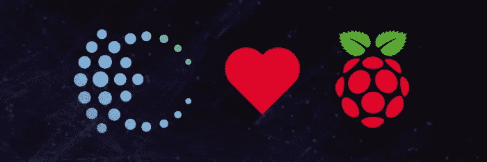

好了，伙计们，你们中的一些人可能已经读过我之前的教程关于在树莓 Pi 上构建和安装 Cellframe 节点。随着时间的推移，现在 Cellframe 正在为 arm64 和 armhf 架构提供构建，因此在本教程中，我们将使用它们自己的存储库，这是下载和更新 Cellframe 节点的最简单的方法。

## 关于单元格框架

[Cellframe](https://cellframe.net/) 是一个雄心勃勃的第三代区块链项目，很少有人(包括我)已经开始谈论它是下一个波尔卡多特或草间弥生。

然而，这个项目更加面向服务，并且与 Polkadot/Kusama 相比具有一些优势(例如，后量子加密、2 级分片、P2P 跨链操作)。

Cellframe 是用 C 写的(这会让它更快)，目前它有一个 C 和 Python 的 SDK。将来会有更多受支持的语言出现。

我真的推荐访问他们的网站(【https://cellframe.net】T4)并阅读他们的白皮书！

## 先决条件

*   Raspberry Pi 2/3/4/400(在本教程中，我们使用的是 Raspberry Pi OS 的 arm64 版本)
*   SD 卡(目前推荐 32Gb+甚至更好，SSD ( **选质量:**我推荐三星 EVO+)
*   SD 卡读卡器
*   USB 键盘
*   https://www.raspberrypi.com/software/[的 Raspberry Pi 成像仪软件](https://www.raspberrypi.com/software/)
*   互联网连接
*   **可选:** HDMI 显示器(显示器、电视等。)

*虽然建议使用 SSD，但是在实际从 SSD 启动之前，您需要做一些额外的配置。对于这些说明，谷歌是你的朋友。*

我们走吧！

## 最重要的第一步

如果你已经创建了一个钱包，你可能需要备份它以防出错。

您可以使用以下命令将 wallet 目录备份到主目录:

```
cp -r /opt/cellframe-node/var/lib/wallet ~
```

完成后，您可以使用以下命令恢复您的钱包:

```
cp -r ~/wallet /opt/cellframe-node/var/lib/
```

## 将操作系统安装到 SD 卡

首先你需要在你的 PC/Mac 上安装 Raspberry Pi Imager。完成后，将 SD 卡插入 SD 读卡器(**注:如果您使用的是外置 SD 读卡器，您还应该将 SD 读卡器连接到 PC 或 Mac😉).**

完成这些步骤后，打开 Raspberry Pi Imager，你会看到一个类似这样的窗口:

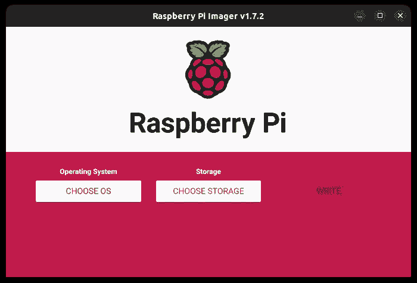

Raspberry Pi Imager

现在，点击“选择 OS”，然后点击“Raspberry Pi OS(其他)”向下滚动，直到看到“Raspberry Pi OS Lite (64 位)”。

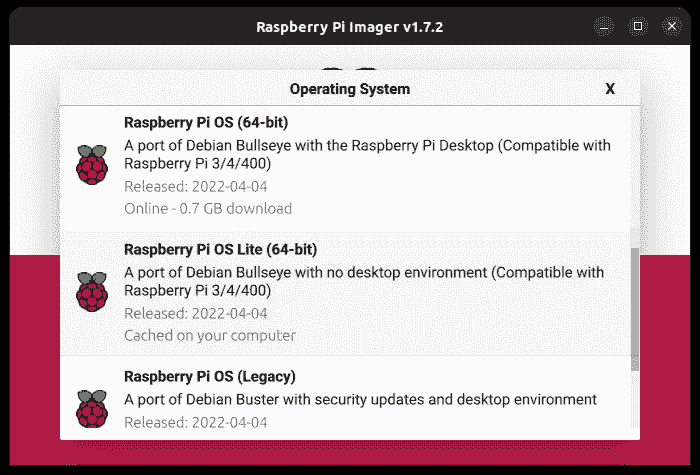

选择正确的操作系统后，您将返回到主窗口。

现在，启用 SSH 可能是一个好主意，更改默认用户和密码，如果你愿意，你也可以在启动到新的 Raspberry Pi 操作系统之前启用无线局域网。因此，点击 Raspberry Pi 成像仪窗口右下角的“齿轮按钮”:

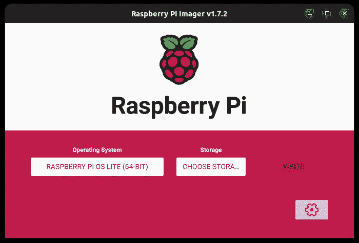

Gear button on the bottom right

一个新窗口将会弹出:

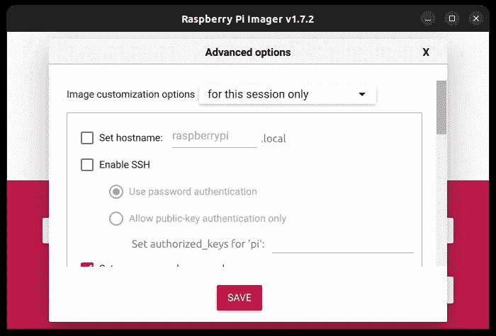

您可能希望在此处启用以下设置:

*   启用 SSH
    -这应该被勾选，这样你就可以远程连接到你的树莓 Pi
*   设置用户名和密码
    -将它们设置为非默认值
*   配置无线局域网
    -将这些设置更改为与您的本地 WiFi 设置相同
*   设置区域设置
    -配置本地时区和键盘布局

完成后，单击“保存”,然后单击“选择存储”,您应该会看到类似以下内容的窗口:

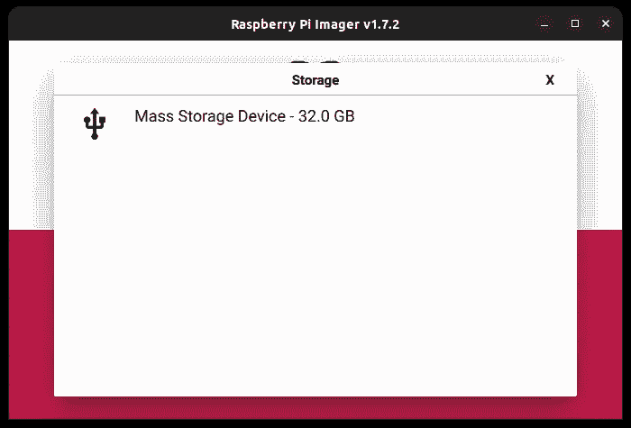

Selecting the correct mass storage device

通过单击选择正确的大容量存储设备，然后单击“写入”。

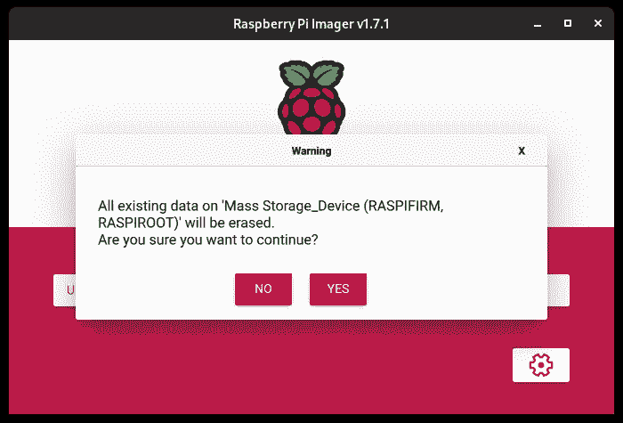

请确保在单击“是”按钮之前选择了正确的设备。按下“是”后，去喝杯咖啡、啤酒等。将图像刷新到 SD 卡需要一段时间。完成后，取出 SD 卡，并将其插入您的树莓派。

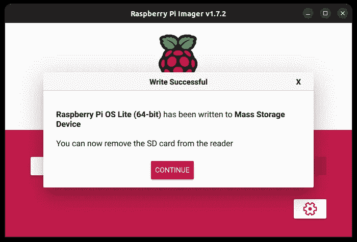

Writing finished!

## 启动和升级安装

将 SD 卡插入 Raspberry Pi 后，还要插入键盘、显示器、网线和电源线。事情即将变得严重😆。

**(注意:如果你通过 SSH 连接到你的 Raspberry Pi，你会得到一个关于主机真实性的警告。当它询问*“你确定要继续连接吗(是/否/[指纹])？”*，只需输入 yes，然后回车即可。)**

等到您看到登录屏幕。当您看到它时，只需键入您在将映像写入 SD 卡之前添加的登录凭据(在用户名和密码后按 enter)，您就可以登录了。

**(注意:输入密码时光标不会移动。)**

登录后，就该用`sudo apt update && sudo apt -y dist-upgrade`命令升级您的安装了。

**(注意:当在命令前使用** `**sudo**` **时，您将获得系统的提升权限(如 root 用户权限)。它可能会要求您输入密码，如果发生这种情况，只需输入您的密码并按 enter 键。)**

安装完成后，用命令`sudo reboot`重启你的 Raspberry Pi。

## 为安装单元框架节点设置 Demlabs 存储库

重新启动并再次登录后，是时候设置官方存储库了，它允许您使用简单的`apt`命令下载并升级节点:

1.  使用命令:
    `wget -O- https://debian.pub.demlabs.net/public/public-key.gpg | gpg --dearmor | sudo tee /usr/share/keyrings/demlabs-archive-keyring.gpg`将 Demlabs 公钥添加到可信密钥中
2.  使用以下命令将 Demlabs 存储库添加到您的源代码中:
    `echo "deb [signed-by=/usr/share/keyrings/demlabs-archive-keyring.gpg] [https://debian.pub.demlabs.net/public](https://debian.pub.demlabs.net/public) $(lsb_release -cs) main" | sudo tee /etc/apt/sources.list.d/demlabs.list`
3.  现在，您可以使用以下命令安装节点了:`sudo apt update && sudo apt install cellframe-node`

在安装完成之前，它会问你几个问题。选择正确的选项，然后按 enter 键。

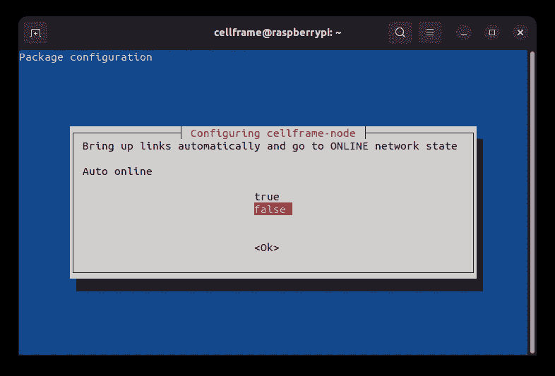

Auto online: Default is false, recommended true.

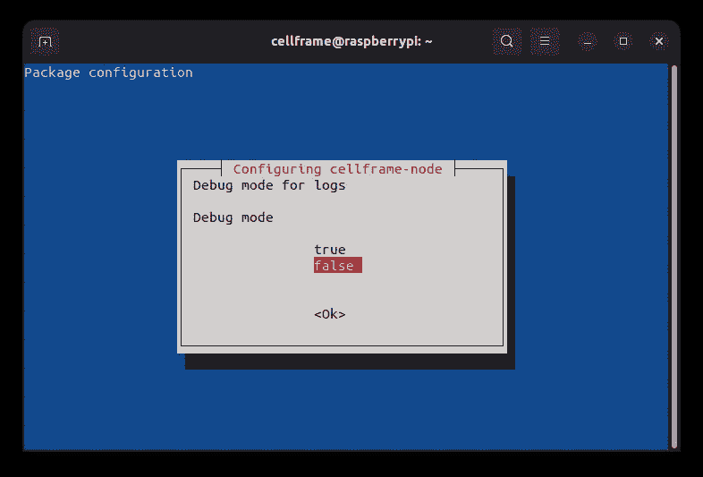

Debug mode: Default is false, recommended false.

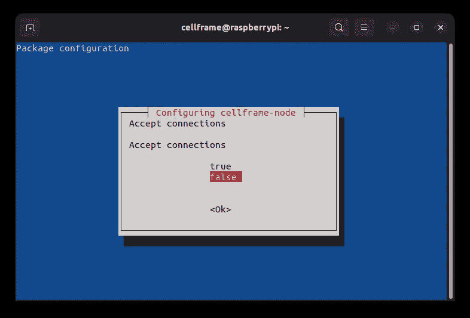

Accept connections: Default false, recommended true.


Server address to listen on: Recommended to set 0.0.0.0 to listen on all network interfaces.

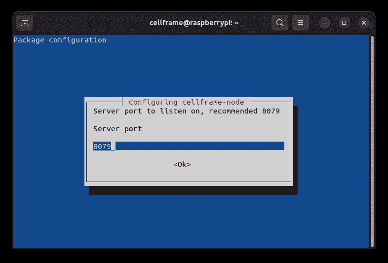

Server port: Recommended 8079.

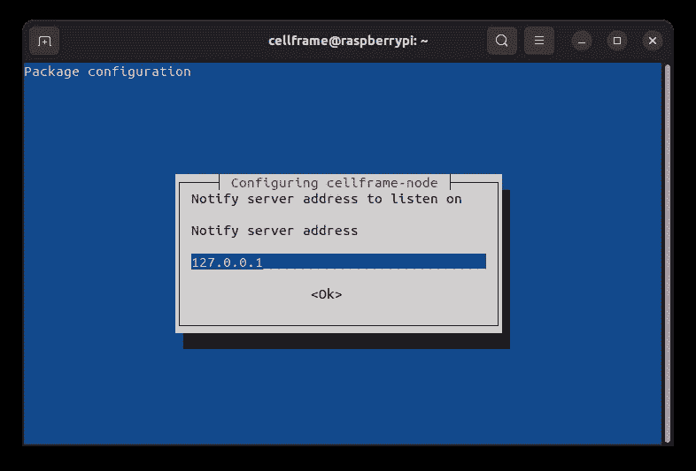

Notify server address: Default is 127.0.0.1 (localhost) and there’s no need to change that.

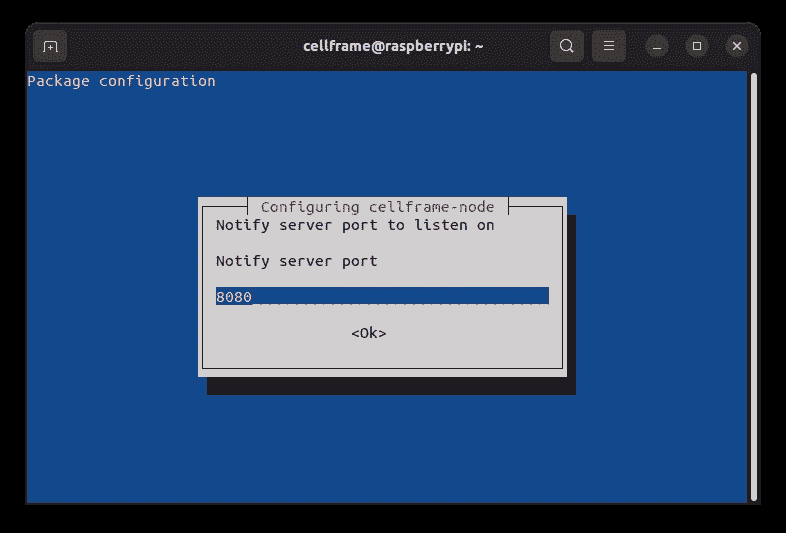

Notify server port: Default is 8080, can be kept on default setting.


Enable Subzero testnet: Default true, recommended true.

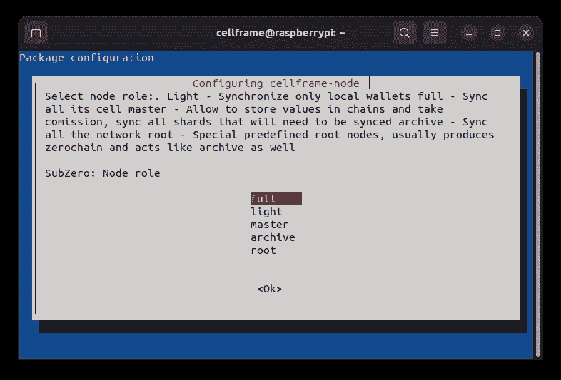

Subzero node role: Default full, recommended full.

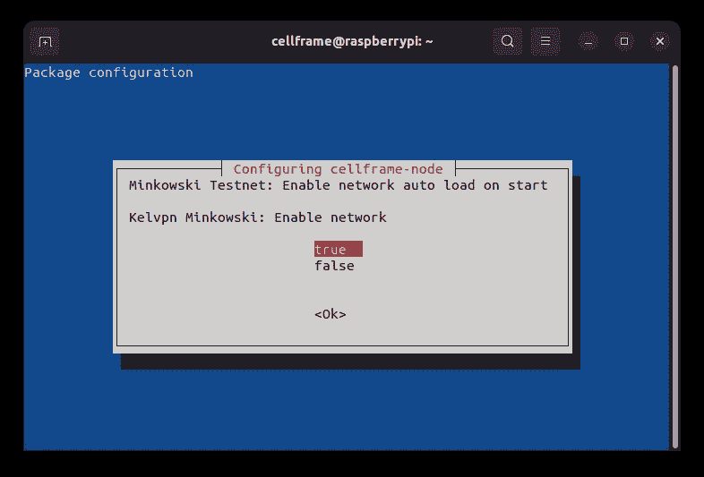

Enable KelVPN Minkowski testnet: Default true, recommended true.

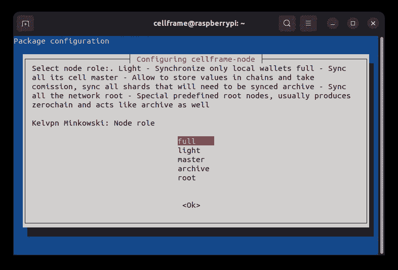

KelVPN Minkowski node role: Default full, recommended full.

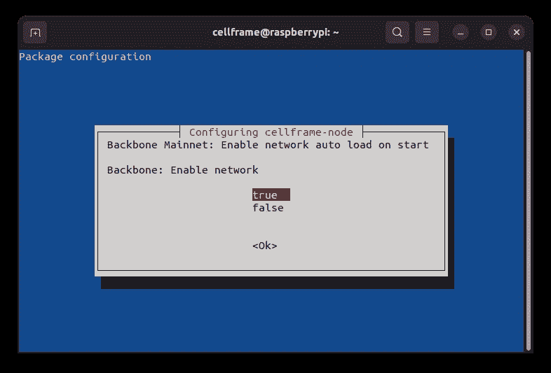

Enable Backbone mainnet: Default true, recommended true.

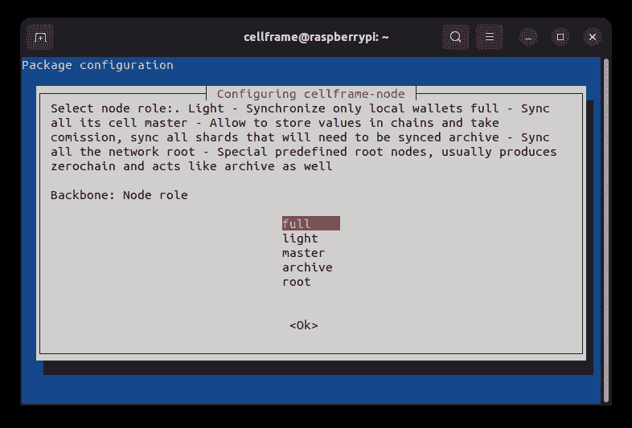

Backbone node role: Default full, recommended full.

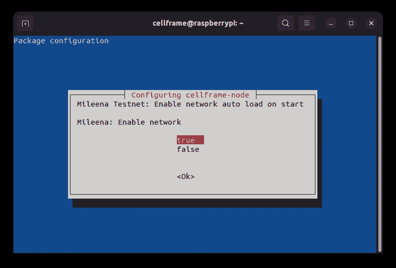

Enable Mileena network: Default true, recommended true.


Milenaa node role: Default full, recommended full.

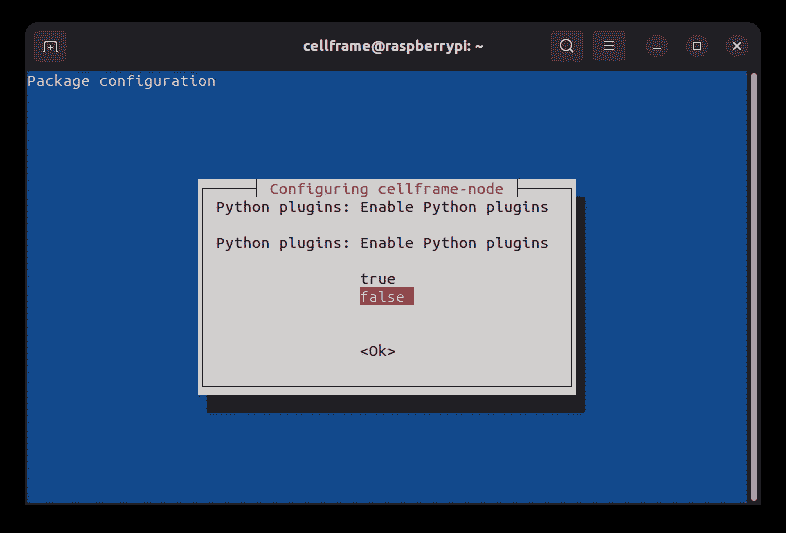

Enable Python plugins: Default false, recommended true.

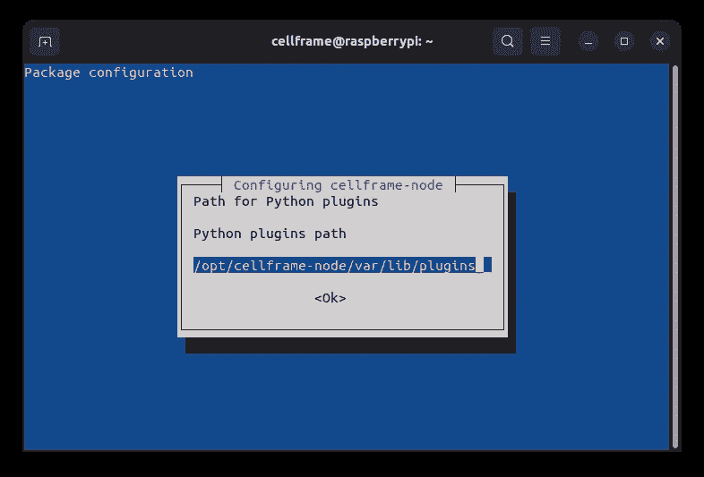

Python plugins path: Can be left as default, only change if you know what you’re doing.

回答完所有问题后，安装将继续，并作为服务自动启动。

如果您想更改其中的一些设置，只需使用命令`sudo dpkg-reconfigure cellframe-node`即可从头开始。

## 安装后手动加载 Python 插件

如果你由于某种原因在安装过程中没有启用插件，你可以在以后通过修改`cellframe-node.cfg`文件来启用插件。

正如我在本文前面提到的，Cellframe 节点内置了一个强大的 SDK。为了释放插件的威力，您需要编辑配置文件`cellframe-node.cfg`。

为此，我们将使用纳米文本编辑器。运行命令`nano /opt/cellframe-node/etc/cellframe-node.cfg`并按下向下箭头键，直到您在屏幕上看到类似这样的内容:

```
# Plugins
#[plugins]
# Load Python-based plugins
#py_load=false   
# Path to Pyhon-based plugins
#py_path=/opt/cellframe-node/var/lib/plugins
```

要启用插件加载，您需要取消几行注释并将`py_load=false`设置为`py_load=true`。编辑文件后，文件的这一部分应该如下所示:

```
# Plugins
[plugins]
# Load Python-based plugins
py_load=true
# Path to Pyhon-based plugins
py_path=/opt/cellframe-node/var/lib/plugins
```

完成编辑后，按 Ctrl+X，回答 Y“保存修改的缓冲区？”然后按回车键。之后，只需用命令`sudo systemctl restart cellframe-node`重启 Cellframe node，就可以运行了。

安装插件的路径默认在`/opt/cellframe-node/var/lib/plugins`。默认情况下插件目录是缺失的，但是您可以使用`mkdir -p /opt/cellframe-node/var/lib/plugins`创建它。

## 一些有用的命令

**升级您的系统和节点** `sudo apt update && sudo apt dist-upgrade`

**显示 Cellframe 节点服务的状态** `sudo systemctl status cellframe-node`

**显示 Cellframe 节点日志文件** `cat /opt/cellframe-node/var/log/cellframe-node.log | tail -n 50`的最后 50 行

**重启 Cellframe 节点服务** `sudo systemctl restart cellframe-node`

**停止 Cellframe 节点服务** `sudo systemctl stop cellframe-node`

## 解决纷争

> Debian 没有启动，屏幕上没有任何反应。

可能是坏的 SD 卡，图像文件损坏或图像写入失败。尝试将图像重新写入 SD 卡。

> 单元框架节点未启动

确保您已经安装了所有必需的依赖项。有关详细信息，请查看日志文件。用`sudo /opt/cellframe-node/bin/cellframe-node`手动运行它，看看它是否产生任何错误。

# 对 Cellframe 上的建筑感兴趣吗？

加入他们的发展电报渠道:[https://t.me/cellframe_dev_en](https://t.me/cellframe_dev_en)

如果你对建设区块链的未来感兴趣，也可以联系我:

**电报:** @CELLgainz

推特: @CELLgainz

> 加入 Coinmonks [电报频道](https://t.me/coincodecap)和 [Youtube 频道](https://www.youtube.com/c/coinmonks/videos)了解加密交易和投资

# 另外，阅读

*   [3 商业评论](/coinmonks/3commas-review-an-excellent-crypto-trading-bot-2020-1313a58bec92) | [Pionex 评论](https://coincodecap.com/pionex-review-exchange-with-crypto-trading-bot) | [Coinrule 评论](/coinmonks/coinrule-review-2021-a-beginner-friendly-crypto-trading-bot-daf0504848ba)
*   [莱杰 vs n rave](/coinmonks/ledger-vs-ngrave-zero-7e40f0c1d694)|[莱杰 nano s vs x](/coinmonks/ledger-nano-s-vs-x-battery-hardware-price-storage-59a6663fe3b0) | [币安评论](/coinmonks/binance-review-ee10d3bf3b6e)
*   [Bybit Exchange 审查](/coinmonks/bybit-exchange-review-dbd570019b71) | [Bityard 审查](https://coincodecap.com/bityard-reivew) | [Jet-Bot 审查](https://coincodecap.com/jet-bot-review)
*   [3 commas vs Cryptohopper](/coinmonks/3commas-vs-pionex-vs-cryptohopper-best-crypto-bot-6a98d2baa203)|[赚取加密利息](/coinmonks/earn-crypto-interest-b10b810fdda3)
*   最好的比特币[硬件钱包](/coinmonks/hardware-wallets-dfa1211730c6) | [BitBox02 回顾](/coinmonks/bitbox02-review-your-swiss-bitcoin-hardware-wallet-c36c88fff29)
*   [block fi vs Celsius](/coinmonks/blockfi-vs-celsius-vs-hodlnaut-8a1cc8c26630)|[Hodlnaut 审核](/coinmonks/hodlnaut-review-best-way-to-hodl-is-to-earn-interest-on-your-bitcoin-6658a8c19edf) | [KuCoin 审核](https://coincodecap.com/kucoin-review)