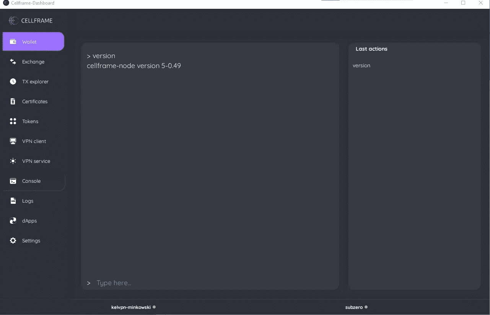
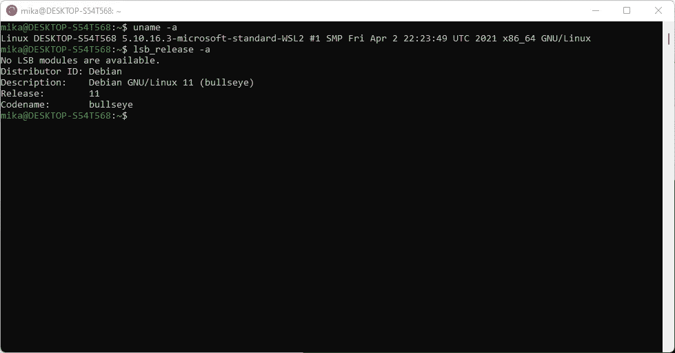
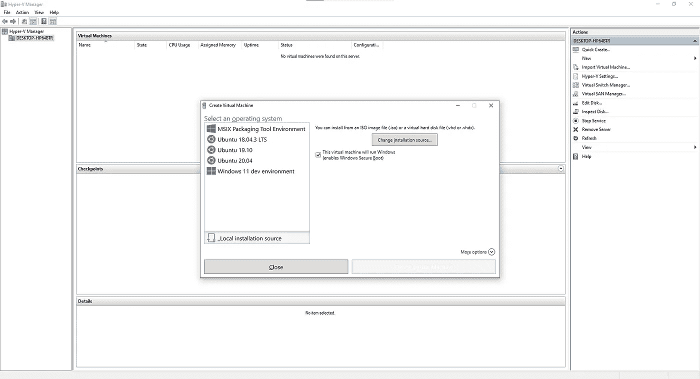
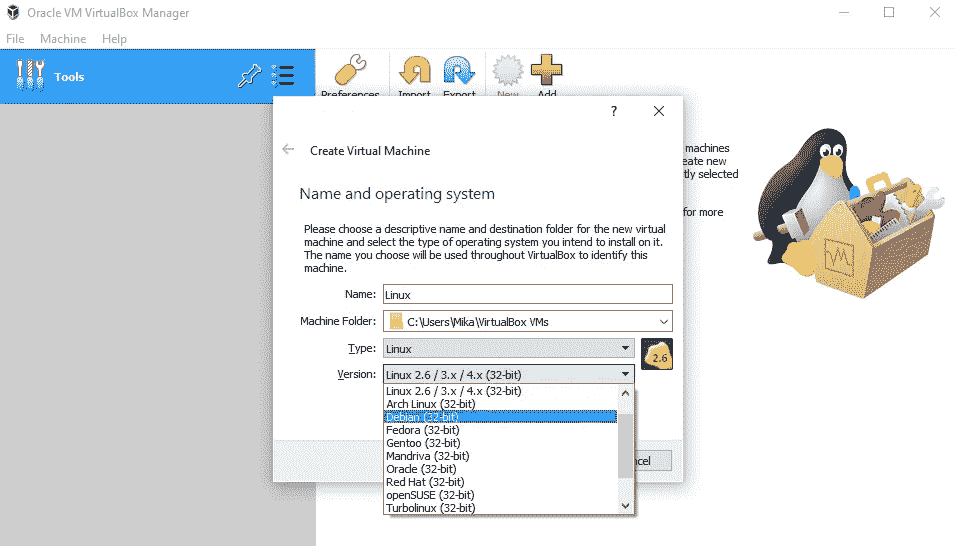
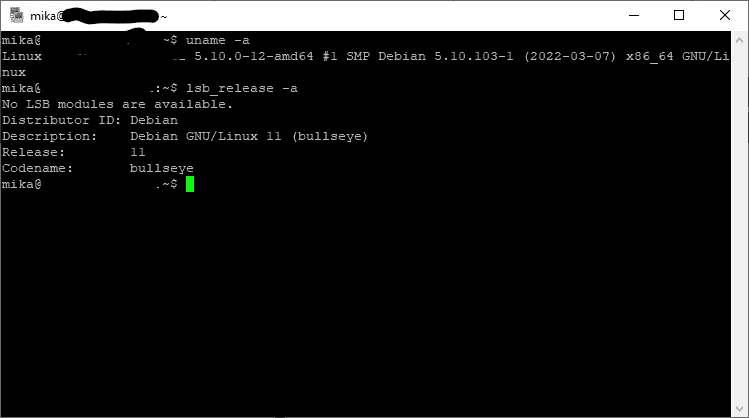

# 在 Windows(以及其他平台)上运行自己的 Cellframe 节点

> 原文：<https://medium.com/coinmonks/running-your-own-cellframe-node-on-windows-other-platforms-too-7da7cb4a99e4?source=collection_archive---------5----------------------->

我的一些读者可能已经等了很久，因为我认为大多数 PC 用户仍然在运行 Windows。

虽然我将 Linux 作为日常驱动程序，但有时我仍然不得不使用 Windows 作为我的操作系统，因为仍然没有 100%可靠的方法在 Linux 上运行 Adobe 软件(主要是 Photoshop 和 Illustrator)。

在本文中，如果您运行的是 Windows，我们将进一步了解所有选项(即使您运行的是 Linux 或 macOS，也可以考虑一些选项)。

## 关于单元格框架

Cellframe 是一个雄心勃勃的第三代区块链项目，很少有人(包括我)已经开始谈论它是下一个波尔卡多特或草间弥生。

然而，这个项目更加面向服务，并且与 Polkadot/Kusama 相比具有一些优势(例如，后量子加密、2 级分片、P2P 跨链操作)。

Cellframe 是用 C 写的(这会让它更快)，目前它有一个 C 和 Python 的 SDK。将来会有更多受支持的语言出现。

我真的推荐访问他们的网站(【https://cellframe.net】T2)并阅读他们的白皮书！

我们走吧！

## 方法 1:单元格框架仪表板

这是最简单的方法，因为 Cellframe Dashboard 内置了 Cellframe 节点，所以这是最明显的选择。

Cellframe 节点的构建也考虑到了 Windows 用户，因此它实际上在必要的地方使用了 WinAPI。

当使用 Cellframe Dashboard 时，您还有一个工具来管理您的钱包/节点和几乎所有您想要的东西。

下载链接@【cellframe.net 

**注意:节点的配置文件位于:
% system drive % \ Users \ Public \ Documents \ cell frame-node**

Using console in Cellframe Dashboard for interacting with node.

**优点:**

*   易于安装，易于运行
*   您获得了管理节点和钱包的所有“附加功能”
*   允许你点击几下鼠标就可以下载 dApps(如果有的话)

**缺点:**

*   Dashboard 仍有一些 bug(截至 2022 年 3 月 27 日)
*   单元框架节点比仪表板更新得更频繁

## 方法 2:WSL(Linux 的 Windows 子系统)

这是另一个解决方案，已在 [Cellframe 开发电报频道列出。](https://t.me/cellframe_dev_en)

虽然我认为这不是最好的解决方案，但它实际上(几乎)完成了工作。

WSL(2)基本上使用 Hyper-V 虚拟化平台架构，它允许您在 Windows 中运行 Linux。

WSL 还比成熟的虚拟机需要更少的资源。

要安装，只需在管理员命令行上执行一个命令`wsl --install`,之后，你就可以从微软商店(或者从命令行，如果你喜欢的话)下载不同的 Linux 发行版。很方便，是吧？

Debian 11 running on WSL.

**优点:**

*   非常容易安装
*   比成熟的虚拟机使用更少的资源
*   在 WSL 上使用 Debian / Ubuntu 时，可以使用我的树莓 Pi 教程中的安装方法

**缺点:**

*   很明显，您需要一些 Linux 经验
*   由于 Cellframe 节点使用 systemd 服务来自动启动/停止/重启(在 Debian / Ubuntu 包中)，它在这里不能开箱即用，因为 WSL 没有对 systemd 的适当支持([但](https://www.theregister.com/2021/11/17/ubuntu_team_systemd_windows_wsl2/))
*   网络配置可能是一个问题，即桥接您的网络适配器是相当困难的

## 方法三:Hyper-V + Linux

现在我们有了一个成熟的第一类 Windows 虚拟机管理程序！

如果您想在 Windows 操作系统上运行虚拟机，Hyper-V 是一个可靠的选择。所有网络设置都有许多配置选项，因此用本地适配器桥接网络连接比在 WSL 上更容易。

有了 Hyper-V，你几乎可以选择任何你想要的操作系统并运行它。它将使用安装的操作系统自己的内核和库，所以你不会被微软提供的内核所束缚(就像在 WSL 中一样)。

它的运行速度也非常快，几乎就像在裸机上运行一样。

对于 Hyper-V，运行 Cellframe 节点的显而易见的选择是 Linux。

Hyper-V manager in action.

**优点:**

*   如果您需要速度，性能类似于裸机(有一些例外)
*   当在 Hyper-V 上使用 Debian / Ubuntu 时，你可以使用我的 Raspberry Pi 教程中的安装方法
*   免费的！

**缺点:**

*   再次需要熟悉 Linux
*   使用大量资源，因为从技术上讲，这是两个操作系统同时运行
*   无法在 Windows 10/11 家庭版上使用(默认情况下)(不过有一个[解决方法](https://www.itechtics.com/enable-hyper-v-windows-10-home/)

## 方法四:Virtualbox + Linux

在 Windows 上虚拟化操作系统可能比使用 Virtualbox 更容易。与 Hyper-V 不同，Virtualbox 是第二类虚拟机管理程序，因此它不能直接访问硬件资源。

使用 Virtualbox，安装任何类型的操作系统都轻而易举。它为多个不同的操作系统预先配置了设置，并且配置您的虚拟机设置(例如，网络设置)也非常简单。

你可以从:
[https://www.virtualbox.org/wiki/Downloads](https://www.virtualbox.org/wiki/Downloads)下载 Virtualbox

使用 Virtualbox，运行 Cellframe node 的明显选择是 Linux server。

Multple different preconfigurations for different Linux distros. Runs Windows too.

**优点:**

*   易于安装和配置多种不同的操作系统
*   它是开源的
*   免费的！
*   在 Virtualbox 上使用 Debian / Ubuntu 时，可以使用我的 Raspberry Pi 教程中的安装方法
*   挺快的……

**缺点:**

*   …但可能没有 Hyper-V 快
*   使用大量资源
*   再次需要熟悉 Linux
*   (个人观点)它的后台是甲骨文，以对开源产品不那么友好而闻名

## 方法 5: VPS(虚拟专用服务器)

这种方法很受想在 Linux 服务器上运行某种类型服务的人的欢迎。虽然它不是裸机服务器，但它的性能仍然很好，将是我的第二好(甚至最好？)如果您在个人计算机上运行 Windows(甚至 Linux ),则选择运行 Cellframe 节点。

VPS 是一个很棒的“一劳永逸”的解决方案(但显然它仍然需要不时地进行一些监控)，你不需要一直开着你的个人电脑。

然而，有一些警告:

*   有些 VPS 提供商是…姑且说“坏”吧。你应该在购买前做一些调查
*   一些 VPS 提供商甚至不允许您在 VPS 上运行这样的节点
*   如果您计划不仅仅在 VPS 上运行一个简单的节点，那么您需要更多的计算能力/内存，这反过来会花费您更多的钱

我有与以下服务提供商合作的经验，他们都很好:

*   时间 4 VPS:[https://www.time4vps.com/](https://www.time4vps.com)
*   数字海洋:[https://www.digitalocean.com/solutions/vps-hosting](https://www.digitalocean.com/solutions/vps-hosting)
*   https://www.vultr.com/

You can access your VPS with Putty/Kitty (SSH) in Windows.

**优点:**

*   无需开启您自己的电脑，节省电力和资源
*   几乎是一劳永逸的解决方案
*   低端盒子非常便宜，通常在 3 欧元/月左右
*   在 VPS 上使用 Debian / Ubuntu 时，可以使用我的树莓 Pi 教程中的安装方法
*   你通常可以升级你的 VPS 到一个更好的(更多的带宽/内存/CPU 能力)，这是一个非常自动的过程

**缺点:**

*   如果他们碰巧有一些网络问题，你不能访问你的服务器
*   这不是免费的
*   再次需要熟悉 Linux

## 结论

我个人推荐目前在 Windows 上运行节点的方法是 Cellframe Dashboard(因为这是最简单的方法)。但这并不意味着这是唯一的选择。

如果你真的想要一个一劳永逸的解决方案(你真的不想让你的电脑 24/7 运行)，我真的建议看看 VPS 选项。尽管您需要一些 Linux 经验。

如果想有自己的硬件，可以考虑买个树莓 Pi 或者瘦客户端。这些都是让事情运转起来的廉价选择。而且他们的电费也很便宜！

如果您对本文有任何疑问，可以通过[电报](https://t.me/CELLgainz)或[推特](https://twitter.com/CellGainz)联系我。

你想在区块链的未来上有所建树吗？加入他们的 [Cellframe 开发电报频道](https://t.me/cellframe_dev_en)。

感谢您的阅读！

> *加入 Coinmonks* [*电报频道*](https://t.me/coincodecap) *和* [*Youtube 频道*](https://www.youtube.com/c/coinmonks/videos) *了解加密交易和投资*

# 另外，阅读

*   [3 商业评论](/coinmonks/3commas-review-an-excellent-crypto-trading-bot-2020-1313a58bec92) | [Pionex 评论](https://coincodecap.com/pionex-review-exchange-with-crypto-trading-bot) | [Coinrule 评论](/coinmonks/coinrule-review-2021-a-beginner-friendly-crypto-trading-bot-daf0504848ba)
*   [莱杰 vs n rave](/coinmonks/ledger-vs-ngrave-zero-7e40f0c1d694)|[莱杰 nano s vs x](/coinmonks/ledger-nano-s-vs-x-battery-hardware-price-storage-59a6663fe3b0) | [币安评论](/coinmonks/binance-review-ee10d3bf3b6e)
*   [Bybit Exchange 审查](/coinmonks/bybit-exchange-review-dbd570019b71) | [Bityard 审查](https://coincodecap.com/bityard-reivew) | [Jet-Bot 审查](https://coincodecap.com/jet-bot-review)
*   [3 commas vs Cryptohopper](/coinmonks/3commas-vs-pionex-vs-cryptohopper-best-crypto-bot-6a98d2baa203)|[赚取加密利息](/coinmonks/earn-crypto-interest-b10b810fdda3)
*   最好的比特币[硬件钱包](/coinmonks/hardware-wallets-dfa1211730c6) | [BitBox02 回顾](/coinmonks/bitbox02-review-your-swiss-bitcoin-hardware-wallet-c36c88fff29)