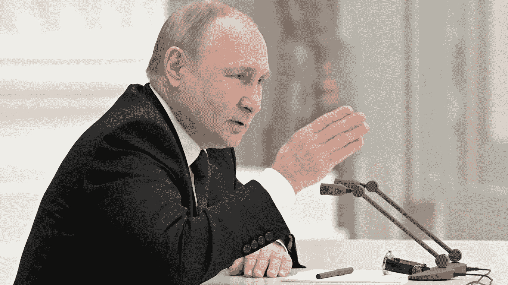

# 俄罗斯和乌克兰:普京在做重要决定前会咨询谁？

> 原文：<https://medium.com/coinmonks/russia-and-ukraine-with-whom-does-putin-consult-before-making-important-decisions-ffff3de10f48?source=collection_archive---------23----------------------->

过去几周，俄罗斯总统弗拉基米尔·普京做出了一些关键决定，这些决定将对乌克兰、俄罗斯和整个世界产生持久影响。

普京在做这些决定时咨询了哪些人？莫斯科的军国主义论调是不是像一些分析人士所说的那样，是所谓的“西洛维基”集团强大影响力的结果，该集团包括几名部长和安全机构负责人？

俄罗斯可谓超级总统共和国。普京总统掌握着所有的权力，所有关于国家运行的重大决定最终都是他自己的。

尽管拥有这些巨大的权力，他还是会咨询周围的人，尤其是那些他长期以来的同事和他非常信任的人。这个部门包括一批曾在安全机构工作过、拥有强大话语权的官员。

俄罗斯的几个机构从事安全和执法工作，被称为“Siloviki”集团。

弗拉基米尔·普京在这些机构之一开始了他的职业生涯，即前苏联克格勃，它始于后苏联时代的俄罗斯联邦安全局(FSB)。

自普京执政以来，西洛维基集团的影响力有所上升。

俄罗斯外交和国内政策的大部分决定都是在俄罗斯国家安全委员会会议上做出的。

该委员会由 30 名成员组成，他们是“siloviki”集团最关键的成员，除了总理和议会两院的领导人之外，还包括外国情报局、联邦安全局、内政部长、外交部长和国防部长。

俄罗斯国家安全委员会秘书长尼古拉·帕特鲁舍夫、俄罗斯安全局局长亚历山大·鲍特尼科夫和俄罗斯对外情报局局长谢尔盖·纳雷什金与俄罗斯总统弗拉基米尔·普京相识多年。20 世纪 70 年代，他们和他一起在圣彼得堡服役，当时圣彼得堡被称为列宁格勒。

除了前三名，外交部长谢尔盖·拉夫罗夫(Sergei Lavrov)和国防部长谢尔盖·丘戈(Sergei Chiugo)被认为是与弗拉基米尔·普京关系最密切的五人组，俄罗斯总统在做出外交政策决定时非常重视他们的意见。

> 据说尼古拉·帕特鲁舍夫是普京最亲密的顾问之一

# 尼古拉·帕特鲁舍夫

尼古拉·帕特鲁舍夫是普京主持的俄罗斯国家安全委员会秘书长，也是总统团队中的“主战派”。帕特鲁舍夫和普京都在 20 世纪 70 年代为克格勃工作。

1999 年，帕特鲁舍夫取代普京成为俄罗斯联邦安全局(FSB)的负责人，该机构是克格勃的继任机构，并一直任职至 2008 年。据说他是普京最亲近的人之一，比任何人都更听他的话。

> 自本世纪初以来，俄罗斯国防部长谢尔盖·绍伊古一直与普京总统关系密切

# 谢尔盖·绍伊古

普京最亲密的朋友和顾问可能是负责 GRU 的国防部长谢尔盖·绍伊古，其成员被指控于 2018 年在英国毒害前俄罗斯特工谢尔盖·斯克里帕尔，并于 2020 年在西伯利亚毒害俄罗斯反对派政治家阿列克谢·纳瓦尔尼。

有消息称，20 世纪 90 年代，千代夫和普京发展了良好的关系。尽管如此，自新世纪开始以来，这两个人已经成为亲密的朋友，并且有共同的语言。他们定期去国防部长的出生地西伯利亚度假。

> 俄罗斯联邦安全局局长莱森德·鲍特尼科夫从 20 世纪 70 年代就认识普京总统

# 亚历山大·鲍特尼科夫

亚历山大·鲍特尼科夫，俄罗斯联邦安全局局长，曾在列宁格勒的克格勃办公室与弗拉基米尔·普京共事，2008 年接替帕特鲁舍夫执掌俄罗斯联邦安全局。他是一名有几十年经验的反间谍特工。

内部人士表示，俄罗斯总统更倾向于相信他从联邦安全局获得的情报报告，而不是任何其他来源。

该机构对内政部和总检察长办公室等执法机构产生影响。

这个机构有其势力，即精英“阿尔法”和“温佩尔”团体。

> 俄罗斯外交部长谢尔盖·拉夫罗夫是对普京影响最温和的人之一

# 谢尔盖·拉夫罗夫

俄罗斯外交部长谢尔盖·拉夫罗夫(Sergei Lavrov)在激烈程度上与鲍特尼科夫截然相反。他是最有经验的俄罗斯外交官之一。他从 2004 年开始领导俄罗斯外交部，也就是说，将近 20 年了。虽然他没有在安全机构与普京一起学习或工作，但据说俄罗斯总统对拉夫罗夫非常尊重。

拉夫罗夫不在普京的朋友圈，但由于他的专业精神、努力工作以及在漫长的职业生涯中不犯错误，他赢得了总统的尊重。

> 尽管是普京总统的长期同事，但后者最近在公开场合让外国情报机构负责人谢尔盖·纳雷什金(Sergei Naryshkin)感到尴尬。

# 谢尔盖·纳雷什金

对外情报局局长谢尔盖·纳雷什金和鲍特尼科夫、帕特鲁舍夫一样，在列宁格勒为弗拉基米尔·普京服务。

尽管是情报部门的负责人，他是一个相对公开的官员，接受过许多媒体的采访，包括 BBC 的史蒂夫·罗森博格。

了解纳雷什金个人的人说，他忠于普京，天生遵守纪律，习惯于服从命令，服从划给他的线。他的安全背景、敏锐的智力和专业经验帮助他进入普京的核心圈子，而弗拉基米尔·普京依靠纳雷什金机构提供的情报笔记。

# 俄罗斯国家安全委员会:决策委员会

俄罗斯国家安全委员会最近召开会议，讨论了承认乌克兰东部两个由分离主义者控制的“共和国”的问题，会议深入探讨了该委员会的工作动态。

BBC 东欧记者 Sarah Rainsford 将这次会议描述为一场戏剧，每个人都有自己的角色和特定的场景。

“大多数俄罗斯高级官员尴尬地坐成半圆形，然后弗拉基米尔·普京让他们一个接一个地走到麦克风前，告诉他想听的话，”她说。

其他分析师看到了复杂的群体动力在起作用，尽管这是个人政治错综复杂的迷宫。

“我们必须理解，安全理事会是由不是朋友的人组成的会议。莫斯科卡内基中心的专家亚历山大·博诺夫说:“他们很可能会相互冲突。

他继续说，“他们在安理会会议上所说的一切，不仅仅是他们所想的表达，而是他们在这场知情机构的游戏中不输给普京的努力。”

会议强调了弗拉基米尔·普京个人对国家安全委员会成员的控制程度，他可以公开指责他们或让他们出洋相，而他们的长期朋友却没有提供什么保护。

尽管是老同事——也可能是私人朋友——但外国情报机构负责人谢尔盖·纳雷什金(Sergei Naryshkin)被普京评论为在承认叛军控制的地区之前，没有“说清楚”地建议给“西方伙伴另一个机会”。

这惹恼了普京，他向纳雷什金施压，要求他表明支持立即认罪，这位情报局长同意了，他似乎深感恼火。

英国皇家联合服务安全与国防研究所的马克·加莱奥蒂在推特上写道:

“纳雷什金从最糟糕的情况中走了出来，普京因为他的困惑而欺负他。

这一幕清楚地表明，他是老板的仆人，而不是朋友。考虑到他是最近比较直言不讳的公共评论员之一，这也表明你过去从未因你的服务而受到表扬。"

值得注意的是，安理会其他成员没有纳雷什金那样尴尬。

只有国防部长、外交部长和联邦安全局局长鲍特尼科夫被要求在由 30 名成员组成的强大委员会会议上发言两次。

拉夫罗夫支持继续外交努力，而绍伊古和鲍特尼科夫则更加强硬，坚持承认乌克兰东部的亲俄分裂分子。

这次会议也很特别，因为它在俄罗斯国家电视台播出，而且安理会通常秘密开会。该广播应该是现场直播的，尽管有人对这一说法的真实性提出了质疑。仔细查看视频后，观察者注意到一些与会者的观点与广播时间不符。

# 另一个委员会

人们还认为，除了安全官员和外交部长，普京还与体制内甚至体制外的其他官员举行一对一的会议。

俄罗斯媒体广泛引用的政治分析家叶夫根尼·门琴科对俄罗斯精英进行了研究。他定期编写关于弗拉基米尔·普京核心圈子的报告，他称之为“政治办公室 2.0”，类似于苏联共产党领导层。

> 众所周知，弗拉基米尔·普京与亿万富翁阿尔卡季·罗滕贝格关系密切

在 2021 年的最新报告中，门琴科说，莫斯科市长谢尔盖·索比亚宁(Sergei Sobyanin)和国家石油巨头俄罗斯石油公司(Rosneft)总裁伊戈尔·谢钦(Igor Sechin)是总统的亲信。

亿万富翁兄弟 Boris 和 Arkady Rothenberg 也是弗拉基米尔·普京的密友和弗拉基米尔·普京的童年好友。

这两者都在本周英国对俄罗斯的制裁中被提及。

2020 年，福布斯杂志将他们列为美国最富有的家庭。

> 加入 Coinmonks [电报频道](https://t.me/coincodecap)和 [Youtube 频道](https://www.youtube.com/c/coinmonks/videos)了解加密交易和投资

# 另外，阅读

*   [隐翅虫替代品](/coinmonks/cryptohopper-alternatives-d67287b16d27) | [HitBTC 审查](/coinmonks/hitbtc-review-c5143c5d53c2)
*   [CBET 评论](https://coincodecap.com/cbet-casino-review) | [库科恩 vs 比特币基地](https://coincodecap.com/kucoin-vs-coinbase)
*   [Fold App 审核](https://coincodecap.com/fold-app-review) | [Kucoin 交易机器人](/coinmonks/kucoin-trading-bot-automate-your-trades-8cf0ca2138e0) | [Probit 审核](https://coincodecap.com/probit-review)
*   [如何匿名购买比特币](https://coincodecap.com/buy-bitcoin-anonymously) | [比特币现金钱包](https://coincodecap.com/bitcoin-cash-wallets)
*   [币安 vs FTX](https://coincodecap.com/binance-vs-ftx) | [最佳(SOL)索拉纳钱包](https://coincodecap.com/solana-wallets)
*   [比诺莫评论](https://coincodecap.com/binomo-review) | [斯多葛派 vs 3Commas vs TradeSanta](https://coincodecap.com/stoic-vs-3commas-vs-tradesanta)
*   [Capital.com 审查](https://coincodecap.com/capital-com-review) | [港加密借贷平台](https://coincodecap.com/crypto-lending-hong-kong)
*   [如何在 Uniswap 上交换加密？](https://coincodecap.com/swap-crypto-on-uniswap) | [A-Ads 审核](https://coincodecap.com/a-ads-review)
*   [WazirX vs coin dcx vs bit bns](/coinmonks/wazirx-vs-coindcx-vs-bitbns-149f4f19a2f1)|[block fi vs coin loan vs Nexo](/coinmonks/blockfi-vs-coinloan-vs-nexo-cb624635230d)
*   [本地比特币审核](/coinmonks/localbitcoins-review-6cc001c6ed56) | [加密货币储蓄账户](https://coincodecap.com/cryptocurrency-savings-accounts)